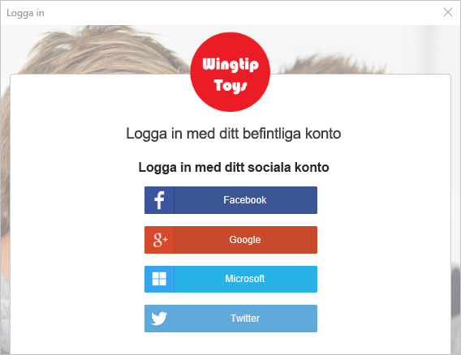

# <a name="quickstart-set-up-sign-in-for-a-desktop-app-using-azure-active-directory-b2c"></a>Snabbstart: Konfigurera inloggning för en skrivbordsapp med Azure Active Directory B2C 

Azure Active Directory (AD Azure) B2C tillhandahåller identitetshantering i molnet för att skydda dina program, ditt företag och dina kunder. Med Azure AD B2C kan appar autentisera med konton på sociala medier och företagskonton med öppna protokoll.

I den här snabbstarten använder du ett Azure AD B2C-aktiverat exempel på en Windows Presentation Foundation-skrivbordsapp (WPF) för att logga in med en social identitetsprovider och anropa en Azure AD B2C-skyddad webb-API.

[!INCLUDE [quickstarts-free-trial-note](../../includes/quickstarts-free-trial-note.md)]

## <a name="prerequisites"></a>Nödvändiga komponenter

* [Visual Studio 2017](https://www.visualstudio.com/downloads/) med arbetsbelastningen **ASP.NET och webbutveckling**. 
* Ett konto från ett socialt medium, till exempel Facebook, Google, Microsoft eller Twitter.

## <a name="download-the-sample"></a>Hämta exemplet

[Ladda ned en zip-fil](https://github.com/Azure-Samples/active-directory-b2c-dotnet-desktop/archive/master.zip) eller klona exempelwebbappen från GitHub.

```
git clone https://github.com/Azure-Samples/active-directory-b2c-dotnet-desktop.git
```

## <a name="run-the-app-in-visual-studio"></a>Kör appen i Visual Studio

Öppna `active-directory-b2c-wpf.sln`-lösningen i Visual Studio i exempelprogrammets projektkatalog.

Tryck på **F5** för att felsöka programmet.

## <a name="create-an-account"></a>Skapa ett konto

Klicka på **Logga in** för att starta arbetsflödet **Registrera dig eller logga in** baserat på en princip för Azure AD B2C.


Exemplet stöder flera registreringsalternativ, till exempel att använda en social identitetsprovider eller att skapa ett lokalt konto med en e-postadress. För den här snabbstarten använder du ett konto från ett socialt medium, till exempel Facebook, Google, Microsoft eller Twitter. 

### <a name="sign-up-using-a-social-identity-provider"></a>Registrera dig med en social identitetsprovider

Azure AD B2C visar en anpassad inloggningssida för ett fiktivt varumärke som kallas Wingtip Toys för exempelwebbappen. 

1. Klicka på knappen för den identitetsprovider som du vill använda för att registrera dig med en social identitetsprovider. 

    

    Du autentiserar dig (loggar in) med autentiseringsuppgifterna för ditt sociala konto och ger behörighet till programmet att läsa information från det sociala kontot. När du beviljar åtkomst kan programmet hämta profilinformation från det sociala kontot, till exempel ditt namn och din ort. 

2. Avsluta inloggningsprocessen för identitetsprovidern. Om du till exempel väljer Twitter anger du dina autentiseringsuppgifter för Twitter och klickar på **Logga in**.

    

    Dina profiluppgifter för det nya kontot fylls i automatiskt med information från det sociala kontot. 

3. Ändra informationen om du vill och klicka på **Fortsätt**. De värden som du anger används för din Azure AD B2C-användarprofil.

    

    Du har skapat ett nytt Azure AD B2C-användarkonto som använder en identitetsprovider. Efter inloggningen visas åtkomsttoken i textrutan *Tokeninformation*. Denna åtkomsttoken används vid åtkomst till API-resursen.

## <a name="edit-your-profile"></a>Redigera din profil

Azure Active Directory B2C tillhandahåller funktioner som gör det möjligt för användare att uppdatera sina profiler.  Exempelwebbappen använder en Azure AD B2C-princip för att redigera profiler för arbetsflödet. 

1. Klicka på **Redigera profil** för att redigera den profil som du skapade.

    

2. Välj den identitetsprovider som är associerad med kontot som du skapade. Om du exempelvis använde Twitter som identitetsprovider när du skapade ditt konto, väljer du Twitter om du vill ändra den tillhörande profilinformationen.

3. Ändra ditt **Visningsnamn** eller **Stad** och klicka på **Fortsätt**.

    En ny åtkomsttoken visas i textrutan *Tokeninformation*. Om du vill kontrollera ändringarna i din profil, kan du kopiera och klistra in åtkomsttoken i tokenavkodaren https://jwt.ms.

## <a name="access-a-protected-web-api-resource"></a>Få åtkomst till en skyddad webb-API-resurs

Klicka på **Anropa API** för att göra en begäran om den Azure AD B2C-skyddade resursen. 


Programmet innehåller Azure AD-åtkomsttoken i begäran till den skyddade web-API-resursen. Webb-API:n skickar tillbaka det visningsnamn som ingår i åtkomsttoken.

Du har använt ditt Azure AD B2C-användarkonto för att utföra ett auktoriserat anrop till ett Azure AD B2C-skyddat webb-API.

## <a name="clean-up-resources"></a>Rensa resurser

Du kan använda Azure AD B2C-klientorganisationen om du vill prova andra snabbstarter eller självstudier för Azure AD B2C. När den inte längre behövs kan du ta bort [Azure AD B2C-klientorganisationen](active-directory-b2c-faqs.md#how-do-i-delete-my-azure-ad-b2c-tenant).

## <a name="next-steps"></a>Nästa steg

Nästa steg är att skapa din egen Azure AD B2C-klientorganisation och konfigurera exemplet som ska köras med hjälp av klientorganisationen. 

> [!div class="nextstepaction"]
> [Skapa en Azure Active Directory B2C-klientorganisation i Azure-portalen](active-directory-b2c-get-started.md)
