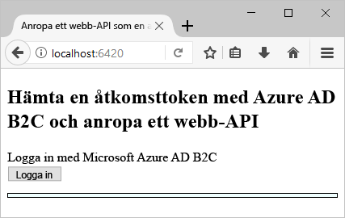
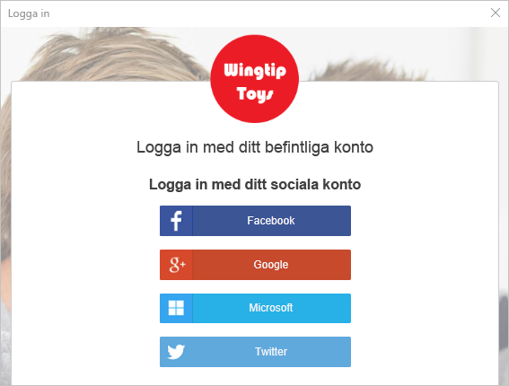
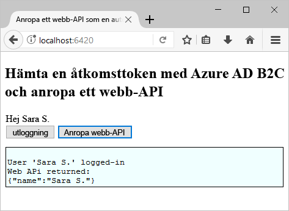

# <a name="quickstart-set-up-sign-in-for-a-single-page-app-using-azure-active-directory-b2c"></a>Snabbstart: Ställ in inloggning för en enda sida-app med Azure Active Directory B2C

Azure Active Directory (AD Azure) B2C tillhandahåller identitetshantering i molnet för att skydda dina program, ditt företag och dina kunder. Med Azure AD B2C kan appar autentisera med konton på sociala medier och företagskonton med öppna protokoll.

I den här snabbstarten använder du ett enkelsidigt Azure AD B2C-aktiverat exempelprogram för ASP.NET till att logga in med en social identitetsprovider och anropa en Azure AD B2C-skyddad webb-API.

[!INCLUDE [quickstarts-free-trial-note](../../includes/quickstarts-free-trial-note.md)]

## <a name="prerequisites"></a>Förutsättningar

* [Visual Studio 2017](https://www.visualstudio.com/downloads/) med arbetsbelastningen **ASP.NET och webbutveckling**.
* Installera [Node.js](https://nodejs.org/en/download/)
* Ett konto från ett socialt medium, till exempel Facebook, Google, Microsoft eller Twitter.

## <a name="download-the-sample"></a>Hämta exemplet

[Ladda ned en zip-fil](https://github.com/Azure-Samples/active-directory-b2c-javascript-msal-singlepageapp/archive/master.zip) eller klona exempelwebbappen från GitHub.

```
git clone https://github.com/Azure-Samples/active-directory-b2c-javascript-msal-singlepageapp.git
```

## <a name="run-the-sample-application"></a>Köra exempelprogrammet

Så här kör du exemplet från kommandotolken Node.js: 

```
cd active-directory-b2c-javascript-msal-singlepageapp
npm install && npm update
node server.js
```

Node.js-programmet visar det portnummer som lyssnar på localhost.

```
Listening on port 6420...
```

Bläddra till programmets URL `http://localhost:6420` i en webbläsare.



## <a name="create-an-account"></a>Skapa ett konto

Klicka på knappen **Logga in** för att starta Azure AD B2C-arbetsflödet **Registrera dig eller logga in** baserat på en Azure AD B2C-princip. 

Exemplet stöder flera registreringsalternativ, inklusive att använda en social identitetsprovider eller skapa ett lokalt konto med en e-postadress. För den här snabbstarten använder du ett konto från ett socialt medium, till exempel Facebook, Google, Microsoft eller Twitter. 

### <a name="sign-up-using-a-social-identity-provider"></a>Registrera dig med en social identitetsprovider

Azure AD B2C visar en anpassad inloggningssida för ett fiktivt varumärke som kallas Wingtip Toys för exempelwebbappen. 

1. Klicka på knappen för den identitetsprovider som du vill använda för att registrera dig med en social identitetsprovider.

    

    Du autentiserar dig (loggar in) med autentiseringsuppgifterna för ditt sociala konto och ger behörighet till programmet att läsa information från det sociala kontot. När du beviljar åtkomst kan programmet hämta profilinformation från det sociala kontot, till exempel ditt namn och din ort. 

2. Avsluta inloggningsprocessen för identitetsprovidern. Om du till exempel väljer Twitter anger du dina autentiseringsuppgifter för Twitter och klickar på **Logga in**.

    

    Dina profiluppgifter för det nya kontot fylls i automatiskt med information från det sociala kontot. 

3. Uppdatera fälten Visningsnamn, Jobbtitel och Ort och klicka på **Fortsätt**.  De värden som du anger används för din Azure AD B2C-användarprofil.

    Du har skapat ett nytt Azure AD B2C-användarkonto som använder en identitetsprovider. 

## <a name="access-a-protected-web-api-resource"></a>Få åtkomst till en skyddad webb-API-resurs

Klicka på knappen **Anropa webb-API** för att returnera ditt visningsnamn från Web API-anropet som ett JSON-objekt. 



Exemplet på ett enkelsidigt program innehåller en Azure AD-åtkomsttoken i begäran till den skyddade webb-API-resursen för att kunna utföra åtgärden att återställa JSON-objektet.

## <a name="clean-up-resources"></a>Rensa resurser

Du kan använda Azure AD B2C-klientorganisationen om du vill prova andra snabbstarter eller självstudier för Azure AD B2C. När den inte längre behövs kan du ta bort [Azure AD B2C-klientorganisationen](active-directory-b2c-faqs.md#how-do-i-delete-my-azure-ad-b2c-tenant).

## <a name="next-steps"></a>Nästa steg

I den här snabbstarten använde du en Azure AD B2C-aktiverad exempelapp för ASP.NET för att logga in med en anpassad inloggningssida, logga in med en social identitetsprovider, skapa ett Azure AD B2C-konto och anropa ett Azure AD B2C-skyddat webb-API. 

Nästa steg är att skapa din egen Azure AD B2C-klientorganisation och konfigurera exemplet som ska köras med hjälp av klientorganisationen. 

> [!div class="nextstepaction"]
> [Skapa en Azure Active Directory B2C-klientorganisation i Azure-portalen](tutorial-create-tenant.md)