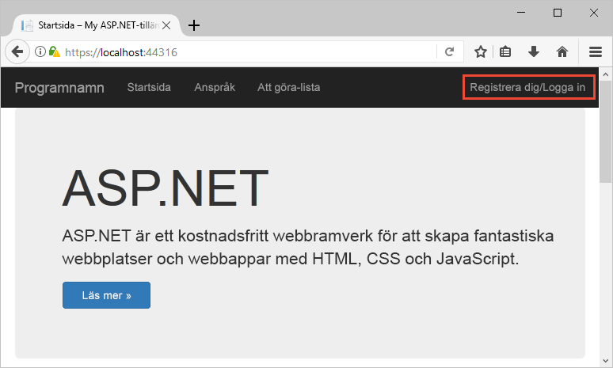
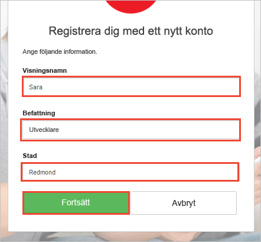
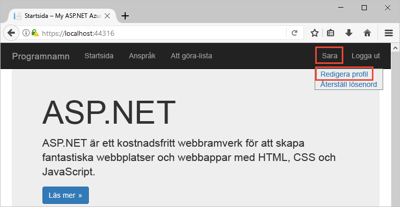
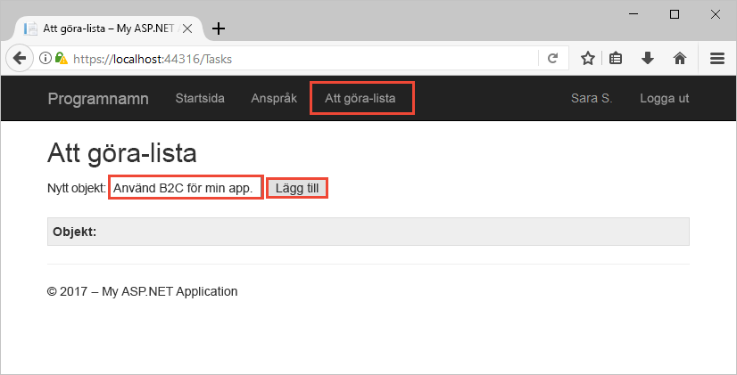

# Testkör ett webbprogram som har konfigurerats med Azure AD B2C

Azure Active Directory B2C ger Identitetshantering i molnet för att hålla ditt program, företag och kunder som skyddas.  Denna Snabbstart använder en exempelapp uppgiften listan för att demonstrera:

* Med hjälp av den **registrera dig eller logga In** princip för att skapa eller logga in med ett sociala identitetsleverantör eller ett lokalt konto med en e-postadress. 
* Anropar en API som skyddas av Azure AD B2C för att skapa och redigera arbetsuppgifter.

## Krav

* Installera [Visual Studio 2017](https://www.visualstudio.com/downloads/) med följande arbetsbelastningar:
    - **ASP.NET och webbutveckling**

* Ett sociala konto från Facebook, Google, Microsoft eller Twitter. Om du inte har en sociala konto, krävs en giltig e-postadress.

[!INCLUDE [quickstarts-free-trial-note](../../includes/quickstarts-free-trial-note.md)]

## Hämta exemplet

[Hämta eller klona exempelprogrammet](https://github.com/Azure-Samples/active-directory-b2c-dotnet-webapp-and-webapi) från GitHub.

## Kör appen i Visual Studio

Öppna i projektmappen exempel programmet den `B2C-WebAPI-DotNet.sln` lösningen i Visual Studio. 

Lösningen består av två projekt:

* **TaskWebApp** – en ASP.NET MVC-webbprogram där en användare kan hantera sina arbetsuppgifter i listan.  
* **TaskService** – ett ASP.NET Web API-serverdel som hanterar alla CRUD-åtgärder som utförs på en användares att göra listobjekt. Webbprogrammet detta API-anrop och visar resultatet.

För den här snabbstarten måste du köra både det `TaskWebApp` och `TaskService` projekt på samma gång. 

1. I Solution Explorer högerklickar du på lösningen och välj **ange Startprojekt...** . 
2. Välj **flera Startprojekt** knappen.
3. Ändra den **åtgärd** för båda projekten till **starta**. Klicka på **OK**.

Välj **Felsök > Starta felsökning** att skapa och köra båda programmen. Varje program öppnas på sin egen webbläsarflik i:

* `https://localhost:44316/`-Den här sidan är ASP.NET-webbprogram. Du kan interagera direkt med det här programmet i Snabbstart.
* `https://localhost:44332/`-Den här sidan är webb-API som anropas av ASP.NET-webbprogram.

## Skapa ett konto

Klicka på den **registrering / logga in** länken i ASP.NET-webbprogram för att starta den **registrera dig eller logga In** arbetsflöde. När du skapar ett konto kan använda du ett befintligt sociala identitet provider-konto eller ett e-postkonto.

### Logga med ett sociala identitetsleverantören.

Klicka på knappen för den identitetsleverantör som du vill använda för att registrera dig med sociala identitetsleverantör. Om du föredrar att använda en e-postadress, hoppa till den [logga med en e-postadress](#sign-up-using-an-email-address) avsnitt.

Du måste autentisera med sociala kontot autentiseringsuppgifter och den programmet behörighet att läsa information från sociala kontot (inloggning). Programmet kan hämta profilinformation från sociala kontot, till exempel ditt namn och ort genom att bevilja åtkomst. 

Slut processen inloggning identitetsprovider. Klicka till exempel **inloggning** knapp för Twitter.

Ditt nya kontoinformation finns i förväg med information från ditt sociala konto.

Uppdatera fält visningsnamn, befattning och ort och klicka på **Fortsätt**.  De värden du anger används för din Azure AD B2C användarprofil.

Du har skapat ett nytt Azure AD B2C-användarkonto som använder en identitetsleverantör. 

Nästa steg: [hopp till Visa din anspråk](#view-your-claims) avsnitt.

### Logga med en e-postadress

Om du väljer att inte använda ett konto för sociala för autentisering kan du skapa ett Azure AD B2C-användarkonto med en giltig e-postadress. Ett lokalt användarkonto i Azure AD B2C använder Azure Active Directory som identitetsleverantören. Om du vill använda din e-postadress, klickar du på den **har du inget konto? Logga nu** länk.

Ange en giltig e-postadress och klicka på **skicka verifieringskoden**. En giltig e-postadress krävs för att få verifieringskoden från Azure AD B2C. 

Ange den Verifieringskod du via e-post och klickar på **Kontrollera koden**.

Lägg till din profilinformation och på **skapa**.

Du har skapat en ny Azure AD B2C lokalt användarkonto.

## Återställa lösenordet

Om du har skapat ditt konto med en e-postadress har funktioner för att tillåta användare att återställa sina lösenord i Azure AD B2C. Om du vill redigera den profil som du har skapat, klicka på ditt profilnamn i menyraden och välj **Återställ lösenord**.

Verifiera din e-postadress genom att ange den och klicka på **skicka verifieringskoden**. En Verifieringskod skickas till din e-postadress.

Ange den Verifieringskod du fick i e-post och klicka på **Kontrollera koden**.

När din e-postadress har verifierats klickar du på **Fortsätt**.

Ange ditt nya lösenord och klicka på **Fortsätt**.

## Visa din anspråk

Klicka på **anspråk** i menyraden web application att visa de anspråk som är associerade med den senaste åtgärden. 

I det här exemplet har den senaste åtgärden för den *logga in eller registrera dig* upplevelse. Observera den **Anspråkstyp** `http://schemas.microsoft.com/claims/authnclassreference` är `b2c_1_susi` som anger den senaste åtgärden var registrering eller inloggning. Om den senaste åtgärden var återställning av lösenord, den **Anspråkstyp** skulle vara `b2c_1_reset`.

## Redigera din profil

Azure Active Directory B2C innehåller funktioner för att tillåta användare att uppdatera deras profiler. Klicka på ditt profilnamn i menyraden web application och välj **Redigera profil** så här redigerar du den profil som du har skapat.

Ändra din **visningsnamn** och **Stad**.  Klicka på **Fortsätt** att uppdatera din profil.

Observera visa namnet uppdateringarna i den övre högra delen av sidan när du har ändrat ditt namn. 

Klicka på **anspråk**. Ändringar du gjort **visningsnamn** och **Stad** återspeglas i anspråk.

 Observera den **Anspråkstyp** `http://schemas.microsoft.com/claims/authnclassreference` har uppdaterats till `b2c_1_edit_profile` som anger den senaste åtgärden som utförs var en profil för redigering. Observera även, namn och ort är de nya värdena *Sara S.* och *Seattle*.

## Komma åt en resurs

Klicka på **uppgiftslista** att ange och ändra din att göra listobjekt. ASP.NET-webbprogram innehåller en åtkomst-token i begäran till web API resurs begärande behörighet att utföra åtgärder på användarens lista arbetsuppgifter. 

Ange text i den **nytt objekt** textruta. Klicka på **Lägg till** skyddas webb-API som lägger till ett listobjekt för att göra att anropa Azure AD B2C.

## Andra scenarier

Andra scenarier för att testa enheten är följande:

* Logga ut från program och klicka på **uppgiftslista**. Observera hur du uppmanas att logga in och din listobjekt sparas. 
* Skapa ett nytt konto med hjälp av en annan typ av konto. Till exempel använda en sociala identitetsleverantör om du har skapat ett konto med en e-postadress tidigare.

## Nästa steg

Nästa steg är att skapa din egen Azure AD B2C-klient och konfigurera samplet som ska köras med din klient. 

> [!div class="nextstepaction"]
> [Skapa en Azure Active Directory B2C-klient i Azure-portalen](active-directory-b2c-get-started.md)