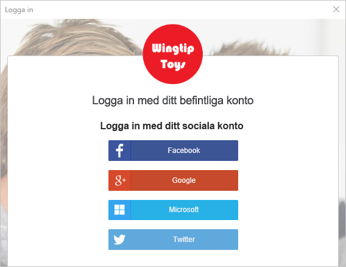

# <a name="quickstart-set-up-sign-in-for-an-aspnet-application-using-azure-active-directory-b2c"></a>Snabbstart: Konfigurera inloggning för ett ASP.NET-program med Azure Active Directory B2C

Azure Active Directory (AD Azure) B2C tillhandahåller identitetshantering i molnet för att skydda dina program, ditt företag och dina kunder. Med Azure AD B2C kan appar autentisera med konton på sociala medier och företagskonton med öppna protokoll.

I den här snabbstarten använder du en Azure AD B2C-aktiverad exempelapp för ASP.NET för att logga in med en social identitetsprovider och anropa ett Azure AD B2C-skyddat webb-API.

[!INCLUDE [quickstarts-free-trial-note](../../includes/quickstarts-free-trial-note.md)]

## <a name="prerequisites"></a>Nödvändiga komponenter

* [Visual Studio 2017](https://www.visualstudio.com/downloads/) med arbetsbelastningen **ASP.NET och webbutveckling**. 
* Ett konto från ett socialt medium, till exempel Facebook, Google, Microsoft eller Twitter.

## <a name="download-the-sample"></a>Hämta exemplet

[Ladda ned en zip-fil](https://github.com/Azure-Samples/active-directory-b2c-dotnet-webapp-and-webapi/archive/master.zip) eller klona exempelwebbappen från GitHub.

```
git clone https://github.com/Azure-Samples/active-directory-b2c-dotnet-webapp-and-webapi.git
```

## <a name="run-the-app-in-visual-studio"></a>Kör appen i Visual Studio

Öppna `B2C-WebAPI-DotNet.sln`-lösningen i Visual Studio i exempelprogrammets projektkatalog.

Exempellösningen innehåller två projekt:

**Exempelwebbapp (TaskWebApp):** webbapp som skapar och redigerar en uppgiftslista. Webbappen använder **registrerings- eller inloggningsprincipen** för att registrera eller logga in användare.

**Webb-API-exempelapp (TaskService):** Webb-API med stöd för att skapa, läsa, uppdatera och ta bort en uppgiftslista. Webb-API:et skyddas av Azure AD B2C och anropas av webbappen.

För den här snabbstarten kör du både projekten `TaskWebApp` och `TaskService` på samma gång. 

1. Välj lösning `B2C-WebAPI-DotNet` i Solution Explorer.
2. Välj **Project > Set StartUp Projects...** (Projekt > Konfigurera StartUp-projekt) på Visual Studio-menyn. 
3. Du kan också markera radioknappen **Multiple startup projects** (Starta flera projekt).
4. Ändra **Åtgärd** för båda projekten till **Start**. Klicka på **OK**.

Tryck på **F5** för att felsöka båda programmen. Varje program öppnas i ett eget webbläsarfönster:

`https://localhost:44316/` – Den här sidan är ASP.NET-webbtillämpningsprogrammet. Du kan interagera direkt med det här programmet i snabbstarten.
`https://localhost:44332/` – Den här sidan är webb-API:et som anropas av ASP.NET-webbtillämpningsprogrammet.

## <a name="create-an-account"></a>Skapa ett konto

Klicka på länken för att **registrera dig eller logga in** i ASP.NET-webbtillämpningsprogrammet för att starta arbetsflödet för att **registrera dig eller logga in** som baseras på en Azure AD B2C-princip.


Exemplet stöder flera registreringsalternativ, till exempel att använda en social identitetsprovider eller att skapa ett lokalt konto med en e-postadress. För den här snabbstarten använder du ett konto från ett socialt medium, till exempel Facebook, Google, Microsoft eller Twitter. 

### <a name="sign-up-using-a-social-identity-provider"></a>Registrera dig med en social identitetsprovider

Azure AD B2C visar en anpassad inloggningssida för ett fiktivt varumärke som kallas Wingtip Toys för exempelwebbappen. 

1. Klicka på knappen för den identitetsprovider som du vill använda för att registrera dig med en social identitetsprovider.

    

    Du autentiserar dig (loggar in) med autentiseringsuppgifterna för ditt sociala konto och ger behörighet till programmet att läsa information från det sociala kontot. När du beviljar åtkomst kan programmet hämta profilinformation från det sociala kontot, till exempel ditt namn och din ort. 

2. Avsluta inloggningsprocessen för identitetsprovidern. Om du till exempel väljer Twitter anger du dina autentiseringsuppgifter för Twitter och klickar på **Logga in**.

    

    Dina profiluppgifter för det nya Azure AD B2C-kontot fylls i automatiskt med information från det sociala kontot.

3. Uppdatera fälten Visningsnamn, Befattning och Ort och klicka på **Fortsätt**.  De värden som du anger används för din Azure AD B2C-användarprofil.

    

    Du har använt exempelwebbappen som använder en Azure AD B2C-princip för att autentisera med hjälp av en identitetsprovider och skapa ett användarkonto för Azure AD B2C. 

## <a name="edit-your-profile"></a>Redigera din profil

Azure Active Directory B2C tillhandahåller funktioner som gör det möjligt för användare att uppdatera sina profiler. Exempelwebbappen använder en Azure AD B2C-princip för att redigera profiler för arbetsflödet. 

1. Klicka på ditt profilnamn på webbappens menyrad och välj **Redigera profil** för att redigera profilen som du har skapat.

    

2. Ändra **Visningsnamn** och **Ort**.  
3. Klicka på **Fortsätt** för att uppdatera din profil. Det nya visningsnamnet visas längst upp till höger på webbappens startsida.

## <a name="access-a-protected-web-api-resource"></a>Få åtkomst till en skyddad webb-API-resurs

1. Klicka på **att göra-listan** för att redigera objekten på att göra-listan. 

2. Ange text i textrutan **Nytt objekt**. Klicka på **Lägg till** för att anropa det Azure AD B2C-skyddade webb-API:et som lägger till ett objekt i att göra-listan.

    

    ASP.NET-webbtillämpningsprogrammet innehåller en åtkomsttoken för Azure AD i begäran till den skyddade web API-resursen som utför åtgärder på användarnas objekt för att göra-listor.

Du har använt ditt Azure AD B2C-användarkonto för att utföra ett auktoriserat anrop till ett Azure AD B2C-skyddat webb-API.

## <a name="clean-up-resources"></a>Rensa resurser

Du kan använda Azure AD B2C-klientorganisationen om du vill prova andra snabbstarter eller självstudier för Azure AD B2C. När den inte längre behövs kan du ta bort [Azure AD B2C-klientorganisationen](active-directory-b2c-faqs.md#how-do-i-delete-my-azure-ad-b2c-tenant).

## <a name="next-steps"></a>Nästa steg

I den här snabbstarten använde du en Azure AD B2C-aktiverad exempelapp för ASP.NET för att logga in med en anpassad inloggningssida, logga in med en social identitetsprovider, skapa ett Azure AD B2C-konto och anropa ett Azure AD B2C-skyddat webb-API. 

Fortsätt till självstudien för att lära dig hur du konfigurerar exempel-ASP.NET för att använda en egen Azure AD B2C-klientorganisation.

> [!div class="nextstepaction"]
> [Skapa en Azure Active Directory B2C-klientorganisation i Azure-portalen](tutorial-create-tenant.md)