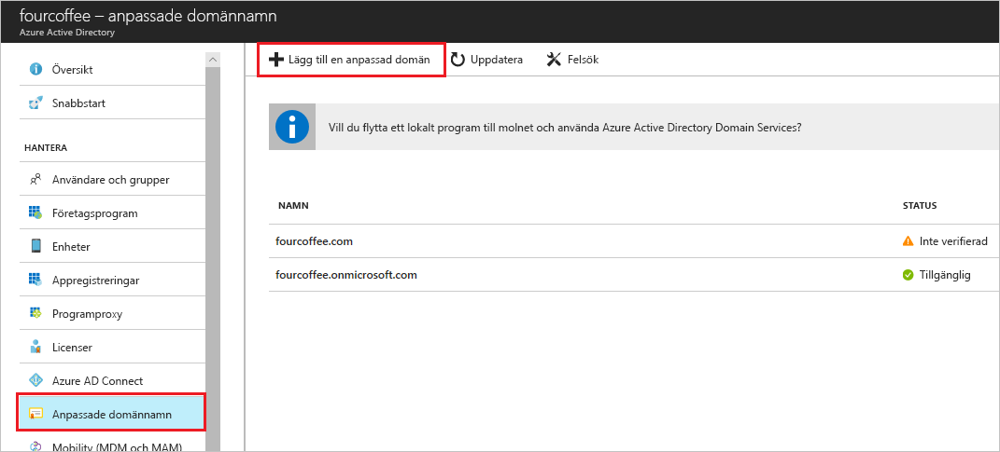

# Så här: Lägg till ditt domännamn med hjälp av Azure Active Directory-portalen
Varje ny Azure AD-klienten levereras med ett första domännamn *domainname*. onmicrosoft.com. Du kan inte ändra eller ta bort det ursprungliga domännamnet, men du kan lägga till din organisations namn i listan. Att lägga till anpassade domännamn som hjälper dig att skapa användarnamn som dina användare känner igen som *alain@contoso.com*.

## Innan du börjar
Innan du kan lägga till ett anpassat domännamn, måste du skapa ditt domännamn med en domänregistrator. En auktoriserad domänregistrator Se [ICANN-Accredited Registratorer](https://www.icann.org/registrar-reports/accredited-list.html).

## Skapa din katalog i Azure AD
När du får ditt domännamn kan skapa du din första Azure AD-katalog.

1. Logga in på den [Azure-portalen](https://portal.azure.com/) med hjälp av en prenumerationsägare för katalogen och välj sedan **Azure Active Directory**.

    

    >[!TIP]
    > Om du planerar att federera din lokala Windows Server AD med Azure AD behöver du markera kryssrutan **Jag planerar att konfigurera den här domänen för enkel inloggning med min lokala Active Directory** när du kör Azure AD Connect-verktyget för att synkronisera dina kataloger. Du behöver även registrera samma domännamn som du väljer för federering med din lokala katalog i steget **Azure AD-domän** i guiden. Du kan se hur det steget i guiden ser ut [i dessa anvisningar](../hybrid/how-to-connect-install-custom.md#verify-the-azure-ad-domain-selected-for-federation). Om du inte har verktyget Azure AD Connect kan du [ladda ned det här](http://go.microsoft.com/fwlink/?LinkId=615771).

2. Skapa en ny katalog genom att följa stegen i [skapar en ny klient för din organisation](active-directory-access-create-new-tenant.md#create-a-new-tenant-for-your-organization).

    >[!Important]
    >Den person som skapar klienten blir automatiskt den globala administratören för den klienten. Global administratör kan lägga till ytterligare administratörer för klienten.

## Lägga till ett anpassat domännamn i Azure AD
När du har skapat din katalog kan du lägga till ditt domännamn.

1. Välj **anpassade domännamn**, och välj sedan **Lägg till anpassad domän**.

    

2. Ange din organisations nya domännamnet i den **anpassade domännamn** box (till exempel _contoso.com_), och välj sedan **Lägg till domän**.

    Overifierad domän läggs och **Contoso** visas där du kan se din DNS-information.

    >[!Important]
    >Du måste ta med .com, .net eller annat toppnivåtillägg för detta ska fungera korrekt.

    

4. Kopiera den DNS-informationen från den **Contoso** sidan. Till exempel MS = ms64983159.

    

## Lägga till DNS-information i domänregistratorn
När du lägger till ett anpassat domännamn till Azure AD måste du gå tillbaka till din domänregistrator och lägga till Azure AD-DNS-information från den kopierade TXT-filen. Skapa den här TXT verifierar-post för din domän ”” ägarskap för ditt domännamn.

-  Gå tillbaka till din domänregistrator, skapa en ny TXT-post för din domän baserat på din kopierade DNS-information i **TTL** (tid till live) till 60 minuter och sedan spara informationen.

    >[!Important]
    >Du kan registrera så många domännamn som du vill ha. Varje domän får dock sin egen TXT-posten från Azure AD. Var försiktig när du anger din TXT-fil uppgifter på domänregistratorn. Om du anger fel eller duplicera information av misstag, kommer du behöva vänta tills TTL-Perioden tidsgränsen (60 minuter) innan du kan försöka igen.

## Kontrollera ditt domännamn
När du registrerar ditt domännamn måste du kontrollera att den är giltig i Azure AD. Spridning från din domänregistrator till Azure AD kan vara omedelbar eller det kan ta upp till några få dagar, beroende på din domänregistrator.

### Verifiera ditt domännamn
1. Logga in på den [Azure-portalen](https://portal.azure.com/) med ett konto som Global administratör för katalogen.

2. Välj **Azure Active Directory**, och välj sedan **anpassade domännamn**.

3. På den **Fabrikam - anpassade domännamn** väljer du det anpassade domännamnet **Contoso**.

    

4. På den **Contoso** väljer **Kontrollera** så att den anpassade domänen har registrerats korrekt och är giltig för Azure AD.

    

### Vanliga problem med verifiering
- Om Azure AD inte kan verifiera ett anpassat domännamn, kan du prova följande rekommendationer:
    - **Vänta minst en timme och försök igen**. DNS-posterna måste spridas innan Azure AD kan verifiera domänen och den här processen kan ta en timme eller mer.

    - **Kontrollera att DNS-posten är korrekt.** Gå tillbaka till webbplatsen domain name Registratorn och kontrollera att posten finns och att den matchar DNS-informationen tillhandahålls av Azure AD.

    Om du inte kan uppdatera posten på webbplatsen registrator, måste du dela posten med någon som har rätt behörighet för att lägga till posten och kontrollera att den är korrekt.

- **Kontrollera att domännamnet inte redan används i en annan katalog.** Ett domännamn kan bara verifieras i en katalog, vilket innebär att om ditt domännamn är för närvarande verifierat i en annan katalog, den inte kan också verifieras på den nya katalogen. Åtgärda problemet duplicering, måste du ta bort domännamnet från den gamla katalogen. Mer information om hur du tar bort domännamn finns [hantera egna domännamn](../users-groups-roles/domains-manage.md). 

## Nästa steg

- Lägg till en annan Global administratör i din katalog. Mer information finns i [så här tilldelar du roller och administratörer](active-directory-users-assign-role-azure-portal.md)

- Lägga till användare i din domän, se [lägga till eller ta bort användare](add-users-azure-active-directory.md)

- Hantera ditt domännamn i Azure AD. Mer information finns i [hantera anpassade domännamn](../users-groups-roles/domains-manage.md)

- Om du har lokala versioner av Windows Server som du vill använda tillsammans med Azure Active Directory, se [integrerar dina lokala kataloger med Azure Active Directory](../connect/active-directory-aadconnect.md).