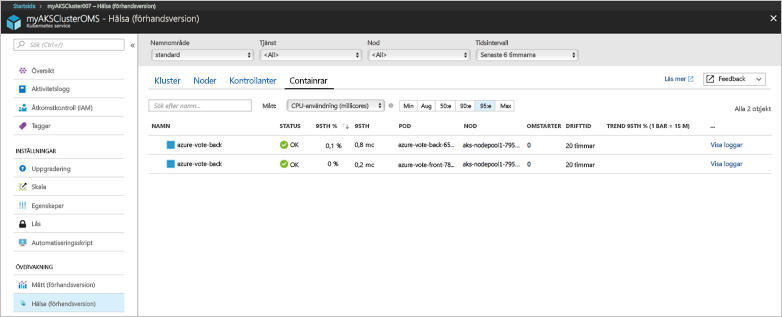
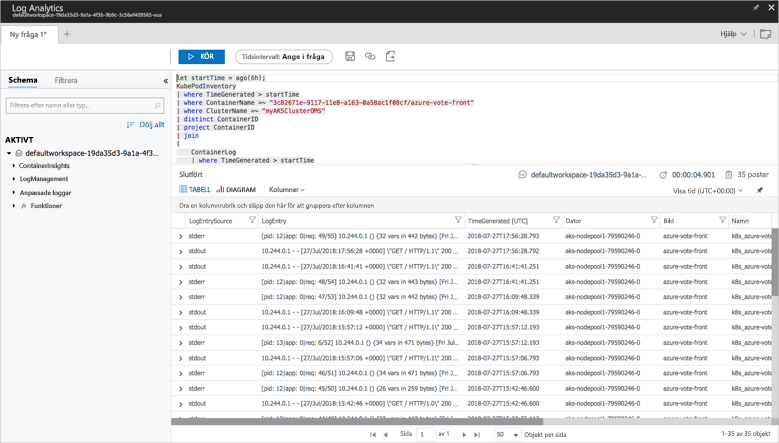

# <a name="quickstart-deploy-an-azure-kubernetes-service-aks-cluster"></a>Snabbstart: Distribuera ett Azure Kubernetes Service-kluster (AKS)

I den här snabbstarten ska vi distribuera ett AKS-kluster med hjälp av Azure CLI. Därefter kör vi ett flerbehållarprogram som består av en webbklientdel och en Redis-instans i klustret. När vi har gjort det kan programmet nås via Internet.


I den här snabbstarten förutsätter vi att du har grundläggande kunskaper om vanliga Kubernetes-begrepp. Detaljerad information om Kubernetes finns i [Kubernetes-dokumentationen][kubernetes-documentation].

[!INCLUDE [cloud-shell-try-it.md](../../includes/cloud-shell-try-it.md)]

Om du väljer att installera och använda CLI lokalt måste du köra Azure CLI version 2.0.43 eller senare under den här snabbstarten. Kör `az --version` för att hitta versionen. Om du behöver installera eller uppgradera kan du läsa [Installera Azure CLI][azure-cli-install].

## <a name="create-a-resource-group"></a>Skapa en resursgrupp

Skapa en resursgrupp med kommandot [az group create][az-group-create]. En Azure-resursgrupp är en logisk grupp där Azure-resurser distribueras och hanteras. När du skapar en resursgrupp uppmanas du att ange en plats. Den här platsen är där dina resurser körs i Azure.

I följande exempel skapas en resursgrupp med namnet *myAKSCluster* på platsen *eastus*.

```azurecli-interactive
az group create --name myAKSCluster --location eastus
```

Resultat:

```json
{
  "id": "/subscriptions/00000000-0000-0000-0000-000000000000/resourceGroups/myAKSCluster",
  "location": "eastus",
  "managedBy": null,
  "name": "myAKSCluster",
  "properties": {
    "provisioningState": "Succeeded"
  },
  "tags": null
}
```

## <a name="create-aks-cluster"></a>Skapa AKS-kluster

Använd kommandot [az aks create] [ az-aks-create] för att skapa ett AKS-kluster. I följande exempel skapas ett kluster med namnet *myAKSCluster* och en enda nod. Hälsoövervakning för container aktiveras också med hjälp av parametern *--enable-addons monitoring*. Mer information om att aktivera övervakningslösningen av containertillstånd finns i [Övervaka hälsotillstånd för Azure Kubernets Service][aks-monitor].

```azurecli-interactive
az aks create --resource-group myAKSCluster --name myAKSCluster --node-count 1 --enable-addons monitoring --generate-ssh-keys
```

Efter flera minuter slutförs kommandot och returnerar JSON-formaterad information om klustret.

## <a name="connect-to-the-cluster"></a>Anslut till klustret

Hantera Kubernetes-kluster med [kubectl][kubectl], Kubernetes kommandoradsklient.

Om du använder Azure CloudShell är `kubectl` redan installerat. Vill du installera det lokalt använder du kommandot [az aks install-cli][az-aks-install-cli].


```azurecli
az aks install-cli
```

För att konfigurera `kubectl` till att ansluta till ditt Kubernetes-kluster använder du kommandot [az aks get-credentials][az-aks-get-credentials]. I det här steget laddar vi ned autentiseringsuppgifter och konfigurerar Kubernetes CLI för att använda dem.

```azurecli-interactive
az aks get-credentials --resource-group myAKSCluster --name myAKSCluster
```

Du kan kontrollera anslutningen till klustret genom att köra kommandot [kubectl get][kubectl-get] för att returnera en lista över klusternoderna. Det kan ta några minuter för noderna att visas.

```azurecli-interactive
kubectl get nodes
```

Resultat:

```
NAME                          STATUS    ROLES     AGE       VERSION
k8s-myAKSCluster-36346190-0   Ready     agent     2m        v1.7.7
```

## <a name="run-the-application"></a>Köra programmet

En Kubernetes-manifestfil definierar ett önskat tillstånd för klustret, till exempel vilka containeravbildningar som ska köras. I det här exemplet används ett manifest för att skapa alla objekt som behövs för att köra Azure Vote-programmet. Det här manifestet innehåller två [Kubernetes-distributioner][kubernetes-deployment], en för Azure Vote Python-program och den andra för en Redis-instans. Dessutom skapas två [Kubernetes-tjänster][kubernetes-service], en intern tjänst för Redis-instansen och en extern tjänst för att komma åt Azure Vote-programmet från Internet.

Skapa en fil med namnet `azure-vote.yaml` och kopiera följande YAML-kod till den. Om du arbetar i Azure Cloud Shell, kan du skapa filen med vi eller Nano som i ett virtuellt eller fysiskt system.

```yaml
apiVersion: apps/v1beta1
kind: Deployment
metadata:
  name: azure-vote-back
spec:
  replicas: 1
  template:
    metadata:
      labels:
        app: azure-vote-back
    spec:
      containers:
      - name: azure-vote-back
        image: redis
        ports:
        - containerPort: 6379
          name: redis
---
apiVersion: v1
kind: Service
metadata:
  name: azure-vote-back
spec:
  ports:
  - port: 6379
  selector:
    app: azure-vote-back
---
apiVersion: apps/v1beta1
kind: Deployment
metadata:
  name: azure-vote-front
spec:
  replicas: 1
  template:
    metadata:
      labels:
        app: azure-vote-front
    spec:
      containers:
      - name: azure-vote-front
        image: microsoft/azure-vote-front:v1
        ports:
        - containerPort: 80
        env:
        - name: REDIS
          value: "azure-vote-back"
---
apiVersion: v1
kind: Service
metadata:
  name: azure-vote-front
spec:
  type: LoadBalancer
  ports:
  - port: 80
  selector:
    app: azure-vote-front
```

Använd kommandot [kubectl apply][kubectl-apply] för att köra programmet.

```azurecli-interactive
kubectl apply -f azure-vote.yaml
```

Resultat:

```
deployment "azure-vote-back" created
service "azure-vote-back" created
deployment "azure-vote-front" created
service "azure-vote-front" created
```

## <a name="test-the-application"></a>Testa programmet

När programmet körs skapas en [Kubernetes-tjänst][kubernetes-service] som exponerar programmets klientdel mot Internet. Den här processen kan ta ett par minuter att slutföra.

Du kan övervaka förloppet genom att använda kommandot [kubectl get service][kubectl-get] med argumentet `--watch`.

```azurecli-interactive
kubectl get service azure-vote-front --watch
```

Till en början visas *EXTERNAL-IP* för *azure-vote-front*-tjänsten som *pending* (väntande).

```
NAME               TYPE           CLUSTER-IP   EXTERNAL-IP   PORT(S)        AGE
azure-vote-front   LoadBalancer   10.0.37.27   <pending>     80:30572/TCP   6s
```

När *EXTERNAL-IP*-adressen har ändrats från *pending* till en *IP-adress* använder du `CTRL-C` för att stoppa kubectl-övervakningsprocessen.

```
azure-vote-front   LoadBalancer   10.0.37.27   52.179.23.131   80:30572/TCP   2m
```

Gå till den externa IP-adressen så att du ser Azure Vote-appen.


## <a name="monitor-health-and-logs"></a>Övervaka hälsotillstånd och loggar

När AKS-klustret skapades aktiverades övervakning för att registrera hälsomått för både klusternoderna och poddarna. De här hälsomåtten är tillgängliga i Azure-portalen. Mer information om övervakning av hälsotillstånd för containrar finns i [Övervaka hälsotillstånd för Azure Kubernets Service][aks-monitor].

Om du vill se aktuell status, drifttid och resursanvändning för Azure Vote-poddarna slutför du följande steg:

1. Öppna en webbläsare till Azure-portalen [https://portal.azure.com][azure-portal].
1. Välj din resursgrupp, till exempel *myResourceGroup*, och välj sedan ditt AKS-kluster, till exempel *myAKSCluster*. 
1. Välj **Monitor container health** (Övervaka containerhälsa) > välj **standardnamnrymden** > välj sedan **Containers** (Containrar).

Det kan ta några minuter för dessa data att hämtas till Azure-portalen, enligt följande exempel:



Om du vill se loggar för podden `azure-vote-front` väljer du länken **Visa loggar** på höger sida av listan över containrar. Loggarna inkluderar strömmarna *stdout* och *stderr* från containern.



## <a name="delete-cluster"></a>Ta bort klustret

När klustret inte längre behövs kan du använda kommandot [az group delete][az-group-delete] för att ta bort resursgruppen, containertjänsten och alla relaterade resurser.

```azurecli-interactive
az group delete --name myAKSCluster --yes --no-wait
```

> [!NOTE]
> När du tar bort klustret tas Azure Active Directory-tjänstens huvudnamn, som används av AKS-klustret, inte bort. Stegvisa instruktioner om hur du tar bort tjänstens huvudnamn finns i dokumentationen om [viktiga överväganden och borttagning av AKS-tjänsten][sp-delete].

## <a name="get-the-code"></a>Hämta koden

I den här snabbstarten har fördefinierade containeravbildningar använts för att skapa en Kubernetes-distribution. Den tillhörande programkoden, Dockerfile och Kubernetes-manifestfilen finns på GitHub.

[https://github.com/Azure-Samples/azure-voting-app-redis][azure-vote-app]

## <a name="next-steps"></a>Nästa steg

I den här snabbstartsguiden distribuerade du ett Kubernetes-kluster och distribuerade sedan ett flerbehållarprogram till det.

Om du vill lära dig mer om AKS, och gå igenom ett exempel med fullständig distributionskod, fortsätter du till självstudiekursen om Kubernetes-kluster.

> [!div class="nextstepaction"]
> [Självstudiekurs om AKS][aks-tutorial]

<!-- LINKS - external -->
[azure-vote-app]: https://github.com/Azure-Samples/azure-voting-app-redis.git
[kubectl]: https://kubernetes.io/docs/user-guide/kubectl/
[kubectl-apply]: https://kubernetes.io/docs/reference/generated/kubectl/kubectl-commands#apply
[kubernetes-deployment]: https://kubernetes.io/docs/concepts/workloads/controllers/deployment/
[kubernetes-documentation]: https://kubernetes.io/docs/home/
[kubectl-get]: https://kubernetes.io/docs/reference/generated/kubectl/kubectl-commands#get
[kubernetes-service]: https://kubernetes.io/docs/concepts/services-networking/service/

<!-- LINKS - internal -->
[aks-monitor]: https://aka.ms/coingfonboarding
[aks-tutorial]: ./tutorial-kubernetes-prepare-app.md
[az-aks-browse]: /cli/azure/aks?view=azure-cli-latest#az-aks-browse
[az-aks-create]: /cli/azure/aks?view=azure-cli-latest#az-aks-create
[az-aks-get-credentials]: /cli/azure/aks?view=azure-cli-latest#az-aks-get-credentials
[az-aks-install-cli]: /cli/azure/aks?view=azure-cli-latest#az-aks-install-cli
[az-group-create]: /cli/azure/group#az-group-create
[az-group-delete]: /cli/azure/group#az-group-delete
[azure-cli-install]: /cli/azure/install-azure-cli
[sp-delete]: kubernetes-service-principal.md#additional-considerations
[azure-portal]: https://portal.azure.com
