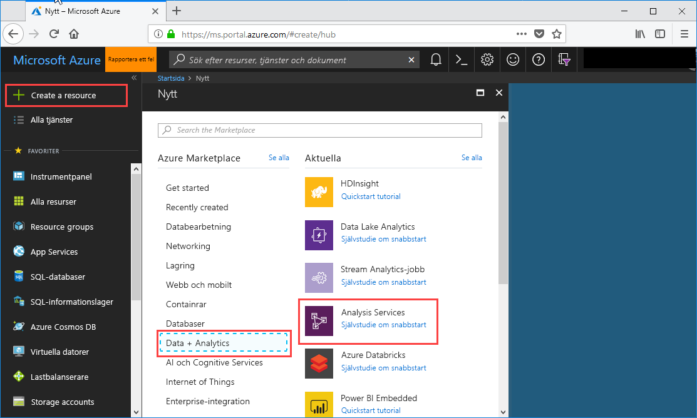
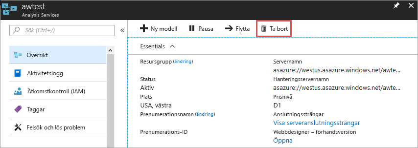

# Skapa en Analysis Services-server i Azure-portalen
Den här artikeln vägleder dig genom att skapa en resurs för Analysis Services-server i din Azure-prenumeration.

Innan du börjar måste du: 

* **Azure-prenumeration**: Gå till [Kostnadsfri utvärderingsversion av Azure](https://azure.microsoft.com/offers/ms-azr-0044p/) för att skapa ett konto.
* **Azure Active Directory**: din prenumeration måste vara kopplad till en Azure Active Directory-klient. Och du måste vara inloggad i Azure med ett konto i den Azure Active Directory. Mer information finns i [Autentisering och användarbehörigheter](analysis-services-manage-users.md).

## Logga in på Azure Portal 

Logga in på [Azure-portalen](https://portal.azure.com)

## Skapa en server

1. Klicka på **+ skapa en resurs** > **Data + analys** > **Analysis Services**.

    

2. I **Analysis Services**, Fyll i de obligatoriska fälten och tryck sedan på **skapa**.
   
    
   
   * **Servernamnet**: Ange ett unikt namn som refererar till servern.
   * **Prenumerationen**: Välj den prenumeration som den här servern kommer att kopplas till.
   * **Resursgruppen**: skapa en ny resursgrupp eller välj en det finns redan. Resursgrupper är avsedda att hjälpa dig att hantera en samling Azure-resurser. Läs mer i [resursgrupper](../azure-resource-manager/resource-group-overview.md).
   * **Plats**: servern är värd för platsen för den här Azure-datacenter. Välj en plats närmast största användarbasen.
   * **Prisnivån**: Välj en prisnivå. Om du vill testa och tänker installera exempeldatabasen för modellen, Välj den kostnadsfria **D1** nivå. Läs mer i [priser för Azure Analysis Services](https://azure.microsoft.com/pricing/details/analysis-services/). 
    * **Administratören**: som standard blir det konto du är inloggad med. Du kan välja ett annat konto från Azure Active Directory.
    * **Backup Storage inställningen**: valfria. Om du redan har en [lagringskonto](../storage/common/storage-introduction.md), du kan ange den som standard för modellen databassäkerhetskopia. Du kan också ange [säkerhetskopierar och återställer](analysis-services-backup.md) inställningarna senare.
    * **Lagring viktiga förfallodatum**: valfria. Ange en lagringsperiod viktiga upphör att gälla.
3. Klicka på **Skapa**.

Skapa tar vanligtvis under en minut. Om du har valt **lägga till till portalen**, gå till portalen för att se den nya servern. Eller navigera till **alla tjänster** > **Analysis Services** att se om din server är klar.

## Rensa resurser
Ta bort servern när de inte längre behövs. I serverns **översikt**, klickar du på **ta bort**. 

 

## Nästa steg

[Lägg till en exempel-datamodell](analysis-services-create-sample-model.md) till servern.  
[Installera en lokal datagateway](analysis-services-gateway-install.md) om datamodellen ansluter till lokala datakällor.  
[Distribuera en tabellmodell projekt](analysis-services-deploy.md) från Visual Studio.   

