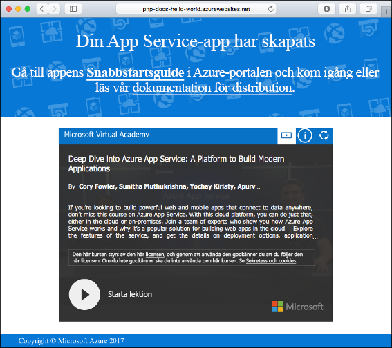
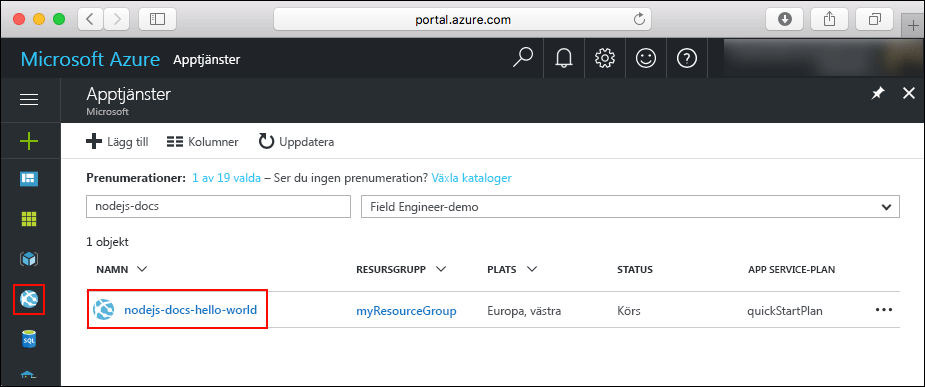

# <a name="create-a-nodejs-web-app-in-azure"></a>Skapa en Node.js-webbapp i Azure

> [!NOTE]
> I den här artikeln distribueras en app till App Service i Windows. Om du vill distribuera en app till App Service i _Linux_ kan du läsa [Skapa en Node.js-webbapp i Azure App Service på Linux](./containers/quickstart-nodejs.md).
>

Med [Azure Web Apps](app-service-web-overview.md) får du en mycket skalbar och automatiskt uppdaterad webbvärdtjänst.  Den här snabbstarten visar hur du distribuerar en Node.js-app till Azure Web Apps. Du skapar webbappen med [Azure CLI](https://docs.microsoft.com/cli/azure/get-started-with-azure-cli) och använder Git för att distribuera Node.js-exempelkoden till webbappen.


Du kan följa stegen här på en Mac-, Windows- eller Linux-dator. Det tar cirka fem minuter att slutföra självstudiekursen när de nödvändiga komponenterna har installerats.   

> [!VIDEO https://channel9.msdn.com/Shows/Azure-for-Node-Developers/Create-a-Nodejs-app-in-Azure-Quickstart/player]   

[!INCLUDE [quickstarts-free-trial-note](../../includes/quickstarts-free-trial-note.md)]

## <a name="prerequisites"></a>Nödvändiga komponenter

För att slutföra den här snabbstarten behöver du:

* <a href="https://nodejs.org/" target="_blank">Installera Node.js och NPM</a>

## <a name="download-the-sample"></a>Hämta exemplet

Ladda ned exempelprojektet för Node.js från [https://github.com/Azure-Samples/nodejs-docs-hello-world/archive/master.zip](https://github.com/Azure-Samples/nodejs-docs-hello-world/archive/master.zip) och extrahera ZIP-arkivet.

Navigera till rotkatalogen för Node.js-exempelprojektet i ett terminalfönster (det som innehåller _index.js_).

## <a name="run-the-app-locally"></a>Köra appen lokalt

Kör programmet lokalt genom att öppna ett terminalfönster och använda `npm start`-skriptet för att starta den inbyggda Node.js HTTP-servern.

```bash
npm start
```

Öppna en webbläsare och navigera till exempelappen på `http://localhost:1337`.

Nu kan du se **Hello World**-meddelandet från exempelappen på sidan.


Tryck på **Ctrl+C** i terminalfönstret för att avsluta webbservern.

[!INCLUDE [Create ZIP file](../../includes/app-service-web-create-zip.md)]

[!INCLUDE [cloud-shell-try-it.md](../../includes/cloud-shell-try-it.md)]

[!INCLUDE [Create resource group](../../includes/app-service-web-create-resource-group.md)] 

[!INCLUDE [Create app service plan](../../includes/app-service-web-create-app-service-plan.md)] 

## <a name="create-a-web-app"></a>Skapa en webbapp

Skapa i Cloud Shell en webbapp i `myAppServicePlan` App Service-planen med kommandot [`az webapp create`](/cli/azure/webapp?view=azure-cli-latest#az_webapp_create). 

Ersätt `<app_name>` med ett globalt unikt appnamn (giltiga tecken är `a-z`, `0-9` och `-`) i följande exempel. Körningen har angetts till `NODE|6.9`. Om du vill se alla körningar som stöds ska du köra [`az webapp list-runtimes`](/cli/azure/webapp?view=azure-cli-latest#az_webapp_list_runtimes). 

```azurecli-interactive
# Bash
az webapp create --resource-group myResourceGroup --plan myAppServicePlan --name <app_name> --runtime "NODE|6.9"
# PowerShell
az --% webapp create --resource-group myResourceGroup --plan myAppServicePlan --name <app_name> --runtime "NODE|6.9"
```

När webbappen har skapats visar Azure CLI utdata liknande den i följande exempel:

```json
{
  "availabilityState": "Normal",
  "clientAffinityEnabled": true,
  "clientCertEnabled": false,
  "cloningInfo": null,
  "containerSize": 0,
  "dailyMemoryTimeQuota": 0,
  "defaultHostName": "<app_name>.azurewebsites.net",
  "enabled": true,
  < JSON data removed for brevity. >
}
```

Bläddra till webbappen som precis skapades. Ersätt _&lt;appnamn >_ med ett unikt appnamn.

```bash
http://<app name>.azurewebsites.net
```

Så här bör din nya webbapp se ut:



[!INCLUDE [Deploy ZIP file](../../includes/app-service-web-deploy-zip.md)]

## <a name="browse-to-the-app"></a>Bläddra till appen

Bläddra till den distribuerade appen via webbläsaren.

```
http://<app_name>.azurewebsites.net
```

Node.js-exempelkoden körs i en Azure App Service-webbapp.


**Grattis!** Du har distribuerat din första Node.js-app till App Service.

## <a name="update-and-redeploy-the-code"></a>Uppdatera och distribuera om koden

Öppna filen `index.js` i Node.js-appen med ett textredigeringsprogram och gör små ändringar i texten i anropet till `response.end`:

```nodejs
response.end("Hello Azure!");
```

I det lokala terminalfönstret navigerar du till programmets rotkatalog och skapar en ny ZIP-fil för det uppdaterade projektet.

```
# Bash
zip -r myUpdatedAppFiles.zip .

# PowerShell
Compress-Archive -Path * -DestinationPath myUpdatedAppFiles.zip
``` 

Distribuera den nya ZIP-filen till App Service med samma steg som i [Ladda upp ZIP-filen](#upload-the-zip-file).

Gå tillbaka till webbläsarfönstret som öppnades när du skulle **söka efter appen** och klicka på knappen för att uppdatera sidan.


## <a name="manage-your-new-azure-web-app"></a>Hantera din nya Azure-webbapp

Gå till <a href="https://portal.azure.com" target="_blank">Azure Portal</a> för att hantera den webbapp som du skapade.

Klicka på **App Services** i menyn till vänster och sedan på namnet på din Azure-webbapp.



Nu visas sidan Översikt för din webbapp. Här kan du utföra grundläggande hanteringsåtgärder som att bläddra, stoppa, starta, starta om och ta bort. 


Menyn till vänster innehåller olika sidor för att konfigurera appen. 

[!INCLUDE [cli-samples-clean-up](../../includes/cli-samples-clean-up.md)]

## <a name="next-steps"></a>Nästa steg

> [!div class="nextstepaction"]
> [Node.js med MongoDB](app-service-web-tutorial-nodejs-mongodb-app.md)
