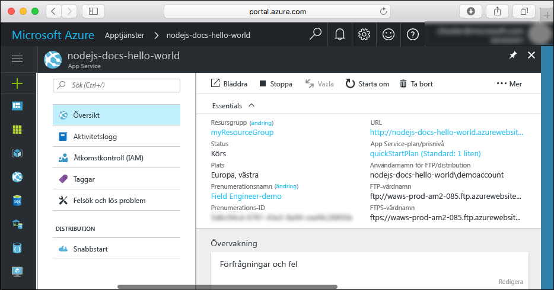

# <a name="create-a-python-web-app-in-azure"></a>Skapa en Python-webbapp i Azure

Med [Azure Web Apps](app-service-web-overview.md) får du en mycket skalbar och automatiskt uppdaterad webbvärdtjänst.  Den här snabbstarten visar hur du utvecklar en Python-app och distribuerar den till Azure Web Apps. Du skapar webbappen med [Azure CLI](https://docs.microsoft.com/cli/azure/get-started-with-azure-cli) och använder Git för att distribuera Python-exempelkoden till webbappen.


Du kan följa stegen nedan på en Mac-, Windows- eller Linux-dator. Det tar cirka fem minuter att slutföra självstudiekursen när de nödvändiga komponenterna har installerats.

## <a name="prerequisites"></a>Krav

För att slutföra den här kursen behöver du:

1. [Installera Git](https://git-scm.com/)
1. [Installera Python](https://www.python.org/downloads/)

[!INCLUDE [quickstarts-free-trial-note](../../includes/quickstarts-free-trial-note.md)]

## <a name="download-the-sample"></a>Hämta exemplet

Kör följande kommando i ett terminalfönster för att klona databasen för exempelappen till den lokala datorn.

```bash
git clone https://github.com/Azure-Samples/python-docs-hello-world
```

Ändra till den katalog som innehåller exempelkoden.

```bash
cd python-docs-hello-world
```

## <a name="run-the-app-locally"></a>Köra appen lokalt

Installera de paket som behövs med hjälp av `pip`.

```bash
pip install -r requirements.txt
```

Kör programmet lokalt genom att öppna ett terminalfönster och använda kommandot `Python` för att starta den inbyggda Python-webbservern.

```bash
python main.py
```

Öppna en webbläsare och gå till exempelapp på `http://localhost:5000`.

Nu kan du se **Hello World**-meddelandet från exempelappen på sidan.


Tryck på **Ctrl+C** i terminalfönstret för att avsluta webbservern.

[!INCLUDE [cloud-shell-try-it.md](../../includes/cloud-shell-try-it.md)]

[!INCLUDE [Configure deployment user](../../includes/configure-deployment-user.md)]

[!INCLUDE [Create resource group](../../includes/app-service-web-create-resource-group.md)]

[!INCLUDE [Create app service plan](../../includes/app-service-web-create-app-service-plan.md)]

## <a name="create-a-web-app"></a>Skapa en webbapp

[!INCLUDE [Create web app](../../includes/app-service-web-create-web-app-python-no-h.md)]

Bläddra till den nya webbappen. Ersätt  _&lt;appnamn >_ med ett unikt appnamn.

```bash
http://<app name>.azurewebsites.net
```


[!INCLUDE [Push to Azure](../../includes/app-service-web-git-push-to-azure.md)]

```bash
Counting objects: 18, done.
Delta compression using up to 4 threads.
Compressing objects: 100% (16/16), done.
Writing objects: 100% (18/18), 4.31 KiB | 0 bytes/s, done.
Total 18 (delta 4), reused 0 (delta 0)
remote: Updating branch 'master'.
remote: Updating submodules.
remote: Preparing deployment for commit id '44e74fe7dd'.
remote: Generating deployment script.
remote: Generating deployment script for python Web Site
remote: Generated deployment script files
remote: Running deployment command...
remote: Handling python deployment.
remote: KuduSync.NET from: 'D:\home\site\repository' to: 'D:\home\site\wwwroot'
remote: Deleting file: 'hostingstart.html'
remote: Copying file: '.gitignore'
remote: Copying file: 'LICENSE'
remote: Copying file: 'main.py'
remote: Copying file: 'README.md'
remote: Copying file: 'requirements.txt'
remote: Copying file: 'virtualenv_proxy.py'
remote: Copying file: 'web.2.7.config'
remote: Copying file: 'web.3.4.config'
remote: Detected requirements.txt.  You can skip Python specific steps with a .skipPythonDeployment file.
remote: Detecting Python runtime from site configuration
remote: Detected python-3.4
remote: Creating python-3.4 virtual environment.
remote: .................................
remote: Pip install requirements.
remote: Successfully installed Flask click itsdangerous Jinja2 Werkzeug MarkupSafe
remote: Cleaning up...
remote: .
remote: Overwriting web.config with web.3.4.config
remote:         1 file(s) copied.
remote: Finished successfully.
remote: Running post deployment command(s)...
remote: Deployment successful.
To https://<app_name>.scm.azurewebsites.net/<app_name>.git
 * [new branch]      master -> master
```

## <a name="browse-to-the-app"></a>Bläddra till appen

Bläddra till den distribuerade appen via webbläsaren.

```bash
http://<app_name>.azurewebsites.net
```

Python-exempelkoden körs i en Azure App Service-webbapp.


**Grattis!** Du har distribuerat din första Python-app till App Service.

## <a name="update-and-redeploy-the-code"></a>Uppdatera och distribuera om koden

Öppna filen `main.py` i Python-appen med ett lokalt textredigeringsprogram och gör små ändringar i texten i strängen bredvid `return`-instruktionen:

```python
return 'Hello, Azure!'
```

Genomför ändringarna i Git i lokala terminalfönster och sedan genomför kodändringarna i Azure.

```bash
git commit -am "updated output"
git push azure master
```

När distributionen är klar går du tillbaka till webbläsarfönstret som öppnades när du skulle [söka efter appen](#browse-to-the-app) och klickar på knappen för att uppdatera sidan.


## <a name="manage-your-new-azure-web-app"></a>Hantera din nya Azure-webbapp

Gå till <a href="https://portal.azure.com" target="_blank">Azure Portal</a> för att hantera den webbapp som du skapade.

Klicka på **Apptjänster** i menyn till vänster och sedan på namnet på din Azure-webbapp.


Nu visas sidan Översikt för din webbapp. Här kan du utföra grundläggande hanteringsåtgärder som att bläddra, stoppa, starta, starta om och ta bort.



Menyn till vänster innehåller olika sidor för att konfigurera appen.

[!INCLUDE [cli-samples-clean-up](../../includes/cli-samples-clean-up.md)]

## <a name="next-steps"></a>Nästa steg

> [!div class="nextstepaction"]
> [Mappa ett befintligt anpassat DNS-namn till Azure Web Apps](app-service-web-tutorial-custom-domain.md)
