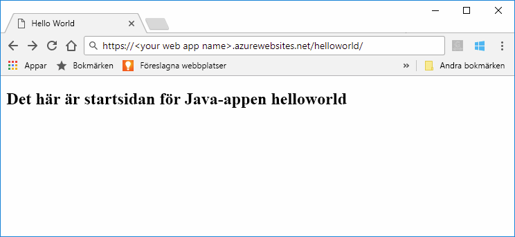

# <a name="quickstart-create-a-java-web-app-in-app-service-on-linux"></a>Snabbstart: Skapa en Java-webbapp i App Service i Linux

App Service i Linux erbjuder nu en förhandsvisningsfunktion för att stödja webbappar i Java. Mer information om förhandsversioner finns i [de kompletterande villkoren för användning av Microsoft Azure-förhandsversioner](https://azure.microsoft.com/support/legal/preview-supplemental-terms/). 

Med [App Service i Linux](app-service-linux-intro.md) får du en mycket skalbar och automatiskt uppdaterad webbvärdtjänst som utgår från operativsystemet Linux. Den här snabbstarten visar hur du använder [Azure CLI](https://docs.microsoft.com/cli/azure/get-started-with-azure-cli) med [Maven-plugin-program för Azure Web Apps (förhandsversion)](https://github.com/Microsoft/azure-maven-plugins/tree/develop/azure-webapp-maven-plugin) för att distribuera en Java-webbapp med en inbyggd Linux-avbildning.


[Distribuera Java-webbappar till en Linux-behållare i molnet med Azure-verktyget för IntelliJ](https://docs.microsoft.com/java/azure/intellij/azure-toolkit-for-intellij-hello-world-web-app-linux) är en alternativ metod för att distribuera Java-appen till din egen behållare.

[!INCLUDE [quickstarts-free-trial-note](../../../includes/quickstarts-free-trial-note.md)]


## <a name="prerequisites"></a>Nödvändiga komponenter

För att slutföra den här snabbstarten behöver du: 

* [Azure CLI 2.0 eller senare](https://docs.microsoft.com/cli/azure/install-azure-cli?view=azure-cli-latest) installeras lokalt.
* [Apache Maven](http://maven.apache.org/).


## <a name="create-a-java-app"></a>Skapa en Java-app

Kör följande kommando med Maven för att skapa en ny *helloworld*-webbapp:  

    mvn archetype:generate -DgroupId=example.demo -DartifactId=helloworld -DarchetypeArtifactId=maven-archetype-webapp

Byt till den nya projektkatalogen *helloworld* och skapa alla moduler med följande kommando:

    mvn verify

Det här kommandot verifierar och skapar alla moduler inklusive filen *helloworld.war* i underkatalogen *helloworld/target*.


## <a name="deploying-the-java-app-to-app-service-on-linux"></a>Distribuera Java-appen till App Service på Linux

Det finns flera distributionsalternativ för att distribuera dina Java-webbappar till App Service på Linux. Dessa alternativ är:

* [Distribuera ett Maven-plugin-program för Azure Web Apps](https://github.com/Microsoft/azure-maven-plugins/tree/develop/azure-webapp-maven-plugin)
* [Distribuera via ZIP eller WAR](https://docs.microsoft.com/azure/app-service/app-service-deploy-zip)
* [Distribuera via FTP](https://docs.microsoft.com/azure/app-service/app-service-deploy-ftp)

I den här snabbstarten använder du Maven-plugin-programmet för Azure-webbappar. Det har fördelen att det är lätt att använda från Maven och det skapar nödvändiga Azure-resurser (resursgrupp, app service plan och webbapp).

### <a name="deploy-with-maven"></a>Distribuera med Maven

Om du vill distribuera från Maven lägger du till följande plugin-definition i `<build>`-elementet i filen *pom.xml*:

```xml
    <plugins>
      <plugin>
        <groupId>com.microsoft.azure</groupId> 
        <artifactId>azure-webapp-maven-plugin</artifactId> 
        <version>1.1.0</version>
        <configuration> 
          <resourceGroup>YOUR_RESOURCE_GROUP</resourceGroup> 
          <appName>YOUR_WEB_APP</appName> 
          <linuxRuntime>tomcat 9.0-jre8</linuxRuntime>
          <deploymentType>ftp</deploymentType> 
          <resources> 
              <resource> 
                  <directory>${project.basedir}/target</directory> 
                  <targetPath>webapps</targetPath> 
                  <includes> 
                      <include>*.war</include> 
                  </includes> 
                  <excludes> 
                      <exclude>*.xml</exclude> 
                  </excludes> 
              </resource> 
          </resources> 
        </configuration>
      </plugin>
    </plugins>
```    

Uppdatera följande platshållare i konfigurationen av plugin-program:

| Platshållare | Beskrivning |
| ----------- | ----------- |
| `YOUR_RESOURCE_GROUP` | Namnet på den nya resursgrupp där du vill skapa din webbapp. Genom att lägga alla resurser för en app i en grupp, kan du hantera dem tillsammans. Genom att till exempel ta bort resursgruppen skulle du ta bort alla resurser som är associerade med appen. Uppdatera det här värdet med ett unikt nytt resursgruppnamn, till exempel *TestResources*. Du använder den här resursgruppens namn för att rensa alla Azure-resurser i ett senare avsnitt. |
| `YOUR_WEB_APP` | Appnamnet är en del av värdnamnet för webbappen när den distribueras till Azure (YOUR_WEB_APP.azurewebsites.net). Uppdatera det här värdet med ett unikt namn för den nya Azure-webbappen, som blir värd för din Java-app, till exempel *contoso*. |

Elementet `linuxRuntime` i konfigurationen styr vilken inbyggd Linux-avbildning som används med programmet.

Kör följande kommando och följ alla instruktioner för att autentisera med Azure CLI:

    az login

Distribuera din Java-app till webbappen med följande kommando:

    mvn clean package azure-webapp:deploy


När distributionen är klar bläddrar du till den distribuerade tillämpningen med hjälp av följande webbadress i webbläsaren.

```bash
http://<app_name>.azurewebsites.net/helloworld
```

Java-exempelkoden körs i en webbapp med inbyggd avbildning.



**Grattis!** Du har distribuerat din första Java-app till App Service på Linux.


[!INCLUDE [cli-samples-clean-up](../../../includes/cli-samples-clean-up.md)]


## <a name="next-steps"></a>Nästa steg

I den här snabbstarten använde du Maven för att skapa en Java-webbapp, och därefter distribuerade du Java-webbappen till App Service på Linux. Om du vill veta mer om att använda Java med Azure följer du länken nedan.

> [!div class="nextstepaction"]
> [Azure för Java-utvecklare](https://docs.microsoft.com/java/azure/)

