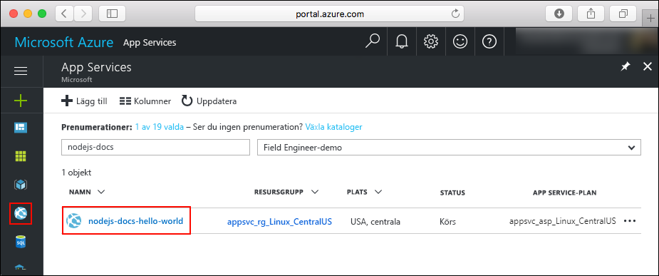
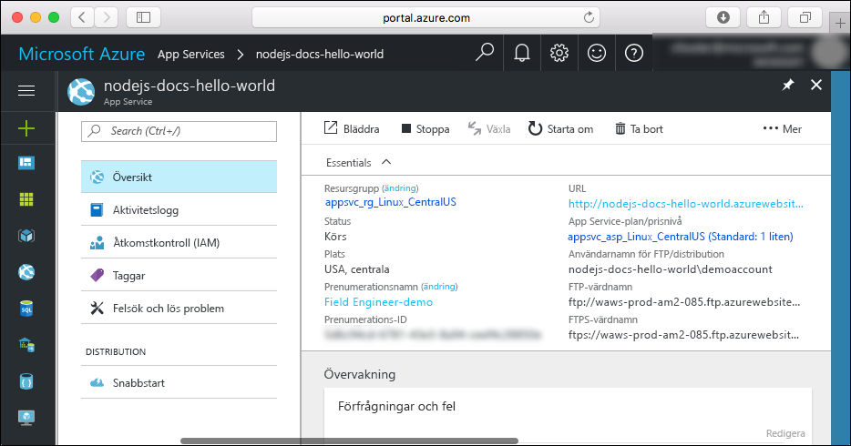

# <a name="create-a-nodejs-web-app-in-azure-app-service-on-linux"></a>Skapa en Node.js-webbapp i Azure App Service på Linux

[Apptjänst i Linux](app-service-linux-intro.md) ger en mycket skalbar, automatisk uppdatering värdtjänst med Linux-operativsystem. Den här snabbstarten visar hur du distribuera en Node.js-app till App Service i Linux med hjälp av en inbyggd avbildning. Du skapar webbappen med inbyggda avbildningen med hjälp av den [Azure CLI](https://docs.microsoft.com/cli/azure/get-started-with-azure-cli), och du använder Git för att distribuera Node.js-kod till webbappen.


Du kan följa stegen nedan på en Mac-, Windows- eller Linux-dator.

## <a name="prerequisites"></a>Krav

För att slutföra den här snabbstarten behöver du:

* [Installera Git](https://git-scm.com/)
* [Installera Node.js och NPM](https://nodejs.org/)

[!INCLUDE [quickstarts-free-trial-note](../../../includes/quickstarts-free-trial-note.md)]

## <a name="download-the-sample"></a>Hämta exemplet

Kör följande kommando för att klona exempel app lagringsplatsen till den lokala datorn i ett terminalfönster på din dator.

```bash
git clone https://github.com/Azure-Samples/nodejs-docs-hello-world
```

Du använder det här terminalfönstret för att köra alla kommandon i den här snabbstarten.

Ändra till den katalog som innehåller exempelkoden.

```bash
cd nodejs-docs-hello-world
```

## <a name="run-the-app-locally"></a>Köra appen lokalt

Kör programmet lokalt genom att öppna ett terminalfönster och använda `npm start`-skriptet för att starta den inbyggda Node.js HTTP-servern.

```bash
npm start
```

Öppna en webbläsare och gå till exempelapp på `http://localhost:1337`.

Nu kan du se **Hello World**-meddelandet från exempelappen på sidan.


Tryck på **Ctrl+C** i terminalfönstret för att avsluta webbservern.

[!INCLUDE [cloud-shell-try-it.md](../../../includes/cloud-shell-try-it.md)]

[!INCLUDE [Configure deployment user](../../../includes/configure-deployment-user.md)]

[!INCLUDE [Create resource group](../../../includes/app-service-web-create-resource-group.md)]

[!INCLUDE [Create app service plan](../../../includes/app-service-web-create-app-service-plan-linux.md)]

## <a name="create-a-web-app-with-built-in-image"></a>Skapa en webbapp med inbyggda avbildning

[!INCLUDE [Create web app](../../../includes/app-service-web-create-web-app-nodejs-no-h.md)]

Bläddra till den nya webbappen. Ersätt  _&lt;appnamn >_ med ett unikt appnamn.

```bash
http://<app name>.azurewebsites.net
```


[!INCLUDE [Push to Azure](../../../includes/app-service-web-git-push-to-azure.md)]

```bash
Counting objects: 23, done.
Delta compression using up to 4 threads.
Compressing objects: 100% (21/21), done.
Writing objects: 100% (23/23), 3.71 KiB | 0 bytes/s, done.
Total 23 (delta 8), reused 7 (delta 1)
remote: Updating branch 'master'.
remote: Updating submodules.
remote: Preparing deployment for commit id 'bf114df591'.
remote: Generating deployment script.
remote: Generating deployment script for node.js Web Site
remote: Generated deployment script files
remote: Running deployment command...
remote: Handling node.js deployment.
remote: Kudu sync from: '/home/site/repository' to: '/home/site/wwwroot'
remote: Copying file: '.gitignore'
remote: Copying file: 'LICENSE'
remote: Copying file: 'README.md'
remote: Copying file: 'index.js'
remote: Copying file: 'package.json'
remote: Copying file: 'process.json'
remote: Deleting file: 'hostingstart.html'
remote: Ignoring: .git
remote: Using start-up script index.js from package.json.
remote: Node.js versions available on the platform are: 4.4.7, 4.5.0, 6.2.2, 6.6.0, 6.9.1.
remote: Selected node.js version 6.9.1. Use package.json file to choose a different version.
remote: Selected npm version 3.10.8
remote: Finished successfully.
remote: Running post deployment command(s)...
remote: Deployment successful.
To https://<app_name>.scm.azurewebsites.net:443/<app_name>.git
 * [new branch]      master -> master
```

## <a name="browse-to-the-app"></a>Bläddra till appen

Bläddra till den distribuerade appen via webbläsaren.

```bash
http://<app_name>.azurewebsites.net
```

Node.js-exempelkod körs i en webbapp med inbyggda avbildning.


**Grattis!** Du har distribuerat din första Node.js-app till App Service på Linux.

## <a name="update-and-redeploy-the-code"></a>Uppdatera och distribuera om koden

Öppna filen `index.js` i Node.js-appen med ett textredigeringsprogram och gör små ändringar i texten i anropet till `response.end`:

```nodejs
response.end("Hello Azure!");
```

Spara ändringarna på Git och skicka sedan kodändringarna till Azure.

```bash
git commit -am "updated output"
git push azure master
```

När distributionen är klar går du tillbaka till webbläsarfönstret som öppnades när du skulle **söka efter appen** och klickar på knappen för att uppdatera.


## <a name="manage-your-new-azure-web-app"></a>Hantera din nya Azure-webbapp

Gå till <a href="https://portal.azure.com" target="_blank">Azure Portal</a> för att hantera den webbapp som du skapade.

Klicka på **Apptjänster** i menyn till vänster och sedan på namnet på din Azure-webbapp.



Nu visas sidan Översikt för din webbapp. Här kan du utföra grundläggande hanteringsåtgärder som att bläddra, stoppa, starta, starta om och ta bort. 



Menyn till vänster innehåller olika sidor för att konfigurera appen. 

[!INCLUDE [cli-samples-clean-up](../../../includes/cli-samples-clean-up.md)]

## <a name="next-steps"></a>Nästa steg

> [!div class="nextstepaction"]
> [Node.js med MongoDB](tutorial-nodejs-mongodb-app.md)
