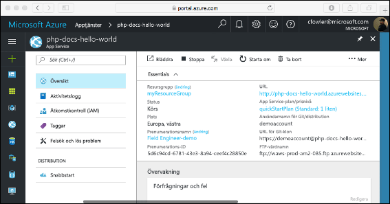

# <a name="create-a-php-web-app-in-app-service-on-linux"></a>Skapa en PHP-webbapp i App Service på Linux

[Apptjänst i Linux](app-service-linux-intro.md) ger en mycket skalbar, automatisk uppdatering värdtjänst med Linux-operativsystem. Den här snabbstartsguide visar hur du distribuerar en PHP-app till Azure App Service på Linux. Du skapar webbappen med inbyggda avbildningen med hjälp av den [Azure CLI](https://docs.microsoft.com/cli/azure/get-started-with-azure-cli) i molnet Shell, och du kan använda Git för att distribuera PHP-kod till webbappen.

! [Sample-appen körs i Azure]] (media/quickstart-php/hello-world-in-browser.png)

Du kan följa stegen nedan på en Mac-, Windows- eller Linux-dator.

## <a name="prerequisites"></a>Krav

För att slutföra den här snabbstarten behöver du:

* <a href="https://git-scm.com/" target="_blank">Installera Git</a>
* <a href="https://php.net" target="_blank">Installera PHP</a>

[!INCLUDE [quickstarts-free-trial-note](../../../includes/quickstarts-free-trial-note.md)]

## <a name="download-the-sample"></a>Hämta exemplet

Kör följande kommandon för att klona exempelprogrammet till din lokala dator och gå till den katalog som innehåller exempelkoden i ett terminalfönster.

```bash
git clone https://github.com/Azure-Samples/php-docs-hello-world
cd php-docs-hello-world
```

## <a name="run-the-app-locally"></a>Köra appen lokalt

Kör programmet lokalt genom att öppna ett terminalfönster och använda kommandot `php` för att starta den inbyggda PHP-webbservern.

```bash
php -S localhost:8080
```

Öppna en webbläsare och gå till exempelapp på `http://localhost:8080`.

Du ser meddelandet **Hello World!** från exempelappen på sidan.


Tryck på **Ctrl+C** i terminalfönstret för att avsluta webbservern.

[!INCLUDE [cloud-shell-try-it.md](../../../includes/cloud-shell-try-it.md)]

[!INCLUDE [Configure deployment user](../../../includes/configure-deployment-user.md)]

[!INCLUDE [Create resource group](../../../includes/app-service-web-create-resource-group.md)]

[!INCLUDE [Create app service plan](../../../includes/app-service-web-create-app-service-plan-linux.md)]

## <a name="create-a-web-app"></a>Skapa en webbapp

[!INCLUDE [Create web app](../../../includes/app-service-web-create-web-app-php-no-h.md)] 

Bläddra till webbplatsen för att se ditt nyligen skapade webbprogram med inbyggda avbildning. Ersätt  _&lt;appnamn >_ med din webbprogrammets namn.

```bash
http://<app_name>.azurewebsites.net
```


[!INCLUDE [Push to Azure](../../../includes/app-service-web-git-push-to-azure.md)] 

```bash
Counting objects: 2, done.
Delta compression using up to 4 threads.
Compressing objects: 100% (2/2), done.
Writing objects: 100% (2/2), 352 bytes | 0 bytes/s, done.
Total 2 (delta 1), reused 0 (delta 0)
remote: Updating branch 'master'.
remote: Updating submodules.
remote: Preparing deployment for commit id '25f18051e9'.
remote: Generating deployment script.
remote: Running deployment command...
remote: Handling Basic Web Site deployment.
remote: Kudu sync from: '/home/site/repository' to: '/home/site/wwwroot'
remote: Copying file: '.gitignore'
remote: Copying file: 'LICENSE'
remote: Copying file: 'README.md'
remote: Copying file: 'index.php'
remote: Ignoring: .git
remote: Finished successfully.
remote: Running post deployment command(s)...
remote: Deployment successful.
To https://<app_name>.scm.azurewebsites.net/<app_name>.git
   cc39b1e..25f1805  master -> master
```

## <a name="browse-to-the-app"></a>Bläddra till appen

Bläddra till den distribuerade appen via webbläsaren.

```bash
http://<app_name>.azurewebsites.net
```

PHP-exempelkod körs i en webbapp med inbyggda avbildning.


**Grattis!** Du har distribuerat din första PHP-program till App Service på Linux.

## <a name="update-locally-and-redeploy-the-code"></a>Uppdatera lokalt och distribuera om koden

I den lokala katalogen öppnar den `index.php` filen i PHP-app och göra en mindre ändring i texten i strängen bredvid `echo`:

```php
echo "Hello Azure!";
```

Spara ändringarna på Git och skicka sedan kodändringarna till Azure.

```bash
git commit -am "updated output"
git push azure master
```

När distributionen är klar går du tillbaka till webbläsarfönstret som öppnades när du skulle **söka efter appen** och klickar på knappen för att uppdatera sidan.


## <a name="manage-your-new-azure-web-app"></a>Hantera din nya Azure-webbapp

Gå till <a href="https://portal.azure.com" target="_blank">Azure Portal</a> för att hantera den webbapp som du skapade.

Klicka på **Apptjänster** i menyn till vänster och sedan på namnet på din Azure-webbapp.



Nu visas sidan Översikt för din webbapp. Här kan du utföra grundläggande hanteringsåtgärder som att bläddra, stoppa, starta, starta om och ta bort.


Menyn till vänster innehåller olika sidor för att konfigurera appen. 

[!INCLUDE [cli-samples-clean-up](../../../includes/cli-samples-clean-up.md)]

## <a name="next-steps"></a>Nästa steg

> [!div class="nextstepaction"]
> [PHP med MySQL](tutorial-php-mysql-app.md)
