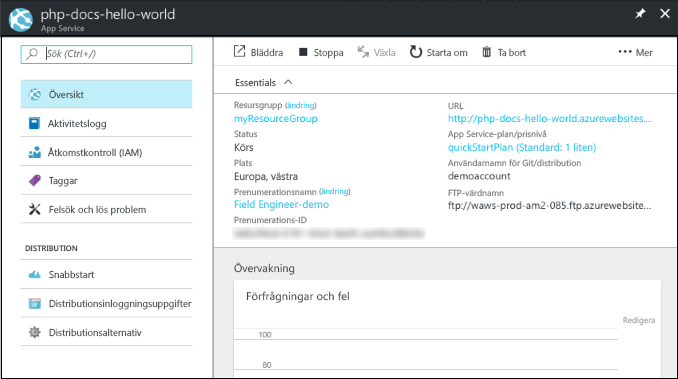

# <a name="deploy-a-python-web-app-in-web-app-for-containers"></a>Distribuera en Python-webbapp i Web App for Containers

Med [App Service i Linux](app-service-linux-intro.md) får du en mycket skalbar och automatiskt uppdaterad webbvärdtjänst som utgår från operativsystemet Linux. I den här snabbstarten får du lära dig hur man skapar en webbapp och distribuerar en enkel Flask-app till den med hjälp av en anpassad Docker Hub-avbildning. Du skapar webbappen med [Azure CLI](https://docs.microsoft.com/cli/azure/get-started-with-azure-cli).


[!INCLUDE [quickstarts-free-trial-note](../../../includes/quickstarts-free-trial-note.md)]

## <a name="prerequisites"></a>Nödvändiga komponenter

För att slutföra den här självstudien behöver du:

* <a href="https://git-scm.com/" target="_blank">Installera Git</a>
* <a href="https://www.docker.com/community-edition" target="_blank">Installera Docker Community Edition</a>
* <a href="https://hub.docker.com/" target="_blank">Registrera dig för ett Docker Hub-konto</a>

## <a name="download-the-sample"></a>Hämta exemplet

I terminalfönstret kör du följande kommandon för att klona exempelappen till din lokala dator och navigerar till katalogen som innehåller exempelkoden.

```bash
git clone https://github.com/Azure-Samples/python-docs-hello-world
cd python-docs-hello-world
```

Den här lagringsplatsen innehåller ett enkelt Flask-program i mappen _/app_ och en _Dockerfile_ som anger tre saker:

- Använd basavbildningen [tiangolo/uwsgi-nginx-flask:python3.6-alpine3.7](https://hub.docker.com/r/tiangolo/uwsgi-nginx-flask/).
- Containern ska lyssna på port 8000.
- Kopiera katalogen `/app` till containers katalog `/app`.

Konfigurationen följer [anvisningarna för basavbildningen](https://hub.docker.com/r/tiangolo/uwsgi-nginx-flask/).

## <a name="run-the-app-locally"></a>Köra appen lokalt

Kör appen i en Docker-container.

```bash
docker build --rm -t flask-quickstart .
docker run --rm -it -p 8000:8000 flask-quickstart
```

Öppna en webbläsare och navigera till exempelappen på `http://localhost:8000`.

Nu kan du se **Hello World**-meddelandet från exempelappen på sidan.


I terminalfönstret trycker du på **Ctrl+C** för att stoppa containern.

## <a name="deploy-image-to-docker-hub"></a>Distribuera avbildningen till Docker Hub

Logga in på ditt Docker Hub-konto. Följ uppmaningen om att ange dina autentiseringsuppgifter för Docker Hub.

```bash
docker login
```

Tagga avbildningen och push-överför den till en ny _offentlig_ lagringsplats för ditt Docker Hub-konto, till en lagringsplats med namnet `flask-quickstart`. Ersätt *\<dockerhub_id>* med ditt Docker Hub-ID.

```bash
docker tag flask-quickstart <dockerhub_id>/flask-quickstart
docker push <dockerhub_id>/flask-quickstart
```

> [!NOTE]
> `docker push` skapar en offentlig lagringsplats om det gick inte att hitta den angivna lagringsplatsen. Den här snabbstarten förutsätter att det finns en offentlig lagringsplats i Docker Hub. Om du föredrar att push-överföra till en privat lagringsplats behöver du konfigurera dina autentiseringsuppgifter för Docker Hub i Azure App Service senare. Se [Skapa en webbapp](#create-a-web-app).

När push-överföringen av avbildningen är klar är du redo att använda den i Azure-webbappen.

[!INCLUDE [cloud-shell-try-it.md](../../../includes/cloud-shell-try-it.md)]

[!INCLUDE [Create resource group](../../../includes/app-service-web-create-resource-group-linux.md)]

[!INCLUDE [Create app service plan](../../../includes/app-service-web-create-app-service-plan-linux.md)]

## <a name="create-a-web-app"></a>Skapa en webbapp

Skapa en [webbapp](../app-service-web-overview.md) i `myAppServicePlan` App Service-planen med kommandot [az webapp create](/cli/azure/webapp?view=azure-cli-latest#az_webapp_create). Ersätt *\<app name>* med ett globalt unikt appnamn och ersätt *\<dockerhub_id>* med ditt Docker Hub-ID.

```azurecli-interactive
az webapp create --resource-group myResourceGroup --plan myAppServicePlan --name <app name> --deployment-container-image-name <dockerhub_id>/flask-quickstart
```

När webbappen har skapats visar Azure CLI utdata liknande den i följande exempel:

```json
{
  "availabilityState": "Normal",
  "clientAffinityEnabled": true,
  "clientCertEnabled": false,
  "cloningInfo": null,
  "containerSize": 0,
  "dailyMemoryTimeQuota": 0,
  "defaultHostName": "<app name>.azurewebsites.net",
  "deploymentLocalGitUrl": "https://<username>@<app name>.scm.azurewebsites.net/<app name>.git",
  "enabled": true,
  < JSON data removed for brevity. >
}
```

Om du tidigare laddade upp till en privat lagringsplats måste du även konfigurera autentiseringsuppgifterna för Docker Hub i App Service. Mer information finns i [Använda en privat avbildning från Docker Hub](tutorial-custom-docker-image.md#use-a-private-image-from-docker-hub-optional).

### <a name="specify-container-port"></a>Ange containerport

Som angetts i _Dockerfile_ lyssnar din container på port 8000. För att App Service ska dirigera din begäran till rätt port måste du ange appinställningen *WEBSITES_PORT*.

I Cloud Shell kör du kommandot [`az webapp config appsettings set`](/cli/azure/webapp/config/appsettings?view=azure-cli-latest#az_webapp_config_appsettings_set).


```azurecli-interactive
az webapp config appsettings set --name <app_name> --resource-group myResourceGroup --settings WEBSITES_PORT=8000
```

## <a name="browse-to-the-app"></a>Bläddra till appen

```bash
http://<app_name>.azurewebsites.net/
```


> [!NOTE]
> Webbappen tar lite tid att starta eftersom Docker Hub-avbildningen måste laddas ned och köras när appen begärs för första gången. Om du först ser ett fel efter en lång tid kan du bara uppdatera sidan.

**Grattis!** Du har distribuerat en anpassad Docker-avbildning som kör en Python-app i Web App for Containers.

## <a name="update-locally-and-redeploy"></a>Uppdatera lokalt och distribuera om

Öppna filen `app/main.py` i Python-appen med ett lokalt textredigeringsprogram och gör små ändringar i texten i strängen bredvid `return`-instruktionen:

```python
return 'Hello, Azure!'
```

Återskapa avbildningen och push-överför den till Docker Hub igen.

```bash
docker build --rm -t flask-quickstart .
docker tag flask-quickstart <dockerhub_id>/flask-quickstart
docker push <dockerhub_id>/flask-quickstart
```

I Cloud Shell startar du om appen. Om du startar om appen garanteras att alla inställningar tillämpas och att den senaste containern hämtas från registret.

```azurecli-interactive
az webapp restart --resource-group myResourceGroup --name <app_name>
```

Vänta ungefär 15 sekunder för att App Service ska hämta den uppdaterade avbildningen. Gå tillbaka till webbläsarfönstret som öppnades när du skulle **söka efter appen** och klicka på knappen för att uppdatera sidan.


## <a name="manage-your-azure-web-app"></a>Hantera din Azure-webbapp

Gå till [Azure Portal](https://portal.azure.com) för att se den webbapp du skapade.

Klicka på **App Services** på menyn till vänster och klicka sedan på namnet på din Azure-webbapp.


Som standard visar portalen dina webbappar på sidan **Översikt**. På den här sidan får du en översikt över hur det går för appen. Här kan du också utföra grundläggande hanteringsåtgärder som att bläddra, stoppa, starta, starta om och ta bort. På flikarna till vänster på sidan kan du se olika konfigurationssidor som du kan öppna.



[!INCLUDE [Clean-up section](../../../includes/cli-script-clean-up.md)]

## <a name="next-steps"></a>Nästa steg

> [!div class="nextstepaction"]
> [Python med PostgreSQL](tutorial-docker-python-postgresql-app.md)

> [!div class="nextstepaction"]
> [Använda anpassade avbildningar](tutorial-custom-docker-image.md)