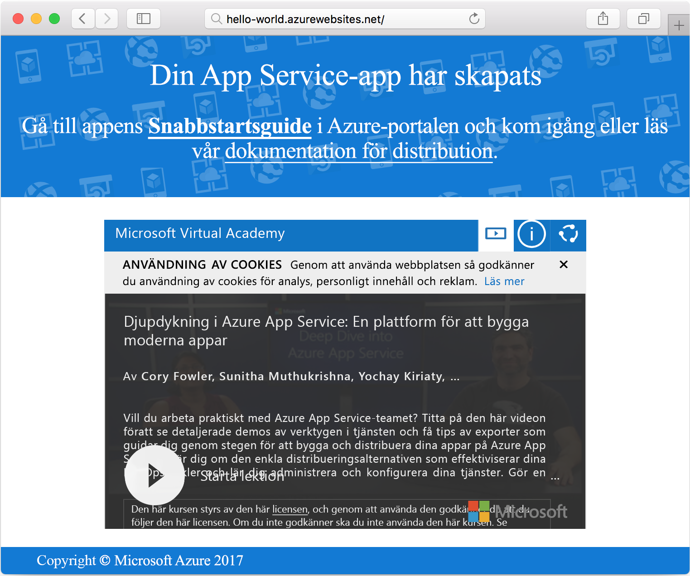

# <a name="create-a-ruby-app-in-app-service-on-linux"></a>Skapa en Ruby-app i App Service on Linux

Med [App Service on Linux](app-service-linux-intro.md) får du en automatiskt uppdaterad webbvärdtjänst med hög skalbarhet. Den här snabbstarten visar hur du skapar en grundläggande Ruby on Rails-app och distribuerar den till Azure som en Web App on Linux.


## <a name="prerequisites"></a>Nödvändiga komponenter

* <a href="https://www.ruby-lang.org/en/documentation/installation/#rubyinstaller" target="_blank">Installera Ruby 2.4.1 eller senare</a>
* <a href="https://git-scm.com/" target="_blank">Installera Git</a>

[!INCLUDE [quickstarts-free-trial-note](../../../includes/quickstarts-free-trial-note.md)]

## <a name="download-the-sample"></a>Hämta exemplet

Kör följande kommando i ett terminalfönster för att klona databasen för exempelappen till den lokala datorn:

```bash
git clone https://github.com/Azure-Samples/ruby-docs-hello-world
```

## <a name="run-the-application-locally"></a>Kör programmet lokalt

Kör rails-servern för att programmet ska fungera. Byt till kataglogen *hello-world* så startar kommandot `rails server` servern.

```bash
cd hello-world\bin
rails server
```

Navigera till `http://localhost:3000` i webbläsaren om du vill testa appen lokalt.


## <a name="modify-app-to-display-welcome-message"></a>Visa ett välkomstmeddelande i appen

Gör ändringar i appen så att ett välkomstmeddelande visas. Först måste du ställa in en väg genom att ändra filen *~/workspace/ruby-docs-hello-world/config/routes.rb* så att den innehåller en väg med namnet `hello`.

  ```ruby
  Rails.application.routes.draw do
      #For details on the DSL available within this file, see http://guides.rubyonrails.org/routing.html
      root 'application#hello'
  end
  ```

Ändra appens kontrollant så att den returnerar meddelandet som HTML till webbläsaren. 

Öppna *~/workspace/hello-world/app/controllers/application_controller.rb* för redigering. Ändra klassen `ApplicationController` så att den ser ut som i följande kodexempel:

  ```ruby
  class ApplicationController > ActionController :: base
    protect_from_forgery with: :exception
    def hello
      render html: "Hello, world from Azure Web App on Linux!"
    end
  end
  ```

Nu har appen konfigurerats. Navigera till `http://localhost:3000` i webbläsaren för att bekräfta rotlandningssidan.


[!INCLUDE [Try Cloud Shell](../../../includes/cloud-shell-try-it.md)]

[!INCLUDE [Configure deployment user](../../../includes/configure-deployment-user.md)]

## <a name="create-a-ruby-web-app-on-azure"></a>Skapa en Ruby-webbapp på Azure

Det måste finnas en resursgrupp som innehåller de tillgångar som behövs för din webbapp. Du skapar en resursgrupp med kommandot [az group create]().

```azurecli-interactive
az group create --location westeurope --name myResourceGroup
```

Använd kommandot [az appservice plan create](/cli/azure/appservice/plan?view=azure-cli-latest#az_appservice_plan_create) för att skapa en App Service-plan för din webbapp.

```azurecli-interactive
az appservice plan create --name myAppServicePlan --resource-group myResourceGroup --is-linux
```

Utfärda därefter kommandot [az webapp create](/cli/azure/webapp?view=azure-cli-latest#az_webapp_create) för att skapa webbappen som använder den nya tjänstplanen. Observera att körningen har angetts till `ruby|2.3`. Glöm inte att ersätta `<app name>` med ett unikt appnamn.

```azurecli-interactive
az webapp create --resource-group myResourceGroup --plan myAppServicePlan --name <app name> \
--runtime "ruby|2.3" --deployment-local-git
```

Utdata från kommandot visar information om den nya webbappen och URL:en för distribution. Det bör se ut ungefär som i följande exempel. Kopiera URL:en för senare användning i den här självstudiekursen.

```bash
https://<deployment user name>@<app name>.scm.azurewebsites.net/<app name>.git
```

När webbappen har skapats kan du visa en **översiktssida**. Navigera till den. Följande välkomstsida visas:




## <a name="deploy-your-application"></a>Distribuera appen

Kör följande kommandon för att distribuera den lokala appen till din Azure-webbplats:

```bash
git remote add azure <Git deployment URL from above>
git add -A
git commit -m "Initial deployment commit"
git push azure master
```

Bekräfta att fjärrdistributionsåtgärderna lyckades. Kommandona producerar utdata som liknar följande:

```bash
remote: Using sass-rails 5.0.6
remote: Updating files in vendor/cache
remote: Bundle gems are installed into ./vendor/bundle
remote: Updating files in vendor/cache
remote: ~site/repository
remote: Finished successfully.
remote: Running post deployment command(s)...
remote: Deployment successful.
To https://<your web app name>.scm.azurewebsites.net/<your web app name>.git
  579ccb....2ca5f31  master -> master
myuser@ubuntu1234:~workspace/<app name>$
```

När distributionen är klar startar du om webbappen så att distributionen börjar gälla med hjälp av kommandot [az webapp restart](/cli/azure/webapp?view=azure-cli-latest#az_webapp_restart):

```azurecli-interactive
az webapp restart --name <app name> --resource-group myResourceGroup
```

Gå till din webbplats och kontrollera resultatet.

```bash
http://<app name>.azurewebsites.net
```


> [!NOTE]
> Försök att bläddra på webbplatsen medan appen startas om resulterar i HTTP-statuskoden `Error 503 Server unavailable`. Det kan ett par minuter att slutföra omstarten.
>

[!INCLUDE [Clean-up section](../../../includes/cli-script-clean-up.md)]

## <a name="next-steps"></a>Nästa steg

[Vanliga frågor och svar om Azure App Service on Linux](https://docs.microsoft.com/azure/app-service-web/app-service-linux-faq)
