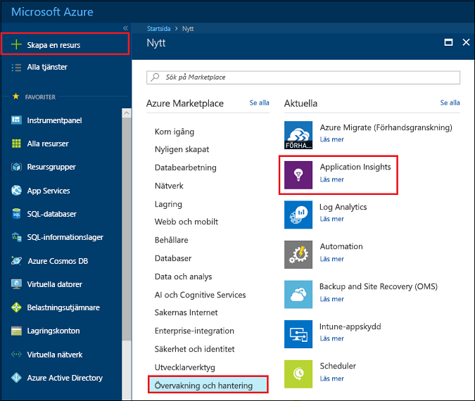
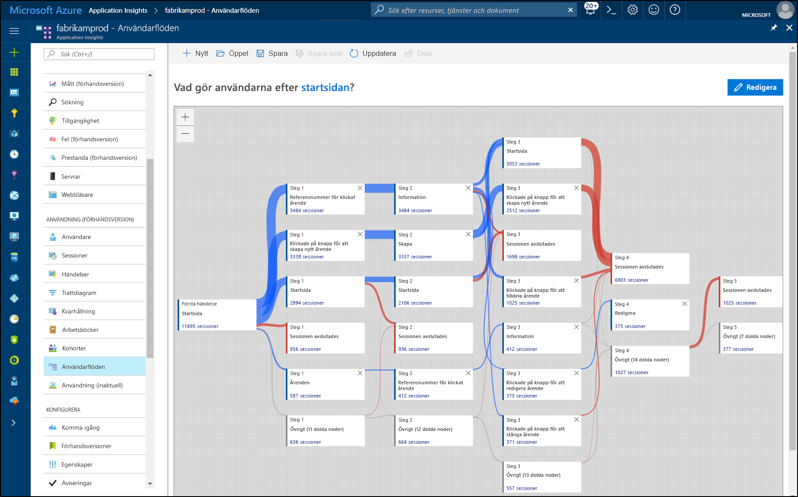

# <a name="start-analyzing-your-mobile-app-with-mobile-center-and-application-insights"></a>Börja analysera din mobila app med Mobile Center och Application Insights

Den här snabbstarten hjälper dig att ansluta din app Center Mobile-instans till Application Insights. Med Application Insights, du kan fråga, segmentera, filtrera och analysera dina telemetri med mer kraftfulla verktyg än vad som är tillgängliga från den [Analytics](https://docs.microsoft.com/mobile-center/analytics/) tjänsten Mobile Center.

## <a name="prerequisites"></a>Krav

Följande krävs för att slutföra den här snabbstarten:

- En Azure-prenumeration.
- En iOS, Android, Xamarin, universell Windows eller reagera inbyggda appen.
 
Om du inte har en Azure-prenumeration kan du skapa ett [kostnadsfritt](https://azure.microsoft.com/free/) konto innan du börjar.

## <a name="onboard-to-mobile-center"></a>Publicera till Mobile Center

Innan du kan använda Application Insights med din mobilapp, måste du publicera din app [Center Mobile](https://docs.microsoft.com/mobile-center/). Application Insights får inte telemetri från din mobila app direkt. Appen skickar i stället anpassade händelsen telemetri till Center Mobile. Sedan exporterar Center Mobile kontinuerligt kopior av dessa anpassade händelser till Application Insights som de tas emot.

Publicera din app, följ Center Mobile Snabbstart för varje plattform som stöder din app. Skapa separata Center Mobile instanser för varje plattform:

* [iOS](https://docs.microsoft.com/mobile-center/sdk/getting-started/ios).
* [Android](https://docs.microsoft.com/mobile-center/sdk/getting-started/android).
* [Xamarin](https://docs.microsoft.com/mobile-center/sdk/getting-started/xamarin).
* [Universell Windows](https://docs.microsoft.com/mobile-center/sdk/getting-started/uwp).
* [Reagera intern](https://docs.microsoft.com/mobile-center/sdk/getting-started/react-native).

## <a name="track-events-in-your-app"></a>Spåra händelser i din app

När appen har publicerats så att Mobile Center, måste den ändras för att skicka telemetri om anpassade händelsen med Mobile Center SDK. Anpassade händelser är den enda typen av Center Mobile telemetri som exporteras till Application Insights.

Anpassade händelser från iOS-appar, Använd den `trackEvent` eller `trackEvent:withProperties` metoder i Mobile Center SDK. [Mer information om spårning av händelser från iOS-appar.](https://docs.microsoft.com/mobile-center/sdk/analytics/ios)

```Swift
MSAnalytics.trackEvent("Video clicked")
```

Anpassade händelser från Android-appar, Använd den `trackEvent` metod i Mobile Center SDK. [Mer information om spårning av händelser från Android-appar.](https://docs.microsoft.com/mobile-center/sdk/analytics/android)

```Java
Analytics.trackEvent("Video clicked")
```

Anpassade händelser från andra app-plattformar, Använd den `trackEvent` metoder i sina mobila Center SDK.

Kontrollera att dina anpassade händelser tas emot genom att gå till den **händelser** fliken den **Analytics** avsnitt i Mobile Center. Det kan ta några minuter för att händelser ska visas från när skickas de från din app.

## <a name="create-an-application-insights-resource"></a>Skapa en Application Insights-resurs

När appen skickar anpassade händelser och händelserna tas emot av Mobile Center, måste du skapa en resurstyp i Mobile Application Insights-resurs i Azure-portalen:

1. Logga in på [Azure-portalen](https://portal.azure.com/).
2. Välj **Nytt** > **Övervakning + Hantering** > **Application Insights**.

    

    En konfiguration visas. Använd tabellen nedan för att fylla i fälten indata.

    | Inställningar        |  Värde           | Beskrivning  |
   | ------------- |:-------------|:-----|
   | **Namn**      | Vissa globalt unikt värde, till exempel ”myApp iOS” | Namn som identifierar appen du övervakar |
   | **Programtyp** | Center Mobile-programmet | Typen av app du övervakar |
   | **Resursgrupp**     | En ny resursgrupp eller en befintlig på menyn | Resursgruppen att skapa ny Application Insights-resurs |
   | **Plats** | En plats på menyn | Välj en plats nära dig eller nära där appen finns |

3. Klicka på **Skapa**.

Om din app stöd för flera plattformar (iOS, Android, osv.), är det bäst att skapa separata Application Insights-resurser, ett för varje plattform.

## <a name="export-to-application-insights"></a>Exportera till Application Insights

I en ny Application Insights-resurs på den **översikt** sidan i den **Essentials** avsnittet längst upp, kopiera nyckeln instrumentation för den här resursen.

I Center Mobile-instans för din app:

1. På den **inställningar** klickar du på **exportera**.
2. Välj **nya exportera**, Välj **Programinsikter**, klicka på **anpassa**.
3. Klistra in din nyckel för Application Insights instrumentation i rutan.
4. Accepterar du öka användningen av Azure-prenumerationen med Application Insights-resurs. Varje Application Insights-resurs är gratis för de första 1 GB data som tas emot per månad. [Läs mer om prissättningen för Application Insights.](https://azure.microsoft.com/pricing/details/application-insights/)

Kom ihåg att upprepa processen för varje plattform som stöder din app.

En gång [exportera](https://docs.microsoft.com/mobile-center/analytics/export) anges upp, varje anpassade händelsen som tagits emot av Center Mobile kopieras till Application Insights. Det kan ta flera minuter för att händelser ska nå Application Insights, så om de inte visas omedelbart, vänta en stund innan diagnostisera ytterligare.

För att ge dig mer data när du först ansluta, exporteras de senaste 48 timmarna anpassade händelser i Center Mobile automatiskt till Application Insights.

## <a name="start-monitoring-your-app"></a>Börja övervaka din app

Application Insights kan fråga, segmentera, filtrera och analysera anpassade händelsen telemetri från dina appar, utöver verktygen analytics Center Mobile tillhandahåller.

1. **Fråga din anpassade händelsen telemetri.** Från Application Insights **översikt** väljer **Analytics**. 

   

   Application Insights Analytics-portalen som är associerade med Application Insights-resurs öppnas. Analytics-portalen kan du direkt fråga dina data med Log Analytics-frågespråket i, så att du kan ställa godtyckligt komplexa frågor om din app och dess användare.
   
   Öppna en ny flik i Analytics-portalen sedan klistra in i följande fråga. Den returnerar en uppräkning av hur många olika användare har skickat varje anpassade händelsen från din app under de senaste 24 timmarna, sorterade efter detta distinkta antal.

   ```AIQL
   customEvents
   | where timestamp >= ago(24h)
   | summarize dcount(user_Id) by name 
   | order by dcount_user_Id desc 
   ```

   

   1. Välj frågan genom att klicka någonstans på frågan i textredigeraren.
   2. Klicka på **Gå** att köra frågan. 

   Lär dig mer om [Application Insights Analytics](app-insights-analytics.md) och [Log Analytics-frågespråket](https://docs.loganalytics.io/docs/Language-Reference).


2. **Segmentera och filtrera dina anpassade händelsen telemetri.** Från Application Insights **översikt** väljer **användare** i innehållsförteckningen.

   

   Användare-verktyget visar hur många användare i appen klickat på vissa knappar, besökta vissa skärmar eller utföra andra åtgärder som du spårar som en händelse med Mobile Center SDK. Om du har ute efter ett sätt att segmentera och filtrera Center Mobile-händelser, är användare-verktyget ett bra alternativ.

    

   Till exempel segmentera din användning av geografisk plats genom att välja **land eller region** i den **delning efter** listrutan.

3. **Analysera konvertering, kvarhållning och navigering mönster i din app.** Från Application Insights **översikt** väljer **användaren flödar** i innehållsförteckningen.

   

   Verktyget användaren flödar visualizes vilka händelser som användare skicka efter vissa första händelsen. Det är användbart för att få en övergripande bild av hur användarna navigera i din app. Det kan också avslöja platser där många användare kärning från din app eller Upprepa samma åtgärder flera gånger.

   Förutom användaren flödar har Application Insights flera andra användning analytics verktyg för att besvara frågor:

   * **Skorstenar** för att analysera och övervaka konvertering priser.
   * **Kvarhållning** för att analysera hur väl din app behåller användare över tid.
   * **Arbetsböcker** för att kombinera grafik och text till en delbart rapport.
   * **Kohorter** för att namnge och spara specifika grupper av användare eller händelser så att de enkelt kan refereras från andra verktyg för analys.

## <a name="clean-up-resources"></a>Rensa resurser

Om du inte vill fortsätta med Center Mobile Application Insights inaktivera export i Mobile Center och ta bort Application Insights-resursen. Detta förhindrar du att du debiteras mer av Application Insights för den här resursen.

Så här inaktiverar export i Mobile Center:

1. I Mobile Center går du till **inställningar** och välj **exportera**.
2. Klicka på Application Insights-exportera som du vill ta bort och klicka sedan på **ta bort export** längst ned och bekräfta.

Ta bort Application Insights-resurs:

1. I den vänstra menyn i Azure-portalen klickar du på **resursgrupper** och välj sedan den resursgrupp som Application Insights-resursen skapades.
2. Öppna Application Insights-resurs som du vill ta bort. Klicka på **ta bort** i den översta menyn för resursen och bekräfta. Detta tar permanent bort kopia av data som har exporterats till Application Insights.

## <a name="next-steps"></a>Nästa steg

> [!div class="nextstepaction"]
> [Förstå hur kunder använder din app](app-insights-usage-overview.md)