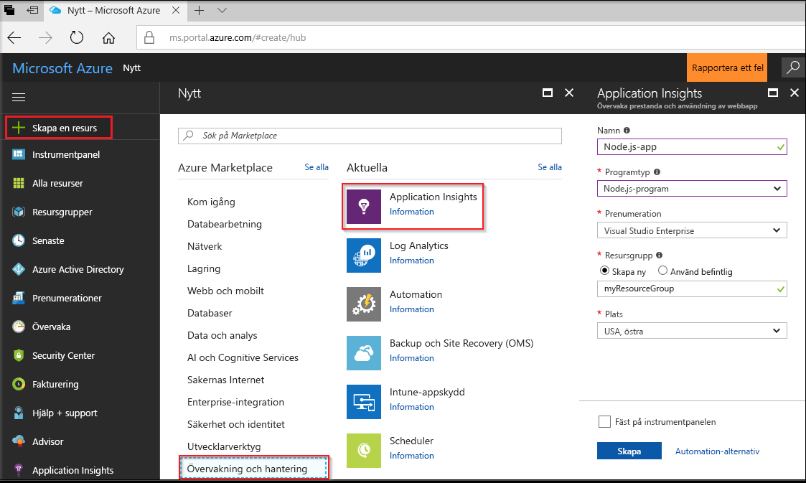
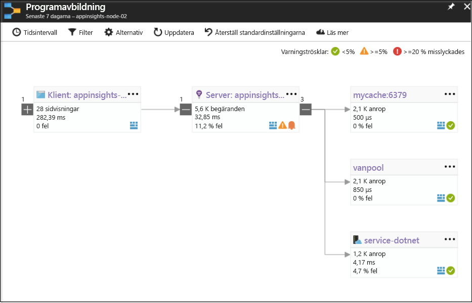
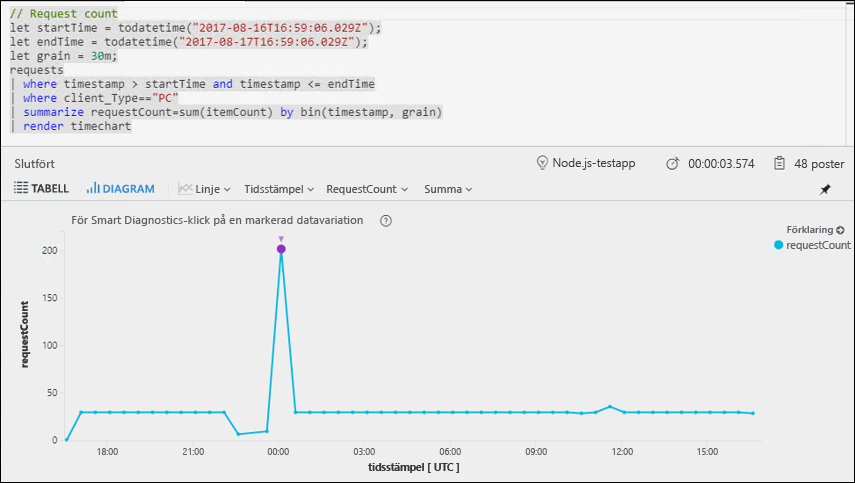
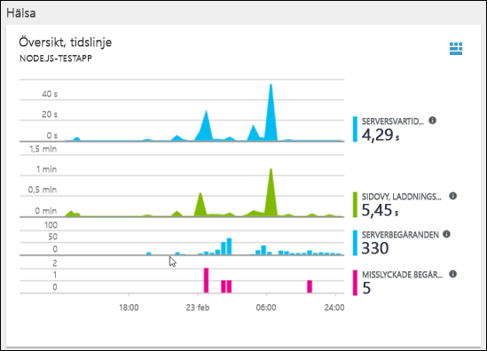
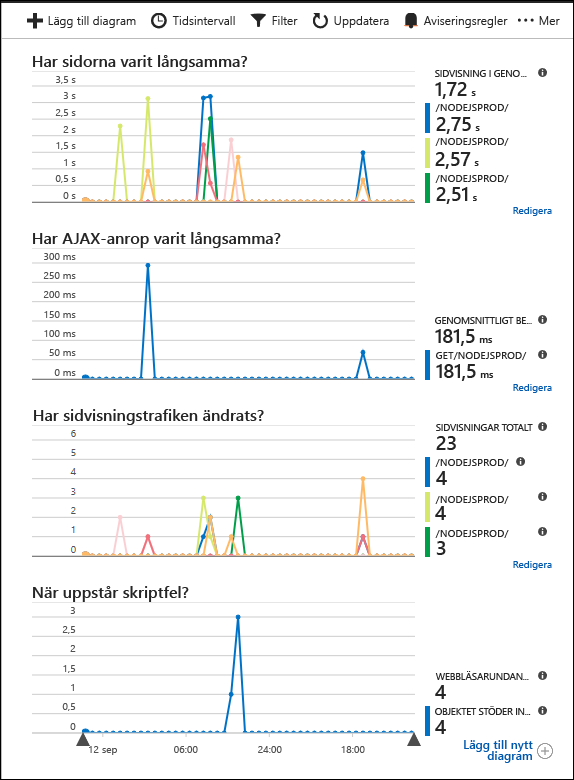

# <a name="start-monitoring-your-nodejs-web-application"></a>Börja övervaka Node.js-webbappen

Med Azure Application Insights kan du enkelt övervaka en webbapp för tillgänglighet, prestanda och användning. Du kan också snabbt identifiera och diagnostisera fel i appen utan att vänta på att en användare rapporterar dem. Med SDK-version 0.20 och framåt kan du övervaka vanliga tredjepartspaket, till exempel MongoDB, MySQL och Redis.

Denna snabbstart guidar dig genom processen att lägga till version 0.22 av Application Insights SDK för Node.js för en befintlig Node.js-webbapp.

## <a name="prerequisites"></a>Krav

För att slutföra den här snabbstarten behöver du:

- Du behöver en Azure-prenumeration och en befintlig Node.js-webbapp.

Om du inte har en Node.js-webbapp kan du skapa en genom att följa [snabbstarten för att skapa en Node.js webbapp](https://docs.microsoft.com/en-us/azure/app-service/app-service-web-get-started-nodejs).
 
Om du inte har en Azure-prenumeration kan du skapa ett [kostnadsfritt](https://azure.microsoft.com/free/) konto innan du börjar.

## <a name="log-in-to-the-azure-portal"></a>Logga in på Azure Portal

Logga in på [Azure-portalen](https://portal.azure.com/).

## <a name="enable-application-insights"></a>Aktivera Application Insights

Application Insights kan samla in telemetridata från alla internetanslutna appar, oavsett om de körs lokalt eller i molnet. Gör så här om du vill börja granska dessa data:

1. Välj **Nytt** > **Övervakning + Hantering** > **Application Insights**.

   

   En konfigurationsruta visas, använd tabellen nedan när du ska fylla i indatafälten.

    | Inställningar        | Värde           | Beskrivning  |
   | ------------- |:-------------|:-----|
   | **Namn**      | Globalt unikt värde | Namn som identifierar appen du övervakar |
   | **Programtyp** | Node.js-app | Typen av app du övervakar |
   | **Resursgrupp**     | myResourceGroup      | Namnet på den nya resursgrupp som är värd för App Insights-data |
   | **Plats** | Östra USA | Välj en plats nära dig eller nära där appen finns |

2. Klicka på **Skapa**.

## <a name="configure-app-insights-sdk"></a>Konfigurera App Insights SDK

1. Välj **Översikt** > **Essentials** > kopiera appens **instrumenteringsnyckel**.

   

2. Lägg till Application Insights SDK för Node.js i appen. Från appens rotmapp kör du:

   ```bash
   npm install applicationinsights --save
   ```

3. Redigera appens första .js-fil och lägg till de två raderna under den översta delen av skriptet. Om du använder [appen Node.js-snabbstart](https://docs.microsoft.com/en-us/azure/app-service/app-service-web-get-started-nodejs) ändrar du filen index.js. 

   ```JavaScript
   const appInsights = require('applicationinsights');
   appInsights.setup('<instrumentation_key').start();
   ```

4. Starta om appen.

> [!NOTE]
> Det tar 3-5 minuter innan data börjar visas i portalen. Om appen är en testapp för lågtrafik bör du komma ihåg att de flesta måtten endast registreras när det förekommer aktiva begäranden eller åtgärder.

## <a name="start-monitoring-in-the-azure-portal"></a>Börja övervaka i Azure-portalen

1. Nu kan du öppna sidan **Översikt** i Application Insights i Azure-portalen, där du hämtade instrumenteringsnyckeln, för att visa information om den app som körs.

   

2. Klicka på **App-karta** om du vill se en layout med beroendena mellan appens komponenter. För varje komponent visas KPI:er som belastning, prestanda, fel och varningar.

   

3. Klicka på **Analys**-ikonen.  Då öppnas **Application Insights Analytics**, med ett funktionsrikt frågespråk för att analysera alla data som samlas in av Application Insights. I det här fallet skapas en fråga som återger antalet begäranden som ett diagram. Du kan skriva egna frågor för att analysera andra data.

   

4. Gå tillbaka till sidan **Översikt** och undersök **hälsotillståndsöversiktens tidslinje**.  På den här instrumentpanelen visas statistik om appens hälsotillstånd, inklusive antalet inkommande begäranden, varaktigheten för dessa begäranden och fel som inträffar. 

   

   Om du vill att diagrammet **Inläsningstid för sidvisning** ska fyllas i med **telemetridata på klientsidan** lägger du till det här skriptet på varje sida du vill spåra:

   ```HTML
   <!-- 
   To collect end-user usage analytics about your application, 
   insert the following script into each page you want to track.
   Place this code immediately before the closing </head> tag,
   and before any other scripts. Your first data will appear 
   automatically in just a few seconds.
   -->
   <script type="text/javascript">
     var appInsights=window.appInsights||function(config){
       function i(config){t[config]=function(){var i=arguments;t.queue.push(function(){t[config].apply(t,i)})}}var t={config:config},u=document,e=window,o="script",s="AuthenticatedUserContext",h="start",c="stop",l="Track",a=l+"Event",v=l+"Page",y=u.createElement(o),r,f;y.src=config.url||"https://az416426.vo.msecnd.net/scripts/a/ai.0.js";u.getElementsByTagName(o)[0].parentNode.appendChild(y);try{t.cookie=u.cookie}catch(p){}for(t.queue=[],t.version="1.0",r=["Event","Exception","Metric","PageView","Trace","Dependency"];r.length;)i("track"+r.pop());return i("set"+s),i("clear"+s),i(h+a),i(c+a),i(h+v),i(c+v),i("flush"),config.disableExceptionTracking||(r="onerror",i("_"+r),f=e[r],e[r]=function(config,i,u,e,o){var s=f&&f(config,i,u,e,o);return s!==!0&&t["_"+r](config,i,u,e,o),s}),t
       }({
           instrumentationKey:"<insert instrumentation key>"
       });
       
       window.appInsights=appInsights;
       appInsights.trackPageView();
   </script>
   ```

5. Klicka på **Webbläsare** under rubriken **Undersök**. Här hittar du prestandamått för appens sidor. Du kan klicka på **Lägg till nytt diagram** för att skapa ytterligare anpassade vyer eller välja **Redigera** för att ändra befintliga diagramtyper, höjd, färgpalett, grupperingar och mått.

   

Mer information om hur du övervakar Node.js finns i [den ytterligare dokumentationen för App Insights Node.js](app-insights-nodejs.md).

## <a name="clean-up-resources"></a>Rensa resurser

Om du tänker fortsätta med efterföljande snabbstarter eller självstudier ska du inte rensa resurserna du har skapat i den här snabbstarten. Om du inte planerar att fortsätta kan du använda stegen nedan för att ta bort alla resurser som har skapats i den här snabbstarten i Azure Portal.

1. På menyn till vänster i Azure Portal klickar du på **Resursgrupper** och sedan på **myResourceGroup**.
2. På sidan med resursgrupper klickar du på **Ta bort**, skriver **myResourceGroup** i textrutan och klickar sedan på **Ta bort**.

## <a name="next-steps"></a>Nästa steg

> [!div class="nextstepaction"]
> [Hitta och diagnostisera prestandaproblem](https://docs.microsoft.com/en-us/azure/application-insights/app-insights-analytics)
