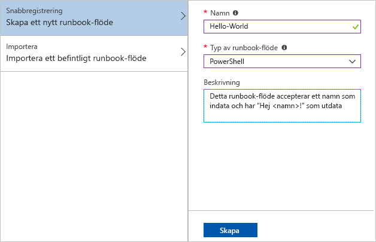
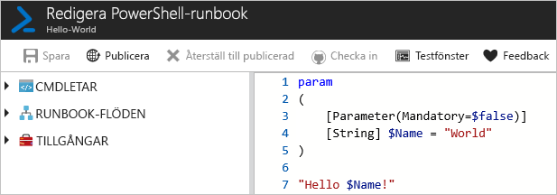
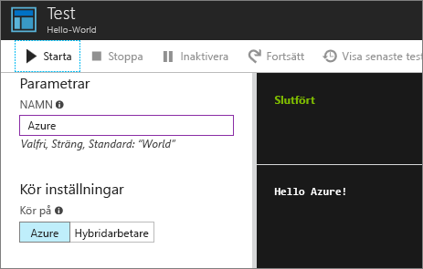
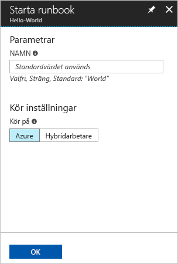
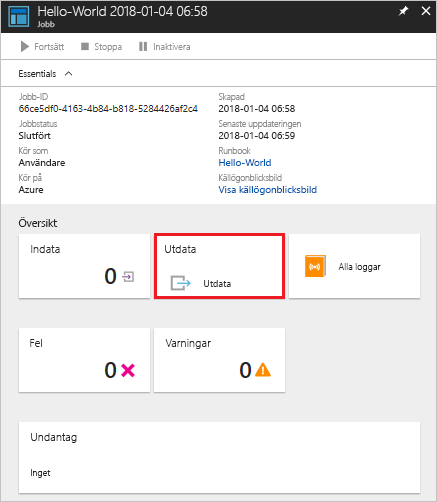

# <a name="create-an-azure-automation-runbook"></a>Skapa en Azure Automation-runbook

Azure Automation-runbooks kan skapas via Azure. Den här metoden ger ett webbläsarbaserat användargränssnitt för att skapa Automation-runbooks. Den här snabbstarten går igenom hur du skapar, testar och publicerar en Automation PowerShell-runbook.

Om du inte har en Azure-prenumeration kan du skapa ett [kostnadsfritt Azure-konto](https://azure.microsoft.com/free/?WT.mc_id=A261C142F) innan du börjar.

## <a name="log-in-to-azure"></a>Logga in på Azure

Logga in till Azure på https://portal.azure.com

## <a name="create-runbook"></a>Skapa runbook

Skapa en runbook först. Exempelrunbooken som skapas i den här snabbstarten matar ut `Hello World` som standard.

1. Öppna ditt Automation-konto.

1. Klicka på **Runbooks** under **PROCESSAUTOMATISERING**. En lista med runbooks visas.

1. Klicka på knappen **Lägg till en runbook** överst i listan. På sidan **Lägg till runbook** väljer du **Snabbregistrering**.

1. Ange ”Hello-World” som runbookens **Namn** och välj **PowerShell** som **Typ av runbook**. Klicka på **Skapa**.

   

1. Runbooken skapas och sidan **Redigera PowerShell-runbook** öppnas.

    

1. Skriv in eller kopiera och klistra in följande kod i redigeringsrutan. Detta skapar en valfri indataparameter som heter ”Name” med standardvärdet ”World”, och matar ut en sträng som använder det här indatavärdet:
   
   ```powershell-interactive
   param
   (
       [Parameter(Mandatory=$false)]
       [String] $Name = "World"
   )

   "Hello $Name!"
   ```

1. Klicka på **Spara** och spara ett utkast av din runbook.

    

## <a name="test-the-runbook"></a>Testa runbooken

När din runbook har skapats ska du testa den för att se om den fungerar.

1. Klicka på **testfönstret** för att öppna **testsidan**.

1. Ange ett värde för **Namn** och klicka på **Starta**. Testjobbet startar och jobbstatus och utdata visas.

    

1. Stäng **testsidan** genom att klicka på ”**X**” i det övre högra hörnet. Välj **OK** i popup-fönstret som visas.

1. På sidan **Redigera PowerShell-runbook** klickar du på **Publicera** för att publicera runbooken som den officiella versionen av runbooken på kontot.

   

## <a name="run-the-runbook"></a>Köra runbooken

När runbooken har publicerats visas översiktssidan.

1. På översiktssidan i runbooken klickar du på **Starta** för att öppna konfigurationssidan **Starta runbook** för denna runbook.

   

1. Lämna **Namn** tomt, så standardvärdet används, och klicka på **OK**. Runbookjobbet skickas och jobbsidan visas.

   

1. När **Jobbstatus** visar **Körs** eller **Slutfört** klickar du på **Utdata** för att öppna rutan **Utdata** och visa runbookens utdata.

   

## <a name="clean-up-resources"></a>Rensa resurser

Ta bort din runbook när den inte längre behövs. Det gör du genom att markera runbooken i runbooklistan och klicka på **Ta bort**.

## <a name="next-steps"></a>Nästa steg

I den här snabbstarten har du skapat, redigerat, testat och publicerat en runbook och startat ett runbookjobb. Om du vill lära dig mer om Automation-runbooks fortsätter du till artikeln om olika runbooktyper du kan skapa och använda i Automation.

> [!div class="nextstepaction"]
> [Automation-anvisningar – Runbooktyper](./automation-runbook-types.md)
