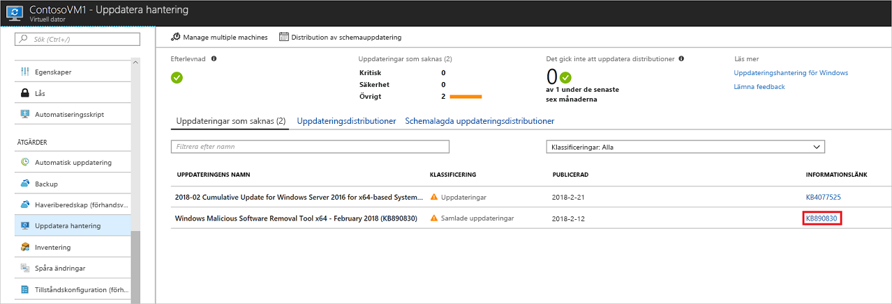
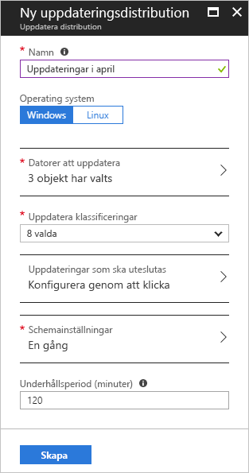

# Hantera Windows-uppdateringar med Azure Automation

Med Uppdateringshantering kan du hantera uppdateringar och korrigeringar för dina virtuella datorer.
I den här självstudien får du lära dig hur du utvärderar statusen för tillgängliga uppdateringar snabbt, planerar installation av uppdateringar som krävs och granskar distributionsresultat för att verifiera uppdateringar.

Prisinformation finns i [Automation-priser för uppdateringshantering](https://azure.microsoft.com/pricing/details/automation/)

I den här guiden får du lära dig hur man:

> [!div class="checklist"]
> * Publicera en virtuell dator för hantering av uppdateringar
> * Visa en uppdateringsbedömning
> * Schemalägga en uppdateringsdistribution
> * Visa resultatet av en distribution

## Nödvändiga komponenter

För att slutföra den här kursen behöver du:

* En Azure-prenumeration. Om du inte redan har ett konto kan du [aktivera dina MSDN-prenumerantförmåner](https://azure.microsoft.com/pricing/member-offers/msdn-benefits-details/) eller registrera dig för ett [kostnadsfritt konto](https://azure.microsoft.com/free/?WT.mc_id=A261C142F).
* Ett [Automation-konto](automation-offering-get-started.md) för bevakaren och åtgärdsrunbooks och bevakaraktiviteten.
* En [virtuell dator](../virtual-machines/windows/quick-create-portal.md) som du vill publicera.

## Logga in på Azure

Logga in på Azure Portal på http://portal.azure.com.

## Aktivera uppdateringshantering

Först måste du aktivera uppdateringshantering för din virtuella datorn för att kunna genomföra den här självstudien. Om du redan har aktiverat någon annan automatiseringslösning för en virtuell dator kan du hoppa över det här steget.

1. På menyn till vänster väljer du **Virtuella datorer** och väljer en virtuell dator på listan
2. På den vänstra menyn, under avsnittet **Åtgärder** klickar du på **Uppdateringshantering**. Sidan **Aktivera hantering av uppdateringar** öppnas.

Verifieringen utförs för att fastställa om uppdateringshantering är aktiverat för den här virtuella datorn.
Verifieringen söker efter en Log Analytics-arbetsyta och ett länkat Automation-konto, och om lösningen är i arbetsytan.

En [Log Analytics](../log-analytics/log-analytics-overview.md?toc=%2fazure%2fautomation%2ftoc.json)-arbetsyta används för att samla in data som genereras av funktioner och tjänster som uppdateringshantering.
Arbetsytan tillhandahåller en enda plats för att granska och analysera data från flera källor.
Om du vill utföra ytterligare åtgärder på virtuella datorer som kräver uppdateringar kan Azure Automation köra runbooks mot virtuella datorer, till exempel ladda ned och installera uppdateringar.

Verifieringsprocessen kontrollerar också om den virtuella datorn har etablerats med MMA och Automation Hybrid Runbook Worker.
Den här agenten används för att kommunicera med den virtuella datorn och hämta information om uppdateringsstatus.

Välj Log Analytics-arbetsytan och Automation-kontot och klicka på **Aktivera** för att aktivera lösningen. Det tar upp till 15 minuter att aktivera lösningen.

Om några av följande krav saknades under publiceringen läggs de till automatiskt:

* [Log Analytics](../log-analytics/log-analytics-overview.md?toc=%2fazure%2fautomation%2ftoc.json)-arbetsyta
* [Automation](./automation-offering-get-started.md)
* En [Hybrid runbook worker](./automation-hybrid-runbook-worker.md) aktiveras på den virtuella datorn

Skärmen **Uppdateringshantering** öppnas. Konfigurera platsen, Log Analytics-arbetsytan och Automation-kontot som ska användas och klicka på **Aktivera**. Om fälten är nedtonade betyder det att någon annan automatiseringslösning är aktiverad för den virtuella datorn, och samma arbetsyta och Automation-konto måste användas.

Det kan ta upp till 15 minuter att aktivera lösningen. Under tiden ska du inte stänga webbläsaren.
När lösningen har aktiverats flödar information om saknade uppdateringar på den virtuella datorn till Log Analytics.
Det kan ta mellan 30 minuter och 6 timmar innan data blir tillgängliga för analys.

## Visa kontroll av uppdateringar

När **uppdateringshantering** är aktiverat visas skärmen **Hantering av uppdateringar**.
Om några uppdateringar saknar ser du en lista med uppdateringar som saknas på fliken  **Uppdateringar som saknas**.

Välj **INFORMATIONSLÄNKEN** för uppdateringen för att öppna supportartikeln för uppdateringen i ett nytt fönster. Här kan du få viktig information om uppdateringen.

Om du klickar någon annanstans i uppdateringen öppnas fönstret **Loggsökning** för den valda uppdateringen. Frågan för loggsökningen är fördefinierad för den specifika uppdateringen. Du kan ändra den här frågan eller skapa en egen fråga om du vill visa detaljerad information om uppdateringarna som har distribuerats eller som saknas i din miljö.

## Schemalägga en uppdateringsdistribution

Nu vet du att det saknas uppdateringar för din virtuella dator. För att installera uppdateringar schemalägger du en distribution som passar ditt schema och servicefönster.
Du kan välja vilka uppdateringstyper som ska tas med i distributionen.
Du kan till exempel ta med kritiska uppdateringar eller säkerhetsuppdateringar och exkludera samlade uppdateringar.

> [!WARNING]
> När uppdateringar kräver en omstart startas den virtuella datorn om automatiskt.

Schemalägg en ny uppdateringsdistribution för den virtuella datorn genom att gå tillbaka till **Uppdateringshantering** och välj **Distribution av schemauppdatering** längst upp på skärmen.

På skärmen **Ny uppdateringsdistribution** anger du följande information:

* **Namn** – Ange ett unikt namn på uppdateringsdistributionen.
* **Uppdatera klassificering** – Välj vilka typer av programvara som ska tas med i uppdateringsdistributionen. Låt alla typer vara markerade för den här självstudien.

  Klassificeringstyper:

  * Kritiska uppdateringar
  * Säkerhetsuppdateringar
  * Samlade uppdateringar
  * Funktionspaket
  * Service pack
  * Definitionsuppdateringar
  * Verktyg
  * Uppdateringar

* **Schemainställningar** – Ställ in tiden på 5 minuter i framtiden. Du kan också acceptera standardvärdet, dvs 30 minuter efter den aktuella tiden.
Du kan också ange om distributionen ska ske en gång eller ange ett schema med återkommande tider.
Välj **Återkommande** under **Upprepning**. Låt standardvärdet stå kvar på 1 och klicka på **OK**. Då ställs ett återkommande schema in.

* **Underhållsperiod (minuter)** – Låt standardvärdet stå kvar. Du kan ange den tidsperiod som uppdateringsdistributionen ska utföras inom. Den här inställningen hjälper till att säkerställa att ändringarna utförs inom ditt definierade servicefönster.

När du har slutfört konfigurationen av schemat klickar du på knappen **Skapa**. Du kommer tillbaka till statusinstrumentpanelen. Välj **Schemalagda uppdateringsdistributioner** om du vill visa distributionsschemat du har skapat.

## Visa resultat för en uppdateringsdistribution

När den schemalagda distributionen startar kan du se status för distributionen på fliken **Uppdateringsdistributioner** på skärmen **Uppdateringshantering**.
Om distributionen körs visas status **Pågår**.
När distributionen har slutförts ändras status till **Lyckades**.
Om det uppstod några fel med en eller flera uppdateringar i distributionen visas status **Misslyckades delvis**.
Klicka på den slutförda uppdateringsdistributionen för att visa instrumentpanelen för distributionen.

På panelen för **uppdateringsresultat** visas en sammanfattning av det totala antalet uppdateringar och distributionsresultat för den virtuella datorn.
Tabellen till höger visar detaljer för varje uppdatering och installationsresultaten.
I följande lista visas tillgängliga värden:

* **Inget försök har gjorts** – Uppdateringen installerades inte eftersom det inte fanns tillräckligt med tid utifrån det underhållsfönster som definierats.
* **Lyckades** – Uppdateringen lyckades
* **Misslyckades** – Uppdateringen misslyckades

Klicka på **Alla loggar** om du vill se alla loggposter som har skapats för distributionen.

Klicka på panelen **Utdata** om du vill se jobbströmmen för den runbook som ansvarar för att hantera uppdateringsdistributionen på den virtuella måldatorn.

Klicka på **Fel** om du vill se detaljerad information om fel som uppstått vid distributionen.

## Nästa steg

I den här självstudiekursen lärde du dig att:

> [!div class="checklist"]
> * Publicera en virtuell dator för hantering av uppdateringar
> * Visa en uppdateringsbedömning
> * Schemalägga en uppdateringsdistribution
> * Visa resultatet av en distribution

Fortsätt till översikten för uppdateringshanteringslösningen.

> [!div class="nextstepaction"]
> [Uppdateringshanteringslösning](../operations-management-suite/oms-solution-update-management.md?toc=%2fazure%2fautomation%2ftoc.json)
