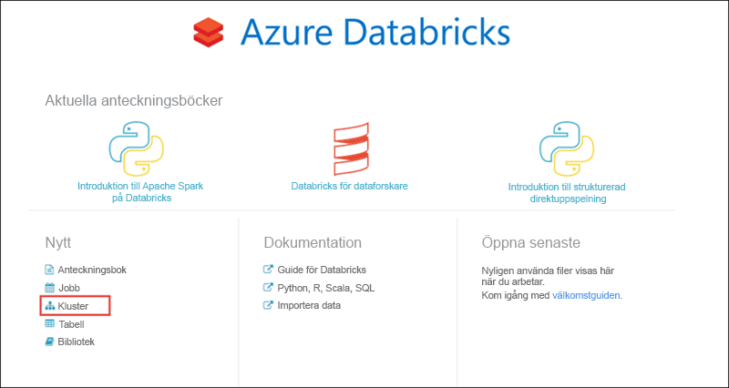
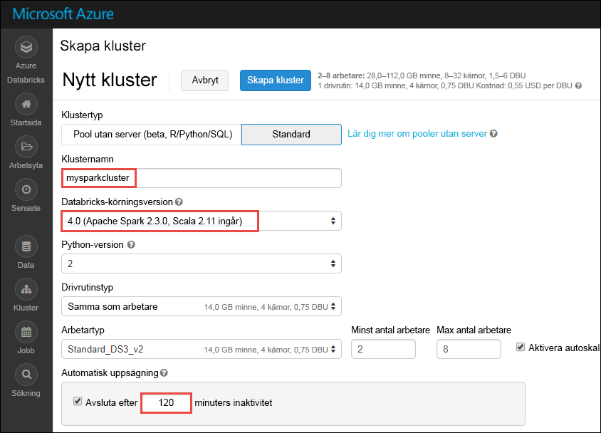
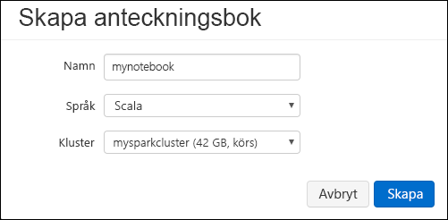
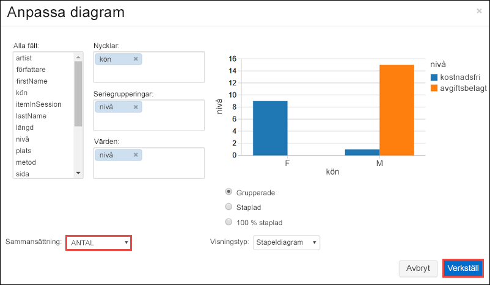
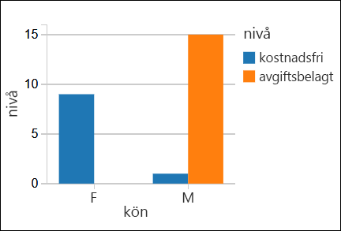

# <a name="quickstart-run-a-spark-job-on-azure-databricks-using-the-azure-portal"></a>Snabbstart: Köra ett Spark-jobb på Azure Databricks med Azure Portal

Den här snabbstarten visar hur du skapar en arbetsyta för Azure Databricks och ett Apache Spark-kluster i den arbetsytan. Dessutom får du lära dig hur du kör ett Spark-jobb på Databricks-klustret. Mer information om Azure Databricks finns i [Vad är Azure Databricks?](what-is-azure-databricks.md)

## <a name="log-in-to-the-azure-portal"></a>Logga in på Azure Portal

Logga in på [Azure Portal](https://portal.azure.com).

## <a name="create-a-databricks-workspace"></a>Skapa en Databricks-arbetsyta

I det här avsnittet skapar du en Azure Databricks-arbetsyta med Azure-portalen. 

1. I Azure-portalen klickar du på **Skapa en resurs**, sedan på **Data och analys** och därefter på **Azure Databricks (Preview)** (Azure Databricks (förhandsversion)). 

    

2. Under **Azure Databricks (Preview)** (Azure Databricks (förhandsversion)) klickar du på **Skapa**.

3. Under **Azure Databricks Service** (Azure Databricks-tjänst) skriver du följande värden:

    

    * För **Namn på arbetsyta** anger du ett namn på din Databricks-arbetsyta.
    * Vid **Prenumeration** i listrutan väljer du din Azure-prenumeration.
    * För **Resursgrupp** anger du om du vill skapa en ny resursgrupp eller använda en befintlig. En resursgrupp är en behållare som innehåller relaterade resurser för en Azure-lösning. Mer information finns i [översikten över Azure-resursgrupper](../azure-resource-manager/resource-group-overview.md).
    * För **Plats** väljer du **USA, östra 2**. För andra tillgängliga regioner läser du informationen om [Azure-tjänsttillgänglighet per region](https://azure.microsoft.com/regions/services/).

4. Klicka på **Skapa**.

## <a name="create-a-spark-cluster-in-databricks"></a>Skapa ett Spark-kluster i Databricks

1. I Azure-portalen går du till arbetsytan Databricks som du skapade och klickar sedan på **Initiera arbetsyta**.

2. Du omdirigeras till Azure Databricks-portalen. Från portalen klickar du på **Kluster**.

    

3. På sidan **Nytt kluster** anger du värdena för att skapa ett kluster.

    

    * Ange ett namn för klustret.
    * Se till att markera kryssrutan **Avsluta efter ___ minuters aktivitet**. Ange en varaktighet (i minuter) för att avsluta klustret om klustret inte används.
    * Acceptera alla övriga standardvärden. 
    * Klicka på **Skapa kluster**. När klustret körs kan du ansluta anteckningsböcker till klustret och köra Spark-jobb.

Mer information om att skapa kluster finns i [Skapa ett Spark-kluster i Azure Databricks](https://docs.azuredatabricks.net/user-guide/clusters/create.html).

## <a name="run-a-spark-sql-job"></a>Köra ett Spark SQL-jobb

Innan du börjar med det här avsnittet måste du slutföra följande:

* [Skapa ett Azure Storage-konto](../storage/common/storage-create-storage-account.md#create-a-storage-account). 
* Ladda ned en exempel-JSON-fil [från Github](https://github.com/Azure/usql/blob/master/Examples/Samples/Data/json/radiowebsite/small_radio_json.json). 
* Ladda upp exempel-JSON-filen till det Azure-lagringskonto du har skapat. Du kan använda [Microsoft Azure Storage Explorer](../vs-azure-tools-storage-manage-with-storage-explorer.md) för att ladda upp filer.

Utför följande steg för att skapa en anteckningsbok i Databricks, konfigurera den för att läsa data från ett Azure Blob Storage-konto och kör ett Spark SQL-jobb på data.

1. Klicka på **Arbetsyta** i det vänstra fönstret. Från listrutan **Arbetsyta** klickar du på **Skapa** och sedan på **Anteckningsbok**.

    

2. I dialogrutan **Skapa anteckningsbok** anger du ett namn, väljer **Scala** som språk och väljer det Spark-kluster som du skapade tidigare.

    

    Klicka på **Skapa**.

3. I följande kodfragment ersätter du `{YOUR STORAGE ACCOUNT NAME}` med namnet på Azure-lagringskontot som du skapade och `{YOUR STORAGE ACCOUNT ACCESS KEY}` med din åtkomstnyckel för lagringskontot. Klistra in följande kodfragment i en tom cell och tryck sedan på SKIFT+RETUR för att köra kodcellen. Kodfragmentet konfigurerar anteckningsboken för att läsa data från et Azure Blob Storage.

       spark.conf.set("fs.azure.account.key.{YOUR STORAGE ACCOUNT NAME}.blob.core.windows.net", "{YOUR STORAGE ACCOUNT ACCESS KEY}")
    
    Om du vill få instruktioner om hur du hämtar åtkomstnyckeln för lagringskontot läser du [Hantera dina åtkomstnycklar för lagring](../storage/common/storage-create-storage-account.md#manage-your-storage-account)

    > [!NOTE]
    > Du kan även använda Azure Data Lake Store med ett Spark-kluster på Azure Databricks. Instruktioner finns i [Använda Data Lake Store med Azure Databricks](https://go.microsoft.com/fwlink/?linkid=864084).

4. Kör en SQL-instruktion för att skapa en temporär tabell med data från exempel-JSON-datafilen **small_radio_json.json**. I följande kodfragment ersätter du platshållarens värden med din behållares namn och namnet på ditt lagringskonto. Klistra in följande kodfragment i en kodcell och tryck sedan på SKIFT+RETUR. I kodfragmentet anger `path` platsen för exempel-JSON-filen som du laddade upp till ditt Azure Storage-konto.

    ```sql
    %sql 
    CREATE TEMPORARY TABLE radio_sample_data
    USING json
    OPTIONS (
     path "wasbs://{YOUR CONTAINER NAME}@{YOUR STORAGE ACCOUNT NAME}.blob.core.windows.net/small_radio_json.json"
    )
    ```

    När kommandot har slutförts har du alla data från JSON-filen som en tabell i Databricks-klustret.

    Med det magiska språkkommandot `%sql` kan du köra en SQL-kod från anteckningsboken även om anteckningsboken är av en annan typ. Mer information finns i [Mixing languages in a notebook](https://docs.azuredatabricks.net/user-guide/notebooks/index.html#mixing-languages-in-a-notebook) (Blanda språk i en anteckningsbok).

5. Nu ska vi titta på en ögonblicksbild av JSON-exempeldata för att bättre förstå den fråga som körs. Klistra in följande kodfragment i kodcellen och tryck på **SKIFT + RETUR**.

    ```sql
    %sql 
    SELECT * from radio_sample_data
    ```

6. Du ser en tabellvy som i följande skärmbild (endast vissa kolumner visas):

    

    Bland annat fångar exempeldata in könet på en radiokanals målgrupp (kolumnnamn, **kön**)  och om deras prenumeration är kostnadsfri eller om den betalas (kolumnnamn, **nivå**).

7. Nu skapar du en visuell representation av dessa data för att visa hur många användare av varje kön som har kostnadsfria konton och hur många som är betalande prenumeranter. Längst ned i tabellvyn klickar du på ikonen **Stapeldiagram** och sedan på **Ritalternativ**.

    

8. I **Anpassa ritning** drar och släpper du värden enligt skärmbilden.

    

    * Ställ in **Nycklar** på **kön**.
    * Ställ in **Seriegrupperingar** på **nivå**.
    * Ställ in **Värden** på **nivå**.
    * Ställ in **Sammansättning** på **COUNT** (Antal).

    Klicka på **Använd**.

9. Utdata visar den visuella representationen som visas i följande skärmbild:

     

## <a name="clean-up-resources"></a>Rensa resurser

Om du markerade kryssrutan **Avsluta efter ___ minuters aktivitet** när du skapade Apache Spark-klustret avslutas klustret automatiskt om det har varit inaktivt under den angivna tiden.

Om du inte har markerat kryssrutan måste du avsluta klustret manuellt. Det gör du genom att klicka på via **Kluster** i den vänstra rutan i Azure Databricks-arbetsytan. För klustret du vill avsluta för du markören över de tre punkterna under kolumnen **Actions** (Åtgärder) och klickar på ikonen **Avsluta**.


## <a name="next-steps"></a>Nästa steg

I den här artikeln skapade du ett Spark-kluster i Azure Databricks och körde ett Spark-jobb med data i Azure Storage. Du kan också titta på [Spark-datakällor](https://docs.azuredatabricks.net/spark/latest/data-sources/index.html) för att lära dig att importera data från andra datakällor till Azure Databricks. Fortsätt till nästa artikel om du vill lära dig att använda Azure Data Lake Store med Azure Databricks.

> [!div class="nextstepaction"]
>[Använda Data Lake Store med Azure Databricks](https://go.microsoft.com/fwlink/?linkid=864084)
