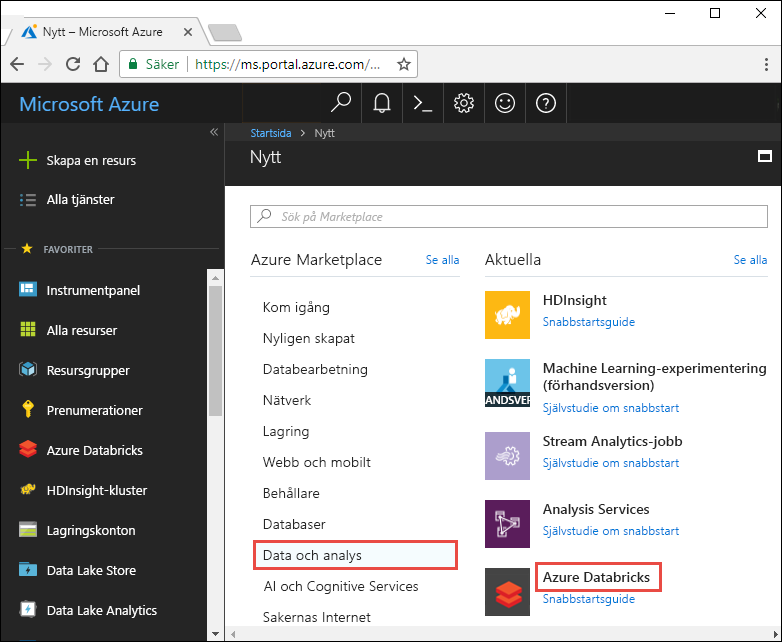
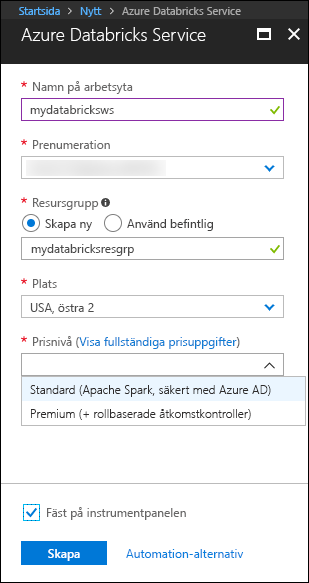
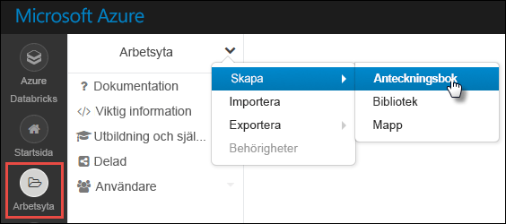
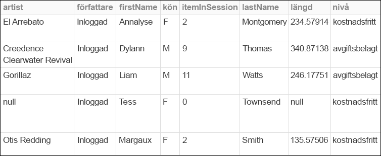
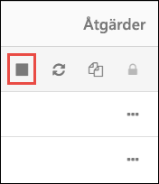

# <a name="quickstart-run-a-spark-job-on-azure-databricks-using-the-azure-portal"></a>Snabbstart: Kör ett jobb med Spark på Azure Databricks med Azure-portalen

Den här snabbstarten visar hur du skapar en arbetsyta för Azure Databricks och ett Apache Spark-kluster i den arbetsytan. Dessutom får du lära dig hur du kör ett Spark-jobb på Databricks klustret. Läs mer på Azure Databricks [vad är Azure Databricks?](what-is-azure-databricks.md)

## <a name="log-in-to-the-azure-portal"></a>Logga in på Azure Portal

Logga in på den [Azure-portalen](https://portal.azure.com).

## <a name="create-a-databricks-workspace"></a>Skapa en Databricks-arbetsyta

I det här avsnittet skapar du en Azure Databricks arbetsyta med Azure-portalen. 

1. I Azure-portalen klickar du på  **+** , klickar du på **Data + analys**, och klicka sedan på **Databricks Azure (förhandsversion)**. 

    

2. Under **Databricks Azure (förhandsversion)**, klickar du på **skapa**.

    > [!NOTE]
    > Azure Databricks genomgår förhandsgranskning för närvarande begränsad. Om du vill att din Azure-prenumeration för vitlistning för förhandsgranskningen så måste du fylla i [registreringsformuläret](https://databricks.azurewebsites.net/).

2. Under **Azure Databricks Service**, ange följande värden:

    

    * För **Arbetsytenamn**, ange ett namn för din Databricks arbetsyta.
    * För **prenumeration**, i listrutan, Välj din Azure-prenumeration.
    * För **resursgruppen**, ange om du vill skapa en ny resursgrupp eller använda en befintlig. En resursgrupp är en behållare som innehåller relaterade resurser för en Azure-lösning. Mer information finns i [översikt över Azure-resursgrupp](../azure-resource-manager/resource-group-overview.md).
    * För **plats**väljer **östra USA 2**. Andra tillgängliga regioner finns [Azure tjänster som är tillgängliga efter region](https://azure.microsoft.com/regions/services/).

3. Klicka på **Skapa**.

## <a name="create-a-spark-cluster-in-databricks"></a>Skapa ett Spark-kluster i Databricks

1. Gå till arbetsytan Databricks som du skapade i Azure-portalen och klicka sedan på **initiera arbetsytan**.

2. Du omdirigeras till Databricks Azure-portalen. Från portalen, klickar du på **klustret**.

    

3. I den **nytt kluster** anger värden för att skapa ett kluster.

    

    * Ange ett namn för klustret.
    * Kontrollera att du väljer den **Avsluta efter ___ minuter för aktiviteten** kryssrutan. Ange en varaktighet (i minuter) för att avsluta klustret, om klustret inte används.
    * Acceptera alla övriga standardvärdena. 
    * Klicka på **Skapa kluster**. När klustret körs kan du ansluta datorer till klustret och köra Spark-jobb.

Mer information om hur du skapar kluster finns [skapar ett Spark-kluster i Azure Databricks](https://docs.azuredatabricks.net/user-guide/clusters/create.html).

## <a name="run-a-spark-sql-job"></a>Kör ett Spark SQL-jobb

Innan du börjar med det här avsnittet måste du utföra följande:

* [Skapa ett Azure storage-konto](../storage/common/storage-create-storage-account.md#create-a-storage-account). 
* Hämta en exempelfil JSON [från Github](https://github.com/Azure/usql/blob/master/Examples/Samples/Data/json/radiowebsite/small_radio_json.json). 
* Överför JSON exempelfilen till Azure storage-konto som du skapade. Du kan använda [Microsoft Azure Lagringsutforskaren](../vs-azure-tools-storage-manage-with-storage-explorer.md) att överföra filer.

Utför följande steg för att skapa en bärbar dator i Databricks, konfigurera anteckningsboken för att läsa data från ett Azure Blob storage-konto och kör sedan ett Spark SQL-jobb på data.

1. I den vänstra rutan klickar du på **arbetsytan**. Från den **arbetsytan** listrutan, klickar du på **skapa**, och klicka sedan på **anteckningsboken**.

    

2. I den **skapa anteckningsboken** dialogrutan, ange ett namn, väljer **Scala** som språk och välj Spark-klustret som du skapade tidigare.

    

    Klicka på **Skapa**.

3. I följande fragment ersätter `{YOUR STORAGE ACCOUNT NAME}` med Azure storage-kontonamn som du skapade och `{YOUR STORAGE ACCOUNT ACCESS KEY}` med din åtkomstnyckel för lagring. Klistra sammandraget i en tom cell i anteckningsboken och sedan trycka på SKIFT + RETUR för att köra kodcellen. Den här fragment konfigurerar anteckningsboken för att läsa data från ett Azure blob storage.

       spark.conf.set("fs.azure.account.key.{YOUR STORAGE ACCOUNT NAME}.blob.core.windows.net", "{YOUR STORAGE ACCOUNT ACCESS KEY}")
    
    Instruktioner om hur du hämtar lagringskontots åtkomstnyckel finns [hantera åtkomstnycklar för lagring](../storage/common/storage-create-storage-account.md#manage-your-storage-account)

    > [!NOTE]
    > Du kan också använda Azure Data Lake Store med ett Spark-kluster på Azure Databricks. Instruktioner finns i [Använd Data Lake Store med Azure Databricks](https://docs.azuredatabricks.net/spark/latest/data-sources/azure/azure-storage.html#azure-data-lake-store).

4. Kör en SQL-instruktion för att skapa en tillfällig tabell med hjälp av data från den JSON Exempeldatafilen **small_radio_json.json**. I följande fragment ersätta platshållarvärdena med behållarens namn och namnet på lagringskontot. Klistra sammandraget cellredigering koden i anteckningsboken och sedan trycka på SKIFT + RETUR. I fragment, `path` anger platsen för exempel JSON-filen som du överfört till ditt Azure Storage-konto.

    ```sql
    %sql 
    CREATE TEMPORARY TABLE radio_sample_data
    USING json
    OPTIONS (
     path "wasbs://{YOUR CONTAINER NAME}@{YOUR STORAGE ACCOUNT NAME}.blob.core.windows.net/small_radio_json.json"
    )
    ```

    När kommandot har slutförts, har alla data från JSON-filen som en tabell i Databricks kluster.

    Den `%sql` språk magiskt kommandot kan du köra en SQL-kod från bärbara datorer, även om den bärbara datorn tillhör en annan typ. Mer information finns i [blanda språk i en bärbar dator](https://docs.azuredatabricks.net/user-guide/notebooks/index.html#mixing-languages-in-a-notebook).

5. Nu ska vi titta på en ögonblicksbild av JSON exempeldata att bättre förstå den fråga som körs. Klistra in följande kodavsnitt i koden cell och trycka på **SKIFT + RETUR**.

    ```sql
    %sql 
    SELECT * from radio_sample_data
    ```

6. Du ser en tabellvy utdata som visas i följande skärmbild (endast vissa kolumner visas):

    

    Bland andra uppgifter exempeldata fångar kön för målgruppen för en alternativknapp kanal (kolumnnamn **kön**) och om prenumerationen är kostnadsfria eller betalda (kolumnnamn **nivå**).

7. Nu kan du skapa en bild av dessa data att visa för varje kön, hur många användare har kostnadsfria konton och hur många är betalda prenumeranter. Längst ned i tabellform utdata klickar du på den **stapeldiagram** ikonen och klickar sedan på **Rita alternativ**.

    

8. I **anpassa Rita**, dra och släpp värden som visas i skärmbilden.

    

    * Ange **nycklar** till **kön**.
    * Ange **seriegrupperingar** till **nivå**.
    * Ange **värden** till **nivå**.
    * Ange **aggregering** till **antal**.

    Klicka på **Använd**.

9. Utdata visar bild som visas i följande skärmbild:

     

## <a name="clean-up-resources"></a>Rensa resurser

När du skapar Spark-kluster om du markerade kryssrutan **Avsluta efter ___ minuter för aktiviteten**, klustret avslutas automatiskt om det har varit inaktiv under den angivna tiden.

Om du inte valde kryssrutan, måste du manuellt avsluta klustret. Om du vill göra det, från arbetsytan Azure Databricks i den vänstra rutan klickar du på **kluster**. För det kluster som du vill avsluta markören över de tre punkterna under **åtgärder** och på den **avsluta** ikon.



## <a name="next-steps"></a>Nästa steg

I den här artikeln, skapa ett Spark-kluster i Azure Databricks och körde ett Spark-jobb med hjälp av data i Azure-lagring. Du kan också titta på [Väck datakällor](https://docs.azuredatabricks.net/spark/latest/data-sources/index.html) att lära dig hur du importerar data från andra datakällor till Azure Databricks. Gå vidare till nästa artikeln lär du dig hur du använder Azure Data Lake Store med Azure Databricks.

> [!div class="nextstepaction"]
>[Använd Data Lake Store med Azure Databricks](https://docs.azuredatabricks.net/spark/latest/data-sources/azure/azure-storage.html#azure-data-lake-store)