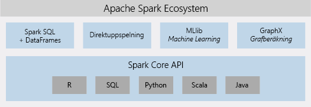

# Vad är Azure Databricks?

Azure Databricks är en Apache Spark-baserade analytics-plattform som är optimerade för Microsoft Azure cloud services-plattformen. Utformad med grundare av Apache Spark, är Databricks integrerad med Azure för att tillhandahålla standardkonfigurationen, effektiv arbetsflöden och en interaktiv arbetsyta som gör det möjligt för samarbete mellan dataanalytiker, data engineers och affärsanalytiker.

![Vad är Azure Databricks? ] (./media/what-is-azure-databricks/azure-databricks-overview.png "Vad är Azure Databricks?")

## Apache Spark-baserade analytics platform

Azure Databricks består av fullständig öppen källkod Apache Spark-kluster tekniker och funktioner. Spark i Azure Databricks innehåller följande komponenter:

* **Spark SQL och DataFrames**: Spark SQL är Spark-modul för att arbeta med strukturerade data. En DataFrame är en distribuerad uppsättning data ordnas i namngivna kolumner. Det motsvarar begreppsmässigt till en tabell i en relationsdatabas eller en data-ram i R/Python.

* **Strömning**: realtidsbearbetning av data och analys för analys och interaktiva program. Integreras med HDFS, Flume och Kafka.

* **MLib**: Machine Learning-bibliotek med vanliga algoritmer och verktyg, inklusive klassificering, regression, kluster, samarbetsfunktioner filtrering, dimensionalitet minskning, samt underliggande optimering primitiver.

* **GraphX**: diagram och graph-beräkningen för en bred omfattning användningsfall från kognitiva analytics till datagranskning.

* **Spark Core API**: har stöd för R, SQL, Python, Scala och Java.

## Apache Spark i Azure Databricks

Azure Databricks bygger på funktionerna i Spark genom att tillhandahålla ett noll-management molnplattform som innehåller:

- Helt hanterad Spark-kluster
- En interaktiv arbetsyta för undersökning och visualisering
- En plattform för Spark-baserade program

### Fullständigt hanterade Apache Spark-kluster i molnet

Azure Databricks har en säkert och tillförlitligt produktionsmiljö i molnet, hanteras och som stöds av Spark experter. Du kan:

* Skapa kluster i sekunder.
* Dynamiskt Autoskala kluster upp eller ned, inklusive serverlösa kluster och dela dem mellan olika grupper. 
* Använda kluster programmässigt med hjälp av REST-API: er. 
* Använda säkra data integrationsmöjligheter byggt på Spark som gör att du kan göra dina data utan centralisering. 
* Få direkt åtkomst till de senaste Apache Spark-funktionerna i varje version.

### Databricks Runtime
Databricks-Runtime är byggt på Apache Spark och internt är utformat för Azure-molnet. 

Med den **utan Server** alternativet Azure Databricks avlägsnar helt ut infrastruktur komplexitet och behovet av att särskilda kunskaper att ställa in och konfigurera infrastrukturen data. Om du väljer alternativet hjälper data forskare snabbt iterera som ett team.

För data-tekniker som intresserar dig prestanda för produktionsjobb, tillhandahåller Azure Databricks en Spark motor som är snabbare och performant via olika optimeringar i i/o-lagret och bearbetning layer (Databricks I/O).

### Arbetsyta för samarbete

Via en gemensam och integrerad miljö effektiviserar Azure Databricks processen att utforska data och prototyper körs datadrivna program i Spark.

* Bestämma hur du använder data med enkelt datagranskning.
* Dokumentera din förloppet på bärbara datorer i R, Python, Scala eller SQL.
* Visualisera data i några få klickningar och använda välbekanta verktyg som Matplotlib, ggoplot eller d3.
* Använd interaktiva instrumentpaneler för att skapa dynamiska rapporter.
* Använda Spark och interagera med data samtidigt.

## Företagssäkerhet

Azure Databricks ger företagsklass Azure säkerhet, inklusive Azure Active Directory-integrering, rollbaserad kontroller och servicenivåavtal som skyddar dina data och din verksamhet.

* Integrering med Azure Active Directory kan du köra fullständig Azure-baserade lösningar med hjälp av Azure Databricks.
* Azure Databricks rollbaserad åtkomst aktiverar detaljerade användarbehörigheter för bärbara datorer, kluster, jobb och data.
* Företagsklass serviceavtal. 

## Integrering med Azure-tjänster

Azure Databricks djupt kan integreras med Azure-databaser och lagrar: SQL Data Warehouse, Cosmos DB, Data Lake Store och Blob Storage. 

## Integrering med Powerbi
Genom omfattande integrering med Power BI kan Azure Databricks du identifiera och dela dina effektfulla insikter snabbt och enkelt. Du kan använda andra BI-verktyg, till exempel Tableau programvara via JDBC/ODBC-klustret slutpunkter.

## Nästa steg

* [Snabbstart: Kör ett jobb med Spark på Azure Databricks](quickstart-create-databricks-workspace-portal.md)
* [Arbeta med Spark-kluster](https://docs.azuredatabricks.net/user-guide/clusters/index.html)
* [Arbeta med bärbara datorer](https://docs.azuredatabricks.net/user-guide/notebooks/index.html)
* [Skapa Spark-jobb](https://docs.azuredatabricks.net/user-guide/jobs.html)

 

