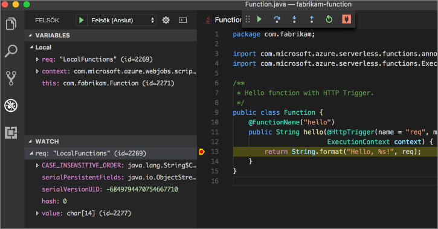

# <a name="create-your-first-function-with-java-and-maven-preview"></a>Skapa din första funktion med Java och Maven (förhandsversion)

[!INCLUDE [functions-java-preview-note](../../includes/functions-java-preview-note.md)]

I den här snabbstarten vägleds du genom processen att skapa ett [serverfritt](https://azure.microsoft.com/overview/serverless-computing/) funktionsprojekt med Maven, testa det lokalt och distribuera det till Azure Functions. När du är klar har du en HTTP-utlöst funktionsapp som körs i Azure.


[!INCLUDE [quickstarts-free-trial-note](../../includes/quickstarts-free-trial-note.md)]

## <a name="prerequisites"></a>Nödvändiga komponenter
För att kunna utveckla funktionsappar med Java måste du ha följande installerat:

-  [Java Developer Kit](https://www.azul.com/downloads/zulu/), version 8.
-  [Apache Maven](https://maven.apache.org), version 3.0 eller senare.
-  [Azure CLI](https://docs.microsoft.com/cli/azure)

> [!IMPORTANT] 
> Miljövariabeln JAVA_HOME måste vara inställd på JDK-installationsplatsen för att snabbstarten ska gå att genomföra.

## <a name="install-the-azure-functions-core-tools"></a>Installera Azure Functions Core Tools

Azure Functions Core Tools tillhandahåller en lokal utvecklingsmiljö för att skriva, köra och felsöka Azure Functions från en terminal eller en kommandotolk. 

Installera [version 2 av de grundläggande verktygen](functions-run-local.md#v2) lokalt på datorn innan du fortsätter.

## <a name="generate-a-new-functions-project"></a>Generera ett nytt funktionsprojekt

Kör följande kommando i en tom mapp för att skapa ett funktionsprojekt utifrån en [Maven-arketyp](https://maven.apache.org/guides/introduction/introduction-to-archetypes.html).

### <a name="linuxmacos"></a>Linux/MacOS

```bash
mvn archetype:generate \
    -DarchetypeGroupId=com.microsoft.azure \
    -DarchetypeArtifactId=azure-functions-archetype 
```

### <a name="windows-cmd"></a>Windows (CMD)
```cmd
mvn archetype:generate ^
    -DarchetypeGroupId=com.microsoft.azure ^
    -DarchetypeArtifactId=azure-functions-archetype
```

Maven uppmanar dig att ange de värden som behövs för att projektet ska genereras. Mer information om värdena _groupId_, _artifactId_ och _version_ finns i referensmaterialet om [namngivningskonventioner i Maven](https://maven.apache.org/guides/mini/guide-naming-conventions.html). Värdet _appName_ måste vara unikt i Azure, så Maven genererar som standard ett appnamn baserat på ett tidigare angivet _artifactId_. Värdet _packageName_ anger vilket Java-paket som ska användas till den genererade funktionskoden.

Identifierarna `com.fabrikam.functions` och `fabrikam-functions` nedan används som exempel och för att göra senare steg i den här snabbstarten lättare att läsa. Du bör ange dina egna värden för Maven i det här steget.

```Output
Define value for property 'groupId': com.fabrikam.functions
Define value for property 'artifactId' : fabrikam-functions
Define value for property 'version' 1.0-SNAPSHOT : 
Define value for property 'package': com.fabrikam.functions
Define value for property 'appName' fabrikam-functions-20170927220323382:
Confirm properties configuration: Y
```

Maven skapar projektfilerna i en ny mapp med namnet _artifactId_, `fabrikam-functions` i det här exemplet. Den körklara genererade koden i projektet utgörs av en enkel [HTTP-utlöst](/azure/azure-functions/functions-bindings-http-webhook) funktion som återspeglar en begäran:

```java
public class Function {
    /**
     * This function listens at endpoint "/api/hello". Two ways to invoke it using "curl" command in bash:
     * 1. curl -d "HTTP Body" {your host}/api/hello
     * 2. curl {your host}/api/hello?name=HTTP%20Query
     */
    @FunctionName("hello")
    public HttpResponseMessage<String> hello(
            @HttpTrigger(name = "req", methods = {"get", "post"}, authLevel = AuthorizationLevel.ANONYMOUS) HttpRequestMessage<Optional<String>> request,
            final ExecutionContext context) {
        context.getLogger().info("Java HTTP trigger processed a request.");

        // Parse query parameter
        String query = request.getQueryParameters().get("name");
        String name = request.getBody().orElse(query);

        if (name == null) {
            return request.createResponse(400, "Please pass a name on the query string or in the request body");
        } else {
            return request.createResponse(200, "Hello, " + name);
        }
    }
}

```

## <a name="run-the-function-locally"></a>Kör funktionen lokalt

Byt katalog till den nyskapade projektmappen. Skapa och kör sedan funktionen med Maven:

```
cd fabrikam-functions
mvn clean package 
mvn azure-functions:run
```

> [!NOTE]
> Om du får det här undantaget: `javax.xml.bind.JAXBException` med Java 9 så hittar du en lösning på [GitHub](https://github.com/jOOQ/jOOQ/issues/6477).

Du kan se dessa utdata när funktionen körs lokalt på datorn och är redo att svara på HTTP-begäranden:

```Output
Listening on http://localhost:7071
Hit CTRL-C to exit...

Http Functions:

   hello: http://localhost:7071/api/hello
```

Utlös funktionen från kommandoraden med curl i ett nytt terminalfönster:

```
curl -w '\n' -d LocalFunction http://localhost:7071/api/hello
```

```Output
Hello LocalFunction!
```

Använd `Ctrl-C` i terminalen för att stoppa funktionskoden.

## <a name="deploy-the-function-to-azure"></a>Distribuera funktionen till Azure

Under distribueringen till Azure Functions används autentiseringsuppgifter från Azure CLI. [Logga in med Azure CLI](/cli/azure/authenticate-azure-cli?view=azure-cli-latest) innan du fortsätter.

```azurecli
az login
```

Distribuera koden till en ny funktionsapp med hjälp av Maven-målet `azure-functions:deploy`.

```
mvn azure-functions:deploy
```

När distributionen är klar kan du se den webbadress som används för att få åtkomst till din funktionsapp i Azure:

```output
[INFO] Successfully deployed Function App with package.
[INFO] Deleting deployment package from Azure Storage...
[INFO] Successfully deleted deployment package fabrikam-function-20170920120101928.20170920143621915.zip
[INFO] Successfully deployed Function App at https://fabrikam-function-20170920120101928.azurewebsites.net
[INFO] ------------------------------------------------------------------------
```

Testa funktionsappen som körs på Azure med hjälp av `cURL`. Du måste ändra URL-adressen från exemplet till den distribuerade URL-adressen för din egen funktionsapp från föregående steg.

```
curl -w '\n' https://fabrikam-functions-20170920120101928.azurewebsites.net/api/hello -d AzureFunctions
```

```Output
Hello AzureFunctions!
```

## <a name="next-steps"></a>Nästa steg

Du har skapat en Java-funktionsapp med en enkel HTTP-utlösare och distribuerat den till Azure Functions.

- Läs igenom [utvecklarguiden för Java-funktioner](functions-reference-java.md) för att få mer information om hur du utvecklar Java-funktioner.
- Lägg till fler funktioner med olika utlösare i projektet med Maven-målet `azure-functions:add`.
- Felsök funktioner lokalt med Visual Studio Code. När du har installerat [Java-tilläggspaketet](https://marketplace.visualstudio.com/items?itemName=vscjava.vscode-java-pack) och öppnat funktionsprojektet i Visual Studio Code ska du [koppla felsökaren](https://code.visualstudio.com/Docs/editor/debugging#_launch-configurations) till port 5005. Ange sedan en brytpunkt i redigeringsprogrammet och utlös funktionen medan den körs lokalt: 
- Fjärrfelsök funktioner med Visual Studio Code. Mer information finns i [Skriva serverlösa Java-program](https://code.visualstudio.com/docs/java/java-serverless#_remote-debug-functions-running-in-the-cloud).
