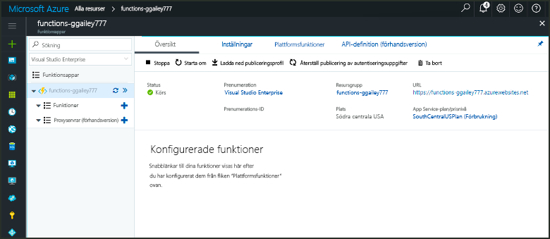

# Skapa en funktion som utlöses av en GitHub-webhook

Lär dig hur du skapar en funktion som utlöses av en HTTP-webhookbegäran med en GitHub-specifik nyttolast.

## Nödvändiga komponenter

+ Ett GitHub-konto med minst ett projekt.
+ En Azure-prenumeration. Om du inte har ett konto kan du skapa ett [kostnadsfritt konto](https://azure.microsoft.com/free/?WT.mc_id=A261C142F) innan du börjar.

## Skapa en Azure Functions-app

[!INCLUDE [Create function app Azure portal](../../includes/functions-create-function-app-portal.md)]

Därefter skapar du en funktion i den nya funktionsappen.

## Skapa en webhook-utlöst GitHub-funktion

1. Expandera funktionsappen och klicka på knappen **+** bredvid **Funktioner**. Om det är den första funktionen i din funktionsapp väljer du **Anpassad funktion**. Detta visar en fullständig uppsättning med funktionsmallar.

    

2. Skriv `github` i sökfältet och välj sedan önskat språk för utlösarmallen för GitHub-webhook. 

      

2. Skriv ett **namn** för funktionen och välj sedan **Skapa**. 

      

3. Klicka på **</> Hämta funktionswebbadress** och kopiera och spara värdena. Gör samma sak för **</> Hämta GitHub-hemlighet**. Du behöver dessa värden när du konfigurerar webhooken i GitHub.

    

Skapa sedan en webhook i GitHub-lagringsplatsen.

## Konfigurera webhooken

1. Navigera till en lagringsplats du äger i GitHub. Du kan också använda en lagringsplats du har förgrenat. Om du behöver förgrena en databas kan du använda <https://github.com/Azure-Samples/functions-quickstart>.

2. Välj **Inställningar** > **Alternativ** och kontrollera att **Problem** har aktiverats under **Funktioner**.

   

1. Välj **Webhooks** > **Lägg till webhook** i **Inställningar**.

    

1. Använd de inställningar som anges i följande tabell och klicka sedan på **Lägg till webhook**:

    

| Inställning | Föreslaget värde | Beskrivning |
|---|---|---|
| **Payload URL** (Webbadress för nyttolast) | Kopierat värde | Använd värdet som returnerades med **</> Hämta funktionswebbadress**. |
| **Innehållstyp** | application/json | Funktionen förväntar sig en JSON-nyttolast. |
| **Hemlighet**   | Kopierat värde | Använd värdet som returnerades med **</> Hämta GitHub-hemlighet**. |
| Händelseutlösare | Låt mig välja enskilda händelser | Vi vill bara utlösa för händelser med ärendekommentarer.  |
| | Ärendekommentar |  |

Nu har webhooken konfigurerats för att utlösa din funktion när en ny ärendekommentar läggs till.

## Testa funktionen

1. I din GitHub-lagringsplats öppnar du fliken **Ärenden** i ett nytt webbläsarfönster.

1. I det nya fönstret klickar du på **Nytt ärende**, skriver en titel och klickar på **Submit new issue** (Skicka nytt ärende).

1. Skriv en kommentar i ärendet och klicka på **Kommentar**.

    

1. Gå tillbaka till portalen och öppna loggarna. Du bör se en spårningspost med den nya kommentartexten.

     

## Rensa resurser

[!INCLUDE [Next steps note](../../includes/functions-quickstart-cleanup.md)]

## Nästa steg

Du har skapat en funktion som utlöses när en begäran tas emot från en GitHub-webhook.

[!INCLUDE [Next steps note](../../includes/functions-quickstart-next-steps.md)]

Mer information om webhook-utlösare finns i [Azure Functions HTTP och webhook-bindningar](functions-bindings-http-webhook.md).
