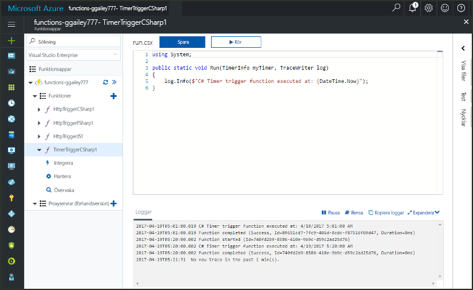

#  Skapa en funktion i Azure som utlöses av en timer

Lär dig hur du använder Azure Functions till att skapa en funktion som körs enligt ett schema du definierar. 

Det bör ta mindre än fem minuter att slutföra alla steg i det här avsnittet.

## Krav 

[!INCLUDE [Previous quickstart note](../../includes/functions-quickstart-previous-topics.md)]

I det här avsnittet skapar du en timerutlöst funktion i din befintliga funktionsapp. 

[!INCLUDE [functions-portal-favorite-function-apps](../../includes/functions-portal-favorite-function-apps.md)] 

## Skapa en timerutlöst funktion

1. Expandera din funktionsapp, klicka på knappen **+** bredvid **Funktioner** och klicka på mallen **TimerTrigger** för önskat språk. Använd inställningarna som anges i tabellen och klicka på **Skapa**:

    | Inställning      |  Föreslaget värde   | Beskrivning                              |
    | ------------ |  ------- | -------------------------------------------------- |
    | **Namnge din funktion** | TimerTriggerCSharp1 | Det här är namnet på den timerutlösta funktionen.
    | **[Schema](http://en.wikipedia.org/wiki/Cron#CRON_expression)** | 0 */1 * * * * | Ett [CRON-uttryck](http://en.wikipedia.org/wiki/Cron#CRON_expression) med sex fält som schemalägger att funktionen ska köras varje minut. |

    En funktion skapas i valt språk som körs varje minut. 

4. Kontrollera körningen genom att granska spårningsinformationen som skrivs till loggarna. 

    

Du kan nu ändra funktionens schema så att den körs mindre ofta, till exempel en gång i timmen. 

## Uppdatera timerschemat

1. Expandera funktionen och klicka på **Integrera**. Det är här du definierar in- och utdatabindningar för funktionen och även anger schemat. 

2. Ange det nya **Schema**-värdet `0 0 */1 * * *` och klicka sedan på **Spara**.  

Du har nu en funktion som körs en gång i timmen. 

## Rensa resurser

[!INCLUDE [Next steps note](../../includes/functions-quickstart-cleanup.md)]

## Nästa steg
Du har skapat en funktion som körs enligt ett schema. 

[!INCLUDE [Next steps note](../../includes/functions-quickstart-next-steps.md)]

Mer information timerutlösare finns i [Schedule code execution with Azure Functions](functions-bindings-timer.md) (Schemalägga kodkörning med Azure Functions). 

