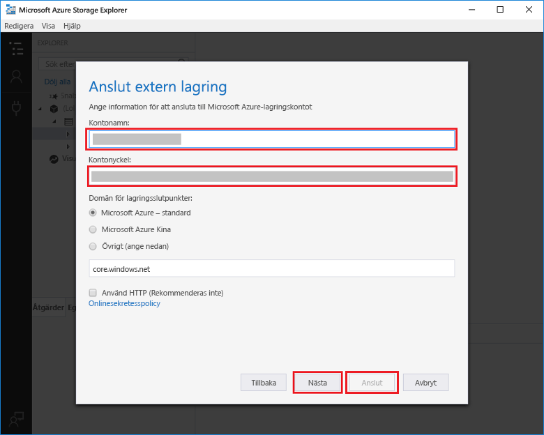

# <a name="add-messages-to-an-azure-storage-queue-using-functions"></a>Lägga till meddelanden i en Azure Storage-kö med Functions

I Azure Functions kan du använda indata- och utdatabindningar för att ansluta till data i en extern tjänst från din funktion på ett deklarativt sätt. I det här avsnittet får du lära dig hur du uppdaterar en befintlig funktion genom att lägga till en utdatabindning som skickar meddelanden till Azure Queue Storage.  


## <a name="prerequisites"></a>Krav 

[!INCLUDE [Previous topics](../../includes/functions-quickstart-previous-topics.md)]

* Installera [Microsoft Azure Storage Explorer](http://storageexplorer.com/).

## <a name="add-binding"></a>Lägga till en utdatabindning
 
1. Expandera både din funktionsapp och din funktion.

2. Välj **Integrera** och **+ Nya utdata**, välj **Azure Queue Storage** och sedan **Välj**.
    
    

3. Använd inställningarna på det sätt som beskrivs i tabellen: 

    

    | Inställning      |  Föreslaget värde   | Beskrivning                              |
    | ------------ |  ------- | -------------------------------------------------- |
    | **Könamn**   | myqueue-items    | Namnet på kön som ska anslutas till i ditt Storage-konto. |
    | **Lagringskontoanslutning** | AzureWebJobStorage | Du kan antingen använda den lagringskontoanslutning som redan används i funktionsappen eller skapa en ny.  |
    | **Meddelandeparameternamn** | outputQueueItem | Namnet på utdatabindningsparametern. | 

4. Klicka på **Spara** för att lägga till bindningen.
 
Nu när du har definierat en utdatabindning måste du uppdatera koden så att bindningen används när meddelanden läggs till i en kö.  

## <a name="update-the-function-code"></a>Uppdatera funktionskoden

1. Välj din funktion så att funktionskoden visas i redigeraren. 

2. För en C#-funktion uppdaterar du funktionsdefinitionen på följande sätt för att lägga till lagringsbindningsparametern **outputQueueItem**. Hoppa över det här steget om du använder en JavaScript-funktion.

    ```cs   
    public static async Task<HttpResponseMessage> Run(HttpRequestMessage req, 
        ICollector<string> outputQueueItem, TraceWriter log)
    {
        ....
    }
    ```

3. Lägg till följande kod i funktionen precis innan metoden returneras. Använd lämpligt kodstycke för det språk som du använder för funktionen.

    ```javascript
    context.bindings.outputQueueItem = "Name passed to the function: " + 
                (req.query.name || req.body.name);
    ```

    ```cs
    outputQueueItem.Add("Name passed to the function: " + name);     
    ```

4. Välj **Spara** för att spara ändringarna.

Värdet som skickades till HTTP-utlösaren ingår i ett meddelande som har lagts till i kön.
 
## <a name="test-the-function"></a>Testa funktionen 

1. Välj **Kör** när kodändringarna har sparats. 

    

2. Kontrollera i loggfilerna att funktionen har slutförts utan fel. En ny kö med namnet **outqueue** skapas i ditt lagringskonto av funktionskörningen när utdatabindningen används för första gången.

Därefter kan du ansluta till ditt lagringskonto och kontrollera den nya kön och meddelandet som du lade till. 

## <a name="connect-to-the-queue"></a>Ansluta till kön

Hoppa över de första tre stegen om du redan har installerat Lagringsutforskaren och anslutit den till ditt lagringskonto.    

1. Välj **Integrera** i funktionen och sedan den nya **Azure Queue Storage**-utdatabindningen. Expandera därefter **Dokumentation**. Kopiera både **kontonamnet** och **kontonyckeln**. Du använder dessa autentiseringsuppgifter för att ansluta till lagringskontot.
 
    

2. Kör verktyget [Microsoft Azure Storage Explorer](http://storageexplorer.com/), klicka på anslutningsikonen till vänster, välj **Use a storage account name and key** (Använd ett kontonamn och en kontonyckel för lagringskontot) och klicka på **Nästa**.

    
    
3. Klistra in **kontonamn** och **kontonyckel** från steg 1 till motsvarande fält och välj sedan **Nästa** och **Anslut**. 
  
    

4. Expandera det anslutna lagringskontot, expandera **Köer** och kontrollera att det finns en kö med namnet **myqueue-items**. Du bör även se ett meddelande som redan finns i kön.  
 
    
 

## <a name="clean-up-resources"></a>Rensa resurser

[!INCLUDE [Next steps note](../../includes/functions-quickstart-cleanup.md)]

## <a name="next-steps"></a>Nästa steg

Du har lagt till en utdatabindning i en befintlig funktion. 

[!INCLUDE [Next steps note](../../includes/functions-quickstart-next-steps.md)]

Mer information om bindning till Queue Storage finns i [Azure Functions Storage queue bindings](functions-bindings-storage-queue.md) (Azure Functions-lagringsköbindningar). 


