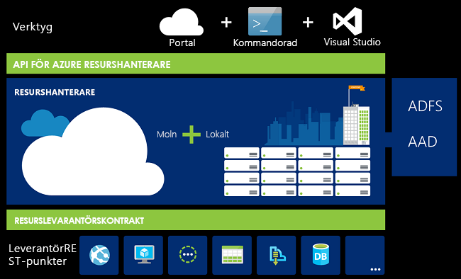
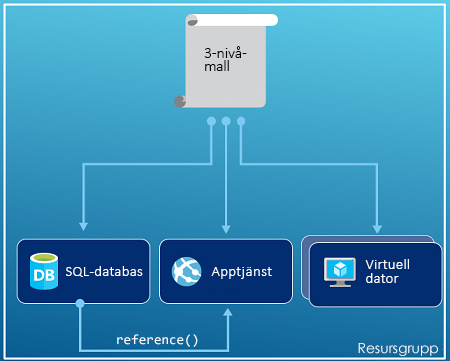
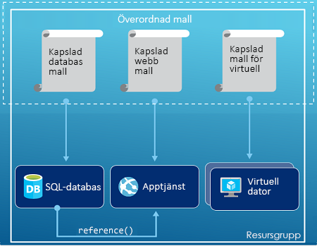
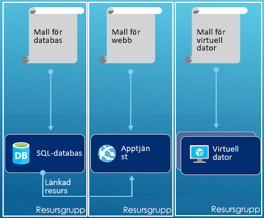

# <a name="azure-resource-manager-overview"></a>Översikt över Azure Resource Manager
Infrastrukturen för ditt program består normalt av många komponenter – kanske en virtuell dator, ett lagringskonto och ett virtuellt nätverk eller en webbapp, en databas, en databasserver och tjänster från tredje part. Du ser inte de här komponenterna som separata entiteter, utan som relaterade delar av samma enhet som är beroende av varandra. Du vill distribuera, hantera och övervaka dem som en grupp. Med Azure Resource Manager kan du arbeta med resurserna i en lösning som en grupp. Du kan distribuera, uppdatera eller ta bort alla resurser i lösningen i en enda, samordnad åtgärd. Du använder en mall för distributionen. Mallen kan användas i olika miljöer, till exempel för testning, mellanlagring och produktion. Resource Manager tillhandahåller säkerhets-, gransknings- och taggningsfunktioner som hjälper dig att hantera dina resurser efter distributionen. 

## <a name="terminology"></a>Terminologi
Om du inte har arbetat med Azure Resource Manager tidigare finns det några termer som kanske är nya för dig.

* **resurs** – Ett hanterbart objekt som är tillgängligt via Azure. Exempel på vanliga resurser är virtuella datorer, lagringskonton, webbappar, databaser och virtuella nätverk, men det finns många fler.
* **resursgrupp** – En behållare som innehåller relaterade resurser för en Azure-lösning. Resursgruppen kan innehålla alla resurser för lösningen, eller endast de resurser som du vill hantera som en grupp. Du bestämmer hur du vill allokera resurser till resursgrupper baserat på vad som är lämpligast för din organisation. Mer information finns i [Resursgrupper](#resource-groups).
* **resursprovider** – En tjänst som tillhandahåller de resurser som du kan distribuera och hantera via Resource Manager. Varje resursprovider tillhandahåller åtgärder som hjälper dig att arbeta med de resurser du distribuerar. Några vanliga resursproviders är Microsoft.Compute som tillhandahåller resursen för virtuella datorer, Microsoft.Storage som tillhandahåller resursen för lagringskonton och Microsoft.Web som tillhandahåller resurser relaterade till webbappar. Mer information finns i [Resursproviders](#resource-providers).
* **Resource Manager-mall** – En JSON-fil (JavaScript Object Notation) som definierar en eller flera resurser som ska distribueras till en resursgrupp. Den definierar även beroendena mellan de distribuerade resurserna. Mallen kan användas för att distribuera resurserna på ett konsekvent sätt och upprepade gånger. Mer information finns i [Malldistribution](#template-deployment).
* **deklarativ syntax** – Syntax som låter dig ange vad du vill skapa utan att du behöver skriva sekvensen med programmeringskommandon för att skapa det. Resource Manager-mallen är ett exempel på deklarativ syntax. I filen definierar du egenskaperna för infrastrukturen som ska distribueras till Azure. 

## <a name="the-benefits-of-using-resource-manager"></a>Fördelarna med att använda Resource Manager
Resource Manager har flera fördelar:

* Du kan distribuera, hantera och övervaka alla resurserna för din lösning som en grupp i stället för att hantera resurserna separat.
* Du kan distribuera lösningen flera gånger genom utvecklingslivscykeln och vara säker på att dina resurser distribueras på ett enhetligt sätt.
* Du kan hantera infrastrukturen med hjälp av deklarativa mallar i stället för skript.
* Du kan definiera beroenden mellan resurser så att de distribueras i rätt ordning.
* Du kan använda åtkomstkontroll för alla tjänster i resursgruppen eftersom rollbaserad åtkomstkontroll (RBAC) är inbyggt i hanteringsplattformen.
* Du kan lägga till taggar för resurser och organisera alla logiskt i din prenumeration.
* Du kan tydliggöra din organisations fakturering genom att visa kostnaderna för en grupp av resurser som delar samma tagg.  

Resource Manager erbjuder ett nytt sätt att distribuera och hantera lösningar. Om du använde den tidigare distributionsmodellen och vill veta mer om ändringarna läser du [Förstå Resource Manager-distribution och klassisk distribution](resource-manager-deployment-model.md).

## <a name="consistent-management-layer"></a>Enhetligt hanteringslager
Resource Manager tillhandahåller ett konsekvent hanteringslager för uppgifter du utför via Azure PowerShell, CLI Azure, Azure Portal, REST API och utvecklingsverktyg. Alla verktyg använder en gemensam uppsättning åtgärder. Du kan använda de verktyg som passar dig bäst och du kan byta fram och tillbaka utan problem. 

Följande bild visar hur alla verktyg interagerar med samma Azure Resource Manager-API. API:et skickar begäranden till Resource Manager-tjänsten, som autentiserar och auktoriserar begäranden. Resource Manager dirigerar sedan begäranden till lämpliga resursleverantörer.



## <a name="guidance"></a>Riktlinjer
Följande rekommendationer hjälper dig att dra full nytta av Resource Manager när du arbetar med dina lösningar.

1. Definiera och distribuera infrastrukturen med den deklarativa syntaxen i Resource Manager-mallarna i stället för med tvingande kommandon.
2. Definiera alla distributions- och konfigurationssteg i mallen. Inga manuella steg ska behövas för att konfigurera lösningen.
3. Kör tvingande kommandon för att hantera resurser, exempelvis för att starta eller stoppa en app eller dator.
4. Ordna resurser med samma livscykel i en resursgrupp. Använd taggar för all annan resursorganisation.

Rekommendationer om mallar finns i [Metodtips för att skapa Azure Resource Manager-mallar](resource-manager-template-best-practices.md).

Vägledning för hur företag kan använda resurshanteraren för att effektivt hantera prenumerationer finns i [Azure enterprise scaffold - förebyggande prenumerationsåtgärder](resource-manager-subscription-governance.md).

## <a name="resource-groups"></a>Resursgrupper
Det finns några viktiga faktorer att tänka på när du definierar en resursgrupp:

1. Alla resurserna i din grupp måste ha samma livscykel. Du distribuerar, uppdaterar och tar bort dem tillsammans. Om en resurs, till exempel en databasserver, behöver finnas i en annan distributionscykel ska den höra till en annan resursgrupp.
2. En enskild resurs kan bara finnas i en resursgrupp.
3. Du kan lägga till eller ta bort en resurs i en resursgrupp när som helst.
4. Du kan flytta en resurs från en resursgrupp till en annan grupp. Mer information finns i [Flytta resurser till en ny resursgrupp eller prenumeration](resource-group-move-resources.md).
5. En resursgrupp kan innehålla resurser som finns i olika regioner.
6. En resursgrupp kan användas för att definiera omfattningen av åtkomstkontrollen för administrativa åtgärder.
7. En resurs kan interagera med resurser i andra resursgrupper. Denna interaktion är vanlig när de två resurserna är relaterade, men inte delar samma livscykel (till exempel webbappar som är anslutna till en databas).

När du skapar en resursgrupp måste du ange en plats för denna resursgrupp. Du kanske undrar, "varför behöver en resursgrupp en plats? Och om resurserna kan ha andra platser än resursgruppen, varför spelar platsen för gruppresursen alls någon roll?" Resursgruppen lagrar metadata om resurserna. När du anger en plats för resursgruppen anger du därför var metadatan ska lagras. På grund av regelefterlevnadsskäl kan du behöva säkerställa att din data lagras inom en viss region.

## <a name="resource-providers"></a>Resursproviders
Varje resursprovider tillhandahåller en uppsättning resurser och åtgärder för arbete i en Azure-tjänst. Om du till exempel vill lagra nycklar och hemligheter arbetar du med resursprovidern **Microsoft.KeyVault**. Den här resursprovidern erbjuder en resurstyp som heter **vaults** (valv) för att skapa nyckelvalvet. 

Namnet på en resurstyp skrivs i formatet: **{resursprovidern}/{resurstypen}**. Till exempel, nyckelvalvtypen är **Microsoft.KeyVault\vaults**.

Innan du börjar distribuera dina resurser bör du ha en bra uppfattning om vilka resursprovidrar som finns. Att känna till namnen på resursprovidrar och resurser gör det lättare för dig att definiera resurser som du vill distribuera till Azure. Du måste också känner till giltiga platser och API-versioner för varje resurstyp. Mer information finns i [Resursproviders och typer](resource-manager-supported-services.md).

## <a name="template-deployment"></a>Malldistribution
Med Resource Manager kan du skapa en mall (i JSON-format) som definierar Azure-lösningens infrastruktur och konfiguration. Genom att använda en mall kan du distribuera lösningen flera gånger under dess livscykel och vara säker på att dina resurser distribueras konsekvent. När du skapar en lösning från portalen innehåller den automatiskt en distributionsmall. Du behöver inte skapa mallen från scratch. I stället kan du börja med mallen för din lösning och anpassa den efter dina specifika behov. Du kan hämta en mall för en befintlig resursgrupp antingen genom att antingen exportera resursgruppens aktuella tillstånd eller genom att visa mallen som används för en viss distribution. Att granska den [exporterade mallen](resource-manager-export-template.md) är ett bra sätt att lära sig mer om mallsyntaxen.

Information om mallformatet och hur du skapar det finns i [Skapa din första Azure Resource Manager-mall](resource-manager-create-first-template.md). JSON-syntaxen för resurstyper finns i [Define resources in Azure Resource Manager templates](/azure/templates/) (Definiera resurser i Azure Resource Manager-mallar).

Resource Manager bearbetar mallen som vilken annan begäran som helst (se bilden för [Konsekvent hanteringslager](#consistent-management-layer)). Den tolkar mallen och konverterar dess syntax till REST API-åtgärder för lämpliga resursleverantörer. Till exempel när Resource Manager tar emot en mall med följande resursdefinition:

```json
"resources": [
  {
    "apiVersion": "2016-01-01",
    "type": "Microsoft.Storage/storageAccounts",
    "name": "mystorageaccount",
    "location": "westus",
    "sku": {
      "name": "Standard_LRS"
    },
    "kind": "Storage",
    "properties": {
    }
  }
]
```

Den konverterar definitionen till följande REST API-åtgärd, som skickas till resursprovidern Microsoft.Storage:

```HTTP
PUT
https://management.azure.com/subscriptions/{subscriptionId}/resourceGroups/{resourceGroupName}/providers/Microsoft.Storage/storageAccounts/mystorageaccount?api-version=2016-01-01
REQUEST BODY
{
  "location": "westus",
  "properties": {
  }
  "sku": {
    "name": "Standard_LRS"
  },   
  "kind": "Storage"
}
```

Det är helt upp till dig hur du definierar mallar och resursgrupper och hur du vill hantera din lösning. Du kan till exempel distribuera programmet i tre nivåer via en enda mall till en enda resursgrupp.



Du behöver dock inte definiera hela infrastrukturen i en enda mall. Ofta är det praktiskt att dela in dina distributionskrav i en uppsättning riktade mallar för specifika ändamål. Du kan enkelt återanvända dessa mallar för olika lösningar. Om du vill distribuera en viss lösning skapar du en huvudmall som länkar alla nödvändiga mallar. Följande bild visar hur du distribuerar en lösning i tre nivåer via en överordnad mall som innehåller tre kapslade mallar.



Om du tänker dig att dina nivåer har separata livscykler kan du distribuera dina tre nivåer till separata resursgrupper. Observera att resurserna fortfarande kan länkas till resurser i andra resursgrupper.



Fler förslag på hur du kan utforma dina mallar finns i [Metodtips för att utforma Azure Resource Manager-mallar](best-practices-resource-manager-design-templates.md). Mer information om kapslade mallar finns i [Använda länkade mallar med Azure Resource Manager](resource-group-linked-templates.md).

En serie i fyra delar om att automatisera distributionen finns i [Automatisera programdistributioner till virtuella datorer i Azure](../virtual-machines/windows/dotnet-core-1-landing.md?toc=%2fazure%2fvirtual-machines%2fwindows%2ftoc.json). Den här serien täcker programarkitektur, åtkomst och säkerhet, tillgänglighet och skala samt programdistribution.

Azure Resource Manager analyserar beroenden för att säkerställa att resurserna skapas i rätt ordning. Om en resurs bygger på ett värde från en annan resurs (till exempel en virtuell dator som behöver ett lagringskonto för diskar) anger du ett beroende. Mer information finns i [Definiera beroenden i Azure Resource Manager-mallar](resource-group-define-dependencies.md).

Du kan också använda mallen för uppdateringar av infrastrukturen. Du kan till exempel lägga till en resurs till din lösning och lägga till konfigurationsregler för resurser som redan har distribuerats. Om mallen används för att skapa en resurs men resursen redan finns utför Azure Resource Manager en uppdatering i stället för att skapa en ny tillgång. Azure Resource Manager uppdaterar den befintliga tillgången till samma tillstånd som den skulle ha som ny.  

Resource Manager tillhandahåller tillägg för scenarier då du behöver ytterligare åtgärder, t.ex. för att installera viss programvara som inte ingår i installationsprogrammet. Om du redan använder en konfigurationshanteringstjänst, t.ex. DSC, Chef eller Puppet, kan du fortsätta arbeta med den tjänsten genom att använda tillägg. Information om tillägg för virtuella datorer finns i [Om tillägg och funktioner för virtuella datorer](../virtual-machines/windows/extensions-features.md?toc=%2fazure%2fvirtual-machines%2fwindows%2ftoc.json). 

Slutligen blir mallen en del av källkoden för din app. Du kan checka in den i databasen för din källkod och uppdatera den i takt med att appen utvecklas. Du kan redigera mallen från Visual Studio.

När du har definierat mallen är du redo att distribuera resurser till Azure. Information om kommandon för att distribuera resurserna finns i:

* [Distribuera resurser med Resource Manager-mallar och Azure PowerShell](resource-group-template-deploy.md)
* [Distribuera resurser med Resource Manager-mallar och Azure CLI](resource-group-template-deploy-cli.md)
* [Distribuera resurser med Resource Manager-mallar och Azure Portal](resource-group-template-deploy-portal.md)
* [Distribuera resurser med Resource Manager-mallar och Resource Manager REST API](resource-group-template-deploy-rest.md)

## <a name="tags"></a>Taggar
Resource Manager innehåller en taggningsfunktion som du kan använda för att kategorisera resurser utifrån dina hanterings- eller faktureringskrav. Använd taggar om du har en komplex samling resursgrupper och resurser och behöver visualisera dessa tillgångar på ett sätt som passar dig. Du kan till exempel tagga resurser som har en liknande roll i organisationen eller som tillhör samma avdelning. Utan taggar kan användare i din organisation skapa flera resurser som kan vara svåra att identifiera och hantera längre fram. Du kan till exempel vilja ta bort alla resurser för ett visst projekt. Om de här resurserna inte är taggade för projektet måste du hitta dem manuellt. Taggning kan vara ett bra sätt att minska onödiga kostnader i din prenumeration. 

Resurser behöver inte finnas i samma resursgrupp för att dela en tagg. Du kan skapa din egen taggtaxonomi för att försäkra dig om att alla användare i organisationen använder samma taggar och att de inte av misstag använder varianter (till exempel ”avd” i stället för ”avdelning”).

I följande exempel visas en tagg som tillämpas på en virtuell dator.

```json
"resources": [    
  {
    "type": "Microsoft.Compute/virtualMachines",
    "apiVersion": "2015-06-15",
    "name": "SimpleWindowsVM",
    "location": "[resourceGroup().location]",
    "tags": {
        "costCenter": "Finance"
    },
    ...
  }
]
```

Om du vill hämta alla resurser med ett visst taggvärde använder du följande PowerShell-cmdlet:

```powershell
Find-AzureRmResource -TagName costCenter -TagValue Finance
```

Alternativt kan du använda följande Azure CLI 2.0-kommando:

```azurecli
az resource list --tag costCenter=Finance
```

Du kan också visa taggade resurser via Azure Portal.

[Användningsrapporten](../billing/billing-understand-your-bill.md) för din prenumeration innehåller taggnamn och -värden, vilket betyder att du kan dela upp kostnader efter taggar. Mer information om taggar finns i [Ordna dina Azure-resurser med hjälp av taggar](resource-group-using-tags.md).

## <a name="access-control"></a>Åtkomstkontroll
Med Resource Manager kan du kontrollera vem som har åtkomst till specifika åtgärder för din organisation. Rollbaserad åtkomstkontroll (RBAC) integreras i hanteringsplattformen och åtkomstkontrollen tillämpas på alla tjänster i resursgruppen. 

Det finns två huvudsakliga begrepp som du behöver förstå när du arbetar med rollbaserad åtkomstkontroll:

* Rolldefinitioner – beskriver en uppsättning behörigheter och kan användas i många tilldelningar.
* Rolltilldelningar – associera en definition med en identitet (användare eller grupp) för en viss omfattning (prenumeration, resursgrupp eller resurs). Tilldelningen ärvs av underliggande omfattningar.

Du kan lägga till användare till fördefinierade plattformsroller och resursspecifika roller. Du kan till exempel dra nytta av den fördefinierade rollen som kallas Läsare och som låter användare visa resurser, men inte ändra dem. Du lägger till användare i en organisation som behöver den här typen av åtkomst till rollen Läsare och sedan tillämpar du rollen på prenumerationen, resursgruppen eller resursen.

Azure tillhandahåller följande fyra plattformsroller:

1. Ägare – kan hantera allt, inklusive åtkomst
2. Deltagare – kan hantera allt förutom åtkomst
3. Läsare – kan visa allt, men inte göra några ändringar
4. Administratör för användaråtkomst – kan hantera användarnas åtkomst till Azure-resurser

Azure tillhandahåller också flera resursspecifika roller. Några vanliga är:

1. Virtuell datordeltagare – kan hantera, men inte bevilja åtkomst till, virtuella datorer, och kan heller inte hantera virtuella nätverks- eller lagringskonton som de är anslutna till
2. Nätverksdeltagare – kan hantera alla nätverksresurser, men inte bevilja åtkomst till dem
3. Lagringskontodeltagare – kan hantera lagringskonton, men inte bevilja åtkomst till dem
4. SQL Server-deltagare – kan hantera SQL-servrar och databaser, men inte deras säkerhetsrelaterade principer
5. Webbplatsdeltagare – kan hantera webbplatser, men inte webbplaner som de är anslutna till

En fullständig lista över roller och tillåtna åtgärder finns i [RBAC: inbyggda roller](../active-directory/role-based-access-built-in-roles.md). Mer information om rollbaserad åtkomstkontroll finns i [Rollbaserad åtkomst i Azure](../active-directory/role-based-access-control-configure.md). 

I vissa fall kanske du vill köra kod eller skript som använder resurser, men inte genom en användares autentiseringsuppgifter. I stället skapar du en identitet som kallas för ”tjänstens huvudnamn” för programmet och tilldelar tjänstens huvudnamn lämplig roll. Med Resource Manager kan du skapa autentiseringsuppgifter för programmet och programmässigt autentisera programmet. Du kan läsa mer om hur du skapar ett huvudnamn för tjänsten i följande avsnitt:

* [Använd Azure PowerShell för att skapa ett huvudnamn för tjänsten för resursåtkomst](resource-group-authenticate-service-principal.md)
* [Använd Azure CLI för att skapa ett huvudnamn för tjänsten för resursåtkomst](resource-group-authenticate-service-principal-cli.md)
* [Använd portalen för att skapa Azure Active Directory-program och ett huvudnamn för tjänsten som får åtkomst till resurser](resource-group-create-service-principal-portal.md)

Du kan också låsa viktiga resurser explicit för att förhindra att användare tar bort eller ändrar dem. Mer information finns i [Låsa resurser med Azure Resource Manager](resource-group-lock-resources.md).

## <a name="activity-logs"></a>Aktivitetsloggar
Resource Manager loggar alla åtgärder som skapar, ändrar eller tar bort en resurs. Du kan använda aktivitetsloggarna för att hitta ett fel när du felsöker eller övervakar hur en användare i organisationen ändrat en resurs. Om du vill visa loggarna väljer du **Aktivitetsloggar** på bladet **Inställningar** för en resursgrupp. Du kan filtrera loggarna med många olika värden, inklusive vilken användare som initierade åtgärden. Information om hur du arbetar med aktivitetsloggar finns i [View activity logs to manage Azure resources](resource-group-audit.md) (Visa aktivitetsloggar för att hantera Azure-resurser).

## <a name="customized-policies"></a>Anpassade principer
Med Resource Manager kan du hantera resurser genom att skapa anpassade principer. De typer av principer som du skapar kan inkludera olika scenarier. Du kan tillämpa en namngivningskonvention på resurser, begränsa vilka typer och instanser av resurser som kan distribueras eller begränsa vilka regioner som kan vara värd för en viss typ av resurs. Du kan kräva ett taggvärde på resurser för att organisera faktureringen efter avdelningar. Du skapar principer för att minska kostnaderna och upprätthålla konsekvensen i din prenumeration. 

Du definierar principer med JSON och sedan använder du dessa principer antingen i hela prenumerationen eller i en resursgrupp. Principer skiljer sig från den rollbaserade åtkomstkontrollen eftersom de tillämpas på resurstyper.

I följande exempel visas en princip som säkerställer taggkonsekvens genom att ange att alla resurser som innehåller en costCenter-tagg.

```json
{
  "if": {
    "not" : {
      "field" : "tags",
      "containsKey" : "costCenter"
    }
  },
  "then" : {
    "effect" : "deny"
  }
}
```

Det finns många fler typer av principer som du kan skapa. Mer information finns i [Hantera resurser och kontrollera åtkomsten med hjälp av principer](resource-manager-policy.md).

## <a name="sdks"></a>SDK:er
Azure-SDK:er är tillgängliga för flera språk och plattformar. Var och en av dessa språkimplementeringar är tillgängliga via pakethanteraren i respektive implementerings ekosystem och på GitHub.

Här är våra databaser för SDK med öppen källkod. Vi tar gärna emot feedback, information om problem och pull-förfrågningar.

* [Azure SDK för .NET](https://github.com/Azure/azure-sdk-for-net)
* [Azures hanteringsbibliotek för Java](https://github.com/Azure/azure-sdk-for-java)
* [Azure SDK för Node.js](https://github.com/Azure/azure-sdk-for-node)
* [Azure SDK för PHP](https://github.com/Azure/azure-sdk-for-php)
* [Azure SDK för Python](https://github.com/Azure/azure-sdk-for-python)
* [Azure SDK för Ruby](https://github.com/Azure/azure-sdk-for-ruby)

Information om hur du använder dessa språk med dina resurser finns i:

* [Azure för .NET-utvecklare](/dotnet/azure/?view=azure-dotnet)
* [Azure för Java-utvecklare](/java/azure/)
* [Azure för Node.js-utvecklare](/nodejs/azure/)
* [Azure för Python-utvecklare](/python/azure/)

> [!NOTE]
> Om ett SDK inte tillhandahåller de funktioner som du behöver kan du även anropa [Azure REST-API](https://docs.microsoft.com/rest/api/resources/) direkt.
> 
> 

## <a name="next-steps"></a>Nästa steg
* En enkel introduktion till mallar finns i [Exportera en Azure Resource Manager-mall från befintliga resurser](resource-manager-export-template.md).
* Mer omfattande anvisningar om hur du skapar en mall finns i [Skapa din första Azure Resource Manager-mall](resource-manager-create-first-template.md).
* Information om de funktioner som du kan använda i en mall finns i [Mallfunktioner](resource-group-template-functions.md)
* Information om hur du använder Visual Studio med Resource Manager finns i [Skapa och distribuera Azure-resursgrupper via Visual Studio](vs-azure-tools-resource-groups-deployment-projects-create-deploy.md).

Här är en videodemonstration av den här översikten:

>[!VIDEO https://channel9.msdn.com/Blogs/Azure-Documentation-Shorts/Azure-Resource-Manager-Overview/player]


[powershellref]: https://docs.microsoft.com/powershell/resourcemanager/azurerm.resources/v3.2.0/azurerm.resources

