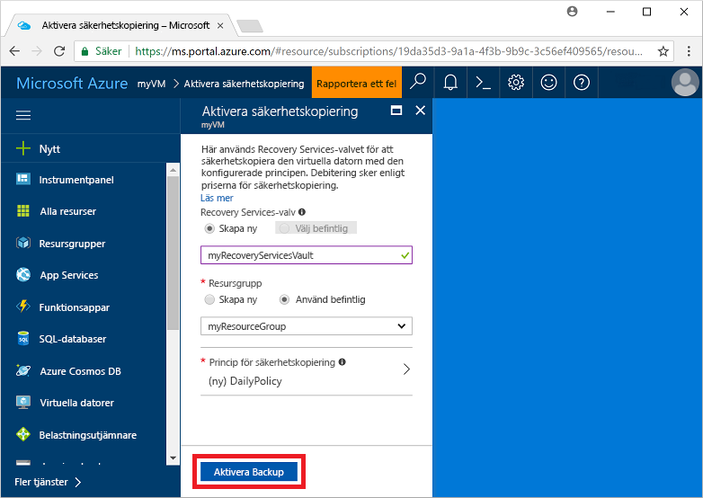
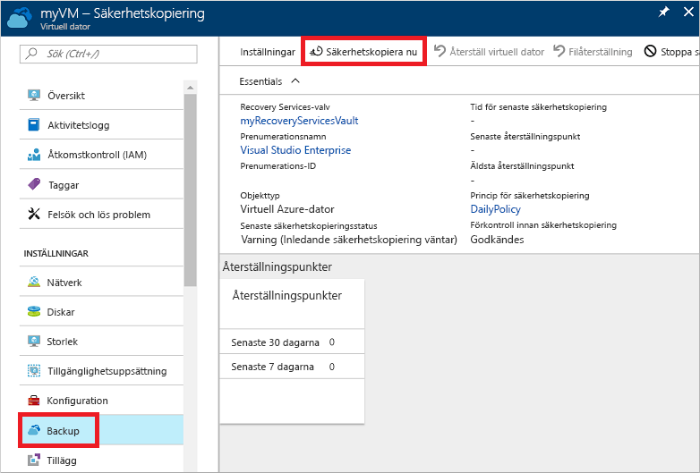
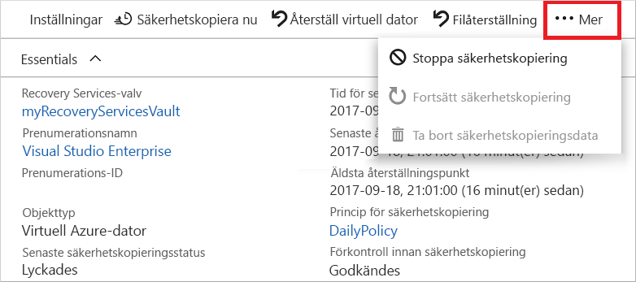

# Säkerhetskopiera en virtuell dator i Azure
Du kan skapa Azure-säkerhetskopior via Azure Portal. Med den här metoden får du ett webbläsarbaserat användargränssnitt för att skapa och konfigurera Azure-säkerhetskopior och alla relaterade resurser. Du kan skydda dina data genom att säkerhetskopiera med jämna mellanrum. Med Azure Backup skapas återställningspunkter som kan lagras i geo-redundanta återställningsvalv. Den här artikeln beskriver hur du säkerhetskopierar en virtuell dator med Azure Portal. 

I den här snabbstarten sker säkerhetskopieringen på en befintlig virtuell Azure-dator. Om du behöver skapa en virtuell dator kan du [skapa en virtuell dator med Azure Portal](../virtual-machines/windows/quick-create-portal.md).

## Logga in på Azure

Logga in på Azure Portal på http://portal.azure.com.

## Välj en virtuell dator som du vill säkerhetskopiera
Skapa en enkel schemalagd daglig säkerhetskopiering till ett Recovery Services-valv. 

1. Välj **Virtuella datorer** på menyn till vänster. 
2. Välj en virtuell dator som du vill säkerhetskopiera i listan. Om du skapade en virtuell dator med exempelkommandona i snabbstarten heter den virtuella datorn *myVM*, och resursgruppen som den finns i *myResourceGroup*.
3. Välj **Säkerhetskopiering** i avsnittet **Åtgärder**. Fönstret **Aktivera säkerhetskopiering** öppnas.

## Aktivera säkerhetskopiering på en virtuell dator
Recovery Services-valvet är en logisk behållare som lagrar säkerhetskopierade data för varje skyddad resurs, till exempel virtuella Azure-datorer. När säkerhetskopieringsjobbet för en skyddad resurs körs, skapas en återställningspunkt i Recovery Services-valvet. Du kan sedan använda någon av dessa återställningspunkter för att återställa data till en given tidpunkt.

1. Välj **Skapa nytt** och ange ett namn för det nya valvet, till exempel *myRecoveryServicesVault*.
2. Välj **Använd befintlig** (om det inte redan har markerats) och sedan resursgruppen för din virtuella dator på den nedrullningsbara menyn.

    

    Valvet är som standard inställt på geo-redundant lagring. Den här lagringsredundansnivån ger ett extra skydd genom att dina säkerhetskopierade data replikeras till en sekundär Azure-region som ligger hundratals kilometer från den primära regionen.

    Du skapar och använder principer för att definiera när ett säkerhetskopieringsjobb ska köras och hur länge återställningspunkterna ska sparas. Med standardskyddsprincipen körs ett säkerhetskopieringsjobb varje dag och återställningspunkterna sparas i 30 dagar. Du kan använda standardvärdena för att snabbt skydda din virtuella dator. 

3. Om du godkänner standardvärdena för säkerhetskopieringsprincipen väljer du **Aktivera säkerhetskopiering**.

Det tar en stund att skapa Recovery Services-valvet.

## Starta ett säkerhetskopieringsjobb
Du kan starta en säkerhetskopiering nu i stället för att vänta tills jobbet körs vid standardprincipens schemalagda tidpunkt. När det första säkerhetskopieringsjobbet körs skapas en fullständig återställningspunkt. Vid varje säkerhetskopiering, efter den första säkerhetskopieringen, skapas inkrementella återställningspunkter. Inkrementella återställningspunkter är lagrings- och tidseffektiva eftersom de bara överför de ändringar som gjorts sedan den senaste säkerhetskopieringen.

1. Välj **Säkerhetskopiera nu** i fönstret **Säkerhetskopiering**.

    

2. Om du vill godkänna bevarandeprincipen för säkerhetskopiering på 30 dagar lämnar du standarddatumet i **Behåll säkerhetskopian till** som det är. Välj **Säkerhetskopiera** för att starta jobbet.

## Övervaka säkerhetskopieringen
I fönstret **Säkerhetskopiering** för din virtuella dator visas status för säkerhetskopieringen och antal slutförda återställningspunkter. När en säkerhetskopiering av den virtuella datorn är klar visas information om **tid för senaste säkerhetskopiering**, **senaste återställningspunkt** och **äldsta återställningspunkt** till höger i fönstret **Översikt**.

## Rensa distribution
När det inte längre behövs kan du inaktivera skyddet av den virtuella datorn, ta bort återställningspunkterna och Recovery Services-valvet och sedan ta bort resursgruppen och de relaterade virtuella datorresurserna

Om du tänker gå vidare till en säkerhetskopieringskurs som förklarar hur du återställer data för din virtuella dator kan du hoppa över stegen i det här avsnittet och gå till [Nästa steg](#next-steps).

1. Välj alternativet **Säkerhetskopiering** för din virtuella dator.

2. Välj **...Mer** om du vill visa ytterligare alternativ och välj sedan **Avbryt säkerhetskopiering**.

    

3. Välj **Ta bort säkerhetskopieringsdata** på den nedrullningsbara menyn.

4. Ange namnet på den virtuella datorn, till exempel *myVM*, i dialogrutan **Type the name of the Backup item** (Skriv namnet på säkerhetskopieringsobjektet). Välj **Avbryt säkerhetskopiering**

    När säkerhetskopieringen av den virtuella datorn har avbrutits och återställningspunkterna har tagits bort, kan du ta bort resursgruppen. Om du använde en befintlig virtuell dator kanske du vill ha kvar resursgruppen och den virtuella datorn.

5. Välj **Resursgrupper** på den vänstra menyn. 
6. Välj din resursgrupp i listan. Om skapade en virtuell dator med exempelkommandona i snabbstarten heter resursgruppen *myResourceGroup*.
7. Välj **Ta bort resursgrupp**. Ange namnet på resursgruppen och välj sedan **Ta bort** för att bekräfta.

    

## Nästa steg
I den här snabbstarten har du skapat ett Recovery Services-valv, aktiverat skydd på en virtuell dator och skapat den första återställningspunkten. Om du vill lära dig mer om Azure Backup och Recovery Services kan du gå vidare till självstudiekurserna.

> [!div class="nextstepaction"]
> [Säkerhetskopiera flera virtuella Azure-datorer](./tutorial-backup-vm-at-scale.md)
