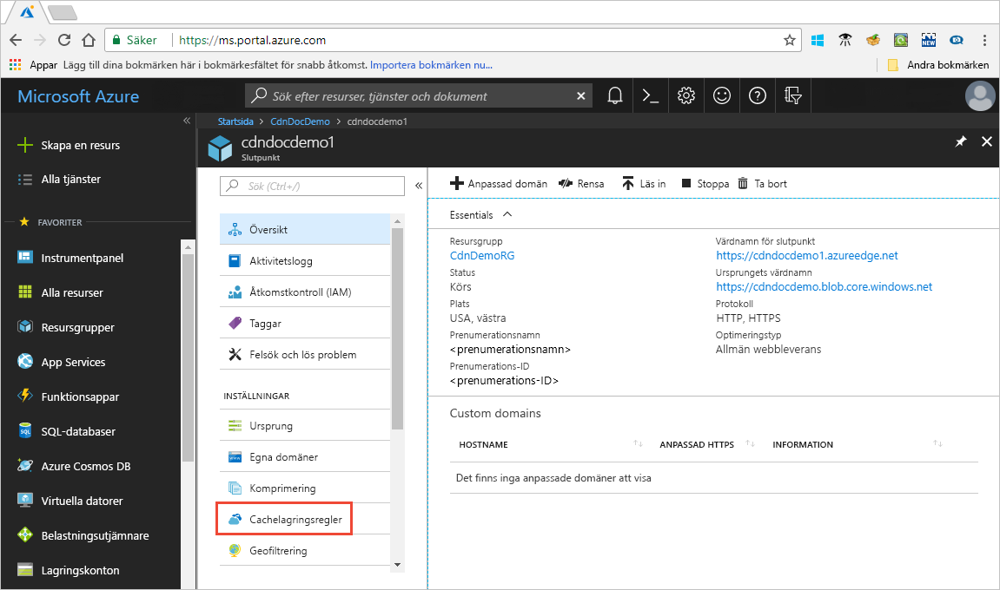

# Kontrollen Azure CDN cachelagring av frågesträngar med cachelagring regler

> [!NOTE] 
> Regler för cachelagring är bara tillgängliga för **Azure CDN Standard från Verizon** och **Azure CDN Standard från Akamai** profiler. För **Azure CDN Premium från Verizon** profiler, måste du använda den [Azure CDN regelmotor](cdn-rules-engine.md) i den **hantera** portalen för liknande funktionalitet.
 
Azure Content Delivery Network (CDN) finns två sätt att styra hur dina filer cachelagras: 

- Cachelagring regler: den här artikeln beskriver hur du kan använda innehållsleveransnätverk (CDN) cachelagring regler för att ange eller ändra standardbeteendet cache giltighetstid både globalt och med anpassade villkor, till exempel ett URL-sökväg och filnamn tillägg. Azure CDN har två typer av cachelagringsregler:

   - Globala cachelagringsregler: Du kan ange en regel för globala cachelagringsregler för varje slutpunkt i din profil, vilket påverkar alla förfrågningar till slutpunkten. Den globala cachelagringsregeln åsidosätter eventuella huvuden för HTTP-cachedirektiv, om angivna.

   - Anpassade cachelagringsregler: Du kan ange en eller flera anpassade cachelagringsregler för varje slutpunkt i din profil. Anpassade cachelagringsregler matchar specifika sökvägar och filnamnstillägg, bearbetas i ordning och åsidosätter den globala cacheregeln om sådan finns. 

- Cachelagring av frågesträngar i frågan: du kan ändra hur Azure CDN behandlar cachelagring för begäranden med frågesträngar. Mer information finns i [kontroll Azure CDN cachelagring av frågesträngar med frågesträngar](cdn-query-string.md). Om filen inte är Cacheable ställs har frågesträngen cachelagring inställningen ingen effekt, baserat på cachelagring regler och standardbeteenden för CDN.

Information om standard cachelagring direktivet sidhuvuden och funktionssätt för cachelagring finns [hur cachelagring fungerar](cdn-how-caching-works.md). 

## Åtkomst till Azure CDN cachelagring regler

1. Öppna Azure portal, Välj en CDN-profil och sedan väljer du en slutpunkt.

2. I det vänstra fönstret under inställningar, väljer du **Cachelagringsregler**.

   

   Sidan **Cachelagringsregler** visas.

   

## Inställningar för cachelagring beteende
För global och anpassade cachelagring regler, kan du ange följande **cachelagring av frågesträngar** inställningar:

- **Kringgå cache**: cachelagra inte och ignorera angivna ursprung cache-direktiv huvuden.

- **Åsidosätt**: ignorera angivna ursprung cache-direktiv huvuden; Använd angivna cachelagringens varaktighet i stället.

- **Ange om de saknas**: Kontrollera om ursprung cache-direktiv sidhuvud, om sådana finns; annars använder angivna cachelagringens varaktighet.

## Giltighetstid för cache
Du kan ange cache giltighetstiden för global och anpassade cachelagring regler, i dagar, timmar, minuter och sekunder:

- För den **åsidosätta** och **om saknas** **cachelagring av frågesträngar** inställningar, giltig cache varaktigheter intervallet mellan 0 sekunder och 366 dagar. För ett värde av 0 sekunder CDN cachelagrar innehållet, men måste verifiera varje begäran med den ursprungliga servern.

- För den **kringgå cache** inställningen cachelagringens varaktighet automatiskt till 0 sekunder och kan inte ändras.

## Anpassade cachelagringsregler matchar villkor

Två matchar villkor är tillgängliga för anpassade cache regler:
 
- **Sökvägen**: det här tillståndet matchar sökvägen för URL-Adressen, exklusive domännamnet och stöder jokertecknet (\*). Till exempel _/myfile.html_, _/min/mappen / *_, och _/my/images/*.jpg_. Den maximala längden är 260 tecken.

- **Tillägget**: det här tillståndet matchar filnamnstillägget för den begärda filen. Du kan ange en lista över kommaavgränsade filnamnstillägg som ska matcha. Till exempel _.jpg_, _.mp3_, eller _.png_. Det maximala antalet tillägg är 50 och det maximala antalet tecken per tillägget är 16. 

## Bearbetningsordningen för globala och anpassad regel
Global och anpassade cachelagring regler bearbetas i följande ordning:

- Globala cachelagring regler företräde framför CDN cachelagring standardbeteendet (HTTP-huvud för cache-direktiv inställningar). 

- Anpassade regler för cachelagring företräde framför globala cachelagring regler, där de tillämpas. Anpassade cachelagring regler bearbetas i ordning uppifrån och ned. Det vill säga om en begäran matchar bägge dessa villkor, åsidosätter regler längst ned i listan regler överst i listan. Därför ska du placera särskilda regler längst ned i listan.

**Exempel**:
- Globala cacheregeln: 
   - Cachelagring av frågesträngar: **åsidosätta**
   - Cachelagra giltighetstiden: 1 dag

- Anpassad cachelagring regel #1:
   - Matcha villkor: **sökväg**
   - Matcha värden:   _/home / *_
   - Cachelagring av frågesträngar: **åsidosätta**
   - Cachelagra giltighetstiden: 2 dagar

- Anpassad cachelagring regeln #2:
   - Matcha villkor: **tillägg**
   - Matcha värden: _.html_
   - Cachelagring av frågesträngar: **om saknas**
   - Cachelagra giltighetstiden: 3 dagar

När dessa regler är inställda, en begäran om  _&lt;slutpunktens värdnamn&gt;_.azureedge.net/home/index.html utlösare anpassade cachelagring regel #2, som har angetts till: **om saknas** och 3 dagar. Därför, om den *index.html* filen har `Cache-Control` eller `Expires` HTTP-huvuden som de är hanteras; annars, om dessa huvuden inte har angetts filen lagras i 3 dagar.

> [!NOTE] 
> Filer som cachelagras innan en ändring för regeln behåller sitt ursprung cache-inställningen för varaktighet. Om du vill återställa sina cache varaktighet, måste du [Rensa filen](cdn-purge-endpoint.md). 
>
> Ändringar av Azure CDN-konfiguration kan ta lite tid att spridas via nätverket: 
> - För **Azure CDN Standard från Akamai**-profiler slutförs spridningen vanligtvis inom en minut. 
> - För **Azure CDN Standard från Verizon** profiler, spridningen vanligtvis är klar på 10 minuter.  
>

## Se också

- [Så här fungerar cachelagring](cdn-how-caching-works.md)
- [Självstudie: Konfigurera Azures CDN-cachelagringsregler](cdn-caching-rules-tutorial.md)
