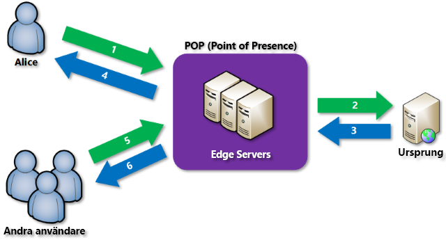

# Översikt över Azure CDN (Content Delivery Network)
> [!NOTE]
> Det här dokumentet beskriver vad Azure CDN (Content Delivery Network) är och hur det fungerar samt funktionerna i respektive Azure CDN-produkt.  Om du vill hoppa över den här informationen och gå direkt till självstudiekursen om hur du skapar en CDN-slutpunkt läser du [Använda Azure CDN](cdn-create-new-endpoint.md).  Om du vill visa en lista över aktuella CDN-nodplatser läser du [POP-platser för Azure CDN](cdn-pop-locations.md).
> 
> 

Azure CDN (Content Delivery Network) cachelagrar statiskt webbinnehåll på strategiskt placerade platser för att leverera innehåll till användarna med maximalt datagenomflöde.  CDN förser utvecklare med en global lösning för innehållsleverans med hög bandbredd där innehållet cachelagras på fysiska noder i hela världen. 

Här är några exempel på fördelarna med att använda CDN för att cachelagra webbplatstillgångar:

* Bättre prestanda och upplevelse för slutanvändarna, särskilt när de använder program där flera turer krävs för att läsa in innehållet.
* Skalning för effektiv hantering av plötsliga belastningstoppar, t.ex. i början av en produktlansering.
* Genom att distribuera användarförfrågningar och hämta innehåll från edge-servrar skickas mindre trafik till ursprunget.

## Hur det fungerar

1. En användare (Alice) begär en fil (även kallad tillgång eller resurs) med hjälp av en URL med ett särskilt domännamn, t.ex. `<endpointname>.azureedge.net`.  DNS omdirigerar begäran till den bästa tillgängliga POP-platsen (Point-of-Presence).  Detta är vanligtvis den POP-plats som ligger närmast användaren geografiskt sett.
2. Om filen inte finns i cacheminnet på edge-servrarna på POP-platsen begär edge-servern filen från ursprunget.  Ursprunget kan vara ett Azure Web Apps-, Azure Cloud Services- eller Azure Storage-konto eller en offentligt tillgänglig webbserver.
3. Ursprunget returnerar filen till edge-servern, inklusive valfria HTTP-sidhuvuden som beskriver filens TTL (Time-To-Live).
4. Edge-servern cachelagrar filen och returnerar den till användaren som ursprungligen begärde den (Alice).  Filen förblir cachelagrad på edge-servern tills TTL-perioden upphör.  Om ursprunget inte angav någon TTL är standardvärdet sju dagar.
5. Fler användare kan begära samma fil med samma URL och kan också dirigeras till samma POP.
6. Om filens TTL inte har gått ut returnerar edge-servern filen från cachen.  Detta resulterar i en snabbare och mer responsiv användarupplevelse.

## Funktioner i Azure CDN
Det finns tre Azure CDN-produkter:  **Azure CDN Standard från Akamai**, **Azure CDN Standard från Verizon** och **Azure CDN Premium från Verizon**.  I följande tabell ser du vilka funktioner som är tillgängliga med respektive produkt.

|  | Standard Akamai | Standard Verizon | Premium Verizon |
| --- | --- | --- | --- |
| &nbsp;&nbsp;&nbsp;&nbsp;&nbsp;&nbsp;&nbsp; __Prestanda och optimering__ |
| [Acceleration av dynamisk webbplats](https://docs.microsoft.com/azure/cdn/cdn-dynamic-site-acceleration) | **&#x2713;**  | **&#x2713;** | **&#x2713;** |
| &nbsp;&nbsp;&nbsp;&nbsp;&nbsp;[Acceleration av dynamisk webbplats – adaptiv bildkomprimering](https://docs.microsoft.com/azure/cdn/cdn-dynamic-site-acceleration#adaptive-image-compression-akamai-only) | **&#x2713;**  |  |  |
| &nbsp;&nbsp;&nbsp;&nbsp;&nbsp;[Acceleration av dynamisk webbplats – förhämtning av objekt](https://docs.microsoft.com/azure/cdn/cdn-dynamic-site-acceleration#object-prefetch-akamai-only) | **&#x2713;**  |  |  |
| [Optimering av videoströmning](https://docs.microsoft.com/azure/cdn/cdn-media-streaming-optimization) | **&#x2713;**  | \* |  \* |
| [Optimering av stora filer](https://docs.microsoft.com/azure/cdn/cdn-large-file-optimization) | **&#x2713;**  | \* |  \* |
| [Global serverbelastningsutjämning (GSLB)](https://docs.microsoft.com/azure/traffic-manager/traffic-manager-load-balancing-azure) |**&#x2713;** |**&#x2713;** |**&#x2713;** |
| [Snabbrensning](cdn-purge-endpoint.md) |**&#x2713;** |**&#x2713;** |**&#x2713;** |
| [Inläsning av tillgångar i förväg](cdn-preload-endpoint.md) | |**&#x2713;** |**&#x2713;** |
| [Cachelagring av frågesträngar](cdn-query-string.md) |**&#x2713;** |**&#x2713;** |**&#x2713;** |
| Dual stack-IPv4/IPv6 |**&#x2713;** |**&#x2713;** |**&#x2713;** |
| [Stöd för HTTP/2](cdn-http2.md) |**&#x2713;** |**&#x2713;** |**&#x2713;** |
| &nbsp;&nbsp;&nbsp;&nbsp;&nbsp;&nbsp;&nbsp; __Säkerhet__ |
| Stöd för HTTPS med CDN-slutpunkt |**&#x2713;** |**&#x2713;** |**&#x2713;** |
| [Egen domän-HTTPS](cdn-custom-ssl.md) | |**&#x2713;** |**&#x2713;** |
| [Stöd för anpassade domännamn](cdn-map-content-to-custom-domain.md) |**&#x2713;** |**&#x2713;** |**&#x2713;** |
| [Geo-filtrering](cdn-restrict-access-by-country.md) |**&#x2713;** |**&#x2713;** |**&#x2713;** |
| [Tokenautentisering](cdn-token-auth.md)|  |  |**&#x2713;**| 
| [DDOS-skydd](https://www.us-cert.gov/ncas/tips/ST04-015) |**&#x2713;** |**&#x2713;** |**&#x2713;** |
| &nbsp;&nbsp;&nbsp;&nbsp;&nbsp;&nbsp;&nbsp; __Analyser och rapporter__ |
| [Grundläggande analys](cdn-analyze-usage-patterns.md) | **&#x2713;** |**&#x2713;** |**&#x2713;** |
| [Avancerade HTTP-rapporter](cdn-advanced-http-reports.md) | | |**&#x2713;** |
| [Realtidsstatistik](cdn-real-time-stats.md) | | |**&#x2713;** |
| [Realtidsaviseringar](cdn-real-time-alerts.md) | | |**&#x2713;** |
| &nbsp;&nbsp;&nbsp;&nbsp;&nbsp;&nbsp;&nbsp; __Användarvänlighet__ |
| Enkel integrering med Azure-tjänster som [Storage](cdn-create-a-storage-account-with-cdn.md), [Cloud Services](cdn-cloud-service-with-cdn.md), [Web Apps](../app-service/app-service-web-tutorial-content-delivery-network.md) och [Media Services](../media-services/media-services-portal-manage-streaming-endpoints.md) |**&#x2713;** |**&#x2713;** |**&#x2713;** |
| Hantering via [REST API](https://msdn.microsoft.com/library/mt634456.aspx), [.NET](cdn-app-dev-net.md), [Node.js](cdn-app-dev-node.md) eller [PowerShell](cdn-manage-powershell.md). |**&#x2713;** |**&#x2713;** |**&#x2713;** |
| [Anpassningsbar, regelbaserad motor för innehållsleverans](cdn-rules-engine.md) | | |**&#x2713;** |
| Inställningar för cache/huvud (med hjälp av [regelmotor](cdn-rules-engine.md)) | | |**&#x2713;** |
| Omdirigering/omarbetning för URL (med hjälp av [regelmotor](cdn-rules-engine.md)) | | |**&#x2713;** |
| Regler för mobil enhet (med hjälp av [regelmotor](cdn-rules-engine.md)) | | |**&#x2713;** |

\* Verizon har stöd för leverans av stora filer och multimedia direkt via Allmän webbleverans.

> [!TIP]
> Saknar du någon funktion i Azure CDN?  [Lämna feedback](https://feedback.azure.com/forums/169397-cdn)! 
> 
> 

## Nästa steg
Information om hur du kommer igång med CDN finns i [Använda Azure CDN](cdn-create-new-endpoint.md).

Om du är en befintlig CDN-kund kan du nu hantera dina CDN-slutpunkter via [Microsoft Azure-portalen](https://portal.azure.com) eller med [PowerShell](cdn-manage-powershell.md).

Om du vill se hur CDN fungerar i praktiken tittar du på [videon från vår Build 2016-session](https://azure.microsoft.com/documentation/videos/build-2016-leveraging-the-new-azure-cdn-apis-to-build-wicked-fast-applications/).

Läs mer om hur man automatiserar Azure CDN med [.NET](cdn-app-dev-net.md) eller [Node.js](cdn-app-dev-node.md).

Information om priser finns i avsnittet om [CDN-priser](https://azure.microsoft.com/pricing/details/cdn/).

