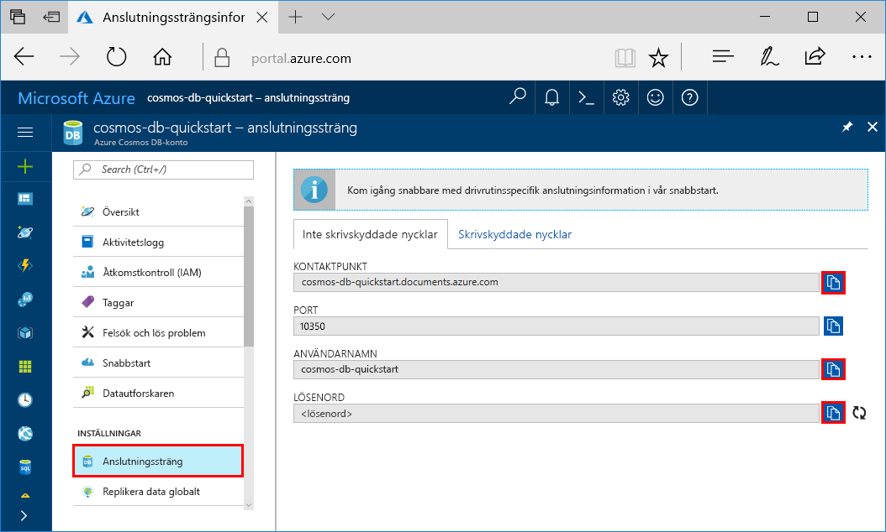

# <a name="quickstart-build-a-cassandra-app-with-net-and-azure-cosmos-db"></a>Snabbstart: Skapa en Cassandra-app med .NET och Azure Cosmos DB

Den här snabbstarten visar hur du använder [Cassandra API](cassandra-introduction.md) i .NET och Azure Cosmos DB för att skapa en profilapp genom att klona ett exempel från GitHub. Denna snabbstart visar dig också hur man skapar ett Azure Cosmos DB-konto med hjälp av den webbaserade Azure-portalen.   

Azure Cosmos DB är Microsofts globalt distribuerade databastjänst för flera datamodeller. Du kan snabbt skapa och ställa frågor mot databaser med dokument, tabeller, nyckel/värde-par och grafer. Du får fördelar av den globala distributionen och den horisontella skalningsförmågan som ligger i grunden hos Azure Cosmos DB. 

## <a name="prerequisites"></a>Nödvändiga komponenter

[!INCLUDE [quickstarts-free-trial-note](../../includes/quickstarts-free-trial-note.md)] Du kan även [Testa Azure Cosmos DB kostnadsfritt](https://azure.microsoft.com/try/cosmosdb/) utan en Azure-prenumeration, utan kostnad och åtaganden.

Åtkomst till förhandsgranskningsprogrammet för Azure Cosmos DB Cassandra-API. Om du inte har ansökt om åtkomst än kan du [registrera dig nu](cassandra-introduction.md#sign-up-now).

Följande gäller också: 
* Om du inte har Visual Studio 2017 installerat kan du ladda ned och använda [Visual Studio 2017 Community Edition](https://www.visualstudio.com/downloads/) **utan kostnad**. Se till att du aktiverar **Azure-utveckling** under installationen av Visual Studio.
* Installera [Git](https://www.git-scm.com/) för att klona exemplet.

<a id="create-account"></a>
## <a name="create-a-database-account"></a>Skapa ett databaskonto

[!INCLUDE [cosmos-db-create-dbaccount-cassandra](../../includes/cosmos-db-create-dbaccount-cassandra.md)]


## <a name="clone-the-sample-application"></a>Klona exempelprogrammet

Nu ska vi övergå till att arbeta med kod. Nu ska vi klona en Cassandra API-app från GitHub, ange anslutningssträngen och köra appen. Du kommer att se hur lätt det är att arbeta med data programmässigt. 

1. Öppna en kommandotolk, skapa en ny mapp som heter git-samples och stäng sedan kommandotolken.

    ```bash
    md "C:\git-samples"
    ```

2. Öppna ett git-terminalfönster, t.ex. git bash, och använd kommandot `cd` för att ändra till den nya mappen där du vill installera exempelappen.

    ```bash
    cd "C:\git-samples"
    ```

3. Klona exempellagringsplatsen med följande kommando. Detta kommando skapar en kopia av exempelappen på din dator.

    ```bash
    git clone https://github.com/Azure-Samples/azure-cosmos-db-cassandra-dotnet-getting-started.git
    ```

3. Öppna sedan lösningsfilen CassandraQuickStartSample i Visual Studio. 

## <a name="review-the-code"></a>Granska koden

Det här steget är valfritt. Om du vill lära dig hur databasresurserna skapas i koden kan du granska följande kodavsnitt. Alla kodavsnitten hämtas från filen Program.cs som är installerad i mappen C:\git-samples\azure-cosmos-db-cassandra-dotnet-getting-started\CassandraQuickStartSample. Annars kan du gå vidare till [Uppdatera din anslutningssträng](#update-your-connection-string).

* Initiera sessionen genom att ansluta till en Cassandra-klusterslutpunkt. Cassandra-API:et på Azure Cosmos DB stöder endast TLSv1.2. 

  ```csharp
   var options = new Cassandra.SSLOptions(SslProtocols.Tls12, true, ValidateServerCertificate);
   options.SetHostNameResolver((ipAddress) => CassandraContactPoint);
   Cluster cluster = Cluster.Builder().WithCredentials(UserName, Password).WithPort(CassandraPort).AddContactPoint(CassandraContactPoint).WithSSL(options).Build();
   ISession session = cluster.Connect();
   ```

* Skapa ett nytt keyspace.

    ```csharp
    session.Execute("CREATE KEYSPACE uprofile WITH REPLICATION = { 'class' : 'NetworkTopologyStrategy', 'datacenter1' : 1 };"); 
    ```

* Skapa en ny tabell.

   ```csharp
  session.Execute("CREATE TABLE IF NOT EXISTS uprofile.user (user_id int PRIMARY KEY, user_name text, user_bcity text)");
   ```

* Infoga användarentiteter med hjälp av IMapper-objektet med en ny session som ansluter till uprofile keyspace.

    ```csharp
    mapper.Insert<User>(new User(1, "LyubovK", "Dubai"));
    ```
    
* Fråga för att hämta alla användares information.

    ```csharp
   foreach (User user in mapper.Fetch<User>("Select * from user"))
   {
      Console.WriteLine(user);
   }
    ```
    
* Fråga för att hämta en användares information.

    ```csharp
    mapper.FirstOrDefault<User>("Select * from user where user_id = ?", 3);
    ```

## <a name="update-your-connection-string"></a>Uppdatera din anslutningssträng

Gå nu tillbaka till Azure Portal för att hämta information om din anslutningssträng och kopiera den till appen. Informationen i anslutningssträngen gör det möjligt för appen att kommunicera med den värdbaserade databasen.

1. I [Azure-portalen](http://portal.azure.com/) klickar du på **Anslutningssträng**. 

    Använd  knappen på höger sida av skärmen för att kopiera värdet ANVÄNDARNAMN.

    

2. I Visual Studio 2017 öppnar du filen Program.cs. 

3. Klistra in värdet för ANVÄNDARNAMN från portalen över `<FILLME>` på rad 13.

    Rad 13 i Program.cs bör nu se ut ungefär så här 

    `private const string UserName = "cosmos-db-quickstart";`

3. Gå tillbaka till portalen och kopiera värdet LÖSENORD. Klistra in värdet för LÖSENORD från portalen över `<FILLME>` på rad 14.

    Rad 14 i Program.cs bör nu se ut ungefär så här 

    `private const string Password = "2Ggkr662ifxz2Mg...==";`

4. Gå tillbaka till portalen och kopiera värdet KONTAKTPUNKT. Klistra in värdet för KONTAKTPUNKT från portalen över `<FILLME>` på rad 15.

    Rad 15 i Program.cs bör nu se ut ungefär så här 

    `private const string CassandraContactPoint = "cosmos-db-quickstarts.documents.azure.com"; //  DnsName`

5. Spara filen Program.cs.
    
## <a name="run-the-app"></a>Kör appen

1. I Visual Studio klickar du på **Verktyg** > **NuGet Package Manager** > **Package Manager Console**.

2. I kommandotolken installerar du .NET-drivrutinens NuGet-paket genom att köra följande kommando. 

    ```cmd
    Install-Package CassandraCSharpDriver
    ```
3. Tryck på Ctrl + F5 för att köra programmet. Appen visas i konsolfönstret. 

    

    Tryck på CTRL + C om du vill stoppa körning av programmet och stänga konsolfönstret. 
    
    Du kan nu öppna Datautforskaren i Azure-portalen och se frågan, ändra och arbeta med dessa nya data. 

    

## <a name="review-slas-in-the-azure-portal"></a>Granska serviceavtal i Azure Portal

[!INCLUDE [cosmosdb-tutorial-review-slas](../../includes/cosmos-db-tutorial-review-slas.md)]

## <a name="clean-up-resources"></a>Rensa resurser

[!INCLUDE [cosmosdb-delete-resource-group](../../includes/cosmos-db-delete-resource-group.md)]

## <a name="next-steps"></a>Nästa steg

I den här snabbstarten har du lärt dig hur man skapar ett Azure Cosmos DB-konto, skapar en samling med datautforskaren och kör en webbapp. Du kan nu importera ytterligare data till ditt Cosmos DB-konto. 

> [!div class="nextstepaction"]
> [Importera Cassandra-data till Azure Cosmos DB](cassandra-import-data.md)
