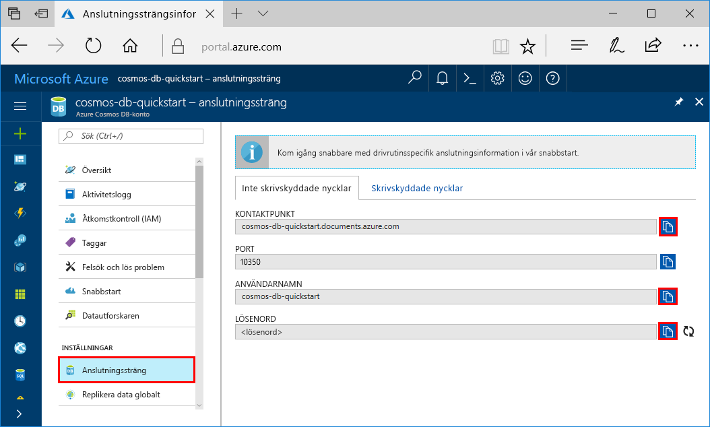

# <a name="quickstart-build-a-cassandra-app-with-nodejs-and-azure-cosmos-db"></a>Snabbstart: Skapa en Cassandra app med Node.js och Azure Cosmos DB

Den här snabbstarten visar hur du använder Node.js och Azure Cosmos DB [Cassandra API](cassandra-introduction.md) att skapa en app för profilen genom att klona ett exempel från GitHub. Denna Snabbstart också vägleder dig genom att skapa ett Azure DB som Cosmos-konto med hjälp av den webbaserade Azure-portalen.

Azure Cosmos-DB är Microsofts globalt distribuerade flera modellen database-tjänsten. Du kan snabbt skapa och fråga dokumentet, tabell, nyckel / värde- och graph-databaser som dra nytta av de globala distribution och skala horisontellt kärnan i Azure Cosmos DB. 

## <a name="prerequisites"></a>Krav

* Åtkomst till förhandsgranskningsprogrammet Azure Cosmos DB Cassandra API. Om du inte använder för åtkomst till ännu, [registrera nu](https://aka.ms/cosmosdb-cassandra-signup).
* [Node.js](https://nodejs.org/en/) version v0.10.29 eller senare
* [Git](http://git-scm.com/)

[!INCLUDE [quickstarts-free-trial-note](../../includes/quickstarts-free-trial-note.md)]Du kan också [försök Azure Cosmos-DB gratis](https://azure.microsoft.com/try/cosmosdb/) utan en Azure-prenumeration, helt kostnadsfritt och åtaganden.


## <a name="create-a-database-account"></a>Skapa ett databaskonto

Innan du kan skapa en databas för dokument, måste du skapa en Cassandra-konto med Azure Cosmos DB.

[!INCLUDE [cosmos-db-create-dbaccount-cassandra](../../includes/cosmos-db-create-dbaccount-cassandra.md)]

## <a name="clone-the-sample-application"></a>Klona exempelprogrammet

Nu ska vi klona en Cassandra API-app från github, ange anslutningssträngen och kör den. Du kommer att se hur lätt det är att arbeta med data programmässigt. 

1. Öppna en git-terminalfönster, till exempel git bash och använda den `cd` kommando för att ändra till en mapp att installera sample-appen. 

    ```bash
    cd "C:\git-samples"
    ```

2. Klona exempellagringsplatsen med följande kommando. Detta kommando skapar en kopia av sample-appen på din dator.

    ```bash
    git clone https://github.com/Azure-Samples/azure-cosmos-db-cassandra-nodejs-getting-started.git
    ```

## <a name="review-the-code"></a>Granska koden

Det här steget är valfritt. Om du är intresserad av att lära sig hur databasresurser skapas i koden kan granska du följande kodavsnitt. Fragmenten hämtas från den `uprofile.js` filen i mappen C:\git-samples\azure-cosmos-db-cassandra-nodejs-getting-started. Annars kan du gå vidare till [uppdatera anslutningssträngen](#update-your-connection-string). 

* Användarnamn och lösenord anges med hjälp av sidan sträng i Azure-portalen. Path\to\cert tillhandahåller en sökväg till X509 certifikat. 

   ```nodejs
   var ssl_option = {
        cert : fs.readFileSync("path\to\cert"),
        rejectUnauthorized : true,
        secureProtocol: 'TLSv1_2_method'
        };
   const authProviderLocalCassandra = new cassandra.auth.PlainTextAuthProvider(config.username, config.password);
   ```

* Den `client` har initierats med contactPoint information. ContactPoint hämtas från Azure-portalen.

    ```nodejs
    const client = new cassandra.Client({contactPoints: [config.contactPoint], authProvider: authProviderLocalCassandra, sslOptions:ssl_option});
    ```

* Den `client` ansluter till Azure Cosmos DB Cassandra API.

    ```nodejs
    client.connect(next);
    ```

* En ny keyspace skapas.

    ```nodejs
    function createKeyspace(next) {
        var query = "CREATE KEYSPACE IF NOT EXISTS uprofile WITH replication = {\'class\': \'NetworkTopologyStrategy\', \'datacenter1\' : \'1\' }";
        client.execute(query, next);
        console.log("created keyspace");    
  }
    ```

* En ny tabell skapas.

   ```nodejs
   function createTable(next) {
    var query = "CREATE TABLE IF NOT EXISTS uprofile.user (user_id int PRIMARY KEY, user_name text, user_bcity text)";
        client.execute(query, next);
        console.log("created table");
   },
   ```

* Nyckel/värde-entiteter infogas.

    ```nodejs
    ...
       {
          query: 'INSERT INTO  uprofile.user  (user_id, user_name , user_bcity) VALUES (?,?,?)',
          params: [5, 'IvanaV', 'Belgaum', '2017-10-3136']
        }
    ];
    client.batch(queries, { prepare: true}, next);
    ```

* Frågan att hämta hämta alla nyckelvärden.

    ```nodejs
   var query = 'SELECT * FROM uprofile.user';
    client.execute(query, { prepare: true}, function (err, result) {
      if (err) return next(err);
      result.rows.forEach(function(row) {
        console.log('Obtained row: %d | %s | %s ',row.user_id, row.user_name, row.user_bcity);
      }, this);
      next();
    });
    ```  
    
* Frågan att hämta en nyckel / värde.

    ```nodejs
    function selectById(next) {
        console.log("\Getting by id");
        var query = 'SELECT * FROM uprofile.user where user_id=1';
        client.execute(query, { prepare: true}, function (err, result) {
        if (err) return next(err);
            result.rows.forEach(function(row) {
            console.log('Obtained row: %d | %s | %s ',row.user_id, row.user_name, row.user_bcity);
        }, this);
        next();
        });
    }
    ```  

## <a name="update-your-connection-string"></a>Uppdatera din anslutningssträng

Gå nu tillbaka till Azure Portal för att hämta information om din anslutningssträng och kopiera den till appen. Detta gör att din app för att kommunicera med databasen värdbaserade.

1. I den [Azure-portalen](http://portal.azure.com/), klickar du på **anslutningssträngen**. 

    Använd den  knappen på höger sida av skärmen för att kopiera värdet övre KONTAKTA punkten.

    

2. Öppna filen `config.js`. 

3. Klistra in KONTAKTA punktvärdet från portalen över `<FillMEIN>` på rad 4.

    Rad 4 bör nu se ut 

    `config.contactPoint = "cosmos-db-quickstarts.documents.azure.com:10350"`

4. Kopiera värdet för användarnamn från portalen och via `<FillMEIN>` på rad 2.

    Rad 2 bör nu se ut 

    `config.username = 'cosmos-db-quickstart';`
    
5. Kopiera värdet lösenord från portalen och via `<FillMEIN>` på rad 3.

    Rad 3 bör nu se ut

    `config.password = '2Ggkr662ifxz2Mg==';`

6. Spara filen config.js.
    
## <a name="use-the-x509-certificate"></a>Använd X509 certifikat 

1. Om du behöver lägga till Baltimore CyberTrust Root har serienummer 02:00:00:b9 och SHA1 fingeravtryck d4🇩🇪20:d0:5e:66:fc:53:fe:1a:50:88:2 c: 78:db:28:52:ca:e4:74. Det kan hämtas från https://cacert.omniroot.com/bc2025.crt, sparas på en lokal fil med tillägget .cer. 

2. Öppna uprofile.js och ändra path\to\cert att peka mot det nya certifikatet. 

3. Spara uprofile.js. 

## <a name="run-the-app"></a>Kör appen

1. I fönstret git terminal kör `npm install` att installera nödvändiga npm-modulerna.

2. Kör `node uprofile.js` att starta tillämpningsprogrammet nod.

3. Kontrollera resultatet som förväntat från kommandoraden.

    

    Tryck på CTRL + C om du vill stoppa exection av programmet och Stäng fönstret. 

    Nu kan du öppna Data Explorer i Azure portal för att se fråga, ändra och arbeta med dessa nya data. 

     

## <a name="review-slas-in-the-azure-portal"></a>Granska serviceavtal i Azure Portal

[!INCLUDE [cosmosdb-tutorial-review-slas](../../includes/cosmos-db-tutorial-review-slas.md)]

## <a name="clean-up-resources"></a>Rensa resurser

[!INCLUDE [cosmosdb-delete-resource-group](../../includes/cosmos-db-delete-resource-group.md)]

## <a name="next-steps"></a>Nästa steg

I den här snabbstarten har du lärt dig hur man skapar ett Azure Cosmos DB-konto, skapar en samling med datautforskaren och kör en app. Du kan nu importera ytterligare data till ditt Cosmos DB-konto. 

> [!div class="nextstepaction"]
> [Importera Cassandra data till Azure Cosmos DB](cassandra-import-data.md)


