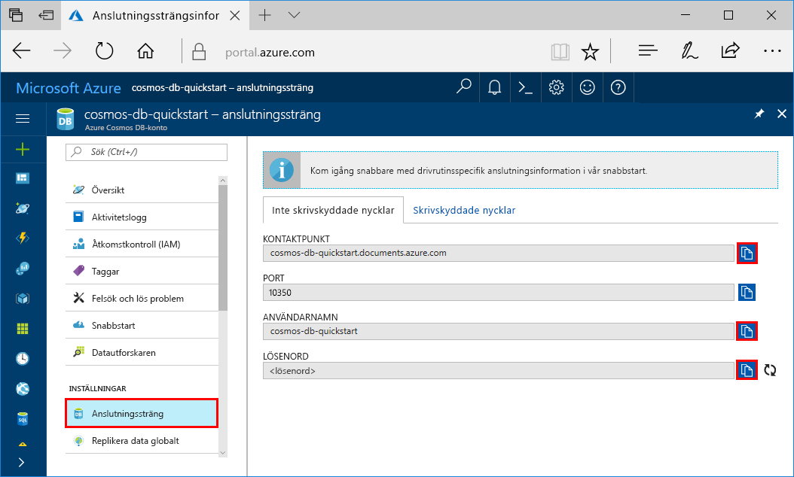
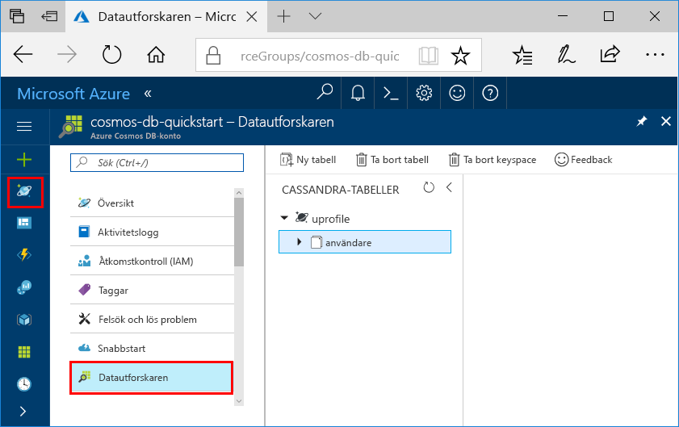

# <a name="quickstart-build-a-cassandra-app-with-python-and-azure-cosmos-db"></a>Snabbstart: Skapa en Cassandra app med Python och Azure Cosmos DB

Den här snabbstarten visar hur du använder Python och Azure Cosmos DB [Cassandra API](cassandra-introduction.md) att skapa en app för profilen genom att klona ett exempel från GitHub. Denna Snabbstart också vägleder dig genom att skapa ett Azure DB som Cosmos-konto med hjälp av den webbaserade Azure-portalen.

Azure Cosmos-DB är Microsofts globalt distribuerade flera modellen database-tjänsten. Du kan snabbt skapa och fråga dokumentet, tabell, nyckel / värde- och graph-databaser som dra nytta av de globala distribution och skala horisontellt kärnan i Azure Cosmos DB.   

## <a name="prerequisites"></a>Krav

[!INCLUDE [quickstarts-free-trial-note](../../includes/quickstarts-free-trial-note.md)]Du kan också [försök Azure Cosmos-DB gratis](https://azure.microsoft.com/try/cosmosdb/) utan en Azure-prenumeration, helt kostnadsfritt och åtaganden.

Åtkomst till förhandsgranskningsprogrammet Azure Cosmos DB Cassandra API. Om du inte använder för åtkomst till ännu, [registrera nu](cassandra-introduction.md#sign-up-now).

Följande gäller också:
* [Python](https://www.python.org/downloads/) version v2.7.14
* [Git](http://git-scm.com/)
* [Python-drivrutin för Apache Cassandra](https://github.com/datastax/python-driver)

## <a name="create-a-database-account"></a>Skapa ett databaskonto

Innan du kan skapa en databas för dokument, måste du skapa en Cassandra-konto med Azure Cosmos DB.

[!INCLUDE [cosmos-db-create-dbaccount-cassandra](../../includes/cosmos-db-create-dbaccount-cassandra.md)]

## <a name="clone-the-sample-application"></a>Klona exempelprogrammet

Nu ska vi klona en Cassandra API-app från github, ange anslutningssträngen och kör den. Du kommer att se hur lätt det är att arbeta med data programmässigt. 

1. Öppna en git-terminalfönster, till exempel git bash och använda den `cd` kommando för att ändra till en mapp att installera sample-appen. 

    ```bash
    cd "C:\git-samples"
    ```

2. Klona exempellagringsplatsen med följande kommando. Detta kommando skapar en kopia av sample-appen på din dator. 

    ```bash
    git clone https://github.com/Azure-Samples/azure-cosmos-db-cassandra-python-getting-started.git
    ```

## <a name="review-the-code"></a>Granska koden

Det här steget är valfritt. Om du är intresserad av att lära sig hur databasresurser skapas i koden kan granska du följande kodavsnitt. Fragmenten hämtas från den `pyquickstart.py` filen. Annars kan du gå vidare till [uppdatera anslutningssträngen](#update-your-connection-string). 

* Användarnamn och lösenord anges med hjälp av sidan sträng i Azure-portalen. Du ersätta path\to\cert med sökvägen till din X509 certifikat.

   ```python
    ssl_opts = {
            'ca_certs': 'path\to\cert',
            'ssl_version': ssl.PROTOCOL_TLSv1_2
            }
    auth_provider = PlainTextAuthProvider( username=cfg.config['username'], password=cfg.config['password'])
    cluster = Cluster([cfg.config['contactPoint']], port = cfg.config['port'], auth_provider=auth_provider, ssl_options=ssl_opts)
    session = cluster.connect()
   
   ```

* Den `cluster` har initierats med contactPoint information. ContactPoint hämtas från Azure-portalen.

    ```python
   cluster = Cluster([cfg.config['contactPoint']], port = cfg.config['port'], auth_provider=auth_provider)
    ```

* Den `cluster` ansluter till Azure Cosmos DB Cassandra API.

    ```python
    session = cluster.connect()
    ```

* En ny keyspace skapas.

    ```python
   session.execute('CREATE KEYSPACE IF NOT EXISTS uprofile WITH replication = {\'class\': \'NetworkTopologyStrategy\', \'datacenter1\' : \'1\' }')
    ```

* En ny tabell skapas.

   ```
   session.execute('CREATE TABLE IF NOT EXISTS uprofile.user (user_id int PRIMARY KEY, user_name text, user_bcity text)');
   ```

* Nyckel/värde-entiteter infogas.

    ```Python
    insert_data = session.prepare("INSERT INTO  uprofile.user  (user_id, user_name , user_bcity) VALUES (?,?,?)")
    batch = BatchStatement()
    batch.add(insert_data, (1, 'LyubovK', 'Dubai'))
    batch.add(insert_data, (2, 'JiriK', 'Toronto'))
    batch.add(insert_data, (3, 'IvanH', 'Mumbai'))
    batch.add(insert_data, (4, 'YuliaT', 'Seattle'))
    ....
    session.execute(batch)
    ```

* Frågan att hämta hämta alla nyckelvärden.

    ```Python
    rows = session.execute('SELECT * FROM uprofile.user')
    ```  
    
* Frågan att hämta en nyckel / värde.

    ```Python
    
    rows = session.execute('SELECT * FROM uprofile.user where user_id=1')
    ```  

## <a name="update-your-connection-string"></a>Uppdatera din anslutningssträng

Gå nu tillbaka till Azure Portal för att hämta information om din anslutningssträng och kopiera den till appen. Detta gör att din app för att kommunicera med databasen värdbaserade.

1. I den [Azure-portalen](http://portal.azure.com/), klickar du på **anslutningssträngen**. 

    Använd den  knappen på höger sida av skärmen för att kopiera värdet övre KONTAKTA punkten.

    

2. Öppna filen `config.py`. 

3. Klistra in KONTAKTA punktvärdet från portalen över `<FILLME>` på rad 10.

    Raden 10 bör nu se ut 

    `'contactPoint': 'cosmos-db-quickstarts.documents.azure.com:10350'`

4. Kopiera värdet för användarnamn från portalen och via `<FILLME>` på rad 6.

    Rad 6 bör nu se ut 

    `'username': 'cosmos-db-quickstart',`
    
5. Kopiera värdet lösenord från portalen och via `<FILLME>` på rad 8.

    Rad 8 bör nu se ut

    `'password' = '2Ggkr662ifxz2Mg==`';`

6. Spara filen config.py.
    
## <a name="use-the-x509-certificate"></a>Använd X509 certifikat

1. Om du behöver lägga till Baltimore CyberTrust Root har serienummer 02:00:00:b9 och SHA1 fingeravtryck d4🇩🇪20:d0:5e:66:fc:53:fe:1a:50:88:2 c: 78:db:28:52:ca:e4:74. Du kan hämta från https://cacert.omniroot.com/bc2025.crt, sparas på en lokal fil med tillägget .cer

2. Öppna pyquickstart.py och ändra path\to\cert att peka mot det nya certifikatet.

3. Spara pyquickstart.py.

## <a name="run-the-app"></a>Kör appen

1. Använd kommandot cd i terminal git för att ändra till mappen azure-cosmos-db-cassandra-python-getting-started. 

2. Kör följande kommandon för att installera modulerna som krävs:

    ```python
    python -m pip install cassandra-driver
    python -m pip install prettytable
    python -m pip install requests
    python -m pip install pyopenssl
    ```

2. Kör följande kommando för att starta tillämpningsprogrammet nod:

    ```
    python pyquickstart.py
    ```

3. Kontrollera resultatet som förväntat från kommandoraden.

    Tryck på CTRL + C om du vill stoppa exection av programmet och Stäng fönstret. 

    
    
    Nu kan du öppna Data Explorer i Azure portal för att se fråga, ändra och arbeta med dessa nya data. 

    

## <a name="review-slas-in-the-azure-portal"></a>Granska serviceavtal i Azure Portal

[!INCLUDE [cosmosdb-tutorial-review-slas](../../includes/cosmos-db-tutorial-review-slas.md)]

## <a name="clean-up-resources"></a>Rensa resurser

[!INCLUDE [cosmosdb-delete-resource-group](../../includes/cosmos-db-delete-resource-group.md)]

## <a name="next-steps"></a>Nästa steg

I den här snabbstarten har du lärt dig hur man skapar ett Azure Cosmos DB-konto, skapar en samling med datautforskaren och kör en app. Du kan nu importera ytterligare data till ditt Cosmos DB-konto. 

> [!div class="nextstepaction"]
> [Importera Cassandra data till Azure Cosmos DB](cassandra-import-data.md)

