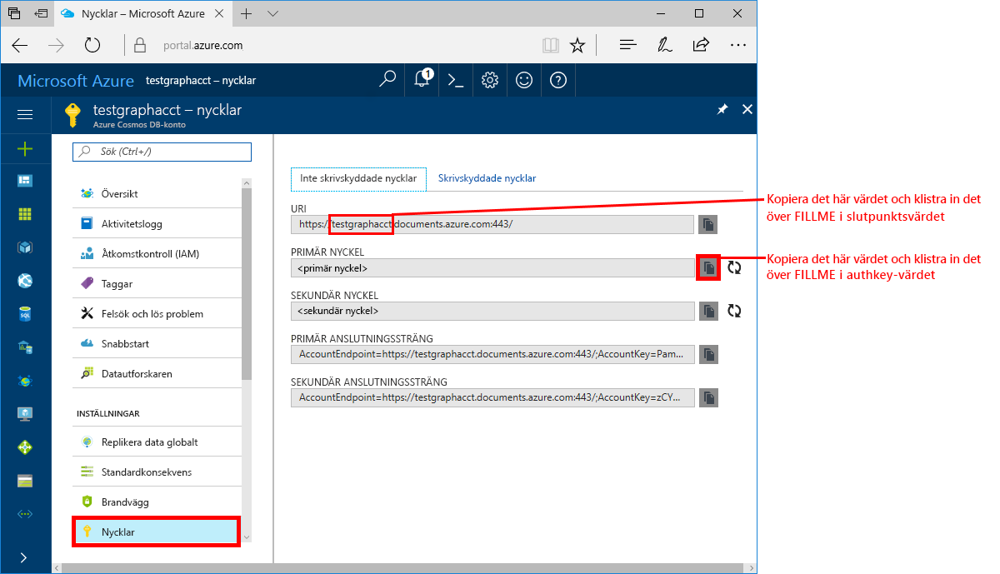

# <a name="azure-cosmos-db-build-a-net-application-using-the-graph-api"></a>Azure Cosmos DB: Skapa en .NET-app med Graph API

Azure Cosmos DB är Microsofts globalt distribuerade databastjänst för flera datamodeller. Du kan snabbt skapa och ställa frågor mot databaser med dokument, nyckel/värde-par och grafer. Du får fördelar av den globala distributionen och den horisontella skalningsförmågan som ligger i grunden hos Azure Cosmos DB. 

Den här snabbstarten demonstrerar hur du skapar ett Azure Cosmos DB-konto, en databas och en graf (behållare) med hjälp av Azure Portal. Sedan skapar du och kör en konsolapp som är byggd med [Graph API](graph-sdk-dotnet.md) (förhandsversion).  

## <a name="prerequisites"></a>Krav

Om du inte har Visual Studio 2017 installerad kan du ladda ned och använda [Visual Studio 2017 Community Edition](https://www.visualstudio.com/downloads/) **utan kostnad**. Se till att du aktiverar **Azure-utveckling** under installationen av Visual Studio.

[!INCLUDE [quickstarts-free-trial-note](../../includes/quickstarts-free-trial-note.md)]

## <a name="create-a-database-account"></a>Skapa ett databaskonto

[!INCLUDE [cosmos-db-create-dbaccount-graph](../../includes/cosmos-db-create-dbaccount-graph.md)]

## <a name="add-a-graph"></a>Lägga till en graf

[!INCLUDE [cosmos-db-create-graph](../../includes/cosmos-db-create-graph.md)]

## <a name="clone-the-sample-application"></a>Klona exempelprogrammet

Nu ska vi klona en Graph API-app från github, ange anslutningssträngen och köra appen. Du kommer att se hur lätt det är att arbeta med data programmässigt. 

1. Öppna ett git-terminalfönster, till exempel git bash, och `cd` till en arbetskatalog.  

2. Klona exempellagringsplatsen med följande kommando. 

    ```bash
    git clone https://github.com/Azure-Samples/azure-cosmos-db-graph-dotnet-getting-started.git
    ```

3. Öppna därefter lösningsfilen i Visual Studio. 

## <a name="review-the-code"></a>Granska koden

Vi gör en snabb genomgång av vad som händer i appen. Öppna filen Program.cs så ser du att de här kodraderna skapar Azure Cosmos DB-resurserna. 

* DocumentClient initieras. I förhandsversionen har vi lagt till en graftillägg-API på Azure Cosmos DB-klienten. Vi arbetar på en fristående grafklient som är frikopplad från Azure Cosmos DB-klienten och resurserna.

    ```csharp
    using (DocumentClient client = new DocumentClient(
        new Uri(endpoint),
        authKey,
        new ConnectionPolicy { ConnectionMode = ConnectionMode.Direct, ConnectionProtocol = Protocol.Tcp }))
    ```

* En ny databas skapas.

    ```csharp
    Database database = await client.CreateDatabaseIfNotExistsAsync(new Database { Id = "graphdb" });
    ```

* En ny graf skapas.

    ```csharp
    DocumentCollection graph = await client.CreateDocumentCollectionIfNotExistsAsync(
        UriFactory.CreateDatabaseUri("graphdb"),
        new DocumentCollection { Id = "graph" },
        new RequestOptions { OfferThroughput = 1000 });
    ```
* En mängd Gremlin-steg utförs med metoden `CreateGremlinQuery`.

    ```csharp
    // The CreateGremlinQuery method extensions allow you to execute Gremlin queries and iterate
    // results asychronously
    IDocumentQuery<dynamic> query = client.CreateGremlinQuery<dynamic>(graph, "g.V().count()");
    while (query.HasMoreResults)
    {
        foreach (dynamic result in await query.ExecuteNextAsync())
        {
            Console.WriteLine($"\t {JsonConvert.SerializeObject(result)}");
        }
    }

    ```

## <a name="update-your-connection-string"></a>Uppdatera din anslutningssträng

Gå nu tillbaka till Azure Portal för att hämta information om din anslutningssträng och kopiera den till appen.

1. I Azure Portal går du till ditt Azure Cosmos DB-konto. Klicka på **Översikt** i det vänstra navigeringsfönstret. Du kommer att kopiera värdet **Gremlin URI** i filen App.config i nästa steg. 

    

    Om värdet **Gremlin URI** är tomt kan du skapa värdet från sidan **Nycklar** i portalen med **URI**-värdet, utan https:// och genom att ändra dokument till diagram. 

2. Öppna filen App.config i Visual Studio 2017. 

3. Kopiera ditt **Gremlin URI**-värde från portalen och gör det till värdet för slutpunktsnyckeln i App.config. 

    `<add key="Endpoint" value="FILLME.graphs.azure.com:443" />`

4. Tillbaka i Azure-portalen klickar du på **Nycklar** på den vänstra navigeringsmenyn och kopierar ditt **PRIMÄRNYCKEL**-värde från portalen och använd värdet för AuthKey-nyckel i App.config. Spara sedan ändringarna. 

    `<add key="AuthKey" value="FILLME" />`

    

Du har nu uppdaterat appen med all information som behövs för kommunikation med Azure Cosmos DB. 

## <a name="run-the-console-app"></a>Kör konsolappen

1. I Visual Studio högerklickar du på projektet **GraphGetStarted** i **Solution Explorer** och sedan på **Hantera NuGet-paket**. 

2. I NuGet-rutan **Bläddra** skriver du *Microsoft.Azure.Graphs* och markerar kryssrutan **Include prerelease** (Ta med förhandsversioner). 

3. Från resultatet installerar du **Microsoft.Azure.Graphs**-biblioteket. Detta installerar bibliotekspaketet för Azure Cosmos DB-graftillägget och alla beroenden.

4. Tryck på Ctrl + F5 för att köra programmet.

   Hörn och gränser som läggs till i tabellen visas i konsolfönstret. Stäng konsolfönstret genom att trycka två gånger på RETUR när skriptet har körts. 

## <a name="browse-using-the-data-explorer"></a>Bläddra med datautforskaren

Nu kan du gå tillbaka till datautforskaren i Azure Portal och bläddra bland och ställa frågor mot dina nya grafdata.

* Den nya databasen visas på panelen Samlingar i datautforskaren. Expandera **graphdb**, **graphcoll** och klicka på **Graph**.

    Data som genereras av den här exempelappen visas i fönstret Graphs (Grafer).

## <a name="review-slas-in-the-azure-portal"></a>Granska serviceavtal i Azure Portal

[!INCLUDE [cosmosdb-tutorial-review-slas](../../includes/cosmos-db-tutorial-review-slas.md)]

## <a name="clean-up-resources"></a>Rensa resurser

Om du inte planerar att fortsätta använda den här appen tar du bort alla resurser som skapades i snabbstarten i Azure Portal med följande steg: 

1. Klicka på **Resursgrupper** på den vänstra menyn i Azure Portal och sedan på namnet på den resurs du skapade. 
2. På sidan med resursgrupper klickar du på **Ta bort**, skriver in namnet på resursen att ta bort i textrutan och klickar sedan på **Ta bort**.

## <a name="next-steps"></a>Nästa steg

I den här snabbstarten har du fått lära dig att skapa ett Azure Cosmos DB-konto, skapa en graf med datautforskaren och att köra en app. Nu kan du skapa mer komplexa frågor och implementera kraftfull logik för grafbläddring med Gremlin. 

> [!div class="nextstepaction"]
> [Fråga med hjälp av Gremlin](tutorial-query-graph.md)


