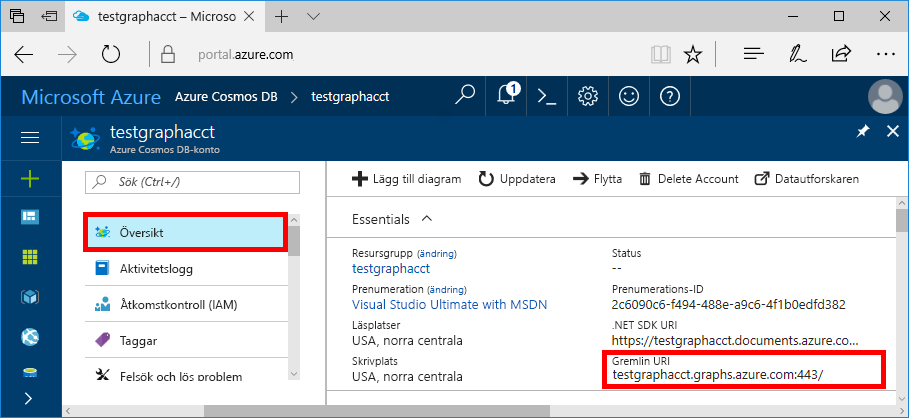
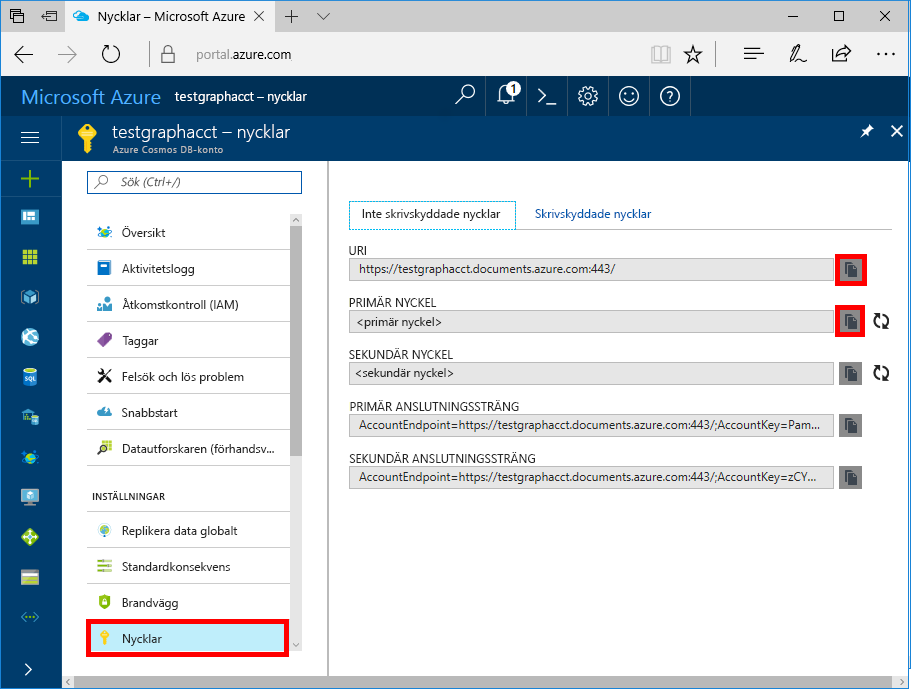

# <a name="azure-cosmos-db-create-query-and-traverse-a-graph-in-the-gremlin-console"></a>Azure Cosmos DB: Skapa, ställ frågor och bläddra i grafen i Gremlin-konsolen

Azure Cosmos DB är Microsofts globalt distribuerade databastjänst för flera datamodeller. Du kan snabbt skapa och ställa frågor mot databaser med dokument, nyckel/värde-par och grafer. Du får fördelar av den globala distributionen och den horisontella skalningsförmågan som ligger i grunden hos Azure Cosmos DB. 

Den här snabbstarten visar hur du kan skapa ett Azure Cosmos DB-konto, databas och graf (behållare) med Azure-portalen och sedan använda [Gremlin Console](https://tinkerpop.apache.org/docs/current/reference/#gremlin-console) från [Apache TinkerPop](http://tinkerpop.apache.org) för att arbeta med graf-API-data (förhandsversion). I den här självstudien får du skapa och fråga hörn och gränser, uppdatera en hörnegenskap, fråga kanter, bläddra i grafen och släppa ett hörn.


Gremlin-konsolen är Groovy-/Java-baserad och körs på Linux, Mac och Windows. Du kan ladda ned den på [Apache TinkerPop-webbplatsen](https://www.apache.org/dyn/closer.lua/tinkerpop/3.2.4/apache-tinkerpop-gremlin-console-3.2.4-bin.zip).

## <a name="prerequisites"></a>Krav

Du måste ha en Azure-prenumeration för att skapa ett Azure Cosmos DB-konto för den här snabbstarten.

[!INCLUDE [quickstarts-free-trial-note](../../includes/quickstarts-free-trial-note.md)]

Du måste också installera [Gremlin-konsolen](http://tinkerpop.apache.org/). Använd version 3.2.4 eller senare.

## <a name="create-a-database-account"></a>Skapa ett databaskonto

[!INCLUDE [cosmos-db-create-dbaccount-graph](../../includes/cosmos-db-create-dbaccount-graph.md)]

## <a name="add-a-graph"></a>Lägga till en graf

[!INCLUDE [cosmos-db-create-graph](../../includes/cosmos-db-create-graph.md)]

## <a id="ConnectAppService"></a>Ansluta till din apptjänst
1. Innan du skapar Gremlin-konsolen ska du skapa eller ändra din remote-secure.yaml-konfigurationsfil i katalogen apache-tinkerpop-gremlin-console-3.2.4/conf.
2. Fyll i din *värd*, *port*, *användarnamn*, *lösenord*, *connectionPool* och *serialiserarens* konfigurationer:

    Inställning|Föreslaget värde|Beskrivning
    ---|---|---
    värdar|[***.graphs.azure.com]|Se skärmbilden nedan. Detta är det Gremlin URI-värdet på översiktssidan för Azure-portalen inom hakparenteser utan : 443/ på slutet.<br><br>Det här värdet kan också hämtas från fliken Nycklar med hjälp av URI-värdet utan https://, eller genom att ändra dokument till grafer och ta bort avslutande: 443/.
    port|443|Ställ in på 443.
    användarnamn|*Ditt användarnamn*|Resursen i formuläret `/dbs/<db>/colls/<coll>` där `<db>` är databasnamnet och `<coll>` är samlingens namn.
    lösenord|*Din primärnyckel*| Se andra skärmbilden nedan. Det här är din primärnyckel som du kan hämta från sidan Nycklar i Azure-portalen i rutan Primärnyckel. Använd kopieringsknappen till vänster om rutan för att kopiera värdet.
    ConnectionPool|{enableSsl: true}|Din anslutningspoolinställning för SSL.
    Serialiserare|{ className: org.apache.tinkerpop.gremlin.<br>driver.ser.GraphSONMessageSerializerV1d0,<br> config: { serializeResultToString: true }}|Ange detta värde och ta bort alla `\n`-radbrytningar när du klistrar in värdet.

    För värdar, kopiera **Gremlin URI**-värdet från **Översiktssidan**: 

    För lösenord, kopiera **Primärnyckeln** från sidan **Nycklar**: 


3. I terminalen, kör `bin/gremlin.bat` eller `bin/gremlin.sh` för att starta [Gremlin-konsolen](http://tinkerpop.apache.org/docs/3.2.4/tutorials/getting-started/).
4. I terminalen, kör `:remote connect tinkerpop.server conf/remote-secure.yaml` för att ansluta till din apptjänst.

    > [!TIP]
    > Om felet `No appenders could be found for logger` visas kontrollerar du att du har uppdaterat serialiserarvärdet i filen remote-secure.yaml på det sätt som beskrivs i steg 2. 

Bra! Konfigurationen är slutförd, så vi kan börja köra några konsolkommandon.

Prova med ett enkelt count()-kommando. Skriv följande i konsolen:
```
:> g.V().count()
```

> [!TIP]
> Observera `:>` som föregår texten`g.V().count()`? 
>
> Detta är en del av kommandot som du måste ange. Det är viktigt när du använder Gremlin-konsolen med Azure Cosmos DB.  
>
> Om du utesluter `:>` instrueras konsolen att köra kommandot lokalt, ofta mot en InMemory-graf.
> Med `:>` talar du om för konsolen att den ska köra fjärrkommandon, i det här fallet mot Cosmos DB (antingen localhost-emulatorn eller en > Azure-instans).


## <a name="create-vertices-and-edges"></a>Skapa hörn och gränser

Vi börjar med att lägga till fem personhörn för *Thomas*, *Mary Kay*, *Robin*, *Ben* och *Jack*.

Indata (Thomas):

```
:> g.addV('person').property('firstName', 'Thomas').property('lastName', 'Andersen').property('age', 44).property('userid', 1)
```

Resultat:

```
==>[id:796cdccc-2acd-4e58-a324-91d6f6f5ed6d,label:person,type:vertex,properties:[firstName:[[id:f02a749f-b67c-4016-850e-910242d68953,value:Thomas]],lastName:[[id:f5fa3126-8818-4fda-88b0-9bb55145ce5c,value:Andersen]],age:[[id:f6390f9c-e563-433e-acbf-25627628016e,value:44]],userid:[[id:796cdccc-2acd-4e58-a324-91d6f6f5ed6d|userid,value:1]]]]
```
Indata (Mary Kay):

```
:> g.addV('person').property('firstName', 'Mary Kay').property('lastName', 'Andersen').property('age', 39).property('userid', 2)

```

Resultat:

```
==>[id:0ac9be25-a476-4a30-8da8-e79f0119ea5e,label:person,type:vertex,properties:[firstName:[[id:ea0604f8-14ee-4513-a48a-1734a1f28dc0,value:Mary Kay]],lastName:[[id:86d3bba5-fd60-4856-9396-c195ef7d7f4b,value:Andersen]],age:[[id:bc81b78d-30c4-4e03-8f40-50f72eb5f6da,value:39]],userid:[[id:0ac9be25-a476-4a30-8da8-e79f0119ea5e|userid,value:2]]]]

```

Indata (Robin):

```
:> g.addV('person').property('firstName', 'Robin').property('lastName', 'Wakefield').property('userid', 3)
```

Resultat:

```
==>[id:8dc14d6a-8683-4a54-8d74-7eef1fb43a3e,label:person,type:vertex,properties:[firstName:[[id:ec65f078-7a43-4cbe-bc06-e50f2640dc4e,value:Robin]],lastName:[[id:a3937d07-0e88-45d3-a442-26fcdfb042ce,value:Wakefield]],userid:[[id:8dc14d6a-8683-4a54-8d74-7eef1fb43a3e|userid,value:3]]]]
```

Indata (Ben):

```
:> g.addV('person').property('firstName', 'Ben').property('lastName', 'Miller').property('userid', 4)

```

Resultat:

```
==>[id:ee86b670-4d24-4966-9a39-30529284b66f,label:person,type:vertex,properties:[firstName:[[id:a632469b-30fc-4157-840c-b80260871e9a,value:Ben]],lastName:[[id:4a08d307-0719-47c6-84ae-1b0b06630928,value:Miller]],userid:[[id:ee86b670-4d24-4966-9a39-30529284b66f|userid,value:4]]]]
```

Indata (Jack):

```
:> g.addV('person').property('firstName', 'Jack').property('lastName', 'Connor').property('userid', 5)
```

Resultat:

```
==>[id:4c835f2a-ea5b-43bb-9b6b-215488ad8469,label:person,type:vertex,properties:[firstName:[[id:4250824e-4b72-417f-af98-8034aa15559f,value:Jack]],lastName:[[id:44c1d5e1-a831-480a-bf94-5167d133549e,value:Connor]],userid:[[id:4c835f2a-ea5b-43bb-9b6b-215488ad8469|userid,value:5]]]]
```


Nu ska vi lägga till gränser för personernas relationer.

Indata (Thomas -> Mary Kay):

```
:> g.V().hasLabel('person').has('firstName', 'Thomas').addE('knows').to(g.V().hasLabel('person').has('firstName', 'Mary Kay'))
```

Resultat:

```
==>[id:c12bf9fb-96a1-4cb7-a3f8-431e196e702f,label:knows,type:edge,inVLabel:person,outVLabel:person,inV:0d1fa428-780c-49a5-bd3a-a68d96391d5c,outV:1ce821c6-aa3d-4170-a0b7-d14d2a4d18c3]
```

Indata (Thomas -> Robin):

```
:> g.V().hasLabel('person').has('firstName', 'Thomas').addE('knows').to(g.V().hasLabel('person').has('firstName', 'Robin'))
```

Resultat:

```
==>[id:58319bdd-1d3e-4f17-a106-0ddf18719d15,label:knows,type:edge,inVLabel:person,outVLabel:person,inV:3e324073-ccfc-4ae1-8675-d450858ca116,outV:1ce821c6-aa3d-4170-a0b7-d14d2a4d18c3]
```

Indata (Robin -> Ben):

```
:> g.V().hasLabel('person').has('firstName', 'Robin').addE('knows').to(g.V().hasLabel('person').has('firstName', 'Ben'))
```

Resultat:

```
==>[id:889c4d3c-549e-4d35-bc21-a3d1bfa11e00,label:knows,type:edge,inVLabel:person,outVLabel:person,inV:40fd641d-546e-412a-abcc-58fe53891aab,outV:3e324073-ccfc-4ae1-8675-d450858ca116]
```

## <a name="update-a-vertex"></a>Uppdatera ett hörn

Nu ska vi uppdatera *Thomas* hörn med den nya åldern *45*.

Indata:
```
:> g.V().hasLabel('person').has('firstName', 'Thomas').property('age', 45)
```
Resultat:

```
==>[id:ae36f938-210e-445a-92df-519f2b64c8ec,label:person,type:vertex,properties:[firstName:[[id:872090b6-6a77-456a-9a55-a59141d4ebc2,value:Thomas]],lastName:[[id:7ee7a39a-a414-4127-89b4-870bc4ef99f3,value:Andersen]],age:[[id:a2a75d5a-ae70-4095-806d-a35abcbfe71d,value:45]]]]
```

## <a name="query-your-graph"></a>Fråga diagrammet

Nu ska vi köra en mängd olika frågor mot grafen.

Vi försöker först fråga med ett filter för att endast returnera personer som är äldre än 40 år.

Indata (filterfråga):

```
:> g.V().hasLabel('person').has('age', gt(40))
```

Resultat:

```
==>[id:ae36f938-210e-445a-92df-519f2b64c8ec,label:person,type:vertex,properties:[firstName:[[id:872090b6-6a77-456a-9a55-a59141d4ebc2,value:Thomas]],lastName:[[id:7ee7a39a-a414-4127-89b4-870bc4ef99f3,value:Andersen]],age:[[id:a2a75d5a-ae70-4095-806d-a35abcbfe71d,value:45]]]]
```

Sedan projicerar vi förnamnet på personerna som är över 40 år.

Indata (filter + projektionsfråga):

```
:> g.V().hasLabel('person').has('age', gt(40)).values('firstName')
```

Resultat:

```
==>Thomas
```

## <a name="traverse-your-graph"></a>Bläddra i grafen

Vi bläddrar i grafen för att returnera alla Thomas vänner.

Indata (Thomas vänner):

```
:> g.V().hasLabel('person').has('firstName', 'Thomas').outE('knows').inV().hasLabel('person')
```

Resultat: 

```
==>[id:f04bc00b-cb56-46c4-a3bb-a5870c42f7ff,label:person,type:vertex,properties:[firstName:[[id:14feedec-b070-444e-b544-62be15c7167c,value:Mary Kay]],lastName:[[id:107ab421-7208-45d4-b969-bbc54481992a,value:Andersen]],age:[[id:4b08d6e4-58f5-45df-8e69-6b790b692e0a,value:39]]]]
==>[id:91605c63-4988-4b60-9a30-5144719ae326,label:person,type:vertex,properties:[firstName:[[id:f760e0e6-652a-481a-92b0-1767d9bf372e,value:Robin]],lastName:[[id:352a4caa-bad6-47e3-a7dc-90ff342cf870,value:Wakefield]]]]
```

Nu ska vi hämta nästa lager med hörn. Bläddra i grafen för att returnera alla Thomas vänners vänner.

Indata (Thomas vänners vänner):

```
:> g.V().hasLabel('person').has('firstName', 'Thomas').outE('knows').inV().hasLabel('person').outE('knows').inV().hasLabel('person')
```
Resultat:

```
==>[id:a801a0cb-ee85-44ee-a502-271685ef212e,label:person,type:vertex,properties:[firstName:[[id:b9489902-d29a-4673-8c09-c2b3fe7f8b94,value:Ben]],lastName:[[id:e084f933-9a4b-4dbc-8273-f0171265cf1d,value:Miller]]]]
```

## <a name="drop-a-vertex"></a>Släppa ett hörn

Vi ska nu ta bort ett hörn från Graph-databasen.

Indata (drop Jack vertex):

```
:> g.V().hasLabel('person').has('firstName', 'Jack').drop()
```

## <a name="clear-your-graph"></a>Rensa diagrammet

Slutligen ska vi rensa databasen från alla hörn och gränser.

Indata:

```
:> g.E().drop()
:> g.V().drop()
```

Grattis! Du har slutfört den här självstudien om Azure Cosmos DB: Graph API!

## <a name="review-slas-in-the-azure-portal"></a>Granska serviceavtal i Azure Portal

[!INCLUDE [cosmosdb-tutorial-review-slas](../../includes/cosmos-db-tutorial-review-slas.md)]

## <a name="clean-up-resources"></a>Rensa resurser

Om du inte planerar att fortsätta använda den här appen tar du bort alla resurser som skapades i snabbstarten i Azure Portal med följande steg:  

1. Klicka på **Resursgrupper** på den vänstra menyn i Azure Portal och sedan på namnet på den resurs du skapade. 
2. På sidan med resursgrupper klickar du på **Ta bort**, skriver in namnet på resursen att ta bort i textrutan och klickar sedan på **Ta bort**.

## <a name="next-steps"></a>Nästa steg

I den här snabbstarten har du lärt dig att skapa ett Azure Cosmos DB-konto, skapa en graf med Datautforskaren, skapa hörn och gränser och bläddra i grafen med Gremlin-konsolen. Nu kan du skapa mer komplexa frågor och implementera kraftfull logik för grafbläddring med Gremlin. 

> [!div class="nextstepaction"]
> [Fråga med hjälp av Gremlin](tutorial-query-graph.md)

