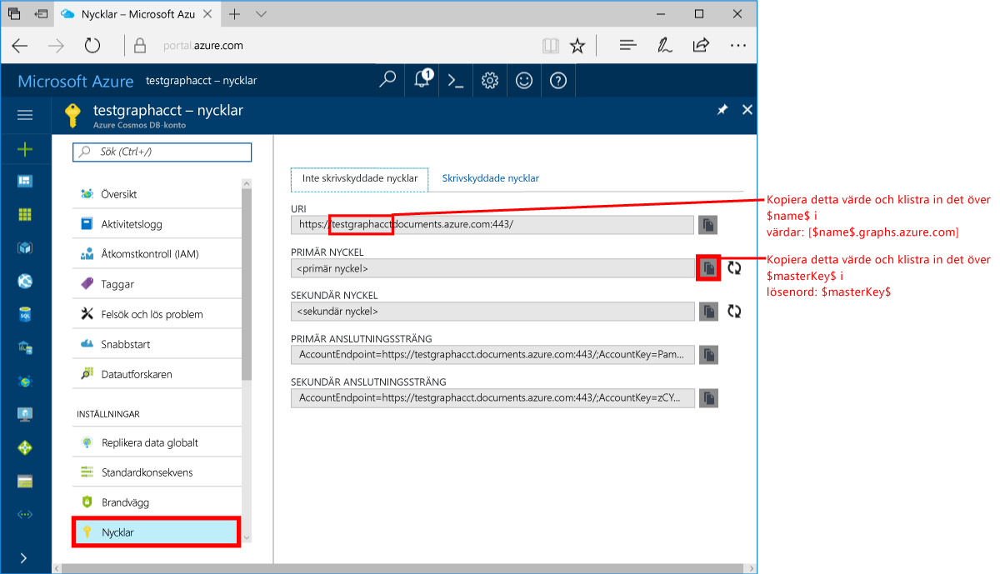
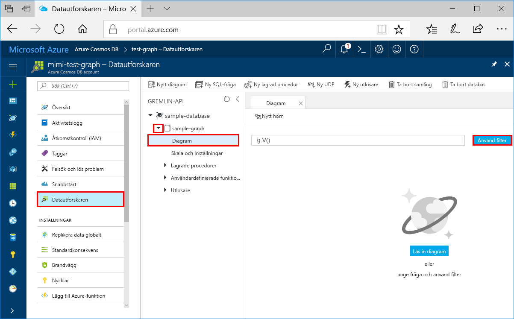
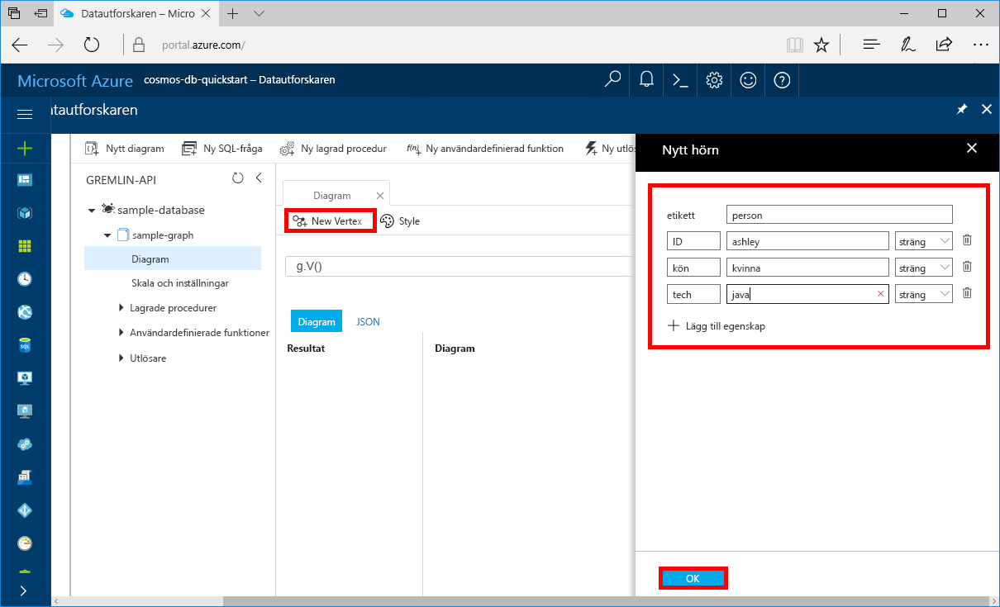

# <a name="azure-cosmos-db-create-a-graph-database-using-java-and-the-azure-portal"></a>Azure Cosmos DB: Skapa en grafdatabas med Java och Azure Portal

Azure Cosmos DB är Microsofts globalt distribuerade databastjänst för flera datamodeller. Med hjälp av Azure Cosmos DB kan du snabbt skapa och fråga hanterat dokument, tabeller och diagram databaser. 

Denna Snabbstart skapar en enkel graph-databas med hjälp av Azure portal verktyg för Azure Cosmos DB. Här visas också hur du snabbt skapar en Java-konsolapp med hjälp av en grafdatabas med OSS-drivrutinen [Gremlin Java](https://mvnrepository.com/artifact/org.apache.tinkerpop/gremlin-driver). Anvisningarna i den här snabbstartsguiden gäller alla operativsystem som kan köra Java. Denna Snabbstart lär du dig att skapa och ändra diagram i Användargränssnittet eller programmässigt, beroende på vilket som är dina inställningar. 

## <a name="prerequisites"></a>Krav
[!INCLUDE [quickstarts-free-trial-note](../../includes/quickstarts-free-trial-note.md)]

Följande gäller också:

* [Java Development Kit (JDK) 1.7+](http://www.oracle.com/technetwork/java/javase/downloads/jdk8-downloads-2133151.html)
    * I Ubuntu kör du `apt-get install default-jdk` för att installera JDK-paketet.
    * Tänk på att ställa in miljövariabeln JAVA_HOME så att den pekar på den mapp där JDK-paketet är installerat.
* [Ladda ned](http://maven.apache.org/download.cgi) och [installera](http://maven.apache.org/install.html) ett [Maven](http://maven.apache.org/)-binärarkiv
    * I Ubuntu kan du köra `apt-get install maven` för att installera Maven.
* [Git](https://www.git-scm.com/)
    * I Ubuntu kan du köra `sudo apt-get install git` för att installera Git.

## <a name="create-a-database-account"></a>Skapa ett databaskonto

Innan du kan börja skapa en grafdatabas måste du skapa ett Gremlin-databaskonto (Graph) med Azure Cosmos DB.

[!INCLUDE [cosmos-db-create-dbaccount-graph](../../includes/cosmos-db-create-dbaccount-graph.md)]

## <a name="add-a-graph"></a>Lägga till en graf

Nu kan du använda datautforskarverktyget i Azure Portal för att skapa en grafdatabas. 

1. Klicka på **Data Explorer** > **nytt diagram**.

    Den **Lägg till diagram** området visas längst till höger kan du behöva rulla för att se den.

    

2. I den **Lägg till diagram** anger inställningar för nya diagram.

    Inställning|Föreslaget värde|Beskrivning
    ---|---|---
    Databas-id|sample-database|Ange *exempeldatabasen* som namn på den nya databasen. Databasnamn måste innehålla mellan 1 och 255 tecken och får inte innehålla `/ \ # ?` eller avslutande blanksteg.
    Graf-id|sample-graph|Ange *exempel diagram* som namn på den nya samlingen. Diagrammet namn har samma krav på tecken som databas-ID: N.
    Lagringskapacitet|Fast (10 GB)|Ändra värdet till **fast (10 GB)**. Det här värdet är databasens lagringskapacitet.
    Dataflöde|400 RU:er|Ändra genomflödet till 400 frågeenheter per sekund (RU/s). Du kan skala upp dataflödet senare om du vill minska svarstiden.
    Partitionsnyckeln|Lämna tomt|Lämna partitionsnyckelfältet tomt i den här snabbstarten.

3. När formuläret är ifyllt klickar du på **OK**.

## <a name="clone-the-sample-application"></a>Klona exempelprogrammet

Nu ska vi övergå till att arbeta med kod. Vi ska klona en Graph API-app från GitHub, ange anslutningssträngen och kör den. Du kommer att se hur lätt det är att arbeta med data programmässigt.  

1. Öppna en git-terminalfönster, till exempel git bash och använda den `cd` kommando för att ändra till en mapp att installera sample-appen.  

    ```bash
    cd "C:\git-samples"
    ```

2. Klona exempellagringsplatsen med följande kommando. Detta kommando skapar en kopia av sample-appen på din dator. 

    ```bash
    git clone https://github.com/Azure-Samples/azure-cosmos-db-graph-java-getting-started.git
    ```

## <a name="review-the-code"></a>Granska koden

Det här steget är valfritt. Om du är intresserad av att lära sig hur databasresurser skapas i koden kan granska du följande kodavsnitt. Fragmenten hämtas från den `Program.java` filen i mappen C:\git-samples\azure-cosmos-db-graph-java-getting-started\src\GetStarted. Annars kan du gå vidare till [uppdatera anslutningssträngen](#update-your-connection-string). 

* Gremlin-`Client`en initieras från konfigurationen i `src/remote.yaml`.

    ```java
    cluster = Cluster.build(new File("src/remote.yaml")).create();
    ...
    client = cluster.connect();
    ```

* En mängd Gremlin-steg utförs med metoden `client.submit`.

    ```java
    ResultSet results = client.submit(gremlin);

    CompletableFuture<List<Result>> completableFutureResults = results.all();
    List<Result> resultList = completableFutureResults.get();

    for (Result result : resultList) {
        System.out.println(result.toString());
    }
    ```

## <a name="update-your-connection-information"></a>Uppdatera informationen

Gå nu tillbaka till Azure-portalen att hämta anslutningsinformationen och kopierar den till appen. De här inställningarna kan din app för att kommunicera med databasen värdbaserade.

1. I den [Azure-portalen](http://portal.azure.com/), klickar du på **nycklar**. 

    Kopiera den första delen av URI-värdet.

    
2. Öppna filen src/remote.yaml och klistra in värdet över `$name$` i `hosts: [$name$.graphs.azure.com]`.

    Rad 1 i remote.yaml bör nu se ut 

    `hosts: [test-graph.graphs.azure.com]`

3. Använd kopieringsknappen kopiera PRIMÄRNYCKELN och klistra in den över i Azure-portalen `$masterKey$` i `password: $masterKey$`.

    4 branschspecifika remote.yaml bör nu se ut 

    `password: 2Ggkr662ifxz2Mg==`

4. Ändra branschspecifika 3 remote.yaml från

    `username: /dbs/$database$/colls/$collection$`

    till 

    `username: /dbs/sample-database/colls/sample-graph`

5. Spara filen remote.yaml.

## <a name="run-the-console-app"></a>Kör konsolappen

1. I git-terminalfönstret `cd` till mappen azure-cosmos-db-graph-java-getting-started.

    ```git
    cd "C:\git-samples\azure-cosmos-db-graph-java-getting-started"
    ```

2. I git-terminalfönstret skriver du `mvn package` för att installera de Java-paket som krävs.

3. I fönstret git terminal kör `mvn exec:java -D exec.mainClass=GetStarted.Program` att starta Java-programmet.

    I terminalfönstret visas de hörn som läggs till i tabellen. När programmet slutar växla tillbaka till Azure-portalen i webbläsaren. 

<a id="add-sample-data"></a>
## <a name="review-and-add-sample-data"></a>Granska och lägg till exempeldata

Nu kan du gå tillbaka till datautforskaren och se de hörn som lagts till i grafen, och lägga till ytterligare datapunkter.

1. Klicka på **Data Explorer**, expandera **exempel diagram**, klickar du på **diagram**, och klicka sedan på **Använd Filter**. 

   

2. I listan **Resultat** kan du se nya användare som har lagts till i grafen. Välj **Ben** och lägg märke till att han är kopplad till Robin. Du kan flytta hörn runt genom att dra och släppa, Zooma in och ut genom att bläddra ratten på musen och expanderar du storleken på diagrammet med dubbelpil. 

   

3. Lägg till några nya användare. Klicka på **Nytt hörn** om du vill lägga till data i grafen.

   

4. Ange en etikett för *person*.

5. Klicka på **Lägg till egenskap** att lägga till var och en av följande egenskaper. Tänk på att du kan skapa unika egenskaper för varje person i grafen. Endast id-nyckeln krävs.

    key|värde|Anteckningar
    ----|----|----
    id|ashley|Den unika identifieraren för hörnet. Om du inte anger något id skapas ett automatiskt.
    kön|kvinna| 
    teknik | Java | 

    > [!NOTE]
    > I den här snabbstartsguiden skapar vi en icke-partitionerad samling. Men om du skapar en partitionerad samling genom att ange en partitionsnyckel när samlingen skapas, måste du lägga till partitionsnyckeln som nyckel i varje nytt hörn. 

6. Klicka på **OK**. Du kan behöva expandera skärmen för att se **OK** längst ned på skärmen.

7. Klicka på **Nytt hörn** igen och lägg till ytterligare en ny användare. 

8. Ange en etikett för *person*.

9. Klicka på **Lägg till egenskap** att lägga till var och en av följande egenskaper:

    key|värde|Anteckningar
    ----|----|----
    id|rakesh|Den unika identifieraren för hörnet. Om du inte anger något id skapas ett automatiskt.
    kön|man| 
    skola|MIT| 

10. Klicka på **OK**. 

11. Klicka på **Använd Filter** med `g.V()` filter för att visa alla värden i diagrammet. Nu visas alla användare i listan **Resultat**. 

    Allteftersom du lägger till data kan du använda filter för att begränsa resultaten. Som standard använder Data Explorer `g.V()` att hämta alla formhörnen i ett diagram. Du kan ändra den till en annan [diagram frågan](tutorial-query-graph.md), som `g.V().count()`, för att returnera en uppräkning av alla formhörnen i diagrammet i JSON-format. Om du har ändrat filtret, ändra filtret tillbaka till `g.V()` och på **Använd Filter** så att visas igen.

12. Nu kan vi koppla ihop Rakesh och Ashley. Se till att **ashley** är markerat i listan**Resultat** och klicka sedan på redigeringsknappen bredvid **Mål** nere till höger. Du kan behöva bredda fönstret för att se området **Egenskaper**.

   

13. I den **mål** skriver *rakesh*, och i den **kant etikett** skriver *vet*, och klicka sedan på kontrollen.

   

14. Markera nu **rakesh** i resultatlistan och se att Ashley och Rakesh är anslutna. 

   

   Resursen skapas en del av den här kursen är klar. Du kan fortsätta att lägga till noder i diagrammet, ändra befintliga brytpunkter eller ändra frågor. Nu ska vi granska mått Azure Cosmos DB tillhandahåller och sedan rensa resurserna. 

## <a name="review-slas-in-the-azure-portal"></a>Granska serviceavtal i Azure Portal

[!INCLUDE [cosmosdb-tutorial-review-slas](../../includes/cosmos-db-tutorial-review-slas.md)]

## <a name="clean-up-resources"></a>Rensa resurser

[!INCLUDE [cosmosdb-delete-resource-group](../../includes/cosmos-db-delete-resource-group.md)]

## <a name="next-steps"></a>Nästa steg

I den här snabbstarten har du fått lära dig att skapa ett Azure Cosmos DB-konto, skapa en graf med datautforskaren och att köra en app. Nu kan du skapa mer komplexa frågor och implementera kraftfull logik för grafbläddring med Gremlin. 

> [!div class="nextstepaction"]
> [Fråga med hjälp av Gremlin](tutorial-query-graph.md)

