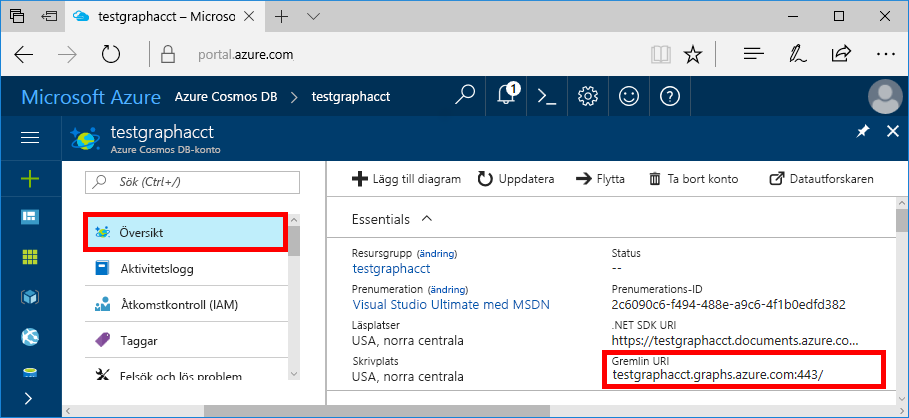

# <a name="azure-cosmos-db-build-a-nodejs-application-by-using-graph-api"></a>Azure Cosmos DB: Skapa en Node.js-app med Graph API

Azure Cosmos DB är Microsofts globalt distribuerade databastjänst för flera datamodeller. Du kan snabbt skapa och ställa frågor mot databaser med dokument, nyckel/värde-par och grafer. Du får fördelar av den globala distributionen och den horisontella skalningsförmågan som ligger i grunden hos Azure Cosmos DB. 

I den här snabbstartartikeln visas hur du skapar ett Azure Cosmos DB-konto för Graph API (förhandsversion), en databas och en graf med hjälp av Azure Portal. Sedan skapar och kör du en konsolapp med drivrutinen [Gremlin Node.js](https://www.npmjs.com/package/gremlin-secure) (öppen källkod).  

> [!NOTE]
> Npm-modulen `gremlin-secure` är en modifierad version av `gremlin`-modulen, med stöd för SSL och SASL som krävs för att ansluta med Azure Cosmos DB. Källkoden finns på [GitHub](https://github.com/CosmosDB/gremlin-javascript).
>

## <a name="prerequisites"></a>Krav

Innan du kan köra det här exemplet måste du uppfylla följande krav:
* [Node.js](https://nodejs.org/en/)-version v0.10.29 eller senare
* [Git](http://git-scm.com/)

[!INCLUDE [quickstarts-free-trial-note](../../includes/quickstarts-free-trial-note.md)]

## <a name="create-a-database-account"></a>Skapa ett databaskonto

[!INCLUDE [cosmos-db-create-dbaccount-graph](../../includes/cosmos-db-create-dbaccount-graph.md)]

## <a name="add-a-graph"></a>Lägga till en graf

[!INCLUDE [cosmos-db-create-graph](../../includes/cosmos-db-create-graph.md)]

## <a name="clone-the-sample-application"></a>Klona exempelprogrammet

Nu ska vi klona en Graph API-app från github, ange anslutningssträngen och köra appen. Du kommer att se hur lätt det är att arbeta med data programmässigt. 

1. Öppna ett git-terminalfönster, till exempel git bash och ändra (via kommandot `cd`) till en arbetskatalog.  

2. Klona exempellagringsplatsen med följande kommando. 

    ```bash
    git clone https://github.com/Azure-Samples/azure-cosmos-db-graph-nodejs-getting-started.git
    ```

3. Öppna därefter lösningsfilen i Visual Studio. 

## <a name="review-the-code"></a>Granska koden

Vi gör en snabb genomgång av vad som händer i appen. Om du öppnar filen `app.js` så ser du följande rader med kod. 

* Gremlin-klienten skapas.

    ```nodejs
    const client = Gremlin.createClient(
        443, 
        config.endpoint, 
        { 
            "session": false, 
            "ssl": true, 
            "user": `/dbs/${config.database}/colls/${config.collection}`,
            "password": config.primaryKey
        });
    ```

  Konfigurationerna finns i `config.js`, som vi redigerar i följande avsnitt.

* En mängd Gremlin-steg utförs med metoden `client.execute`.

    ```nodejs
    console.log('Running Count'); 
    client.execute("g.V().count()", { }, (err, results) => {
        if (err) return console.error(err);
        console.log(JSON.stringify(results));
        console.log();
    });
    ```

## <a name="update-your-connection-string"></a>Uppdatera din anslutningssträng

1. Uppdatera filen config.js. 

2. I config.js, fyller du i config.endpoint-nyckeln med **Gremlin URI**-värdet från sidan **Översikt** i Azure-portalen. 

    `config.endpoint = "GRAPHENDPOINT";`

    

   Om värdet **Gremlin URI** är tomt kan du skapa värdet från sidan **Nycklar** i portalen med **URI**-värdet, utan https:// och genom att ändra dokument till diagram.

   Gremlin-slutpunkten måste vara värddatorns namn utan port och protocol-nummer, till exempel `mygraphdb.graphs.azure.com` (inte `https://mygraphdb.graphs.azure.com` eller `mygraphdb.graphs.azure.com:433`).

3. I config.js, fyller du i config-primaryKey-värdet med **Primärnyckelvärdet** från sidan **Nycklar** i Azure-portalen. 

    `config.primaryKey = "PRIMARYKEY";`

   

4. Ange databasens namn och grafvärdet (behållaren) för config.database och config.collection. 

Här är ett exempel på hur din färdiga config.js-fil ska se ut:

```nodejs
var config = {}

// Note that this must not have HTTPS or the port number
config.endpoint = "testgraphacct.graphs.azure.com";
config.primaryKey = "Pams6e7LEUS7LJ2Qk0fjZf3eGo65JdMWHmyn65i52w8ozPX2oxY3iP0yu05t9v1WymAHNcMwPIqNAEv3XDFsEg==";
config.database = "graphdb"
config.collection = "Persons"

module.exports = config;
```

## <a name="run-the-console-app"></a>Kör konsolappen

1. Öppna ett terminalfönster och ändra (via kommandot `cd`) till installationskatalogen för package.json-fil som ingår i projektet.  

2. Kör `npm install` att installera nödvändiga npm-moduler, inklusive `gremlin-secure`.

3. Kör `node app.js` i en terminal för att starta nodprogrammet.

## <a name="browse-with-data-explorer"></a>Bläddra med datautforskaren

Nu kan du gå tillbaka till datautforskaren i Azure Portal och bläddra bland, ställa frågor mot och arbeta med dina nya grafdata.

Den nya databasen visas på panelen **Samlingar** i datautforskaren. Expandera **graphdb**, **graphcoll** och klicka på **Graph**.

Data som genereras av den här exempelappen visas i fönstret **Graphs** (Grafer).

## <a name="review-slas-in-the-azure-portal"></a>Granska serviceavtal i Azure Portal

[!INCLUDE [cosmosdb-tutorial-review-slas](../../includes/cosmos-db-tutorial-review-slas.md)]

## <a name="clean-up-your-resources"></a>Rensa dina resurser

Om du inte planerar att fortsätta använda den här appen kan du ta bort alla resurser som du skapade i den här artikeln genom att göra följande: 

1. Klicka på **Resursgrupper** på den vänstra menyn i Azure Portal och sedan på namnet på den resurs du skapade. 
2. På sidan med resursgrupper klickar du på **Ta bort**, skriver in namnet på resursen att ta bort och klickar sedan på **Ta bort**.

## <a name="next-steps"></a>Nästa steg

I den här artikeln har du fått lära dig att skapa ett Azure Cosmos DB-konto, skapa en graf med datautforskaren och att köra en app. Nu kan du skapa mer komplexa frågor och implementera kraftfull logik för grafbläddring med Gremlin. 

> [!div class="nextstepaction"]
> [Fråga med hjälp av Gremlin](tutorial-query-graph.md)

