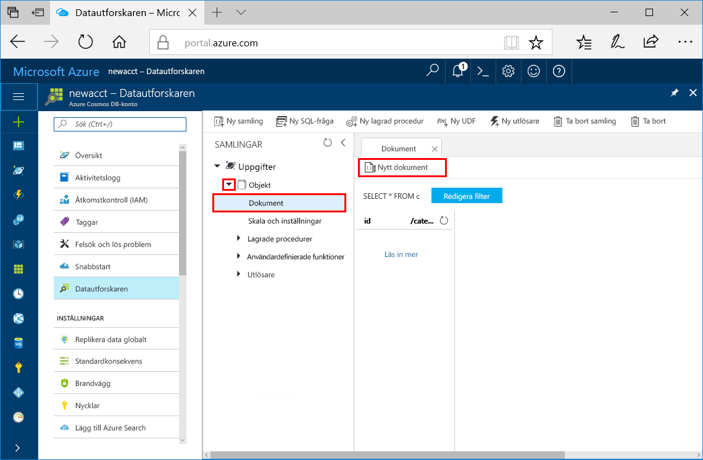
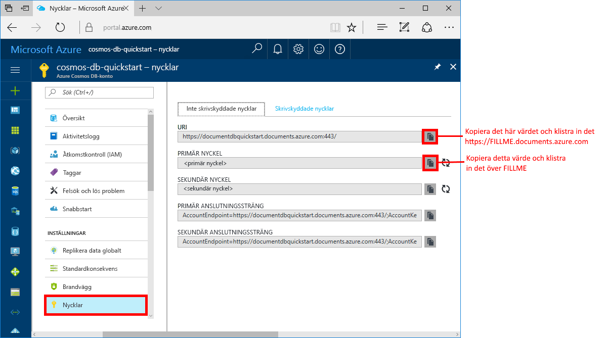

# <a name="azure-cosmos-db-create-a-document-database-using-java-and-the-azure-portal"></a>Azure Cosmos DB: Skapa en dokumentdatabas med Java och Azure Portal

Azure Cosmos DB är Microsofts globalt distribuerade databastjänst för flera datamodeller. Du kan använda Azure Cosmos DB för att snabbt skapa och fråga hanterade dokument-, tabell- och grafdatabaser.

I den här snabbstarten skapar vi en dokumentdatabas med hjälp av Azure Portal-verktygen för Azure Cosmos DB [SQL-API:et](sql-api-introduction.md). Här visas också hur du snabbt skapar en Java-konsolapp med hjälp av [SQL Java API](sql-api-sdk-java.md). Anvisningarna i den här snabbstartsguiden gäller alla operativsystem som kan köra Java. När du har slutfört den här snabbstarten kommer du kunna skapa och ändra dokumentdatabasresurser i antingen användargränssnittet eller programmässigt, beroende på vad du föredrar.

## <a name="prerequisites"></a>Nödvändiga komponenter

[!INCLUDE [quickstarts-free-trial-note](../../includes/quickstarts-free-trial-note.md)] 
[!INCLUDE [cosmos-db-emulator-docdb-api](../../includes/cosmos-db-emulator-docdb-api.md)]

Följande gäller också: 

* [Java Development Kit (JDK) 1.7+](http://www.oracle.com/technetwork/java/javase/downloads/jdk8-downloads-2133151.html)
    * I Ubuntu kör du `apt-get install default-jdk` för att installera JDK-paketet.
    * Tänk på att ställa in miljövariabeln JAVA_HOME så att den pekar på den mapp där JDK-paketet är installerat.
* [Ladda ned](http://maven.apache.org/download.cgi) och [installera](http://maven.apache.org/install.html) ett [Maven](http://maven.apache.org/)-binärarkiv
    * I Ubuntu kan du köra `apt-get install maven` för att installera Maven.
* [Git](https://www.git-scm.com/)
    * I Ubuntu kan du köra `sudo apt-get install git` för att installera Git.

## <a name="create-a-database-account"></a>Skapa ett databaskonto

Innan du kan börja skapa en dokumentdatabas måste du skapa ett SQL-API-konto med Azure Cosmos DB.

[!INCLUDE [cosmos-db-create-dbaccount](../../includes/cosmos-db-create-dbaccount.md)]

## <a name="add-a-collection"></a>Lägga till en samling

[!INCLUDE [cosmos-db-create-collection](../../includes/cosmos-db-create-collection.md)]

<a id="add-sample-data"></a>
## <a name="add-sample-data"></a>Lägg till exempeldata

Du kan nu lägga till data till din nya samling med datautforskaren.

1. Expandera samlingen **Objekt** och klicka på **Dokument** > **Nytt dokument**.

   
  
2. Lägg nu till ett dokument i samlingen med följande struktur och klicka på **Spara**. Kopiera JSON till Urklipp med knappen **Kopiera** i kodrutan.

     ```json
     {
         "id": "1",
         "category": "personal",
         "name": "groceries",
         "description": "Pick up apples and strawberries.",
         "isComplete": false
     }
     ```

    

3.  Skapa och spara ännu ett dokument där du ändrar `id` till 2 och ändrar de andra egenskaperna efter behov. Dina nya dokument kan ha vilken struktur du vill eftersom Azure Cosmos DB inte kräver något schema för dina data.

## <a name="query-your-data"></a>Fråga dina data

Du kan nu använda frågor i Datautforskaren för att hämta och filtrera dina data.

1. Du kan se att frågan är inställd på `SELECT * FROM c` som standard. Den här standardfrågan hämtar och visar alla dokument i samlingen. 

    

2. Stanna kvar på fliken **Dokument** och ändra frågan genom att klicka på knappen **Redigera filter**, lägga till `ORDER BY c._ts DESC` i frågepredikatrutan och sedan klicka på **Tillämpa filter**.

    

Den här ändrade frågan visar en lista över dokumenten i fallande ordning baserat på deras tidsstämpel, så att ditt andra dokument nu står först. Om du känner till SQL-syntax kan du ange någon av de [SQL-frågor](sql-api-sql-query.md) som stöds i den här rutan. 

Då är vårt arbete i Datautforskaren klart. Innan vi går vidare till att arbeta med kod kan du notera att du även kan använda Datautforskaren för att skapa lagrade procedurer, UDF:er och utlösare för att utföra affärslogik på serversidan såväl som att skala genomflödet. Datautforskaren visar all den inbyggda programmässiga dataåtkomsten som finns tillgänglig i API:erna, men ger enkel åtkomst till dina data i Azure-portalen.

## <a name="clone-the-sample-application"></a>Klona exempelprogrammet

Nu ska vi övergå till att arbeta med kod. Vi ska klona en SQL API-app från GitHub, ange anslutningssträngen och köra appen. Du kommer att se hur lätt det är att arbeta med data programmässigt. 

1. Öppna en kommandotolk, skapa en ny mapp som heter git-samples och stäng sedan kommandotolken.

    ```bash
    md "C:\git-samples"
    ```

2. Öppna ett git-terminalfönster, t.ex. git bash, och använd kommandot `cd` för att ändra till den nya mappen där du vill installera exempelappen. 

    ```bash
    cd "C:\git-samples"
    ```

3. Klona exempellagringsplatsen med följande kommando. Detta kommando skapar en kopia av exempelappen på din dator.

    ```bash
    git clone https://github.com/Azure-Samples/azure-cosmos-db-documentdb-java-getting-started.git
    ```

## <a name="review-the-code"></a>Granska koden

Det här steget är valfritt. Om du vill lära dig hur databasresurserna skapas i koden kan du granska följande kodavsnitt. Annars kan du gå vidare till [Uppdatera din anslutningssträng](#update-your-connection-string). 

Följande kodfragment har hämtats från filen C:\git-samples\azure-cosmos-db-documentdb-java-getting-started\src\GetStarted\Program.java.

* `DocumentClient`-initiering. [DocumentClient](https://docs.microsoft.com/java/api/com.microsoft.azure.documentdb._document_client) ger logisk representation på klientsidan för Azure Cosmos DB-databastjänsten. Den här klienten används för att konfigurera och köra förfrågningar till tjänsten. `FILLME`-delarna delar i den här koden uppdateras senare i snabbstarten.

    ```java
    this.client = new DocumentClient("https://FILLME.documents.azure.com",
            "FILLME", 
            new ConnectionPolicy(),
            ConsistencyLevel.Session);
    ```

* Skapa [databas](https://docs.microsoft.com/java/api/com.microsoft.azure.documentdb._database).

    ```java
    Database database = new Database();
    database.setId(databaseName);
    
    this.client.createDatabase(database, null);
    ```

* Skapa [DocumentCollection](https://docs.microsoft.com/java/api/com.microsoft.azure.documentdb._document_collection).

    ```java
    DocumentCollection collectionInfo = new DocumentCollection();
    collectionInfo.setId(collectionName);

    ...

    this.client.createCollection(databaseLink, collectionInfo, requestOptions);
    ```

* Skapa dokument med metoden [createDocument](https://docs.microsoft.com/java/api/com.microsoft.azure.documentdb._document_client.createdocument).

    ```java
    // Any Java object within your code can be serialized into JSON and written to Azure Cosmos DB
    Family andersenFamily = new Family();
    andersenFamily.setId("Andersen.1");
    andersenFamily.setLastName("Andersen");
    // More properties

    String collectionLink = String.format("/dbs/%s/colls/%s", databaseName, collectionName);
    this.client.createDocument(collectionLink, family, new RequestOptions(), true);
    ```

* SQL-frågor via JSON utförs med hjälp av metoden [queryDocuments](https://docs.microsoft.com/java/api/com.microsoft.azure.documentdb._document_client.querydocuments).

    ```java
    FeedOptions queryOptions = new FeedOptions();
    queryOptions.setPageSize(-1);
    queryOptions.setEnableCrossPartitionQuery(true);

    String collectionLink = String.format("/dbs/%s/colls/%s", databaseName, collectionName);
    FeedResponse<Document> queryResults = this.client.queryDocuments(
        collectionLink,
        "SELECT * FROM Family WHERE Family.lastName = 'Andersen'", queryOptions);

    System.out.println("Running SQL query...");
    for (Document family : queryResults.getQueryIterable()) {
        System.out.println(String.format("\tRead %s", family));
    }
    ```    

## <a name="update-your-connection-string"></a>Uppdatera din anslutningssträng

Gå nu tillbaka till Azure Portal för att hämta information om din anslutningssträng och kopiera den till appen. På så vis kan appen kommunicera med den värdbaserade databasen.

1. I [Azure Portal](http://portal.azure.com/) klickar du på **Nycklar**. 

    Använd knapparna på höger sida av skärmen för att kopiera det övre värdet, URI.

    

2. Öppna filen `Program.java` från mappen C:\git-samples\azure-cosmos-db-documentdb-java-getting-started\src\GetStarted. 

3. Klistra in URI-värdet från portalen över `https://FILLME.documents.azure.com` på rad 45.

4. Gå tillbaka till portalen och kopiera värdet för PRIMÄR NYCKEL som visas i skärmbilden. Klistra in värdet för PRIMÄR NYCKEL från portalen över `FILLME` på rad 46.

    Metoden getStartedDemo bör nu se ut ungefär så här: 
    
    ```java
    private void getStartedDemo() throws DocumentClientException, IOException {
        this.client = new DocumentClient("https://youraccountname.documents.azure.com:443/",
                "your-primary-key...RJhQrqQ5QQ==", 
                new ConnectionPolicy(),
                ConsistencyLevel.Session);
    ```

5. Spara filen Program.java.

## <a name="run-the-app"></a>Kör appen

1. I git-terminalfönstret `cd` till mappen azure-cosmos-db-documentdb-java-getting-started.

    ```git
    cd "C:\git-samples\azure-cosmos-db-documentdb-java-getting-started"
    ```

2. I git-terminalfönstret använder du följande kommando för att installera de Java-paket som krävs.

    ```
    mvn package
    ```

3. I git-terminalfönstret använder du följande kommando för att starta Java-programmet.

    ```
    mvn exec:java -D exec.mainClass=GetStarted.Program
    ```

    Terminalfönstret visar ett meddelande om att FamilyDB-databasen har skapats. 
    
4. Skapa databasen genom att trycka på en nyckel och skapa sedan samlingen genom att trycka på en annan nyckel. 

    I slutet av programmet tas alla resurser bort, så du måste gå tillbaka till Datautforskaren i webbläsaren om du vill kunna se att den nu innehåller en FamilyDB-databas och en FamilyCollection-samling.

5. Skapa det första dokumentet genom att växla till konsolfönstret och trycka på en tangent och skapa sedan det andra dokumentet genom att tryck på en annan tangent. Visa dem sedan genom att gå tillbaka till Datautforskaren. 

6. Kör en fråga och visa utdata i konsolfönstret genom att trycka på en tangent. 

7. Nästa tangent som du trycker på tar bort resurserna. Om du vill behålla resurserna kan du avsluta programmet genom att trycka på CTRL + C i konsolfönstret. I annat fall tar du bort resurserna från ditt konto genom att trycka på valfri tangent, och slipper därmed onödiga avgifter. 

    


## <a name="review-slas-in-the-azure-portal"></a>Granska serviceavtal i Azure Portal

[!INCLUDE [cosmosdb-tutorial-review-slas](../../includes/cosmos-db-tutorial-review-slas.md)]

## <a name="clean-up-resources"></a>Rensa resurser

[!INCLUDE [cosmosdb-delete-resource-group](../../includes/cosmos-db-delete-resource-group.md)]

## <a name="next-steps"></a>Nästa steg

I den här snabbstarten har du lärt dig att skapa ett Azure Cosmos DB-konto, en dokumentdatabas och en samling med datautforskaren och att köra en app för att göra samma sak programmässigt. Du kan nu importera ytterligare data till Azure Cosmos DB-samlingen. 

> [!div class="nextstepaction"]
> [Importera data till Azure Cosmos DB](import-data.md)


