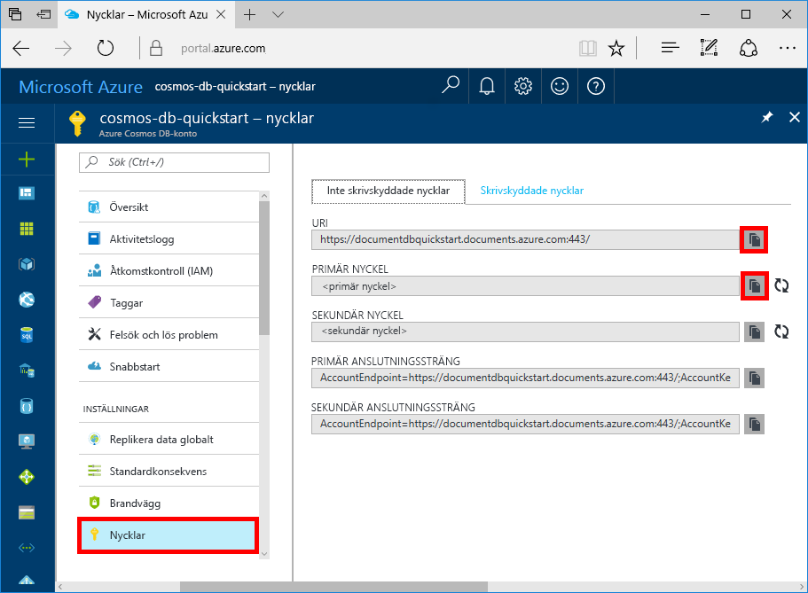

# <a name="azure-cosmos-db-build-a-sql-api-app-with-nodejs-and-the-azure-portal"></a>Azure Cosmos DB: Skapa en SQL API-app med Node.js och Azure Portal

Azure Cosmos DB är Microsofts globalt distribuerade databastjänst för flera datamodeller. Du kan snabbt skapa och ställa frågor mot databaser med dokument, nyckel/värde-par och grafer. Du får fördelar av den globala distributionen och den horisontella skalningsförmågan som ligger i grunden hos Azure Cosmos DB. 

Den här snabbstarten visar hur du skapar ett Azure Cosmos DB [SQL API](sql-api-introduction.md)-konto, dokumentdatabas och samling med Azure Portal. Sedan skapar du och kör en konsolapp som är byggd med [SQL Node.js API](sql-api-sdk-node.md).

## <a name="prerequisites"></a>Nödvändiga komponenter

[!INCLUDE [quickstarts-free-trial-note](../../includes/quickstarts-free-trial-note.md)] 
[!INCLUDE [cosmos-db-emulator-docdb-api](../../includes/cosmos-db-emulator-docdb-api.md)]

* Följande gäller också:
    * [Node.js](https://nodejs.org/en/) version v0.10.29 eller senare
    * [Git](http://git-scm.com/)

## <a name="create-a-database-account"></a>Skapa ett databaskonto

[!INCLUDE [cosmos-db-create-dbaccount](../../includes/cosmos-db-create-dbaccount.md)]

## <a name="add-a-collection"></a>Lägga till en samling

[!INCLUDE [cosmos-db-create-collection](../../includes/cosmos-db-create-collection.md)]

## <a name="add-sample-data"></a>Lägg till exempeldata

[!INCLUDE [cosmos-db-create-sql-api-add-sample-data](../../includes/cosmos-db-create-sql-api-add-sample-data.md)]

## <a name="query-your-data"></a>Fråga dina data

[!INCLUDE [cosmos-db-create-sql-api-query-data](../../includes/cosmos-db-create-sql-api-query-data.md)]

## <a name="clone-the-sample-application"></a>Klona exempelprogrammet

Nu ska vi klona en SQL API-app från github, ange anslutningssträngen och köra appen. Du kommer att se hur lätt det är att arbeta med data programmässigt. 

1. Öppna en kommandotolk, skapa en ny mapp som heter git-samples och stäng sedan kommandotolken.

    ```bash
    md "C:\git-samples"
    ```

2. Öppna ett git-terminalfönster, t.ex. git bash, och använd kommandot `cd` för att ändra till den nya mappen där du vill installera exempelappen.

    ```bash
    cd "C:\git-samples"
    ```

3. Klona exempellagringsplatsen med följande kommando. Detta kommando skapar en kopia av exempelappen på din dator.

    ```bash
    git clone https://github.com/Azure-Samples/azure-cosmos-db-documentdb-nodejs-getting-started.git
    ```

## <a name="review-the-code"></a>Granska koden

Det här steget är valfritt. Om du vill lära dig hur databasresurserna skapas i koden kan du granska följande kodavsnitt. Annars kan du gå vidare till [Uppdatera din anslutningssträng](#update-your-connection-string). 

Följande kodfragment är alla hämtade från filen app.js.

* `documentClient` har initierats.

    ```nodejs
    var client = new documentClient(config.endpoint, { "masterKey": config.primaryKey });
    ```

* En ny databas skapas.

    ```nodejs
    client.createDatabase(config.database, (err, created) => {
        if (err) reject(err)
        else resolve(created);
    });
    ```

* En ny samling skapas.

    ```nodejs
    client.createCollection(databaseUrl, config.collection, { offerThroughput: 400 }, (err, created) => {
        if (err) reject(err)
        else resolve(created);
    });
    ```

* Vissa dokument skapas.

    ```nodejs
    client.createDocument(collectionUrl, document, (err, created) => {
        if (err) reject(err)
        else resolve(created);
    });
    ```

* En SQL-fråga över JSON utförs.

    ```nodejs
    client.queryDocuments(
        collectionUrl,
        'SELECT VALUE r.children FROM root r WHERE r.lastName = "Andersen"'
    ).toArray((err, results) => {
        if (err) reject(err)
        else {
            for (var queryResult of results) {
                let resultString = JSON.stringify(queryResult);
                console.log(`\tQuery returned ${resultString}`);
            }
            console.log();
            resolve(results);
        }
    });
    ```    

## <a name="update-your-connection-string"></a>Uppdatera din anslutningssträng

Gå nu tillbaka till Azure Portal för att hämta information om din anslutningssträng och kopiera den till appen.

1. I [Azure Portal](http://portal.azure.com/) går du till ditt Azure Cosmos DB-konto. Klicka på **Nycklar** i det västra navigeringsfönstret och sedan på **läs- och skrivnycklar**. Du använder kopiera-knapparna till höger på skärmen för att kopiera URI:n och primärnyckeln i `config.js`-filen i nästa steg.

    

2. Öppna filen `config.js`. 

3. Kopiera ditt URI-värde från portalen (med kopieringsknappen) och gör det till värdet för slutpunktsnyckeln i `config.js`. 

    `config.endpoint = "https://FILLME.documents.azure.com"`

4. Kopiera sedan värdet för primärnyckeln från portalen och gör det till värdet för `config.primaryKey` i `config.js`. Du har nu uppdaterat din app med all information den behöver för att kommunicera med Azure Cosmos DB. 

    `config.primaryKey "FILLME"`
    
## <a name="run-the-app"></a>Kör appen
1. Kör `npm install` i en terminal för att installera de npm-moduler som krävs

2. Kör `node app.js` i en terminal för att starta nodprogrammet.

Du kan nu gå tillbaka till datautforskaren och se frågan, ändra och arbeta med dessa nya data. 

## <a name="review-slas-in-the-azure-portal"></a>Granska serviceavtal i Azure Portal

[!INCLUDE [cosmosdb-tutorial-review-slas](../../includes/cosmos-db-tutorial-review-slas.md)]

## <a name="clean-up-resources"></a>Rensa resurser

[!INCLUDE [cosmosdb-delete-resource-group](../../includes/cosmos-db-delete-resource-group.md)]

## <a name="next-steps"></a>Nästa steg

I den här snabbstarten har du lärt dig hur man skapar ett Azure Cosmos DB-konto, skapar en samling med datautforskaren och kör en app. Du kan nu importera ytterligare data till ditt Cosmos DB-konto. 

> [!div class="nextstepaction"]
> [Importera data till Azure Cosmos DB](import-data.md)


