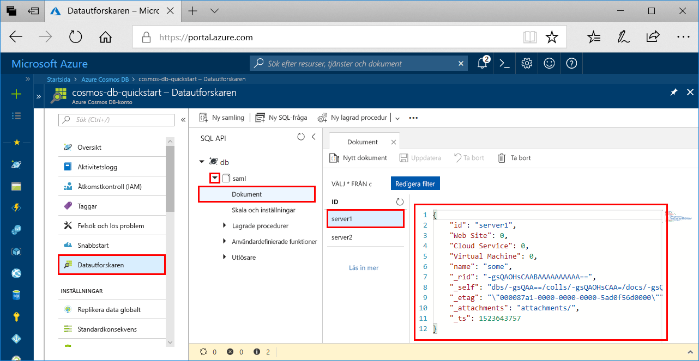

# <a name="azure-cosmos-db-build-a-sql-api-app-with-python-and-the-azure-portal"></a>Azure Cosmos DB: Skapa en SQL API-app med Python och Azure Portal

> [!div class="op_single_selector"]
> * [.NET](create-sql-api-dotnet.md)
> * [Java](create-sql-api-java.md)
> * [Node.js](create-sql-api-nodejs.md)
> * [Node.js- v2](create-sql-api-nodejs-preview.md)
> * [Python](create-sql-api-python.md)
> * [Xamarin](create-sql-api-xamarin-dotnet.md)
>  

Azure Cosmos DB är Microsofts globalt distribuerade databastjänst för flera datamodeller. Du kan snabbt skapa och ställa frågor mot databaser med dokument, nyckel/värde-par och grafer. Du får fördelar av den globala distributionen och den horisontella skalningsförmågan som ligger i grunden hos Azure Cosmos DB. 

Den här snabbstarten visar hur du skapar ett Azure Cosmos DB [SQL API](sql-api-introduction.md)-konto, dokumentdatabas och samling med Azure Portal. Sedan skapar du och kör en konsolapp som är byggd med [SQL Python API](sql-api-sdk-python.md).

[!INCLUDE [quickstarts-free-trial-note](../../includes/quickstarts-free-trial-note.md)] [!INCLUDE [cosmos-db-emulator-docdb-api](../../includes/cosmos-db-emulator-docdb-api.md)]

## <a name="prerequisites"></a>Nödvändiga komponenter

* [Python 3.6](https://www.python.org/downloads/) med \<installationsplats\>\Python36 och \<installationsplats > \Python36\Scripts har lagts till i din sökväg. 
* [Visual Studio Code](https://code.visualstudio.com/)
* [Python-tillägg för Visual Studio Code](https://marketplace.visualstudio.com/items?itemName=ms-python.python#overview)

## <a name="create-a-database-account"></a>Skapa ett databaskonto

[!INCLUDE [cosmos-db-create-dbaccount](../../includes/cosmos-db-create-dbaccount.md)]

## <a name="add-a-collection"></a>Lägga till en samling

[!INCLUDE [cosmos-db-create-collection](../../includes/cosmos-db-create-collection.md)]

## <a name="add-sample-data"></a>Lägg till exempeldata

[!INCLUDE [cosmos-db-create-sql-api-add-sample-data](../../includes/cosmos-db-create-sql-api-add-sample-data.md)]

## <a name="query-your-data"></a>Fråga dina data

[!INCLUDE [cosmos-db-create-sql-api-query-data](../../includes/cosmos-db-create-sql-api-query-data.md)]

## <a name="clone-the-sample-application"></a>Klona exempelprogrammet

Nu ska vi klona en SQL API-app från github, ange anslutningssträngen och köra appen. Du kommer att se hur lätt det är att arbeta med data programmässigt. 

1. Öppna en kommandotolk, skapa en ny mapp som heter git-samples och stäng sedan kommandotolken.

    ```bash
    md "C:\git-samples"
    ```

2. Öppna ett git-terminalfönster, t.ex. git bash, och använd kommandot `cd` för att ändra till den nya mappen där du vill installera exempelappen.

    ```bash
    cd "C:\git-samples"
    ```

3. Klona exempellagringsplatsen med följande kommando. Detta kommando skapar en kopia av exempelappen på din dator. 

    ```bash
    git clone https://github.com/Azure-Samples/azure-cosmos-db-documentdb-python-getting-started.git
    ```  
    
## <a name="review-the-code"></a>Granska koden

Det här steget är valfritt. Om du vill lära dig hur databasresurserna skapas i koden kan du granska följande kodavsnitt. Annars kan du gå vidare till [Uppdatera din anslutningssträng](#update-your-connection-string). 

Följande kodfragment har hämtats från filen DocumentDBGetStarted.py.

* DocumentClient initieras.

    ```python
    # Initialize the Python client
    client = document_client.DocumentClient(config['ENDPOINT'], {'masterKey': config['MASTERKEY']})
    ```

* En ny databas skapas.

    ```python
    # Create a database
    db = client.CreateDatabase({ 'id': config['SQL_DATABASE'] })
    ```

* En ny samling skapas.

    ```python
    # Create collection options
    options = {
        'offerEnableRUPerMinuteThroughput': True,
        'offerVersion': "V2",
        'offerThroughput': 400
    }

    # Create a collection
    collection = client.CreateCollection(db['_self'], { 'id': config['SQL_COLLECTION'] }, options)
    ```

* Vissa dokument skapas.

    ```python
    # Create some documents
    document1 = client.CreateDocument(collection['_self'],
        { 
            'id': 'server1',
            'Web Site': 0,
            'Cloud Service': 0,
            'Virtual Machine': 0,
            'name': 'some' 
        })
    ```

* En fråga utförs med hjälp av SQL

    ```python
    # Query them in SQL
    query = { 'query': 'SELECT * FROM server s' }    
            
    options = {} 
    options['enableCrossPartitionQuery'] = True
    options['maxItemCount'] = 2

    result_iterable = client.QueryDocuments(collection['_self'], query, options)
    results = list(result_iterable);

    print(results)
    ```

## <a name="update-your-connection-string"></a>Uppdatera din anslutningssträng

Gå nu tillbaka till Azure-portalen för att hämta information om din anslutningssträng och kopiera den till appen.

1. Gå till [Azure-portalen](http://portal.azure.com/). Gå till ditt Azure Cosmos DB-konto och klicka på **Nycklar** i den vänstra navigeringspanelen. Använd kopieringsknapparna till höger på skärmen och kopiera **URI** och **Primärnyckel** till filen DocumentDBGetStarted.py i nästa steg.

    

2. Öppna filen C:\git-samples\azure-cosmos-db-documentdb-python-getting-startedDocumentDBGetStarted.py i Visual Studio-koden. 

3. Kopiera ditt **URI**-värde från portalen (med kopieringsknappen) och gör det till värdet för **slutpunkts**nyckeln i DocumentDBGetStarted.py. 

    `'ENDPOINT': 'https://FILLME.documents.azure.com',`

4. Kopiera sedan värdet för **PRIMÄRNYCKEL** från portalen och gör det till värdet för **config.MASTERKEY** i DocumentDBGetStarted.py. Du har nu uppdaterat din app med all information den behöver för att kommunicera med Azure Cosmos DB. 

    `'MASTERKEY': 'FILLME',`

5. Spara filen DocumentDBGetStarted.py.
    
## <a name="run-the-app"></a>Kör appen

1. Gå till Visual Studio Code och välj **Visa**>**Kommandopalett**. 

2. I kommandotolken anger du **Python: Välj tolk** och välj sedan den version av Python som ska användas.

    Sidfoten i Visual Studio Code uppdateras för att ange vilken tolk som valts. 

3. Välj **Visa** > **Integrerad terminal** så att den integrerade Visual Studio Code-terminalen öppnas.

4. I fönstret för den integrerade terminalen kontrollerar du att du befinner dig i mappen azure-cosmos-db-documentdb-python-getting-started. Om du inte är det kör du följande kommando för att växla till exempelmappen. 

    ```
    cd "C:\git-samples\azure-cosmos-db-documentdb-python-getting-started"`
    ```

5. Kör följande kommando för att installera paketet pydocumentdb: 

    ```
    pip3 install pydocumentdb
    ```

    Om du får ett felmeddelande om nekad åtkomst när du försöker installera pydocumentdb måste dur [köra VS Code som administratör](https://stackoverflow.com/questions/37700536/visual-studio-code-terminal-how-to-run-a-command-with-administrator-rights).

6. Kör följande kommando för att köra exemplet och skapa och lagra nya dokument i Azure Cosmos dB.

    ```
    python DocumentDBGetStarted.py
    ```

7. Bekräfta att nya dokument har skapats och sparats i Azure-portalen: välj **Data Explorer**, expandera **coll**, expandera **Dokument** och välj sedan dokumentet **server1**. Innehållet i dokumentet server1 matchar det innehåll som returneras i fönstret för den integrerade terminalen. 

    

## <a name="review-slas-in-the-azure-portal"></a>Granska serviceavtal i Azure-portalen

[!INCLUDE [cosmosdb-tutorial-review-slas](../../includes/cosmos-db-tutorial-review-slas.md)]

## <a name="clean-up-resources"></a>Rensa resurser

[!INCLUDE [cosmosdb-delete-resource-group](../../includes/cosmos-db-delete-resource-group.md)]

## <a name="next-steps"></a>Nästa steg

I den här snabbstarten har du lärt dig hur man skapar ett Azure Cosmos DB-konto, skapar en samling med datautforskaren och kör en app. Du kan nu importera ytterligare data till ditt Cosmos DB-konto. 

> [!div class="nextstepaction"]
> [Importera data till Azure Cosmos DB för användning med SQL API:t](import-data.md)


