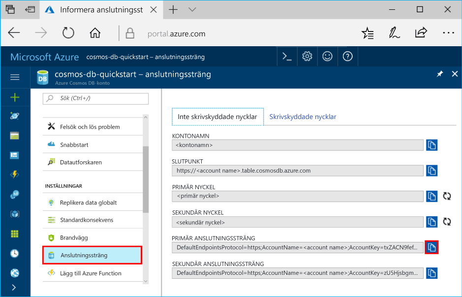

# <a name="quickstart-build-a-table-api-app-with-net-and-azure-cosmos-db"></a>Snabbstart: Skapa en tabell-API-app med .NET och Azure Cosmos DB 

Den här snabbstarten visar hur du använder [tabell-API](table-introduction.md) i .NET och Azure Cosmos DB för att skapa en app genom att klona ett exempel från GitHub. Den här snabbstarten visar även hur du skapar ett Azure Cosmos DB-konto och hur du använder Datautforskaren för att skapa tabeller och entiteter i den webbaserade Azure-portalen.

Azure Cosmos DB är Microsofts globalt distribuerade databastjänst för flera datamodeller. Du kan snabbt skapa och ställa frågor mot databaser med dokument, nyckel/värde-par och grafer. Du får fördelar av den globala distributionen och den horisontella skalningsförmågan som ligger i grunden hos Azure Cosmos DB. 

## <a name="prerequisites"></a>Krav

Om du inte har Visual Studio 2017 installerad kan du ladda ned och använda [Visual Studio 2017 Community Edition](https://www.visualstudio.com/downloads/) **utan kostnad**. Se till att du aktiverar **Azure-utveckling** under installationen av Visual Studio.

[!INCLUDE [quickstarts-free-trial-note](../../includes/quickstarts-free-trial-note.md)]

## <a name="create-a-database-account"></a>Skapa ett databaskonto

> [!IMPORTANT] 
> Du måste skapa ett nytt tabell-API-konto för att arbeta med de allmänt tillgängliga tabell-API SDK:erna. Tabell-API-konton som skapas i förhandsversionen stöds inte av de allmänt tillgängliga SDK:erna.
>

[!INCLUDE [cosmos-db-create-dbaccount-table](../../includes/cosmos-db-create-dbaccount-table.md)]

## <a name="add-a-table"></a>Lägg till en tabell

[!INCLUDE [cosmos-db-create-table](../../includes/cosmos-db-create-table.md)]

## <a name="add-sample-data"></a>Lägg till exempeldata

Du kan nu lägga till data till den nya tabellen med datautforskaren.

1. Öppna Datautforskaren, expandera **sample-table**, klicka på **Entiteter** och klicka sedan på **Lägg till entitet**.

   
2. Lägg till data i värderutorna för egenskaperna PartitionKey (Partitionsnyckel) och RowKey (Radnyckel) och klicka på **Lägg till entitet**.

   
  
    Du kan nu lägga till fler entiteter i din tabell, redigera entiteter eller ställa frågor mot data i Datautforskaren. I Datautforskaren kan du även skala ditt dataflöde och lägga till lagrade procedurer, användardefinierade funktioner och utlösare i tabellen.

## <a name="clone-the-sample-application"></a>Klona exempelprogrammet

Nu ska vi klona en Table-app från github, ange anslutningssträngen och köra appen. Du kommer att se hur lätt det är att arbeta med data programmässigt. 

1. Öppna ett git-terminalfönster, t.ex. git bash, och använd kommandot `cd` för att ändra till en mapp där du vill installera exempelappen. 

    ```bash
    cd "C:\git-samples"
    ```

2. Klona exempellagringsplatsen med följande kommando. Detta kommando skapar en kopia av exempelappen på din dator. 

    ```bash
    git clone https://github.com/Azure-Samples/storage-table-dotnet-getting-started.git
    ```

3. Öppna därefter lösningsfilen TableStorage i Visual Studio. 

## <a name="update-your-connection-string"></a>Uppdatera din anslutningssträng

Gå nu tillbaka till Azure Portal för att hämta information om din anslutningssträng och kopiera den till appen. På så vis kan appen kommunicera med den värdbaserade databasen. 

1. I [Azure-portalen](http://portal.azure.com/) klickar du på **Anslutningssträng**. 

    Använd knapparna på höger sida av skärmen för att kopiera PRIMÄR ANSLUTNINGSSTRÄNG.

    

2. Öppna filen App.config i Visual Studio. 

3. Ta bort kommentarerna för StorageConnectionString på rad 8 och StorageConnectionString på rad 7 eftersom den här självstudien inte använder Storage-emulatorn. Rad 7 och 8 bör nu se ut så här:

    ```
    <!--key="StorageConnectionString" value="UseDevelopmentStorage=true;" />-->
    <add key="StorageConnectionString" value="DefaultEndpointsProtocol=https;AccountName=[AccountName];AccountKey=[AccountKey]" />
    ```

4. Klistra in PRIMÄR ANSLUTNINGSSTRÄNG från portalen i värdet StorageConnectionString på rad 8. Klistra in strängen innanför citattecknen. 

    > [!IMPORTANT]
    > Om slutpunkten använder documents.azure.com innebär det att du har ett förhandsversionskonto, och du måste skapa ett [nytt tabell-API-konto](#create-a-database-account) för att kunna arbeta med den allmänt tillgängliga SDK:n för tabell-API. 
    > 

    Rad 8 bör nu se ut ungefär som:

    ```
    <add key="StorageConnectionString" value="DefaultEndpointsProtocol=https;AccountName=<account name>;AccountKey=txZACN9f...==;TableEndpoint=https://<account name>.table.cosmosdb.azure.com;" />
    ```

5. Spara filen App.config.

Du har nu uppdaterat appen med all information som behövs för kommunikation med Azure Cosmos DB. 

## <a name="build-and-deploy-the-app"></a>Skapa och distribuera appen

1. I Visual Studio högerklickar du på projektet **TableStorage** i **Solution Explorer** och därefter på **Hantera NuGet-paket**. 

2. Skriv *Microsoft.Azure.CosmosDB.Table* i rutan **Bläddra** i NuGet.

3. Från resultatet installerar du **Microsoft.Azure.CosmosDB.Table**-biblioteket. Det här installerar tabell-API-paketet i Azure Cosmos DB samt alla beroenden.

4. Öppna BasicSamples.cs och lägg till en brytpunkt på raderna 30 och 52.

5. Tryck på Ctrl + F5 för att köra programmet.

    Konsolfönstret visar de data som läggs till i den nya tabelldatabasen i Azure Cosmos DB. 
    
    Se [Felsökning](table-sdk-dotnet.md#troubleshooting) om du får ett felmeddelande om beroenden.

    När du kommer till den första brytpunkten går du tillbaka till Datautforskaren i Azure-portalen, expanderar demotabellen* och klickar på **Entiteter**. Fliken **Entiteter** till höger visar den nya entiteten som har lagts till. Lägg märke till att telefonnumret för användaren är 425-555-0101.
    
6. Stäng fliken Entiteter i Datautforskaren.
    
7. Fortsätta att köra appen till nästa brytpunkt.

    När du kommer till brytpunkten växlar du tillbaka till portalen och klickar på Entiteter igen för att öppna fliken Entiteter. Du kan nu se att telefonnumret har uppdaterats till 425-555-0105.

8. När du är tillbaka i konsolfönstret trycker du på CTRL + C för att avsluta körningen av appen. 

    Du kan nu gå tillbaka till Datautforskaren för att lägga till eller ändra entiteterna och skicka frågor till data.

## <a name="review-slas-in-the-azure-portal"></a>Granska serviceavtal i Azure Portal

[!INCLUDE [cosmosdb-tutorial-review-slas](../../includes/cosmos-db-tutorial-review-slas.md)]

## <a name="clean-up-resources"></a>Rensa resurser

[!INCLUDE [cosmosdb-delete-resource-group](../../includes/cosmos-db-delete-resource-group.md)]

## <a name="next-steps"></a>Nästa steg

I den här snabbstarten har du fått lära dig att skapa ett Azure Cosmos DB-konto, skapa en tabell med datautforskaren och att köra en app.  Du kan nu ställa frågor mot dina data med tabell-API:t.  

> [!div class="nextstepaction"]
> [Importera tabelldata till tabell-API](table-import.md)

