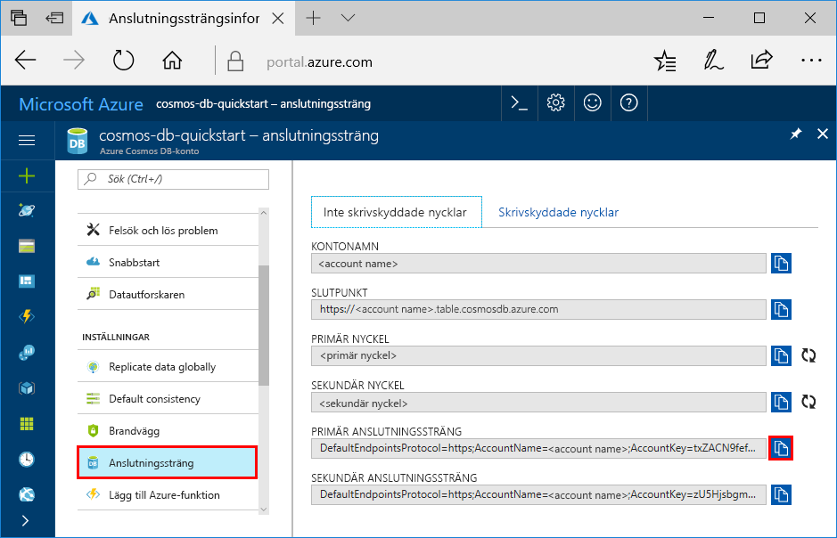

# <a name="quickstart-build-a-table-api-app-with-python-and-azure-cosmos-db"></a>Snabbstart: Skapa en tabell-API-app med Python och Azure Cosmos DB

Den här snabbstarten visar hur du använder [tabell-API](table-introduction.md) i Python och Azure Cosmos DB för att skapa en app genom att klona ett exempel från GitHub. Den här snabbstarten visar även hur du skapar ett Azure Cosmos DB-konto och hur du använder Datautforskaren för att skapa tabeller och entiteter i den webbaserade Azure-portalen.

Azure Cosmos DB är Microsofts globalt distribuerade databastjänst för flera datamodeller. Du kan snabbt skapa och ställa frågor mot databaser med dokument, nyckel/värde-par, breda kolumner och grafer. Du får fördelar av den globala distributionen och den horisontella skalningsförmågan som ligger i grunden hos Azure Cosmos DB. 

## <a name="prerequisites"></a>Krav

[!INCLUDE [quickstarts-free-trial-note](../../includes/quickstarts-free-trial-note.md)]
[!INCLUDE [cosmos-db-emulator-docdb-api](../../includes/cosmos-db-emulator-docdb-api.md)]

Följande gäller också:

* Om du inte har Visual Studio 2017 installerad kan du ladda ned och använda [Visual Studio 2017 Community Edition](https://www.visualstudio.com/downloads/) **utan kostnad**. Se till att du aktiverar **Azure-utveckling** under installationen av Visual Studio.
* Python Tools för Visual Studio från [GitHub](http://microsoft.github.io/PTVS/). I den här självstudien används Python Tools för VS 2015.
* Python 2.7 från [python.org](https://www.python.org/downloads/release/python-2712/)

## <a name="create-a-database-account"></a>Skapa ett databaskonto

> [!IMPORTANT] 
> Du måste skapa ett nytt tabell-API-konto för att arbeta med de allmänt tillgängliga tabell-API SDK:erna. Tabell-API-konton som skapas i förhandsversionen stöds inte av de allmänt tillgängliga SDK:erna.
>

[!INCLUDE [cosmos-db-create-dbaccount-table](../../includes/cosmos-db-create-dbaccount-table.md)]

## <a name="add-a-table"></a>Lägg till en tabell

[!INCLUDE [cosmos-db-create-table](../../includes/cosmos-db-create-table.md)]

## <a name="add-sample-data"></a>Lägg till exempeldata

Du kan nu lägga till data till den nya tabellen med datautforskaren.

1. Öppna Datautforskaren, expandera **sample-table**, klicka på **Entiteter** och klicka sedan på **Lägg till entitet**.

   
2. Lägg till data i värderutorna för egenskaperna PartitionKey (Partitionsnyckel) och RowKey (Radnyckel) och klicka på **Lägg till entitet**.

   
  
    Du kan nu lägga till fler entiteter i din tabell, redigera entiteter eller ställa frågor mot data i Datautforskaren. I Datautforskaren kan du även skala ditt dataflöde och lägga till lagrade procedurer, användardefinierade funktioner och utlösare i tabellen.

## <a name="clone-the-sample-application"></a>Klona exempelprogrammet

Nu ska vi klona en Table-app från github, ange anslutningssträngen och köra appen. Du kommer att se hur lätt det är att arbeta med data programmässigt. 

1. Öppna ett git-terminalfönster, t.ex. git bash, och använd kommandot `cd` för att ändra till en mapp där du vill installera exempelappen. 

    ```bash
    cd "C:\git-samples"
    ```

2. Klona exempellagringsplatsen med följande kommando. Detta kommando skapar en kopia av exempelappen på din dator. 

    ```bash
    git clone https://github.com/Azure-Samples/storage-python-getting-started.git
    ```

3. Öppna därefter lösningsfilen i Visual Studio. 

## <a name="update-your-connection-string"></a>Uppdatera din anslutningssträng

Gå nu tillbaka till Azure Portal för att hämta information om din anslutningssträng och kopiera den till appen. På så vis kan appen kommunicera med den värdbaserade databasen. 

1. I [Azure-portalen](http://portal.azure.com/) klickar du på **Anslutningssträng**. 

    

2. Kopiera KONTONAMN med knappen till höger.

3. Öppna filen config.py och klistra in KONTONAMN från portalen för värdet STORAGE_ACCOUNT_NAME på rad 19.

4. Gå tillbaka till portalen och kopiera PRIMÄRNYCKEL.

5. Klistra in PRIMÄRNYCKEL från portalen i värdet STORAGE_ACCOUNT_KEY på rad 20.

3. Spara filen config.py.

## <a name="run-the-app"></a>Kör appen

1. I Visual Studio högerklickar du på projektet i **Solution Explorer**, väljer den aktuella Python-miljön och högerklickar.

2. Välj alternativet för att installera Python Package och skriv **azure-storage-table**

3. Tryck på F5 för att köra programmet. Appen visas i din webbläsare. 

Du kan nu gå tillbaka till datautforskaren och se frågan, ändra och arbeta med dessa nya data. 

## <a name="review-slas-in-the-azure-portal"></a>Granska serviceavtal i Azure Portal

[!INCLUDE [cosmosdb-tutorial-review-slas](../../includes/cosmos-db-tutorial-review-slas.md)]

## <a name="clean-up-resources"></a>Rensa resurser

[!INCLUDE [cosmosdb-delete-resource-group](../../includes/cosmos-db-delete-resource-group.md)]

## <a name="next-steps"></a>Nästa steg

I den här snabbstarten har du fått lära dig att skapa ett Azure Cosmos DB-konto, skapa en tabell med datautforskaren och att köra en app.  Du kan nu ställa frågor mot dina data med tabell-API:t.  

> [!div class="nextstepaction"]
> [Importera tabelldata till tabell-API](table-import.md)
