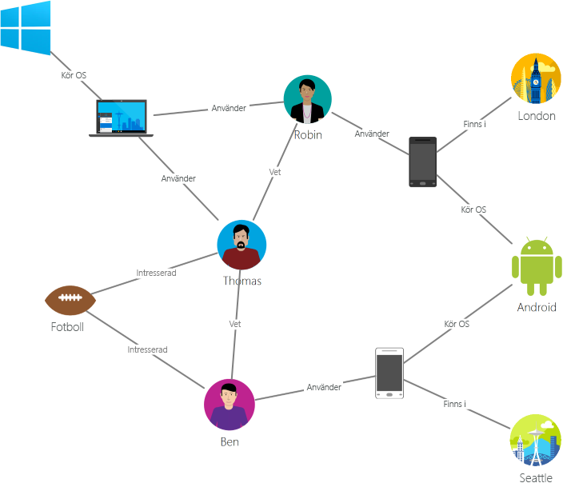
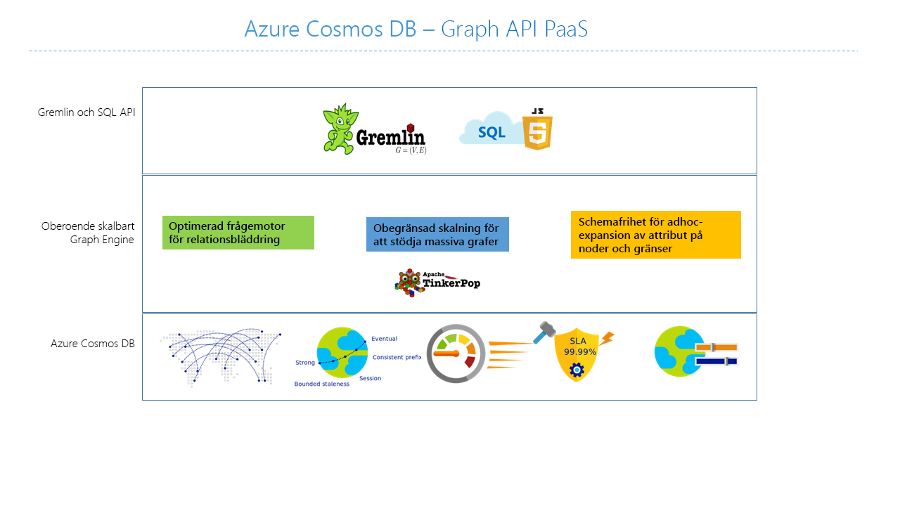

# Introduktion till Azure Cosmos DB: Graph API

[Azure Cosmos DB](introduction.md) är den globalt distribuerade databastjänsten för flera datamodeller från Microsoft för verksamhetskritiska program. Azure Cosmos DB erbjuder följande funktioner, som alla backas upp av [branschledande serviceavtal](https://azure.microsoft.com/support/legal/sla/cosmos-db/):

* [Nyckelfärdig global distribution](distribute-data-globally.md)
* [Elastisk skalbarhet av dataflöden och lagringsutrymme](partition-data.md) över hela världen
* Svarstider på enstaka millisekunder vid 99:e percentilen
* [Fem väldefinierade konsekvensnivåer](consistency-levels.md)
* Garanterat hög tillgänglighet 

Azure Cosmos DB [indexerar alla data automatiskt](http://www.vldb.org/pvldb/vol8/p1668-shukla.pdf) utan att du behöver bry dig om schema- eller indexhantering. Den stöder flera modeller och dokument, nyckelvärden, diagram och kolumndatamodeller.

Vi rekommenderar att du tittar på följande video där Kirill Gavrylyuk förklarar hur man kommer igång med diagram i Azure Cosmos DB:

> [!VIDEO https://channel9.msdn.com/Shows/Azure-Friday/Graphs-with-Azure-Cosmos-DB-Gremlin-API/player]
> 
> 

Azure Cosmos DB Graph API erbjuder:

- Diagrammodellering.
- Bläddrings-API:er.
- Nyckelfärdig global distribution.
- Elastisk skalbarhet av lagring och dataflöde med mindre än 10 ms svarstider för läsning och mindre än 15 ms vid 99:e percentilen.
- Automatisk indexering med omedelbar frågetillgänglighet.
- Justerbara konsekvensnivåer.
- Serviceavtal med 99,99 % tillgänglighet för alla konton i en region och alla konton i flera regioner med avslappnad konsekvens och 99,999 % lästillgänglighet för alla flerregions-databaskonton.

Du kan ställa frågor mot Azure Cosmos DB med diagramtraverseringsspråket [Apache TinkerPop](http://tinkerpop.apache.org) eller [Gremlin](http://tinkerpop.apache.org/docs/current/reference/#graph-traversal-steps).

Den här artikeln ger en översikt över Azure Cosmos DB Graph API och förklarar hur du kan använda den för att lagra massiva diagram med miljarder brytpunkter och kanter. Du kan fråga diagrammen med svarstider på millisekunder och enkelt utveckla diagrammets struktur och schema.

## Diagramdatabas
Data som de visas i verkligheten är naturligt sammanlänkade. Traditionell datamodellering fokuserar på entiteter. För många program finns det även ett behov av att modellera eller att modellera både entiteter och relationer på ett naturligt sätt.

Ett [diagram](http://mathworld.wolfram.com/Graph.html) är en struktur som består av [brytpunkter](http://mathworld.wolfram.com/GraphVertex.html) och [kanter](http://mathworld.wolfram.com/GraphEdge.html). Både brytpunkterna och kanterna kan ha ett godtyckligt antal egenskaper. Brytpunkter betecknar diskreta objekt, till exempel en person, en plats eller en händelse. Kanter betecknar relationer mellan brytpunkter. En person kan till exempel känna till en annan person, vara inblandad i en händelse och nyligen ha varit på en plats. Egenskaper uttrycker information om brytpunkterna och kanterna. Exempelegenskaper inkluderar en brytpunkt som har ett namn, ålder och kant som har en tidsstämpel och/eller en vikt. Mer formellt, kallas den här modellen för ett [egenskapsdiagram](http://tinkerpop.apache.org/docs/current/reference/#intro). Azure Cosmos DB stöder egenskapsdiagram-modellen.

Följande exempeldiagram visar till exempel relationerna mellan personer, mobila enheter, intressen och operativsystem:

Diagram är användbara för att förstå en mängd olika datauppsättningar inom vetenskap, teknik och företagsvärlden. Diagramdatabaser låter dig modellera och lagra diagram på ett naturligt och effektivt sätt, vilket gör dem användbara för många scenarier. Diagramdatabaser är vanligtvis NoSQL-databaser eftersom användningsfallen ofta också kräver schemaflexibilitet och snabba iterationer.

Diagram erbjuder en ny och kraftfull teknik för datamodellering. Men bara det här faktumet är inte en tillräcklig anledning att använda en diagramdatabas. För många användningsfall och mönster som involverar diagrambläddring, kan diagram överträffa traditionella SWL- och NoSQL-databaser i storlek. Den här prestandaskillnaden förstärks ytterligare vid bläddring av mer än en relation som en vän av en vän.

Du kan kombinera den snabba bläddringen som diagramdatabaser erbjuder med diagramalgoritmer som djup först-sökningar, bredd först-sökningar och Dijkstras algoritm för att lösa problem inom olika domäner som sociala nätverk, innehållshantering, geospatiala och rekommendationer.

## Diagram på planetskala med Azure Cosmos DB
Azure Cosmos DB är en fullständigt hanterad diagramdatabas som erbjuder global distribution, elastisk skalbarhet av lagring och dataflöde, automatisk indexering och frågor, justerbara konsekvensnivåer och stöd för TinkerPop-standarden.

Azure Cosmos DB erbjuder följande differentierade funktioner jämfört med andra diagramdatabaser på marknaden:

* Elastiskt skalbara dataflöden och lagring

 Diagram i verkligheten behöver skala utöver kapaciteten för en enskild server. Med Azure Cosmos DB kan du skala dina diagram sömlöst över flera servrar. Du kan även skala dataflödet för ditt diagram oberoende baserat på dina åtkomstmönster. Azure Cosmos DB stöder diagramdatabaser som kan skalas till praktiskt taget obegränsade lagringsstorlekar och etablerade dataflöden.

* Replikering för flera regioner

 Azure Cosmos DB replikerar transparent dina diagramdata till alla regioner som du har kopplat till ditt konto. Replikering låter dig utveckla program som kräver global åtkomst till data. Det finns kompromisser inom områden som konsekvens, tillgänglighet, prestanda och motsvarande garantier. Azure Cosmos DB erbjuder transparenta regionala redundansväxlingar med flera API:er. Du kan elastiskt skala dataflöde och lagring över hela världen.

* Snabba frågor och bläddringar med välbekant Gremlin-syntax

 Lagra heterogena brytpunkter och kanter och fråga de här dokumenten via ett bekant Gremlin-syntax. Azure Cosmos DB använder en höggradigt samtidig, låsfri, loggstrukturerad indexeringsteknik som automatiskt indexerar allt innehåll. Det här tillåter detaljrika frågor i realtid utan att behöva ange schematips, sekundärindex eller vyer. Läs mer i [Fråga diagram med hjälp av Gremlin](gremlin-support.md).

* Fullständigt hanterat

 Azure Cosmos DB eliminerar behovet av att hantera databasen och datorresurserna. Som en fullständigt hanterad Microsoft Azure-tjänst behöver du inte hantera virtuella datorer, distribuera och konfigurera programvara, hantera skalning eller hantera komplexa uppgraderingar av datanivåer. Varje databas säkerhetskopieras och skyddas automatiskt mot regionala fel. Du kan enkelt lägga till ett Azure Cosmos DB-konto och etablera kapacitet efter behov så att du kan fokusera på ditt program istället för att driva och hantera din databas.

* Automatisk indexering

 Som standard indexerar Azure Cosmos DB automatiskt alla egenskaperna inom noderna och kanterna i diagrammet och varken förväntar sig eller kräver något schema eller att sekundära index skapas.

* Kompatibilitet med Apache TinkerPop

 Azure Cosmos DB har ett inbyggt stöd för Apache TinkerPop-standarden med öppen källkod och kan integreras med andra TinkerPop-aktiverade diagramsystem. Du kan därför enkelt migrera från en annan diagramdatabas, som Titan eller Neo4j, eller använda Azure Cosmos DB med ramverk för diagramanalys som Apache Spark GraphX.

* Justerbara konsekvensnivåer

 Välj mellan fem väldefinierade konsekvensnivåer för bästa möjliga balans mellan konsekvens och prestanda. Azure Cosmos DB erbjuder fem olika konsekvensnivåer för frågor och läsåtgärder: stark, bunden utgång, session, enhetligt prefix och slutlig. Med de här detaljerade, väldefinierade konsekvensnivåerna kan du själv avgöra balansen mellan konsekvens, tillgänglighet och svarstid. Läs mer i [Justerbara datakonsekvensnivåer i Azure Cosmos DB](consistency-levels.md).

Azure Cosmos DB kan också använda flera modeller som dokument och diagram i samma behållare/databaser. Du kan använda en dokumentsamling för att lagra diagramdata sida vid sida med dokument. Du kan använda både SQL-frågor via JSON och Gremlin-frågor för att fråga efter samma data som ett diagram.

## Kom igång
Du kan använda Azure-kommandoradsgränssnittet (CLI), Azure PowerShell eller Azure-portalen med stöd för Graph API för att skapa Azure Cosmos DB-konton. När du har skapat konton, erbjuder Azure-portalen en tjänstslutpunkt som `https://<youraccount>.gremlin.cosmosdb.azure.com`, vilket erbjuder en WebSocket-klientdel för Gremlin. Du kan konfigurera dina TinkerPop-kompatibla verktyg som [Gremlin konsolen](http://tinkerpop.apache.org/docs/current/reference/#gremlin-console), för att ansluta till den här slutpunkten och skapa program i Java, Node.js och Gremlin-klientdrivrutiner.

Följande tabell visar populära Gremlin-drivrutiner som du kan använda mot Azure Cosmos DB:

| Ladda ned | Dokumentation | Komma igång |
| --- | --- | --- |
| [.NET](http://tinkerpop.apache.org/docs/3.3.1/reference/#gremlin-DotNet) | [Gremlin.NET på GitHub](https://github.com/apache/tinkerpop/tree/master/gremlin-dotnet) | [Skapa diagram med .NET](create-graph-dotnet.md) |
| [Java](https://mvnrepository.com/artifact/com.tinkerpop.gremlin/gremlin-java) | [Gremlin JavaDoc](http://tinkerpop.apache.org/javadocs/current/full/) | [Skapa diagram med Java](create-graph-java.md) |
| [Node.js](https://www.npmjs.com/package/gremlin) | [Gremlin-JavaScript på GitHub](https://github.com/jbmusso/gremlin-javascript) | [Skapa diagram med Node.js](create-graph-nodejs.md) |
| [Python](http://tinkerpop.apache.org/docs/3.3.1/reference/#gremlin-python) | [Gremlin-Python på GitHub](https://github.com/apache/tinkerpop/tree/master/gremlin-python) | [Skapa diagram med Python](create-graph-python.md) |
| [PHP](https://packagist.org/packages/brightzone/gremlin-php) | [Gremlin-PHP på GitHub](https://github.com/PommeVerte/gremlin-php) | [Skapa diagram med PHP](create-graph-php.md) |
| [Gremlin-konsol](https://tinkerpop.apache.org/downloads.html) | [TinkerPop-dokument](http://tinkerpop.apache.org/docs/current/reference/#gremlin-console) |  [Skapa diagram med Gremlin-konsolen](create-graph-gremlin-console.md) |

## Scenarier för diagramstöd för Azure Cosmos DB
Här följer några scenarier där diagramstödet för Azure Cosmos DB kan användas:

* Sociala nätverk

 Genom att kombinera data om dina kunder och deras interaktioner med andra personer kan du utveckla anpassade upplevelser, förutsäga kundbeteende eller ansluta personer med andra med liknande intressen. Azure Cosmos-DB kan användas för att hantera sociala nätverk och spåra kundinställningar och data.

* Rekommendationsmotorer

 Det här scenariot används ofta inom detaljhandeln. Genom att kombinera information om produkter, användare och användarinteraktioner som köp, bläddring eller klassificeringen av ett objekt, kan du skapa anpassade rekommendationer. De låga svarstiderna, elastiska skalbarheten och det interna diagramstödet för Azure Cosmos DB är idealiskt för modellering av de här interaktionerna.

* Geospatial

 Många program inom telekommunikation, logistik och reseplanering måste hitta en plats av intresse inom ett område eller hitta den kortaste/optimala vägen mellan två platser. Azure Cosmos DB är en naturlig lösning på de här problemen.

* Internet of Things

 Med nätverket och anslutningarna mellan IoT-enheter som modellerats som ett diagram, kan du skapa en bättre förståelse för dina enheters och tillgångars tillstånd. Du kan också undersöka hur ändringar i en del av nätverket kan påverka en annan del.

## Nästa steg
Mer information om diagramstöd i Azure Cosmos DB finns i:

* Kom igång med [Självstudien Azure Cosmos DB-diagram](create-graph-dotnet.md).
* Läs mer om hur du [frågar diagram i Azure Cosmos DB med hjälp av Gremlin](gremlin-support.md).
