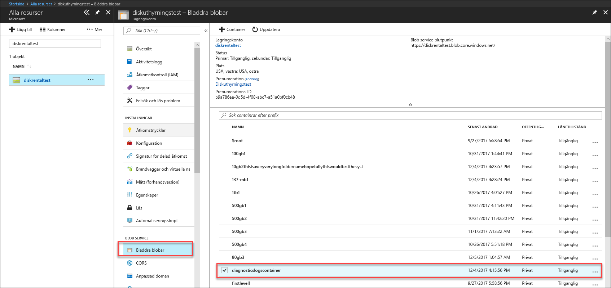
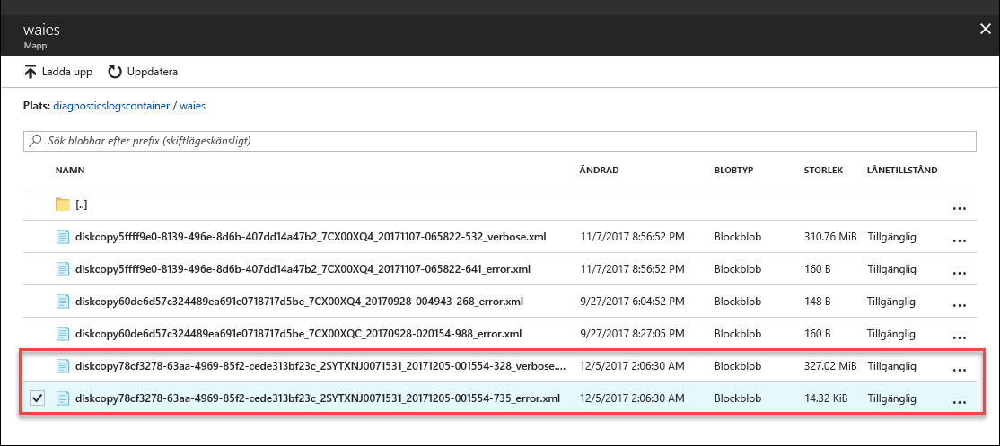

# Felsöka problem i Azure Data Box-disk (förhandsversion)

Den här artikeln gäller för Microsoft Azure Data Box som kör förhandsversionen. Den här artikeln beskriver några av de komplexa arbetsflöden och de administrativa uppgifter som kan utföras på Data Box och Data Box-disken. 

Du kan hantera Data Box Disk via Azure Portal. Den här artikeln fokuserar på de uppgifter som du kan utföra med Azure-portalen. Använd Azure-portalen för att hantera beställningar, hantera enheter och spåra beställningens status från början till slut.

Den här artikeln innehåller följande självstudier:

- Ladda ned diagnostikloggar
- Frågeaktivitetsloggar

> [!IMPORTANT]
> Data Box finns som en förhandsversion. Granska [Azures användningsvillkor för förhandsversionen](https://azure.microsoft.com/support/legal/preview-supplemental-terms/) innan du distribuerar den här lösningen.

## Ladda ned diagnostikloggar

Om det uppstår några fel under datakopieringsprocessen visar portalen en sökväg till den mapp där diagnostikloggarna finns. 

Diagnostikloggarna kan vara:
- Felloggar
- Utförliga loggar  

För att navigera till sökvägen för kopieringsloggen går du till det lagringskonto som associerats med din Data Box-beställning. 

1.  Gå till **Allmänt > Beställningsinformation** och anteckna det lagringskonto som är associerat med din beställning.
 

2.  Gå till **Alla resurser** och sök efter det lagringskonto som identifierades i föregående steg. Välj och klicka på lagringskontot.

    

3.  Gå till **Blob Service > Bläddra efter blobar** och leta efter den blob som motsvarar lagringskontot. Gå till **diagnosticslogcontainer > waies**. 

    

    Du bör se både felloggarna och utförliga loggar för datakopiering. Välj och klicka på varje fil och ladda sedan ned en lokal kopia.

## Frågeaktivitetsloggar

Använd aktivitetsloggarna för att hitta ett fel när du felsöker eller övervakar hur en användare i organisationen ändrat en resurs. Via aktivitetsloggarna kan du fastställa:

- Vilka åtgärder som utfördes på resurserna i din prenumeration.
- Den som initierade åtgärden. 
- När åtgärden utfördes.
- Status för åtgärden.
- Värdena för andra egenskaper som kan hjälpa dig undersöka åtgärden.

Aktivitetsloggen innehåller alla skrivåtgärder (till exempel PUT, POST, DELETE) som utförts på dina resurser, men inte läsåtgärderna (till exempel GET). 

Aktivitetsloggar bibehålls i 90 dagar. Du kan fråga efter alla datumintervall förutsatt att startdatumet inte är mer än 90 dagar bakåt i tiden. Du kan även filtrera med någon av de inbyggda frågorna i Insights. Till exempel kan du klicka på ett fel och sedan välja och klicka på specifika fel för att förstå rotorsaken.

## Fel på upplåsningsverktyget för Data Box-disk

| Felmeddelande/verktygsbeteende      | Rekommendationer                                                                                               |
|-------------------------------------------------------------------------------------------------------------------------------------|------------------------------------------------------------------------------------------------------|
| Ingen  Upplåsningsverktyget för Data Box-disk kraschar.                                                                            | BitLocker är inte installerat. Kontrollera att den värddator som kör upplåsningsverktyget för Data Box-disk har BitLocker installerat.                                                                            |
| Aktuellt .NET Framework stöds inte. De versioner som stöds är 4.5 och senare.  Verktyget avslutas med ett meddelande.  | .NET 4.5 är inte installerat. Installera .NET 4.5 eller senare på den värddator som kör upplåsningsverktyget för Data Box-disk.                                                                            |
| Det gick inte att låsa upp eller verifiera några volymer. Kontakta Microsoft-supporten.    Verktyget misslyckas med att låsa upp eller verifiera låsta enheter. | Verktyget kunde inte låsa upp någon av de låsta enheterna med den angivna nyckeln. Kontakta Microsoft-supporten om du vill ha hjälp.                                                |
| Följande volymer är olåsta och verifierade.  Volymenhetsbeteckningar: E: Det gick inte att låsa upp alla volymer med följande nycklar: werwerqomnf, qwerwerqwdfda   Verktyget låser upp vissa enheter och visar lyckade och misslyckade enhetsbeteckningar.| Slutfördes delvis. Det gick inte att låsa upp några av enheterna med den angivna nyckeln. Kontakta Microsoft-supporten om du vill ha hjälp. |
| Det gick inte att hitta låsta volymer. Kontrollera att den disk som mottogs från Microsoft är korrekt ansluten och är låst.          | Verktyget kan inte hitta några låsta enheter. Antingen är enheterna redan upplåsta eller så identifieras de inte. Kontrollera att enheterna är anslutna och att de är låsta.                                                           |
| Oåterkalleligt fel: Ogiltig parameter Parameternamn: invalid_arg ANVÄNDNING: DataBoxDiskUnlock /PassKeys:<lista_över_nycklar_separerade_med_semikolon>  Exempel: DataBoxDiskUnlock /PassKeys:nyckel1;nyckel2;nyckel3 Exempel: DataBoxDiskUnlock /SystemCheck Exempel: DataBoxDiskUnlock /Help  /PassKeys:       Hämta den här nyckeln från Azure DataBox-diskbeställning. Nyckeln låser upp dina diskar. /Help:           Det här alternativet ger hjälp om cmdlet-användning och exempel. /SystemCheck:    Det här alternativet kontrollerar om datorn uppfyller kraven för att köra verktyget.  Tryck på valfri tangent för att avsluta. | En ogiltig parameter har angetts. De enda tillåtna parametrarna är /SystemCheck, /PassKey och /Help.                                                                            |
## Nästa steg

- Lär dig hur du [hanterar Data Box-disk via Azure-portalen](data-box-portal-ui-admin.md).
