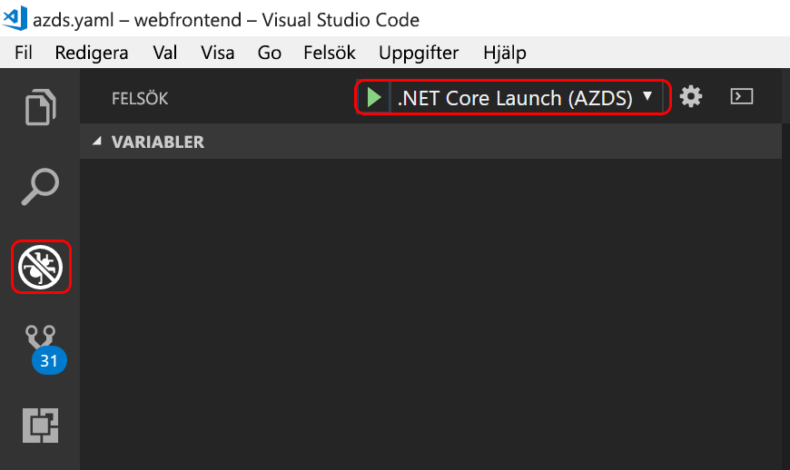

# <a name="get-started-on-azure-dev-spaces-with-net-core"></a>Komma igång med Azure Dev Spaces med .NET Core

[!INCLUDE[](includes/learning-objectives.md)]

[!INCLUDE[](includes/see-troubleshooting.md)]

Nu är du redo att skapa en Kubernetes-baserad utvecklarmiljö i Azure.

[!INCLUDE[](includes/portal-aks-cluster.md)]

## <a name="install-the-azure-cli"></a>Installera Azure CLI
Azure Dev Spaces kräver minimal konfiguration av den lokala datorn. Merparten av utvecklarmiljöns konfiguration lagras i molnet och kan delas med andra användare. Den lokala datorn kan köra Windows, Mac eller Linux. För Linux stöds följande distributioner: Ubuntu (18.04, 16.04 och 14.04), Debian 8 och 9, RHEL 7, Fedora 26+, CentOS 7, openSUSE 42.2 samt SLES 12.

Börja genom att ladda ned och köra [Azure CLI](/cli/azure/install-azure-cli?view=azure-cli-latest). 

> [!IMPORTANT]
> Om du redan har installerat Azure CLI kontrollerar du att du använder version 2.0.38 eller senare.

[!INCLUDE[](includes/sign-into-azure.md)]

[!INCLUDE[](includes/use-dev-spaces.md)]

[!INCLUDE[](includes/install-vscode-extension.md)]

Du kan börja skriva kod medan klustret skapas.

## <a name="create-a-web-app-running-in-a-container"></a>Skapa en webbapp som körs i en container

I det här avsnittet ska du skapa en ASP.NET Core-webbapp och köra den i en container i Kubernetes.

### <a name="create-an-aspnet-core-web-app"></a>Skapa en ASP.NET Core-webbapp
Om du har [.NET Core](https://www.microsoft.com/net) installerat kan du snabbt skapa en ASP.NET Core-webbapp i en mapp med namnet `webfrontend`.
    
```cmd
dotnet new mvc --name webfrontend
```

Du kan också **ladda ned exempelkod från GitHub** genom att gå till https://github.com/Azure/dev-spaces och välja **Klona eller Ladda ned** för att ladda ned GitHub-databasen till din lokala miljö. Koden för den här guiden finns i `samples/dotnetcore/getting-started/webfrontend`.

[!INCLUDE[](includes/azds-prep.md)]

[!INCLUDE[](includes/build-run-k8s-cli.md)]

### <a name="update-a-content-file"></a>Uppdatera en innehållsfil
Azure Dev Spaces handlar om mer än att bara få kod att köra i Kubernetes – det handlar om att du snabbt och löpande kan se effekten av dina kodändringar i en Kubernetes-miljö i molnet.

1. Leta upp filen `./Views/Home/Index.cshtml` och gör en ändring i HTML-koden. Ändra till exempel rad 70, `<h2>Application uses</h2>`, till något som: `<h2>Hello k8s in Azure!</h2>`
1. Spara filen. Efter en liten stund visas ett meddelande i terminalfönstret som meddelar att en fil i den aktiva containern har uppdaterats.
1. Gå till webbläsaren och uppdatera sidan. Den uppdaterade HTML-koden bör visas på webbsidan.

Vad hände? Redigering av innehållsfiler som HTML och CSS kräver inte omkompilering i en .NET Core-webbapp. Ett aktivt `azds up`-kommando synkroniserar automatiskt ändrade innehållsfiler i containern som körs i Azure, så att du genast kan se dina innehållsändringar.

### <a name="update-a-code-file"></a>Uppdatera en kodfil
Uppdateringar av kodfiler kräver lite mer arbete eftersom .NET Core-appar måste återskapas och skapa uppdaterade binärfiler för programmet.

1. Tryck på `Ctrl+C` (för att stoppa `azds up`) i terminalfönstret.
1. Öppna kodfilen `Controllers/HomeController.cs` och ändra meddelandet som ska visas på sidan Om: `ViewData["Message"] = "Your application description page.";`
1. Spara filen.
1. Kör `azds up` i terminalfönstret. 

Det här kommandot återskapar containeravbildningen och distribuerar Helm-diagrammet på nytt. Bekräfta kodändringarna i det aktiva programmet genom att gå till menyn Om i webbappen.


Det finns dock en ännu *snabbare kodutvecklingsmetod*, som vi ska titta närmare på i nästa avsnitt. 

## <a name="debug-a-container-in-kubernetes"></a>Felsöka en container i Kubernetes

[!INCLUDE[](includes/debug-intro.md)]

[!INCLUDE[](includes/init-debug-assets-vscode.md)]


### <a name="select-the-azds-debug-configuration"></a>Välj AZDS-felsökningskonfigurationen
1. Du öppnar felsökningsvyn genom att klicka på felsökningsikonen i **aktivitetsfältet** längs kanten i VS Code.
1. Välj **.NET Core Launch (AZDS)** (.NET Core-start (AZDS)) som den aktiva felsökningskonfigurationen.



> [!Note]
> Om du inte ser några Azure Dev Spaces-kommandon på kommandopaletten kontrollerar du att du har installerat VS Code-tillägget för Azure Dev Spaces. Kontrollera att arbetsytan som du öppnade i VS Code är mappen som innehåller azds.yaml.


### <a name="debug-the-container-in-kubernetes"></a>Felsöka containern i Kubernetes
Tryck på **F5** för att felsöka koden i Kubernetes.

Precis som med `up`-kommandot, synkroniseras koden med utvecklarmiljön och en container skapas och distribueras till Kubernetes. Men den här gången är felsökaren kopplad till fjärrcontainern.

[!INCLUDE[](includes/tip-vscode-status-bar-url.md)]

Lägg till en brytpunkt i en kodfil på serversidan, t.ex. i funktionen `Index()` i källfilen `Controllers/HomeController.cs`. Brytpunkten aktiveras när du uppdaterar sidan i webbläsaren.

Du har fullständig åtkomst till felsökningsinformation precis som när koden körs lokalt, t.ex. anropsstack, lokala variabler, undantagsinformation och så vidare.

### <a name="edit-code-and-refresh"></a>Redigera kod och uppdatera
Gör en kodändring när felsökaren är aktiv. Ändra till exempel meddelandet på sidan Om i `Controllers/HomeController.cs`. 

```csharp
public IActionResult About()
{
    ViewData["Message"] = "My custom message in the About page.";
    return View();
}
```

Spara filen och klicka på knappen **Uppdatera** i **fönstret Felsökningsåtgärder**. 


I stället för att återskapa och distribuera om en ny containeravbildning varje gång koden ändras, vilket ofta tar lång tid, kompilerar Azure Dev Spaces om koden inkrementellt i den befintliga containern för snabbare redigerings- och felsökningsförlopp.

Uppdatera webbappen i webbläsaren och gå till sidan Om. Nu bör ditt anpassade meddelande visas i användargränssnittet.

**Nu vet du hur du snabbt kan arbeta med kod och felsöka direkt i Kubernetes!** Nu ska vi gå vidare och se hur du kan skapa och anropa en andra container.

## <a name="next-steps"></a>Nästa steg

> [!div class="nextstepaction"]
> [Lär dig mer om teamutveckling](team-development-netcore.md)
