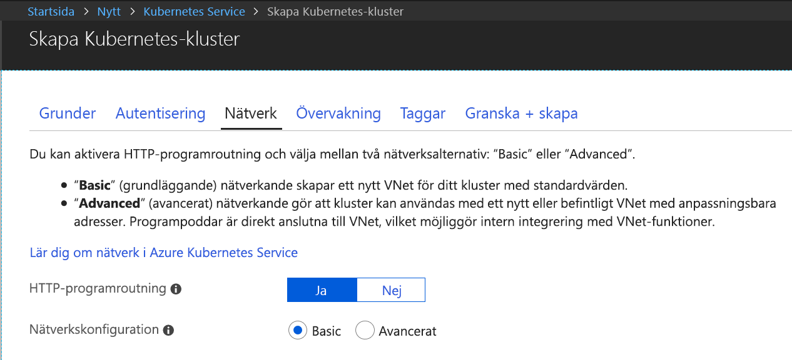

## Skapa ett Kubernetes-kluster som är aktiverat för Azure Dev Spaces

1. Logga in på Azure Portal på http://portal.azure.com.
1. Välj **Skapa en resurs** > sök efter **Kubernetes** > välj **Kubernetes Service** > **Skapa**.

   Utför följande steg under varje rubrik för att skapa AKS-klustret.

    - **PROJEKTINFORMATION**: välj en Azure-prenumeration och en ny eller befintlig Azure-resursgrupp.
    - **KLUSTERINFORMATION**: ange namn, region (för närvarande måste du välja USA, östra, Europa, västra, USA, västra 2, Kanada, centrala eller Kanada, östra), version och DNS-prefix för AKS-klustret.
    - **SKALNING**: välj en VM-storlek för AKS-agentnoderna och sedan antalet noder. Om du håller på att komma igång med Azure Dev Spaces är en nod tillräckligt för att utforska alla funktioner. Antalet noder kan enkelt justeras när som helst efter att klustret har distribuerats. Observera att VM-storleken inte kan ändras efter att ett AKS-kluster har skapats. Men när ett AKS-kluster har distribuerats kan du enkelt skapa ett nytt AKS-kluster med större virtuella datorer och använda Dev Spaces för att distribuera till större kluster igen om du behöver skala upp.

   Se till att välja Kubernetes version 1.10.3 eller senare.

   

   Välj **Nästa: nätverk** när du är klar.

1. Se till att routning av HTTP-program är aktiverat.

   

    > [!IMPORTANT]
    > Du måste se till att aktivera routning av HTTP-program när du skapar ditt AKS-kluster. Det går inte att ändra den här inställningen senare.

1. Välj din önskade inställning för rollbaserad åtkomstkontroll (RBAC). Azure Dev Spaces har stöd för kluster med RBAC aktiverat eller inaktiverat.

    

1. Välj **Granska + skapa** och välj sedan **Skapa** när du är klar.
