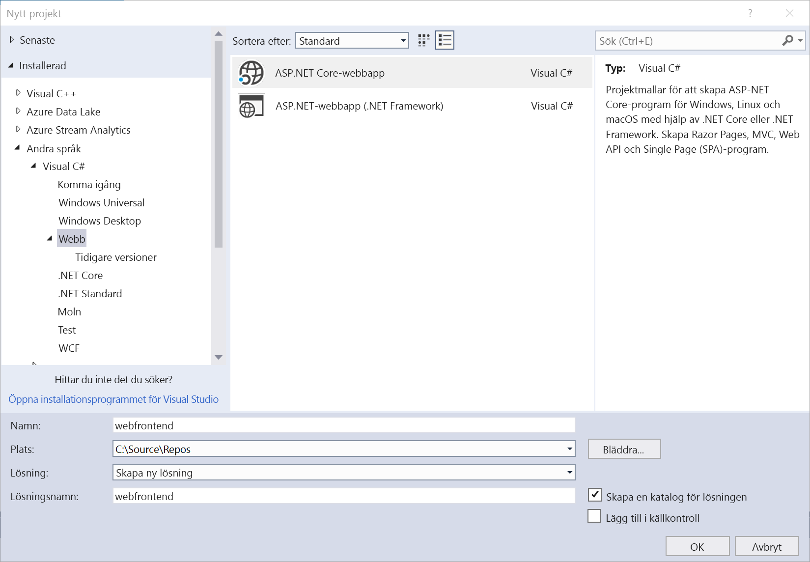
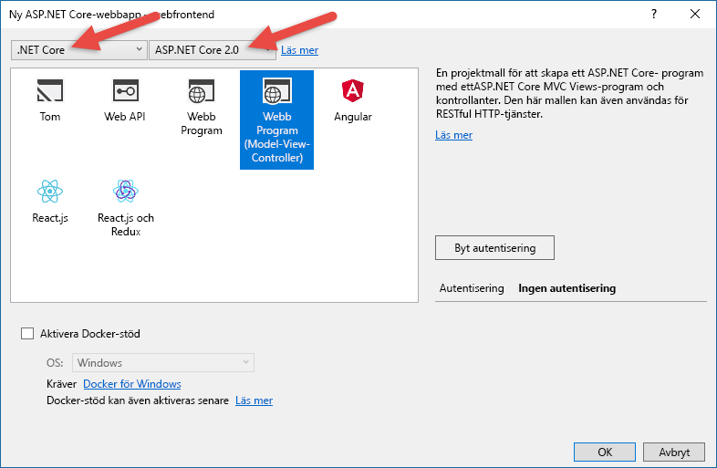
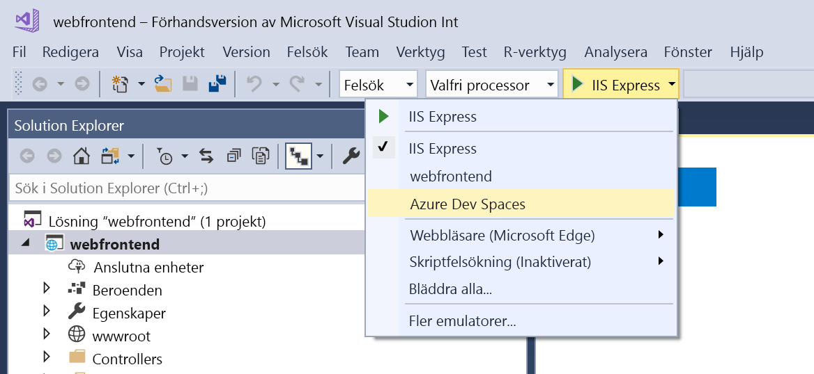
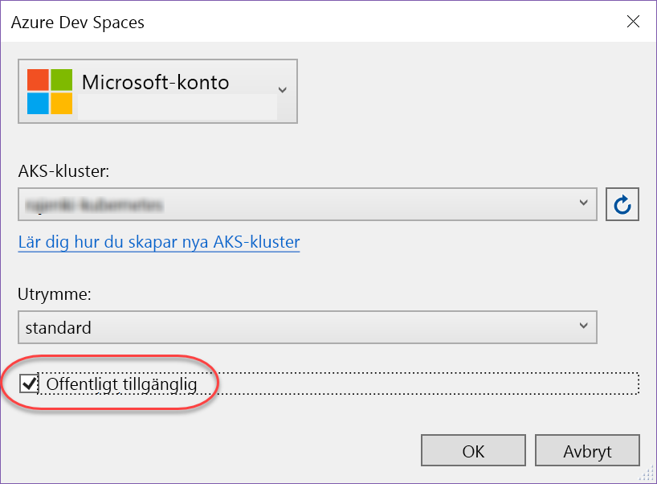
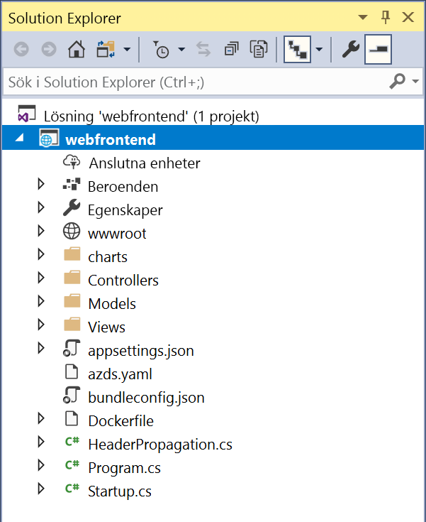

# Snabbstart: Skapa en Kubernetes-utvecklingsmiljö med Azure Dev Spaces (.NET Core och Visual Studio)

I den här guiden får du lära dig hur du:

- Skapar en Kubernetes-baserad miljö i Azure som är optimerad för utveckling.
- Iterativt utvecklar kod i behållare med Visual Studio.

[!INCLUDE]

[!INCLUDE]

## Hämta Visual Studio-verktygen 
1. Installera den senaste versionen av [Visual Studio 2017](https://www.visualstudio.com/vs/)
1. Se till att följande arbetsbelastning är markerad i Visual Studio-installationsprogrammet:
    * ASP.NET och webbutveckling
1. Installera [Visual Studio-tillägget för Azure Dev Spaces](https://aka.ms/get-azds-visualstudio)

Nu är du redo att skapa en ASP.NET-webbapp med Visual Studio.

## Skapa en ASP.NET-webbapp

Skapa ett nytt projekt i Visual Studio 2017. För närvarande måste projektet vara ett **ASP.NET Core-webbprogram**. Ge projektet namnet ”**webfrontend**”.

Välj mallen **Webbprogram (MVC, Model-View-Controller)** och välj **.NET Core** och **ASP.NET Core 2.0** som mål i de två listrutorna överst i dialogrutan. Klicka på **OK** för att skapa projektet.

## Skapa en utvecklingsmiljö i Azure

Med Azure Dev Spaces kan du skapa Kubernetes-baserade utvecklingsmiljöer som hanteras helt av Azure och som har optimerats för utveckling. För projektet som du precis skapat väljer du **Azure Dev Spaces** i listrutan för startinställningar, som du ser nedan.

I nästa dialogruta som visas kontrollerar du att du har loggat in med rätt konto och välj sedan ett befintligt kluster.

Lämna standardinställningen `default` i listrutan **Utrymme** tills vidare. Du lär dig mer om det här alternativet längre fram. Markera kryssrutan **Offentligt tillgänglig** så att webbprogrammet är tillgängligt via en offentlig slutpunkt. Den här inställningen krävs inte, men är användbar för att demonstrera några begrepp längre fram i den här genomgången. Men oroa dig inte, du kommer att kunna felsöka din webbplats med hjälp av Visual Studio oavsett.

Välj eller skapa klustret genom att klicka på **OK**.

Om du väljer ett kluster som inte har konfigurerats för användning med Azure Dev Spaces tillfrågas du om du vill konfigurera det.

Välj **OK**. 

En bakgrundsaktivitet startas och de nödvändiga inställningarna konfigureras. Åtgärden tar flera minuter att slutföra. Du kan kontrollera att åtgärden fortfarande körs genom att hovra med muspekaren över ikonen för **bakgrundsaktiviteter** i det nedre vänstra hörnet i statusfältet, som du ser i följande bild.

> [!Note]
Du kan inte felsöka programmet förrän utvecklingsmiljön har skapats.

## Titta på filerna som lagts till i projektet
Under tiden som utvecklingsmiljön skapas kan du titta på filerna som har lagts till i projektet när du valde att använda en utvecklingsmiljön.

Först ser du att en mapp med namnet `charts` har lagts till och att ett [Helm-diagram](https://docs.helm.sh) har skapats för ditt program i den här mappen. Dessa filer används för att distribuera ditt program till utvecklingsmiljön.

Du ser att en fil med namnet `Dockerfile` har lagts till. Den här filen innehåller information som behövs för ditt program i Docker-standardformatet. En `HeaderPropagation.cs`-fil skapas också. Vi diskuterar den här filen längre fram i genomgången. 

Slutligen ser du också en fil med namnet `azds.yaml`, som innehåller konfigurationsinformation som krävs av utvecklingsmiljön, t.ex. huruvida programmet ska vara tillgängligt via en offentlig slutpunkt.

## Felsöka en behållare i Kubernetes
När utvecklingsmiljön har skapats kan du felsöka programmet. Ange en brytpunkt i koden, till exempel på rad 20 i filen `HomeController.cs` där variabeln `Message` anges. Starta felsökningen genom att trycka på **F5**. 

Visual Studio kommunicerar med utvecklingsmiljön för att skapa och distribuera programmet och öppnar sedan en webbläsare där webbprogrammet körs. Det kan verka som om behållaren körs lokalt, men i själva verket körs den i utvecklingsmiljön i Azure. localhost-adressen beror på att Azure Dev Spaces skapar en tillfällig SSH-tunnel för behållaren som körs i Azure.

Klicka på länken **Om** längst upp på sidan för att utlösa brytpunkten. Du har fullständig åtkomst till felsökningsinformation precis som när koden körs lokalt, t.ex. anropsstack, lokala variabler, undantagsinformation och så vidare.

## Nästa steg

> [!div class="nextstepaction"]
> [Arbeta med flera behållare och utveckling i team](get-started-netcore-visualstudio.md#call-another-container)