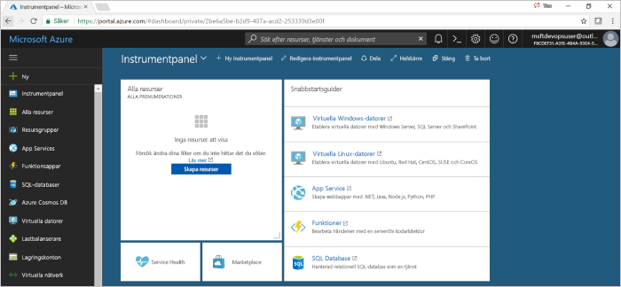
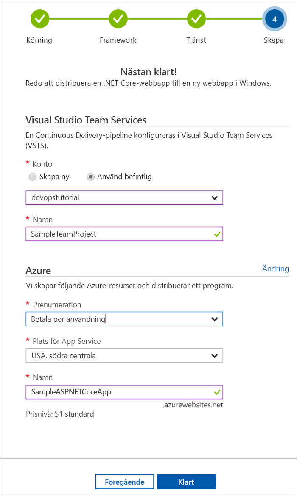
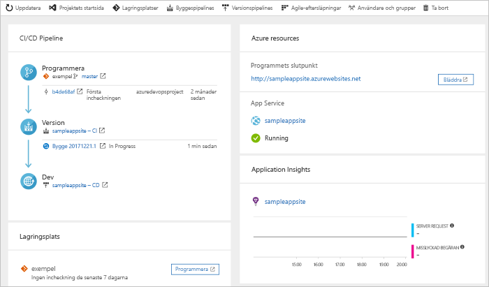

# Skapa en CI/CD-pipeline för Go med Azure DevOps-projekt

Konfigurera kontinuerlig integrering (CI) och kontinuerlig leverans (CD) för ditt **Go**-program med **Azure DevOps-projektet**.  Azure DevOps-projektet förenklar den initiala konfigurationen av en VSTS-version och lanseringspipeline.

Om du inte har en Azure-prenumeration kan du skaffa en kostnadsfritt via [Visual Studio Dev Essentials](https://visualstudio.microsoft.com/dev-essentials/).

## Logga in på Azure Portal

Azure DevOps-projektet skapar en CI/CD-pipeline i VSTS.  Du kan skapa ett **nytt VSTS**-konto eller använda ett **befintligt konto**.  Azure DevOps-projektet skapar även **Azure-resurser** i den **Azure-prenumeration** som du väljer.

1. Logga in i [Microsoft Azure-portalen](https://portal.azure.com).

1. Välj ikonen **+ Skapa en resurs** i det vänstra navigeringsfältet och sök efter **DevOps-projekt**.  Välj **Skapa**.

    

## Välj ett exempelprogrammet och en Azure-tjänst

1. Välj **Go**-exempelprogrammet och välj sedan **Nästa**.

1. Standardramverket är **Enkel Go-app**.  Välj **Nästa**. 

1. Programramverket som du valde i föregående steg avgör vilka typer av distributionsmål som finns tillgängliga för Azure-tjänsten att distribuera.  Låt Azure-tjänsten som är standard vara och välj **Nästa**.

## Konfigurera VSTS och en Azure-prenumeration 

1. Skapa ett **nytt** kostnadsfritt VSTS-konto eller välj ett **befintligt** konto.  Välj ett **namn** för ditt VSTS-projekt.  Välj din **Azure-prenumeration**, **plats** och välj ett **namn** för ditt program.  När du är klar väljer du **Klar**.

    

1. **Projektinstrumentpanelen** läses in i Azure-portalen på några minuter.  Ett exempelprogram konfigureras i en lagringsplats i VSTS-kontot, en version körs och programmet distribueras till Azure.  Den här instrumentpanelen ger insyn i **kodlagringsplatsen**, **VSTS CI/CD-pipeline** och i ditt **program i Azure**.  På höger sida av instrumentpanelen väljer du **Bläddra** för att visa programmet som körs.

     

## Genomför ändringar i koden och kör CI/CD

Azure DevOps-projektet skapade en Git-lagringsplats i din VSTS eller ditt GitHub-konto.  Följ stegen nedan för att visa lagringsplatsen och gör ändringar i koden i programmet.

1. På vänster sida av instrumentpanelen för DevOps-projektet väljer du på länken för din **huvudgren**.  Den här länken öppnar en vy till den nyligen skapade Git-lagringsplatsen.

1. Om du vill visa webbadressen för den klonade databasen väljer du **Klona** längst upp till höger i webbläsaren. Du kan klona Git-lagringsplatsen till din favorit-IDE.  I kommande steg kan du använda webbläsaren för att göra och genomföra ändringar i koden direkt till huvudgrenen.

1. På vänster sida i webbläsaren navigerar du till filen **views/index.html**.

1. Välj **Redigera** och gör en ändring i texten.  Du kan till exempel ändra texten i en av div-taggarna.

1. Välj **genomför** och spara sedan ändringarna.

1. I din webbläsare navigerar du till **instrumentpanelen för Azure DevOps-projektet**.  Du bör nu se att en version håller på att skapas.  De ändringar du utfört skapas och distribueras automatiskt via en VSTS-CI/CD-pipeline.

## Granska VSTS-CI/CD-pipelinen

Azure DevOps-projektet konfigurerade automatiskt en fullständig VSTS-CI/CD-pipeline i VSTS-kontot.  Utforska och anpassa pipelinen efter behov.  Följ stegen nedan för att bekanta dig med VSTS-versionen och versionsdefinitioner.

1. Välj **Skapa pipelines** från **längst upp** på instrumentpanelen för Azure DevOps-projektet.  Den här länken öppnar en flik i webbläsaren och öppnar VSTS versionsdefinition för det nya projektet.

1. Välj **ellipsen**.  Den här åtgärden öppnar en meny där du kan starta flera aktiviteter, till exempel att lägga till en ny version i en kö, pausa en version och redigera versionsdefinitionen.

1. Välj **Redigera**.

1. **Granska de olika uppgifterna** för versionsdefinition från den här vyn.  Versionen kör olika uppgifter som att hämta källor från Git-lagringsplatsen, återställa beroenden och publicera utdata för distributioner.

1. Längst upp i versionsdefinitionen väljer du **build definition name** (namn på versionsdefinitionen).

1. Ändra **namnet** på din versionsdefinition till något mer beskrivande.  Välj **Save & queue** (Spara och köa) och välj sedan **spara**.

1. Under ditt versionsdefinitionsnamn väljer du **historik**.  Du kan se en spårningslogg över de senaste ändringarna för versionen.  VSTS spårar alla ändringar som görs på versionsdefinition vilket gör att du kan jämföra versioner.

1. Välj **utlösare**.  Azure DevOps-projektet skapade automatiskt en CI-utlösare och varje incheckning till lagringsplatsen startar en ny version.  Du kan välja att inkludera eller exkludera grenar från CI-processen.

1. Välj **kvarhållning**.  Du kan ange principer för att behålla eller ta bort ett visst antal versioner baserat på ditt scenario.

1. Välj **Build and Release** (Build-versioner och versioner) och sedan **Versioner**.  Azure DevOps-projektet skapade en VSTS-versionsdefinition för att hantera distributioner till Azure.

1. På vänster sida i webbläsaren väljer du **ellipsen** bredvid din versionsdefinition och sedan väljer du **redigera**.

1. Versionsdefinitionen innehåller en **pipeline** som definierar lanseringsprocessen.  Under **Artefakter** väljer du **Släpp**.  Den versionsdefinition du undersökte i de föregående stegen skapar de utdata som används för artefakten. 

1. På höger sida av ikonen **Släpp** väljer du **Utlösare av kontinuerlig distribution**.  Den här versionsdefinitionen har en aktiverad CD-utlösare som kör en distribution varje gång en ny versionsartefakt är tillgänglig.  Du kan även inaktivera utlösaren så att dina distributioner kräver manuell körning. 

1. På vänster sida i webbläsaren väljer du **Uppgifter**.  Uppgifter är de aktiviteter som distributionsprocessen utför.  I det här exemplet skapades en uppgift för att distribuera till **Azure App-tjänsten**.

1. Till höger i webbläsaren väljer du **Visa versioner**.  Den här vyn visar en historik över versioner.

1. Välj **ellipsen** bredvid en versionerna och välj **Öppna**.  Det finns flera menyer att utforska från den här vyn, till exempel en versionssammanfattning, tillhörande arbetsobjekt och tester.

1. Välj **Incheckningar**.  Den här vyn visar kodincheckningar som är associerade med den specifika distributionen. 

1. Välj **Loggar**.  Loggarna innehåller användbar information om distributionsprocessen.  De kan visas både under och efter distributionerna.

## Rensa resurser

När du inte längre behöver den kan du ta bort Azure App-tjänsten och relaterade resurser som skapats i den här snabbstarten med hjälp av funktionen **Ta bort** från instrumentpanelen för Azure DevOps-projektet.

## Nästa steg

Se den här självstudien för att lära dig mer om att ändra dessa build-versions- och versionsdefinitioner för att uppfylla behoven i ditt team:

> [!div class="nextstepaction"]
> [Anpassa CD-process](https://docs.microsoft.com/vsts/pipelines/release/define-multistage-release-process?view=vsts)
