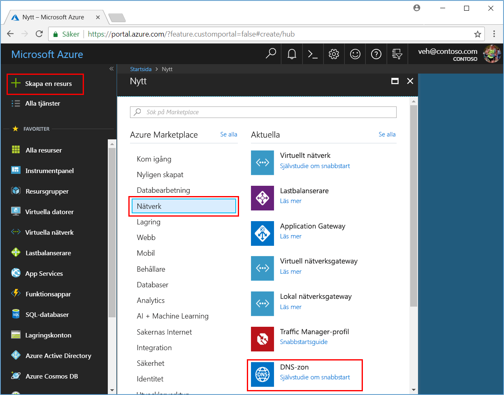
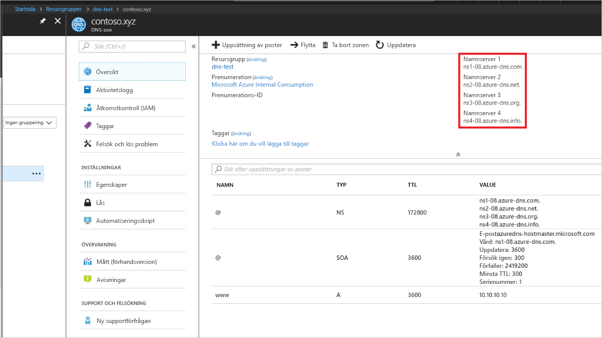

# <a name="quickstart-configure-azure-dns-for-name-resolution-using-the-azure-portal"></a>Snabbstart: Konfigurera Azure DNS för namnmatchning med hjälp av Azure-portalen

 Du kan konfigurera Azure DNS för att matcha värdnamn i din offentliga domän. Om du till exempel skulle köpa domännamnet contoso.com från en domännamnsregistrator kan du konfigurera Azure DNS för att vara värd för domänen contoso.com och matcha www.contoso.com till IP-adressen till din webbserver eller webbapp.

I den här snabbstarten skapar du en testdomän och skapar sedan en adresspost med namnet ”www” för att matcha IP-adressen 10.10.10.10.

Det är viktigt att veta att alla namn och IP-adresser som används i den här snabbstarten bara är exempel och inte är avsedda att representera ett verkligt scenario. Där det är tillämpligt beskrivs dock även verkliga scenarier.

<!---
You can also perform these steps using [Azure PowerShell](dns-getstarted-powershell.md) or the cross-platform [Azure CLI 2.0](dns-getstarted-cli.md).
--->

En DNS-zon används för att förvara DNS-posterna för en viss domän. Om du vill låta Azure DNS vara värd för din domän så måste du skapa en DNS-zon för det domännamnet. Varje DNS-post för din domän skapas sedan i den här DNS-zonen. Följande steg visar hur du gör detta.

Om du inte har en Azure-prenumeration kan du skapa ett [kostnadsfritt konto](https://azure.microsoft.com/free/?WT.mc_id=A261C142F) innan du börjar.

## <a name="create-a-dns-zone"></a>Skapa en DNS-zon

1. Logga in på Azure Portal.
2. Uppe till vänster klickar du på **+ Skapa en resurs** och sedan på **Nätverk**. Klicka därefter på **DNS-zon** för att öppna sidan **Skapa DNS-zon**.

    

4. På sidan **Skapa DNS-zon** anger du följande värden och klickar sedan på **Skapa**:


   | **Inställning** | **Värde** | **Detaljer** |
   |---|---|---|
   |**Namn**|contoso.xyz|Namnet på DNS-zonen i det här exemplet. Du kan använda valfritt värde för den här snabbstarten så länge det inte redan har konfigurerats på Azure DNS-servrarna. Ett verkligt värde skulle vara en domän som du har köpt från en domännamnsregistrator.|
   |**Prenumeration**|[Din prenumeration]|Välj en prenumeration att skapa DNS-zonen i.|
   |**Resursgrupp**|**Skapa ny:** dns-test|Skapa en resursgrupp. Resursgruppens namn måste vara unikt inom den prenumeration du valde. |
   |**Plats**|Östra USA||

Det kan ta några minuter att skapa zonen.

## <a name="create-a-dns-record"></a>Skapa en DNS-post

Nu skapar du en ny adresspost (”A”-post). ”A”-poster används för att matcha ett värdnamn till en IPv4-adress.

1. Klicka på **Alla resurser** i rutan **Favoriter** i Azure Portal. Klicka på DNS-zonen **contoso.xyz** på sidan Alla resurser. Om den prenumeration som du valde redan har flera resurser kan du ange **contoso.xyz** i rutan **Filtrera efter namn...** när du ska hitta din DNS-zon.

1. Välj **+ Postuppsättning** längst upp på sidan **DNS-zon** för att öppna sidan **Lägg till uppsättning av poster**.

1. Ange följande värden på sidan **Lägg till uppsättning av poster** och klicka på **OK**. I det här exemplet skapar du en ”A”-post.

   |**Inställning** | **Värde** | **Detaljer** |
   |---|---|---|
   |**Namn**|www|Namnet på posten. Det här är det namn som du bör använda för den värd som du vill matcha till en IP-adress.|
   |**Typ**|A| Typ av DNS-post som ska skapas. ”A”-poster är de vanligaste, men det finns andra posttyper för e-postservrar (MX), IPv6-adresser (AAAA) och så vidare. |
   |**TTL**|1|Time-to-live för DNS-begäran. Anger hur länge DNS-servrar och klienter kan cachelagra ett svar.|
   |**TTL-enhet**|hours|Tidsmått för TTL-värde.|
   |**IP-adress**|10.10.10.10| Det här värdet är den IP-adress som ”A”-posten matchar till. Det här är bara ett testvärde för den här snabbstarten. För ett verkligt exempel skulle du ange den offentliga IP-adressen för din webbserver.|


Eftersom du inte faktiskt köper ett verkligt domännamn i den här snabbstarten behöver du inte konfigurera Azure DNS som namnserver hos din domänregistrator. Men i ett verkligt scenario skulle vilja att vem som helst på Internet kan matcha ditt värdnamn för att ansluta till din webbserver eller app. Mer information om det verkliga scenariot finns i [Delegera en domän till Azure DNS](dns-delegate-domain-azure-dns.md).


## <a name="test-the-name-resolution"></a>Testa namnmatchningen

Nu när du har en testzon med en ”A”-testpost kan du testa namnmatchningen med ett verktyg som heter nslookup. 

1. Först måste du veta vilka Azure DNS-namnservrar som ska användas med nslookup. 

   Namnservrarna för din zon anges på DNS-zonens **översiktssida**. Kopiera namnet på en av namnservrarna:

   

2. Nu öppnar du en kommandotolk och kör följande kommando:

   ```
   nslookup <host name> <name server>
   
   For example:

   nslookup www.contoso.xyz ns1-08.azure-dns.com
   ```

Du bör se något som liknar följande skärmbild:


Detta verifierar att namnmatchningen fungerar korrekt. www.contoso.xyz matchar till 10.10.10.10, precis enligt din konfiguration.

## <a name="clean-up-resources"></a>Rensa resurser

När resursgruppen **dns-test** inte längre behövs kan du ta bort den för att ta bort de resurser som skapades i den här snabbstarten. För att göra det klickar du på resursgruppen **dns-test** och klickar sedan på **Ta bort resursgrupp**.


## <a name="next-steps"></a>Nästa steg

> [!div class="nextstepaction"]
> [Skapa DNS-poster för en webbapp i en anpassad domän](./dns-web-sites-custom-domain.md)