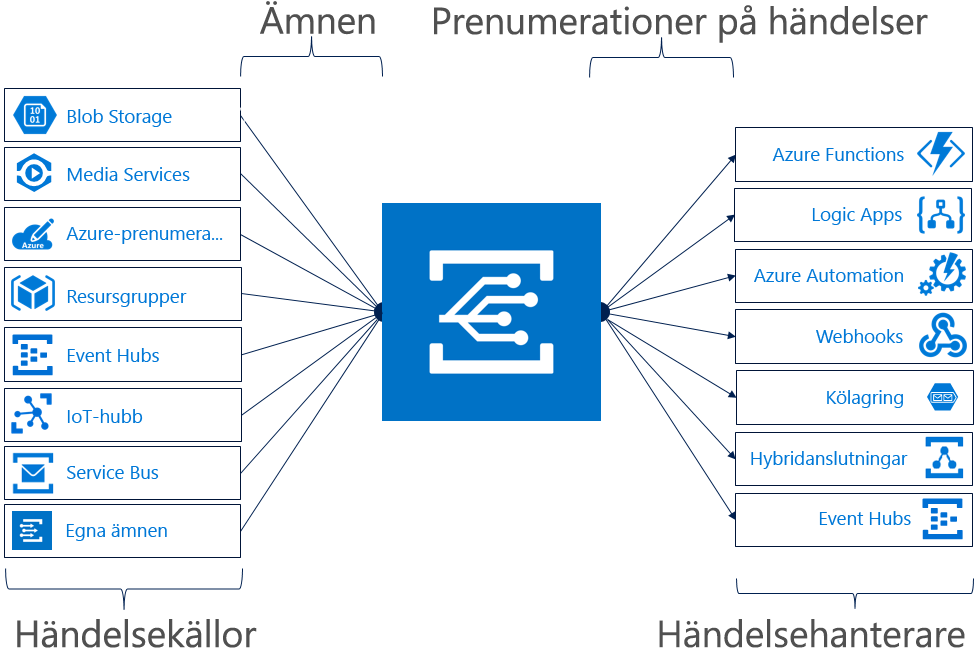

# En introduktion till Azure händelse rutnätet

Azure händelse rutnätet kan du enkelt kan skapa program med händelsebaserat arkitekturerna. Du väljer Azure-resursen du vill prenumerera på och ge händelsehanteraren eller WebHook-slutpunkten för att skicka händelsen till. Händelsen rutnätet har inbyggt stöd för händelser som kommer från Azure-tjänster, som storage-blobbar och resursgrupper. Händelsen rutnätet har också anpassade stöd för program och händelser från tredje part, med hjälp av anpassade avsnitt och anpassade webhooks. 

Du kan använda filter för att vidarebefordra specifika händelser till olika slutpunkter samtidigt till flera slutpunkter och kontrollera att din händelser levereras på ett tillförlitligt sätt. Händelsen rutnätet har också inbyggt stöd för anpassade och tredjeparts-händelser.

Händelsen rutnätet stöder för närvarande följande områden:

* Sydostasien
* Asien Öst
* USA, centrala
*   USA, östra
*   USA, östra 2
* Västeuropa
* Nordeuropa
*   Västra centrala USA
*   USA, västra
*   Västra USA 2

Den här artikeln innehåller en översikt över Azure händelse rutnätet. Om du vill komma igång med händelsen rutnätet finns [skapa och flöde anpassade händelser med Azure händelse rutnätet](custom-event-quickstart.md). Följande bild visar hur händelsen rutnätet ansluter källor och hanterare, men ger inte en omfattande lista över vilka alternativ som stöds.

## Händelsekällan

För närvarande stöder följande Azure-tjänster skickar händelser till händelse rutnätet:

* Azure-prenumerationer (hanteringsåtgärder)
* Anpassade avsnitt
* Event Hubs
* IoT-hubb
* Resursgrupper (hanteringsåtgärder)
* Service Bus
* Storage Blob
* Storage General-purpose v2 (GPv2)

## Händelsehanterare

För närvarande stöder följande Azure-tjänster hantera händelser från Event rutnät: 

* Azure Automation
* Azure Functions
* Event Hubs
* Logic Apps
* Microsoft Flow
* WebHooks

När du använder Azure Functions som hanterare kan använda händelse rutnätet utlösaren i stället för allmänna HTTP-utlösare. Event Grid verifierar automatiskt Event Grid Function-utlösare. Med allmänna HTTP-utlösare måste du implementera [verifieringssvaret](security-authentication.md#webhook-event-delivery).

## Begrepp

Det finns fem koncept i Azure händelse rutnät som gör att du kan komma igång:

* **Händelser** -vad hände.
* **Källor/händelseutfärdare** – där händelsen ägde rum.
* **Avsnitt om** -slutpunkten som utgivare för att skicka händelser.
* **Händelseprenumerationer** -slutpunkt eller inbyggda mekanism för vägen händelser, ibland till flera hanterarna. Prenumerationer används också av hanterare Intelligent filtrera inkommande händelser.
* **Händelsehanterare** -app eller tjänst reagera på händelsen.

Mer information om de här koncepten finns [koncept i Azure händelse rutnät](concepts.md).

## Funktioner

Här följer några viktiga funktioner i Azure händelse rutnätet:

* **Enkelhet** -plats och klicka på att sträva efter händelser från Azure-resurs till händelsehanteraren eller slutpunkt.
* **Avancerad filtrering** -Filter på händelsen typ eller händelse publiceringssökväg att säkerställa händelsehanterare får endast relevanta händelser.
* **FLÄKT-ut** -prenumerera på flera slutpunkter på samma händelse ska skicka kopior av händelsen till så många platser efter behov.
* **Tillförlitlighet** -använda 24-timmarsformat återförsök med exponentiell backoff för att säkerställa att händelser levereras.
* **Betala per händelse** – betala endast för hur du använder händelsen rutnätet.
* **Hög genomströmning** -skapa omfattande arbetsbelastningar i händelse rutnät med stöd för miljontals händelser per sekund.
* **Inbyggda händelser** – komma igång snabbt och köra med resurs-definierade inbyggda händelser.
* **Anpassade händelser** -Använd händelse rutnätet flödet, filter och tillförlitligt leverera anpassade händelser i din app.

En jämförelse av händelse rutnät, Händelsehubbar och Service Bus finns [Välj mellan Azure-tjänster som levererar meddelanden](compare-messaging-services.md).

## Vad kan jag göra med händelsen rutnät?

Azure händelse rutnätet innehåller flera funktioner som kan förbättrar frågeprestanda avsevärt serverlösa ops automation och integrering arbete: 

### Arkitekturer för program utan server

Event Grid kopplar samman datakällor och händelsehanterare. Använd exempelvis Event Grid för att direkt utlösa att en funktion utan server kör bildanalys varje gång ett nytt foto läggs till i en blobblagringsbehållare. 

### OPS Automation

Event Grid ger snabbare automatisering och enklare principtillämpning. Event Grid kan exempelvis meddela Azure Automation när en virtuell dator skapas eller en SQL-databas startas. De här händelserna kan användas för att automatiskt kontrollera att tjänstkonfigurationer följer standard, placera metadata i åtgärdsverktyg, tagga virtuella datorer eller arkivera arbetsobjekt.

### Integrering av program

Event Grid ansluter din app till andra tjänster. Till exempel skapa en anpassad avsnittet för att skicka data om din app till händelse rutnätet och dra nytta av dess tillförlitlig leverans, avancerad routning, och dirigera integrering med Azure. Du kan även använda Event Grid med Logic Apps för att bearbeta data var som helst, utan att skriva kod. 

## Hur mycket kostar händelse rutnätet?

Azure händelse rutnätet använder en modell med betalning per händelse prisnivå så att du betalar bara för att du använder. De första 100 000 åtgärderna per månad är gratis. Åtgärder definieras som händelsen ingång, avancerad matchar, leverans försök och management-anrop. Mer information finns i [sida med priser](https://azure.microsoft.com/pricing/details/event-grid/).

## Nästa steg

* [Vidarebefordra Blob Storage-händelser](../storage/blobs/storage-blob-event-quickstart.md?toc=%2fazure%2fevent-grid%2ftoc.json)  
  Svara på blob storage-händelser med hjälp av händelse rutnätet.
* [Skapa och prenumerera på anpassade händelser](custom-event-quickstart.md)  
  Hoppa direkt i och börja skicka dina egna anpassade händelser för valfri slutpunkt med hjälp av Azure händelse rutnätet Snabbstart.
* [Med hjälp av Logic Apps som händelsehanterare](monitor-virtual-machine-changes-event-grid-logic-app.md)  
  En självstudiekurs om hur du skapar en app med Logic Apps för att reagera på händelser pushas efter händelsen rutnät.
* [Strömma stordata till ett datalager](event-grid-event-hubs-integration.md)  
  En självstudiekurs som använder Azure Functions till dataströmmen data från Händelsehubbar till SQL Data Warehouse.
* [Händelsen rutnätet REST API-referens](/rest/api/eventgrid)  
  Ger mer teknisk information om rutnätet Azure händelse och en referens för att hantera prenumerationer på händelser, Routning och filtrering.