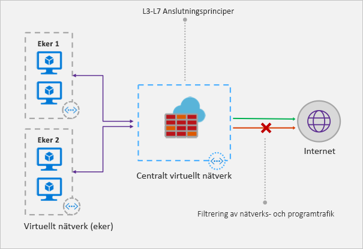

# Vad är Azure Firewall?

Azure Firewall är en hanterad, molnbaserad tjänst för nätverkssäkerhet som skyddar dina Azure Virtual Network-resurser. Det är en helt tillståndskänslig brandvägg som en tjänst med inbyggd hög tillgänglighet och obegränsad molnskalbarhet. 

[!INCLUDE [firewall-preview-notice](../../includes/firewall-preview-notice.md)]

Du kan centralt skapa, framtvinga och logga principer för tillämpning och nätverksanslutning över prenumerationer och virtuella nätverk. Azure Firewall använder en statisk offentlig IP-adress för din virtuella nätverksresurser som tillåter att externa brandväggar identifierar trafik som kommer från ditt virtuella nätverk.  Tjänsten är helt integrerad med Azure Monitor för loggning och analys.

## Funktioner

Den offentliga förhandsversionen av Azure Firewall erbjuder följande funktioner:

### Inbyggd hög tillgänglighet
Hög tillgänglighet är inbyggt, så det krävs inga ytterligare lastbalanserare och du behöver inte konfigurera något.

### Obegränsad molnskalbarhet 
Azure Firewall kan skala upp så mycket du behöver för att hantera föränderliga nätverkstrafikflöden, så du behöver inte budgetera för hög trafikbelastning.

### FQDN-filtrering 
Du kan begränsa utgående HTTP/S-trafik till en angiven lista med fullständigt kvalificerade domännamn (FQDN), inklusive jokertecken. Den här funktionen kräver inte SSL-avslutning.

### Regler för filtrering av nätverkstrafik

Du kan centralt skapa nätverksfiltreringsreglerna *tillåt* eller *neka* efter källans och målets IP-adress, port och protokoll. Azure Firewall är helt tillståndskänslig så att den kan identifiera legitima paket för olika typer av anslutningar. Regler tillämpas och loggas i flera prenumerationer och virtuella nätverk.

### Stöd för utgående SNAT

Alla IP-adresser för utgående trafik över virtuellt nätverk översätts till den offentliga Azure Firewall-IP-adressen (Source Network Address Translation). Du kan identifiera och tillåta trafik som kommer från ditt virtuella nätverk till fjärranslutna Internetmål.

### Azure Monitor-loggning

Alla händelser är integrerade med Azure Monitor, vilket gör att du kan arkivera loggar till ett lagringskonto, strömma händelser till din händelsehubb eller skicka dem till Log Analytics.

## Kända problem

Den offentliga förhandsversionen av Azure Firewall har följande kända problem:

|Problem  |Beskrivning  |Åtgärd  |
|---------|---------|---------|
|Samverkan med NSG:er     |Om en nätverkssäkerhetsgrupp (NSG) tillämpas på brandväggens undernät kan det hända att den blockerar utgående Internetanslutning även om NSG:n är konfigurerad för att tillåta utgående Internetåtkomst. Utgående Internetanslutningar är markerade som härrörande från ett VirtualNetwork och målet är Internet. En NSG har *tillåt* för VirtualNetwork till VirtualNetwork som standard, men inte när målet är Internet.|Åtgärda detta genom att lägga till följande inkommande regel till den NSG som tillämpas på brandväggens undernät:  Källa: VirtualNetwork-källportar: Alla   Mål: Alla målportar: Alla   Protokoll: All åtkomst: Tillåt|
|Konflikt med Azure Security Center (ASC) Just-in-Time-funktionen (JIT)|Om åtkomst till en virtuell dator sker via JIT, och den är i ett undernät med en användardefinierad väg som pekar på Azure Firewall som en standard-gateway, fungerar inte ASC JIT. Det här är ett resultat av asymmetrisk routning – ett paket kommer in via den virtuella datorns offentliga IP-adress (JIT öppnade åtkomsten), men returnvägen är via brandväggen, som släpper paketet eftersom ingen session har upprättats i brandväggen.|Du kan kringgå problemet genom att placera de virtuella JIT-datorerna på ett separat undernät som inte har en användardefinierad väg till brandväggen.|
|Nav och ekrar med global peering fungerar inte|Modellen med nav och ekrar, där navet och brandväggen distribueras i en Azure-region och ekrarna är i en annan Azure-region, har inte stöd för anslutning via Global VNet-peering.|Mer information finns på sidan om att [skapa, ändra eller ta bort en virtuell nätverkspeering](https://docs.microsoft.com/azure/virtual-network/virtual-network-manage-peering#requirements-and-constraints)|
Nätverksfiltreringsregler för icke-TCP-/UDP-protokoll (till exempel ICMP) fungerar inte för Internetbunden trafik|Nätverksfiltreringsregler för icke-TCP-/UDP-protokoll fungerar inte med SNAT till din offentliga IP-adress. Icke-TCP-/UDP-protokoll stöds mellan ekerundernät och virtuella nätverk.|Azure Firewall använder Standard Load Balancer, [som för närvarande inte stöder SNAT för IP-protokoll](https://docs.microsoft.com/azure/load-balancer/load-balancer-standard-overview#limitations). Vi utforskar alternativ för att stödja det här scenariot i en framtida version.

## Nästa steg

- [Självstudie: Distribuera och konfigurera Azure Firewall med hjälp av Azure-portalen](tutorial-firewall-deploy-portal.md)
- [Distribuera Azure Firewall med hjälp av en mall](deploy-template.md)
- [Skapa en testmiljö för Azure Firewall](scripts/sample-create-firewall-test.md)

